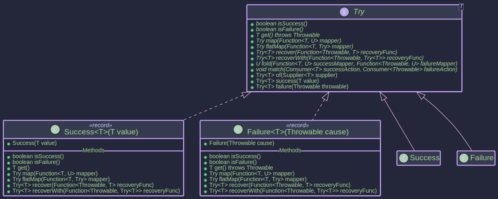

# TryMonad:
## _Typed Error Handling_

~~~ admonish example title="See Example Code:"
[TryExample.java](https://github.com/higher-kinded-j/higher-kinded-j/blob/main/hkj-examples/src/main/java/org/higherkindedj/example/basic/trymonad/TryExample.java)
~~~

## Purpose

The `Try<T>` type in the `Higher-Kinded-J` library represents a computation that might result in a value of type `T` (a `Success`) or fail with a `Throwable` (a `Failure`). It serves as a functional alternative to traditional `try-catch` blocks for handling exceptions, particularly checked exceptions, within a computation chain.  We can think of it as an `Either` where the `Left` is an `Exception`, but also using try-catch blocks behind the scene, so that we don’t have to.

**Try Type**



**Monadic Structure**


Key benefits include:

* **Explicit Error Handling:** Makes it clear from the return type (`Try<T>`) that a computation might fail.
* **Composability:** Allows chaining operations using methods like `map` and `flatMap`, where failures are automatically propagated without interrupting the flow with exceptions.
* **Integration with HKT:** Provides HKT simulation (`TryKind`) and type class instances (`TryMonad`) to work seamlessly with generic functional abstractions operating over `Kind<F, A>`.
* **Error Recovery:** Offers methods like `recover` and `recoverWith` to handle failures gracefully within the computation chain.

It implements `MonadError<TryKind<?>, Throwable>`, signifying its monadic nature and its ability to handle errors of type `Throwable.

## How to Use `Try<T>`


~~~admonish title="Creating Instance"

- [TryExample.java](https://github.com/higher-kinded-j/higher-kinded-j/blob/main/hkj-examples/src/main/java/org/higherkindedj/example/basic/trymonad/TryExample.java)

You can create `Try` instances in several ways:

1. **`Try.of(Supplier)`:** Executes a `Supplier` and wraps the result in `Success` or catches any thrown `Throwable` (including `Error` and checked exceptions) and wraps it in `Failure`.

   ```java
   import org.higherkindedj.hkt.trymonad.Try;
   import java.io.FileInputStream;

   // Success case
   Try<String> successResult = Try.of(() -> "This will succeed"); // Success("This will succeed")

   // Failure case (checked exception)
   Try<FileInputStream> failureResult = Try.of(() -> new FileInputStream("nonexistent.txt")); // Failure(FileNotFoundException)

   // Failure case (runtime exception)
   Try<Integer> divisionResult = Try.of(() -> 10 / 0); // Failure(ArithmeticException)
   ```
2. **`Try.success(value)`:** Directly creates a `Success` instance holding the given value (which can be null).

   ```java
   Try<String> directSuccess = Try.success("Known value");
   Try<String> successNull = Try.success(null);
   ```
3. **`Try.failure(throwable)`:** Directly creates a `Failure` instance holding the given non-null `Throwable`.

   ```java
   Try<String> directFailure = Try.failure(new RuntimeException("Something went wrong"));
   ```
~~~
~~~admonish title="Checking the State"

- [TryExample.java](https://github.com/higher-kinded-j/higher-kinded-j/blob/main/hkj-examples/src/main/java/org/higherkindedj/example/basic/trymonad/TryExample.java)


* `isSuccess()`: Returns `true` if it's a `Success`.
* `isFailure()`: Returns `true` if it's a `Failure`.

### Getting the Value (Use with Caution)

* `get()`: Returns the value if `Success`, otherwise throws the contained `Throwable`. **Avoid using this directly; prefer `fold`, `map`, `flatMap`, or recovery methods.**
~~~


~~~admonish title="Transforming Values (_map_)"

- [TryExample.java](https://github.com/higher-kinded-j/higher-kinded-j/blob/main/hkj-examples/src/main/java/org/higherkindedj/example/basic/trymonad/TryExample.java)

Applies a function to the value inside a `Success`. If the function throws an exception, the result becomes a `Failure`. If the original `Try` was a `Failure`, `map` does nothing and returns the original `Failure`.

```java
Try<Integer> initialSuccess = Try.success(5);
Try<String> mappedSuccess = initialSuccess.map(value -> "Value: " + value); // Success("Value: 5")

Try<Integer> initialFailure = Try.failure(new RuntimeException("Fail"));
Try<String> mappedFailure = initialFailure.map(value -> "Value: " + value); // Failure(RuntimeException)

Try<Integer> mapThrows = initialSuccess.map(value -> { throw new NullPointerException(); }); // Failure(NullPointerException)
```
~~~

~~~admonish title="Chaining Operations (_flatMap_)"

- [TryExample.java](https://github.com/higher-kinded-j/higher-kinded-j/blob/main/hkj-examples/src/main/java/org/higherkindedj/example/basic/trymonad/TryExample.java)

Applies a function that returns another `Try` to the value inside a `Success`. This is used to sequence operations where each step might fail. Failures are propagated.

```java
Function<Integer, Try<Double>> safeDivide =
value -> (value == 0) ? Try.failure(new ArithmeticException("Div by zero")) : Try.success(10.0 / value);

Try<Integer> inputSuccess = Try.success(2);
Try<Double> result1 = inputSuccess.flatMap(safeDivide); // Success(5.0)

Try<Integer> inputZero = Try.success(0);
Try<Double> result2 = inputZero.flatMap(safeDivide); // Failure(ArithmeticException)

Try<Integer> inputFailure = Try.failure(new RuntimeException("Initial fail"));
Try<Double> result3 = inputFailure.flatMap(safeDivide); // Failure(RuntimeException) - initial failure propagates
```
~~~

----
### Handling Failures (`fold`, `recover`, `recoverWith`)

~~~admonish title="_fold(successFunc, failureFunc)_"

- [TryExample.java](https://github.com/higher-kinded-j/higher-kinded-j/blob/main/hkj-examples/src/main/java/org/higherkindedj/example/basic/trymonad/TryExample.java)

Safely handles both cases by applying one of two functions.

```java
String message = result2.fold(
    successValue -> "Succeeded with " + successValue,
    failureThrowable -> "Failed with " + failureThrowable.getMessage()
); // "Failed with Div by zero"

```
~~~

~~~admonish title="_recover(recoveryFunc)_"

- [TryExample.java](https://github.com/higher-kinded-j/higher-kinded-j/blob/main/hkj-examples/src/main/java/org/higherkindedj/example/basic/trymonad/TryExample.java)

If `Failure`, applies a function `Throwable -> T` to produce a new `Success` value. If the recovery function throws, the result is a `Failure` containing that new exception.

```java
Function<Throwable, Double> recoverHandler = throwable -> -1.0;
Try<Double> recovered1 = result2.recover(recoverHandler); // Success(-1.0)
Try<Double> recovered2 = result1.recover(recoverHandler); // Stays Success(5.0)
```
~~~

~~~admonish title="_recoverWith(recoveryFunc)_"

- [TryExample.java](https://github.com/higher-kinded-j/higher-kinded-j/blob/main/hkj-examples/src/main/java/org/higherkindedj/example/basic/trymonad/TryExample.java)

Similar to `recover`, but the recovery function `Throwable -> Try<T>` must return a `Try`. This allows recovery to potentially result in another `Failure`.

```java
Function<Throwable, Try<Double>> recoverWithHandler = throwable ->
    (throwable instanceof ArithmeticException) ? Try.success(Double.POSITIVE_INFINITY) : Try.failure(throwable);

Try<Double> recoveredWith1 = result2.recoverWith(recoverWithHandler); // Success(Infinity)
Try<Double> recoveredWith2 = result3.recoverWith(recoverWithHandler); // Failure(RuntimeException) - re-raised
```
~~~

----

~~~admonish example title="Example: Using _TryMonad_"

- [TryExample.java](https://github.com/higher-kinded-j/higher-kinded-j/blob/main/hkj-examples/src/main/java/org/higherkindedj/example/basic/trymonad/TryExample.java)

To use `Try` with generic code expecting `Kind<F, A>`:

1. **Get Instance:**`TryMonad tryMonad = TryMonad.INSTANCE;`
2. **Wrap(Widen):** Use `TRY.widen(myTry)` or factories like `TRY.tryOf(() -> ...)`.
3. **Operate:** Use `tryMonad.map(...)`, `tryMonad.flatMap(...)`, `tryMonad.handleErrorWith(...)` etc.
4. **Unwrap(Narrow):** Use `TRY.narrow(tryKind)` to get the `Try<T>` back.

```java

TryMonad tryMonad = TryMonad.INSTANCE;

Kind<TryKind.Witness, Integer> tryKind1 = TRY.tryOf(() -> 10 / 2); // Success(5) Kind
Kind<TryKind.Witness, Integer> tryKind2 = TRY.tryOf(() -> 10 / 0); // Failure(...) Kind

// Map using Monad instance
Kind<TryKind.Witness, String> mappedKind = tryMonad.map(Object::toString, tryKind1); // Success("5") Kind

// FlatMap using Monad instance
Function<Integer, Kind<TryKind.Witness, Double>> safeDivideKind =
        i -> TRY.tryOf(() -> 10.0 / i);
Kind<TryKind.Witness, Double> flatMappedKind = tryMonad.flatMap(safeDivideKind, tryKind1); // Success(2.0) Kind

// Handle error using MonadError instance
Kind<TryKind.Witness, Integer> handledKind = tryMonad.handleErrorWith(
        tryKind2, // The Failure Kind
        error -> TRY.success(-1) // Recover to Success(-1) Kind
);

// Unwrap
Try<String> mappedTry = TRY.narrow(mappedKind); // Success("5")
Try<Double> flatMappedTry = TRY.narrow(flatMappedKind); // Success(2.0)
Try<Integer> handledTry = TRY.narrow(handledKind); // Success(-1)

System.out.println(mappedTry);
System.out.println(flatMappedTry);
System.out.println(handledTry);
```
~~~