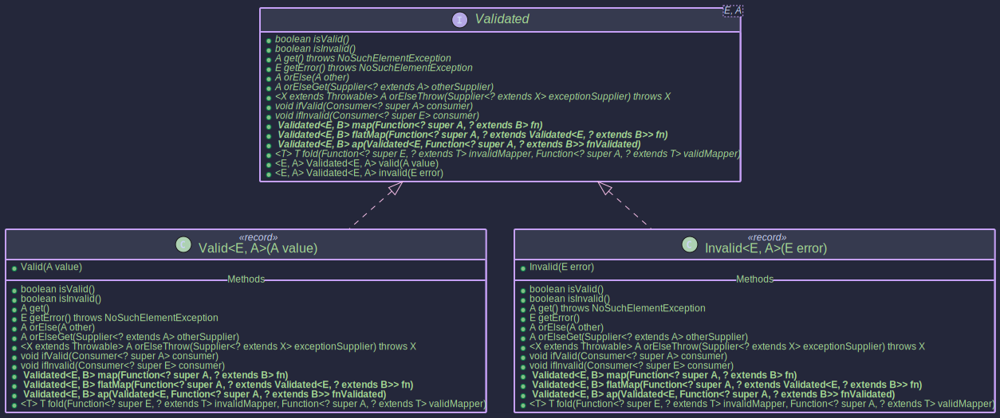

# The ValidatedMonad:
## _Accumulating Errors with `Validated`_

~~~admonish info title="What You'll Learn"
- Why fail-fast validation frustrates your users (and how to fix it)
- The difference between `flatMap` (fail-fast) and `ap` with `Semigroup` (error-accumulating)
- Building a complete form validator that reports ALL errors in one pass
- Using `ValidatedMonad` as a `MonadError` for recovery and error transformation
- When to reach for `Validated` vs `Either` vs `ValidationPath`
~~~

~~~ admonish example title="See Example Code:"
[ValidatedMonadExample.java](https://github.com/higher-kinded-j/higher-kinded-j/blob/main/hkj-examples/src/main/java/org/higherkindedj/example/basic/validated/ValidatedMonadExample.java)
~~~

## The Problem: Death by a Thousand Submits

A user fills out your registration form. They make three mistakes — empty name, malformed email, and age below 18. They hit Submit.

Your validation reports: **"Name is required."**

They fix the name, hit Submit again. Now they see: **"Invalid email format."**

They fix the email, hit Submit a third time. Finally: **"Must be at least 18."**

Three round-trips. Three frustrations. Three errors that were all knowable from the very first submission.

This is fail-fast validation. With a monadic chain (`flatMap`), each step depends on the previous one succeeding, so the first failure stops everything:

```java
// flatMap chain — validation stops at the FIRST error
validateName("")         // Invalid(["Name is required"])   <-- STOPS HERE
  .flatMap(name ->
    validateEmail("x@@")   // never reached
      .flatMap(email ->
        validateAge(15)));   // never reached
```

What you actually want is to run ALL validations independently and collect every error in one pass. That is exactly what `Validated` with applicative operations gives you.

~~~admonish note title="Fail-Fast vs Error Accumulation"
```
FAIL-FAST (flatMap):                  ACCUMULATE (ap + Semigroup):

validateName("")  --> Invalid         validateName("")  --> Invalid("Name is required")
       |                              validateEmail("x@@") --> Invalid("Invalid email")
    STOP HERE                         validateAge(15)   --> Invalid("Must be 18+")
                                           |
                                      combine all errors
                                           |
                                      Invalid(["Name is required",
                                               "Invalid email",
                                               "Must be 18+"])
```

- **flatMap**: Each step depends on the previous result. If step 1 fails, steps 2 and 3 never run. Use this when validations are **dependent**.
- **ap + Semigroup**: All steps run independently. Errors are combined using a `Semigroup<E>`. Use this when validations are **independent**.
~~~

## Core Components

**Validated Type** — `Valid(value)` or `Invalid(error)`:



**Monadic Structure** — `ValidatedMonad<E>` enables monadic operations on `ValidatedKind.Witness<E>`:


| Component | Role |
|-----------|------|
| `Validated<E, A>` | `Valid(value)` or `Invalid(error)` — like Either but validation-focused |
| `ValidatedKind<E, A>` / `ValidatedKindHelper` | HKT bridge: `widen()`, `narrow()`, `valid()`, `invalid()` |
| `ValidatedMonad<E>` | `MonadError<ValidatedKind.Witness<E>, E>` — fail-fast `map`/`flatMap`, plus `raiseError`/`handleErrorWith` |

~~~admonish note title="Validated vs Either"
Both represent success or failure. The difference is in **applicative** behaviour:
- `Either`: Always fail-fast in both Monad and Applicative contexts.
- `Validated`: Fail-fast as a Monad (`flatMap`), but can **accumulate errors** as an Applicative (`ap` with `Semigroup`).

If you only ever need fail-fast semantics, use [Either](./either_monad.md).
~~~

## Building a Complete Form Validator

Let's build a registration validator that validates username, email, and age — reporting ALL errors in one pass.

~~~admonish example title="Step 1: Define Individual Validators"

Each validator is an independent function that returns `Validated<List<String>, T>`:

```java
ValidatedMonad<List<String>> validatedMonad = ValidatedMonad.instance();

static Validated<List<String>, String> validateName(String name) {
    return (name == null || name.isBlank())
        ? Validated.invalid(List.of("Name is required"))
        : Validated.valid(name.trim());
}

static Validated<List<String>, String> validateEmail(String email) {
    return (email == null || !email.matches("^[^@]+@[^@]+\\.[^@]+$"))
        ? Validated.invalid(List.of("Invalid email format"))
        : Validated.valid(email.trim());
}

static Validated<List<String>, Integer> validateAge(int age) {
    return (age < 18)
        ? Validated.invalid(List.of("Must be at least 18 years old"))
        : Validated.valid(age);
}
```

Each validator works independently. None depends on another's result. This is the key to accumulation.
~~~

~~~admonish example title="Step 2: Compose with flatMap (Fail-Fast)"

When validations **depend** on each other, use `flatMap`. The chain stops at the first failure:

```java
// Dependent validation: email domain must match company based on user's role
Kind<ValidatedKind.Witness<List<String>>, String> result =
    validatedMonad.flatMap(
        name -> validatedMonad.flatMap(
            email -> VALIDATED.valid("User: " + name + " <" + email + ">"),
            VALIDATED.widen(validateEmail("alice@example.com"))
        ),
        VALIDATED.widen(validateName("Alice"))
    );
// Valid("User: Alice <alice@example.com>")

// If the first step fails, everything stops:
Kind<ValidatedKind.Witness<List<String>>, String> failed =
    validatedMonad.flatMap(
        name -> validatedMonad.flatMap(
            email -> VALIDATED.valid("User: " + name + " <" + email + ">"),
            VALIDATED.widen(validateEmail("bad@@"))      // never reached
        ),
        VALIDATED.widen(validateName(""))                 // Invalid — stops here
    );
// Invalid(["Name is required"])
```
~~~

~~~admonish example title="Step 3: Compose with ap (Error Accumulation)"

When validations are **independent**, use `ap` with a `Semigroup`. All validators run, and errors combine:

```java
// All three validators run regardless of individual failures
Validated<List<String>, String>  name  = validateName("");           // Invalid
Validated<List<String>, String>  email = validateEmail("bad@@");     // Invalid
Validated<List<String>, Integer> age   = validateAge(15);            // Invalid

// Using map3 to combine — ALL errors are collected:
Kind<ValidatedKind.Witness<List<String>>, String> result = validatedMonad.map3(
    VALIDATED.widen(name),
    VALIDATED.widen(email),
    VALIDATED.widen(age),
    (n, e, a) -> "User(" + n + ", " + e + ", age=" + a + ")"
);

Validated<List<String>, String> finalResult = VALIDATED.narrow(result);
// Invalid(["Name is required", "Invalid email format", "Must be at least 18 years old"])
//         ^^^ ALL three errors in one pass!
```

`map3` uses `ap` under the hood — it lifts the combining function into the `Validated` context and applies each argument, accumulating errors via the `Semigroup`. The `mapN` family (`map2`, `map3`, `map4`) is the recommended way to combine independent validations without writing curried functions manually.
~~~

~~~admonish example title="Step 4: Recover from Errors"

`ValidatedMonad<E>` implements `MonadError`, so you get structured recovery:

```java
Kind<ValidatedKind.Witness<List<String>>, Integer> failed =
    validatedMonad.raiseError(List.of("Something went wrong"));

// handleErrorWith — recover to a Valid state
Kind<ValidatedKind.Witness<List<String>>, Integer> recovered =
    validatedMonad.handleErrorWith(failed, errors -> validatedMonad.of(0));
// Valid(0)

// handleErrorWith — transform the error
Kind<ValidatedKind.Witness<List<String>>, Integer> transformed =
    validatedMonad.handleErrorWith(failed,
        errors -> validatedMonad.raiseError(
            List.of("Transformed: " + errors.getFirst())));
// Invalid(["Transformed: Something went wrong"])

// handleError — recover with a plain value
Kind<ValidatedKind.Witness<List<String>>, Integer> fallback =
    validatedMonad.handleError(failed, errors -> -1);
// Valid(-1)

// Valid values pass through untouched — handler is never called
Kind<ValidatedKind.Witness<List<String>>, Integer> ok = validatedMonad.of(42);
Kind<ValidatedKind.Witness<List<String>>, Integer> stillOk =
    validatedMonad.handleErrorWith(ok, errors -> validatedMonad.of(0));
// Valid(42) — handler was never invoked
```
~~~

### Working with `Validated<E, A>` Directly

Beyond the typeclass, the `Validated` type itself offers useful methods:

* `isValid()` / `isInvalid()` — check the state.
* `get()` / `getError()` — extract value or error (throws `NoSuchElementException` on wrong case).
* `orElse(other)` / `orElseGet(supplier)` / `orElseThrow(supplier)` — safe extraction with fallbacks.
* `fold(invalidMapper, validMapper)` — eliminate both cases into a single result.
* `map`, `flatMap`, `ap` — also available directly on `Validated` instances.

~~~admonish note title="Which Composition to Choose?"
```
Does step B depend on step A's result?
  |
  +-- YES --> flatMap (fail-fast)
  |           "Validate email, THEN check if domain matches company"
  |
  +-- NO  --> ap + Semigroup (accumulate)
              "Validate name AND email AND age independently"
```
Many real-world forms mix both: independent field validations (accumulate), followed by cross-field checks (fail-fast).
~~~

## When to Use Validated

| Scenario | Use |
|----------|-----|
| Form/input validation — want ALL errors at once | `Validated` with `ap` + `Semigroup` |
| Sequential validation — later steps depend on earlier results | `ValidatedMonad` (fail-fast via `flatMap`) |
| Typed errors with arbitrary branching | Prefer [Either](./either_monad.md) |
| Application-level validation with fluent API | Prefer [ValidationPath](../effect/path_validation.md) |
| Mix of independent + dependent validations | Independent fields via `ap`, then cross-field checks via `flatMap` |

~~~admonish important title="Key Points"
- `Validated<E, A>` is `Valid(value)` or `Invalid(error)` — explicitly models validation outcomes.
- **Monadic** operations (`flatMap` via `ValidatedMonad`) are **fail-fast**: the first `Invalid` short-circuits the chain.
- **Applicative** operations (`ap` with a `Semigroup<E>`) **accumulate** errors from independent validations.
- `ValidatedMonad<E>` implements `MonadError<ValidatedKind.Witness<E>, E>`, giving you `raiseError` and `handleErrorWith` for structured recovery.
- The choice between `flatMap` and `ap` is a design decision: **dependent** validations use flatMap, **independent** validations use ap.
- `ValidatedKindHelper` provides zero-cost `widen()`/`narrow()` casts for HKT integration.
~~~

---

~~~admonish tip title="Effect Path Alternative"
For most use cases, prefer **[ValidationPath](../effect/path_validation.md)** which wraps `Validated` and provides:

- Fluent composition with `map`, `via`, `recover`
- Seamless integration with the [Focus DSL](../optics/focus_dsl.md) for structural navigation
- A consistent API shared across all effect types
- Error accumulation when combined with applicative operations

```java
// Instead of manual Validated chaining:
Validated<List<Error>, User> user = validateUser(input);
Validated<List<Error>, Order> order = user.flatMap(u -> createOrder(u));

// Use ValidationPath for cleaner composition:
ValidationPath<List<Error>, Order> order = Path.validation(validateUser(input))
    .via(u -> createOrder(u));
```

See [Effect Path Overview](../effect/effect_path_overview.md) for the complete guide.
~~~

~~~admonish example title="Benchmarks"
Validated has dedicated JMH benchmarks. Key expectations:

- **`invalidMap`** reuses the same Invalid instance with zero allocation (like Either.Left)
- **`invalidLongChain`** benefits from sustained instance reuse over deep chains
- If Invalid operations allocate memory, instance reuse is broken

```bash
./gradlew :hkj-benchmarks:jmh --includes=".*ValidatedBenchmark.*"
```
See [Benchmarks & Performance](../benchmarks.md) for full details.
~~~

---

**Previous:** [Try](try_monad.md)
**Next:** [VTask](vtask_monad.md)
