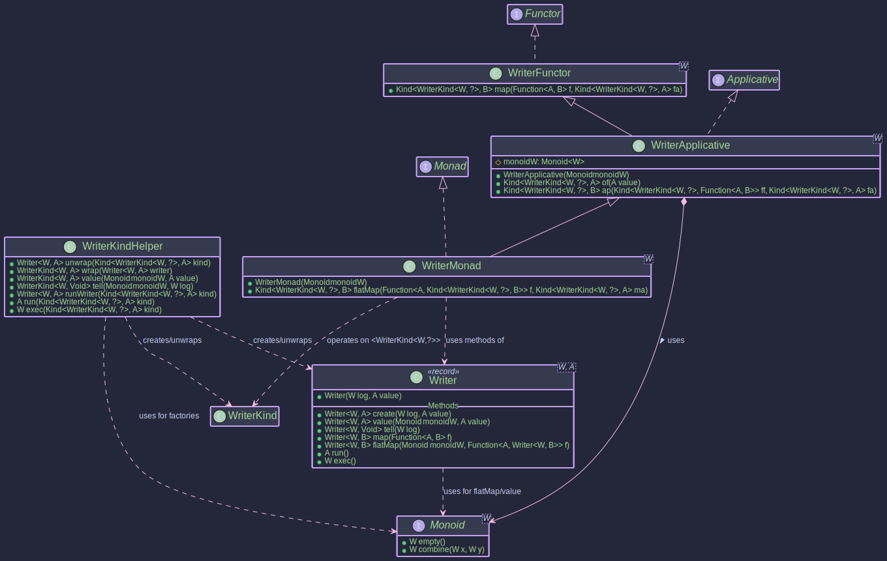

# The WriterMonad:
## _Accumulating Output Alongside Computations_

~~~admonish info title="What You'll Learn"
- How to accumulate logs or output alongside your main computation
- Understanding the role of Monoid in combining accumulated values
- Building detailed audit trails and debugging information
- Using `tell` for pure logging and `listen` for capturing output
- Creating calculations that produce both results and comprehensive logs
~~~

~~~ admonish example title="See Example Code:"
[WriterExample.java](https://github.com/higher-kinded-j/higher-kinded-j/blob/main/hkj-examples/src/main/java/org/higherkindedj/example/basic/writer/WriterExample.java)
~~~

## Purpose

The **Writer monad** is a functional pattern designed for computations that, in addition to producing a primary result value, also need to **accumulate** some secondary output or log along the way. Think of scenarios like:

* Detailed logging of steps within a complex calculation.
* Collecting metrics or events during a process.
* Building up a sequence of results or messages.

A `Writer<W, A>` represents a computation that produces a main result of type `A` and simultaneously accumulates an output of type `W`. The key requirement is that the accumulated type `W` must form a **Monoid**.

### The Role of `Monoid<W>`

A `Monoid<W>` is a type class that defines two things for type `W`:

1. `empty()`: Provides an identity element (like `""` for String concatenation, `0` for addition, or an empty list).
2. `combine(W w1, W w2)`: Provides an **associative** binary operation to combine two values of type `W` (like `+` for strings or numbers, or list concatenation).

The Writer monad uses the `Monoid<W>` to:

* Provide a starting point (the `empty` value) for the accumulation.
* Combine the accumulated outputs (`W`) from different steps using the `combine` operation when sequencing computations with `flatMap` or `ap`.

Common examples for `W` include `String` (using concatenation), `Integer` (using addition or multiplication), or `List` (using concatenation).

## Structure

The `Writer<W, A>` record directly implements `WriterKind<W, A>`, which in turn extends `Kind<WriterKind.Witness<W>, A>`.

 

## The `Writer<W, A>` Type

The core type is the `Writer<W, A>` record:

```java
// From: org.higherkindedj.hkt.writer.Writer
public record Writer<W, A>(@NonNull W log, @Nullable A value) implements WriterKind<W, A> {
  // Static factories
  public static <W, A> @NonNull Writer<W, A> create(@NonNull W log, @Nullable A value);
  public static <W, A> @NonNull Writer<W, A> value(@NonNull Monoid<W> monoidW, @Nullable A value); // Creates (monoidW.empty(), value)
  public static <W> @NonNull Writer<W, Unit> tell(@NonNull W log); // Creates (log, Unit.INSTANCE) 

  // Instance methods (primarily for direct use, HKT versions via Monad instance)
  public <B> @NonNull Writer<W, B> map(@NonNull Function<? super A, ? extends B> f);
  public <B> @NonNull Writer<W, B> flatMap(
          @NonNull Monoid<W> monoidW, // Monoid needed for combining logs
          @NonNull Function<? super A, ? extends Writer<W, ? extends B>> f
  );
  public @Nullable A run(); // Get the value A, discard log
  public @NonNull W exec(); // Get the log W, discard value
}
```

* It simply holds a pair: the accumulated `log` (of type `W`) and the computed `value` (of type `A`).
* `create(log, value)`: Basic constructor.
* `value(monoid, value)`: Creates a Writer with the given value and an *empty* log according to the provided `Monoid`.
* `tell(log)`: Creates a Writer with the given log, and `Unit.INSTANCE` as it's  value, signifying that the operation's primary purpose is the accumulation of the log. Useful for just adding to the log. (Note: The original `Writer.java` might have `tell(W log)` and infer monoid elsewhere, or `WriterMonad` handles `tell`).
* `map(...)`: Transforms the computed value `A` to `B` while leaving the log `W` untouched.
* `flatMap(...)`: Sequences computations. It runs the first Writer, uses its value `A` to create a second Writer, and combines the logs from both using the provided `Monoid`.
* `run()`: Extracts only the computed value `A`, discarding the log.
* `exec()`: Extracts only the accumulated log `W`, discarding the value.

## Writer Components

To integrate `Writer` with Higher-Kinded-J:

* `WriterKind<W, A>`: The HKT interface. `Writer<W, A>` itself implements `WriterKind<W, A>`. `WriterKind<W, A>` extends `Kind<WriterKind.Witness<W>, A>`.
  * It contains a nested `final class Witness<LOG_W> {}` which serves as the phantom type `F_WITNESS` for `Writer<LOG_W, ?>`.
* **`WriterKindHelper`**: The utility class with static methods:
  * `widen(Writer<W, A>)`: Converts a `Writer` to `Kind<WriterKind.Witness<W>, A>`. Since `Writer` directly implements `WriterKind`, this is effectively a checked cast.
  * `narrow(Kind<WriterKind.Witness<W>, A>)`: Converts `Kind` back to `Writer<W,A>`. This is also effectively a checked cast after an `instanceof Writer` check.
  * `value(Monoid<W> monoid, A value)`: Factory method for a `Kind` representing a `Writer` with an empty log.
  * `tell(W log)`: Factory method for a `Kind` representing a `Writer` that only logs.
  * `runWriter(Kind<WriterKind.Witness<W>, A>)`: Unwraps to `Writer<W,A>` and returns the record itself.
  * `run(Kind<WriterKind.Witness<W>, A>)`: Executes (unwraps) and returns only the value `A`.
  * `exec(Kind<WriterKind.Witness<W>, A>)`: Executes (unwraps) and returns only the log `W`.

## Type Class Instances (`WriterFunctor`, `WriterApplicative`, `WriterMonad`)

These classes provide the standard functional operations for `Kind<WriterKind.Witness<W>, A>`, allowing you to treat `Writer` computations generically. **Crucially, `WriterApplicative<W>` and `WriterMonad<W>` require a `Monoid<W>` instance during construction.**

* `WriterFunctor<W>`: Implements `Functor<WriterKind.Witness<W>>`. Provides `map` (operates only on the value `A`).
* **`WriterApplicative<W>`**: Extends `WriterFunctor<W>`, implements `Applicative<WriterKind.Witness<W>>`. Requires a `Monoid<W>`. Provides `of` (lifting a value with an empty log) and `ap` (applying a wrapped function to a wrapped value, combining logs).
* **`WriterMonad<W>`**: Extends `WriterApplicative<W>`, implements `Monad<WriterKind.Witness<W>>`. Requires a `Monoid<W>`. Provides `flatMap` for sequencing computations, automatically combining logs using the `Monoid`.


~~~admonish example title="Example: Logging a complex calculation"

- [WriterExample.java](https://github.com/higher-kinded-j/higher-kinded-j/blob/main/hkj-examples/src/main/java/org/higherkindedj/example/basic/writer/WriterExample.java)

You typically instantiate `WriterMonad<W>` for the specific log type `W` and its corresponding `Monoid`.

### 1. Choose Your Log Type `W` and `Monoid<W>`

Decide what you want to accumulate (e.g., `String` for logs, `List<String>` for messages, `Integer` for counts) and get its `Monoid`.

```java

class StringMonoid implements Monoid<String> {
  @Override public String empty() { return ""; }
  @Override public String combine(String x, String y) { return x + y; }
}

Monoid<String> stringMonoid = new StringMonoid(); 
```

### 2. Get the `WriterMonad` Instance

Instantiate the monad for your chosen log type `W`, providing its `Monoid`.

```java
import org.higherkindedj.hkt.writer.WriterMonad;

// Monad instance for computations logging Strings
// F_WITNESS here is WriterKind.Witness<String>
WriterMonad<String> writerMonad = new WriterMonad<>(stringMonoid);

```

### 3. Create Writer Computations

Use `WriterKindHelper` factory methods, providing the `Monoid` where needed. The result is `Kind<WriterKind.Witness<W>, A>`.

```java

// Writer with an initial value and empty log
Kind<WriterKind.Witness<String>, Integer> initialValue = WRITER.value(stringMonoid, 5); // Log: "", Value: 5

// Writer that just logs a message (value is Unit.INSTANCE)
Kind<WriterKind.Witness<String>, Unit> logStart = WRITER.tell("Starting calculation; "); // Log: "Starting calculation; ", Value: ()

// A function that performs a calculation and logs its step
Function<Integer, Kind<WriterKind.Witness<String>, Integer>> addAndLog =
        x -> {
          int result = x + 10;
          String logMsg = "Added 10 to " + x + " -> " + result + "; ";
          // Create a Writer directly then wrap with helper or use helper factory
          return WRITER.widen(Writer.create(logMsg, result));
        };

Function<Integer, Kind<WriterKind.Witness<String>, String>> multiplyAndLogToString =
        x -> {
          int result = x * 2;
          String logMsg = "Multiplied " + x + " by 2 -> " + result + "; ";
          return WRITER.widen(Writer.create(logMsg, "Final:" + result));
        };

```

### 4. Compose Computations using `map` and `flatMap`

Use the methods on the `writerMonad` instance. `flatMap` automatically combines logs using the `Monoid`.

```java
// Chain the operations:
// Start with a pure value 0 in the Writer context (empty log)
Kind<WriterKind.Witness<String>, Integer> computationStart = writerMonad.of(0);

// 1. Log the start
Kind<WriterKind.Witness<String>, Integer> afterLogStart  = writerMonad.flatMap(ignoredUnit -> initialValue, logStart);

Kind<WriterKind.Witness<String>, Integer> step1Value = WRITER.value(stringMonoid, 5); // ("", 5)
Kind<WriterKind.Witness<String>, Unit> step1Log = WRITER.tell("Initial value set to 5; "); // ("Initial value set to 5; ", ())


// Start -> log -> transform value -> log -> transform value ...
Kind<WriterKind.Witness<String>, Integer> calcPart1 = writerMonad.flatMap(
        ignored -> addAndLog.apply(5), // Apply addAndLog to 5, after logging "start"
        WRITER.tell("Starting with 5; ")
);
// calcPart1: Log: "Starting with 5; Added 10 to 5 -> 15; ", Value: 15

Kind<WriterKind.Witness<String>, String> finalComputation = writerMonad.flatMap(
        intermediateValue -> multiplyAndLogToString.apply(intermediateValue),
        calcPart1
);
// finalComputation: Log: "Starting with 5; Added 10 to 5 -> 15; Multiplied 15 by 2 -> 30; ", Value: "Final:30"


// Using map: Only transforms the value, log remains unchanged from the input Kind
Kind<WriterKind.Witness<String>, Integer> initialValForMap = value(stringMonoid, 100); // Log: "", Value: 100
Kind<WriterKind.Witness<String>, String> mappedVal = writerMonad.map(
        i -> "Value is " + i,
        initialValForMap
); // Log: "", Value: "Value is 100"
```

### 5. Run the Computation and Extract Results

Use `WRITER.runWriter`, `WRITER.run`, or `WRITER.exec` from `WriterKindHelper`.

```java

import org.higherkindedj.hkt.writer.Writer; 

// Get the final Writer record (log and value)
Writer<String, String> finalResultWriter = runWriter(finalComputation);
String finalLog = finalResultWriter.log();
String finalValue = finalResultWriter.value();

System.out.println("Final Log: " + finalLog);
// Output: Final Log: Starting with 5; Added 10 to 5 -> 15; Multiplied 15 by 2 -> 30;
System.out.println("Final Value: " + finalValue);
// Output: Final Value: Final:30

// Or get only the value or log
String justValue = WRITER.run(finalComputation); // Extracts value from finalResultWriter
String justLog = WRITER.exec(finalComputation);  // Extracts log from finalResultWriter

System.out.println("Just Value: " + justValue); // Output: Just Value: Final:30
System.out.println("Just Log: " + justLog);     // Output: Just Log: Starting with 5; Added 10 to 5 -> 15; Multiplied 15 by 2 -> 30;

Writer<String, String> mappedResult = WRITER.runWriter(mappedVal);
System.out.println("Mapped Log: " + mappedResult.log());   // Output: Mapped Log
System.out.println("Mapped Value: " + mappedResult.value()); // Output: Mapped Value: Value is 100
```
~~~


~~~admonish important  title="Key Points:"

The Writer monad (`Writer<W, A>`, `WriterKind.Witness<W>`, `WriterMonad<W>`) in `Higher-Kinded-J` provides a structured way to perform computations that produce a main value (`A`) while simultaneously accumulating some output (`W`, like logs or metrics). 

It relies on a `Monoid<W>` instance to combine the accumulated outputs when sequencing steps with `flatMap`. This pattern helps separate the core computation logic from the logging/accumulation aspect, leading to cleaner, more composable code. 

The Higher-Kinded-J enables these operations to be performed generically using standard type class interfaces, with `Writer<W,A>` directly implementing `WriterKind<W,A>`.

~~~

---

**Previous:** [Validated](validated_monad.md)
**Next:** [Const](const_type.md)