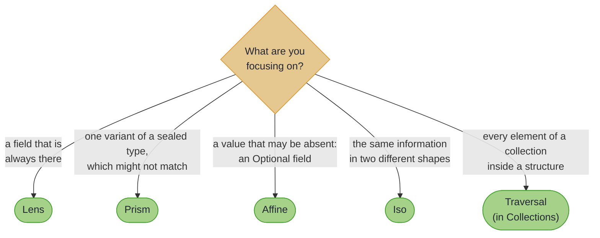

# Fundamentals

> *"The best way to predict the future is to invent it... The second best way is to fund it. The third best way is to map it."*
>
> – Neal Stephenson, *Cryptonomicon*

---

Every Java developer has, at some point, stared at a screen wondering why updating a single field in an immutable record requires reconstructing half the object graph. The standard approach (manually copying and rebuilding each layer) works, technically speaking, in the same way that crossing the Atlantic in a rowing boat works. Possible, certainly. Pleasant, no.

Optics offer a rather more civilised alternative. Here is the destination, before any theory: a reusable path from a `User` down to the name of the street they live on, and two one-line updates through it. Every line compiles against the real library on every build:

<!-- verify -->
```java
var streetName = UserLenses.address()
    .andThen(AddressLenses.street())
    .andThen(StreetLenses.name());

User moved = streetName.set("Baker Street", user);
User shouted = streetName.modify(String::toUpperCase, user);
// moved.address().street().name()   -> "Baker Street"
// shouted.address().street().name() -> "FLEET STREET"
// the whole graph is rebuilt for you; user itself is untouched
```

At their heart, optics are simply composable, reusable paths through data structures. A Lens focuses on a single field. A Prism handles cases that might not exist. An Iso converts between equivalent representations. None of this is particularly revolutionary in concept (functional programmers have been using these tools for decades), but the practical benefit is considerable: once you've defined a path, you can use it to get, set, or modify values without writing the same tedious reconstruction code repeatedly.

## Which optic do you need?



~~~admonish tip title="Why this matters"
Three things separate these optics from a bag of getter helpers. They are **generated**: annotate a record and the boilerplate is the processor's problem, forever in sync with the fields. They are **effect-ready**: the same path that does a pure `set` today runs a validating, accumulating, or asynchronous update tomorrow through `modifyF`, because every optic is generic over an `Applicative`. And they are **lawful**: the round-trip laws each optic must satisfy are published in `hkj-test` and checked, not assumed.
~~~

This section introduces the fundamental optics: Lens for product types (records with fields), Prism for sum types (sealed interfaces with variants), Affine for zero-or-one focus, and Iso for reversible conversions. By the end, you'll understand not only how each works, but when to reach for one over another.

The composition rules table at the section's end is worth bookmarking. You'll refer to it more often than you might expect. The [Optics landing page](ch_intro.md) carries the overall optics hierarchy if you need to see where these four fit in relation to Traversals, Folds, Getters, and Setters.

~~~admonish info title="Hands-On Learning"
Practice this section in the [Lens & Prism Journey](../tutorials/optics/lens_prism_journey.md) (30 exercises, ~40 minutes).
~~~

~~~admonish tip title="See Also"
- [Annotations at a Glance](annotations_at_a_glance.md): every optic in this section is generated by an annotation
~~~

---

~~~admonish info title="In This Chapter"
- **Lenses** – Focus on exactly one field within a record. A Lens guarantees the field exists and provides both get and set operations.
- **Prisms** – Handle sum types (sealed interfaces) where a value might be one of several variants. A Prism can attempt to match a variant and construct new instances.
- **The Prism Toolkit** – Ready-made prisms and combinators for everyday matching: type tests, predicates, enum constants, and non-sealed hierarchies.
- **Validated Prisms** – The smart-constructor optic for boundaries: a fallible, accumulating `parse` paired with a total `build`, the leaf every generated record mapping is built from.
- **Affines** – For optional fields that may or may not be present. An Affine targets zero-or-one values, making it perfect for nullable fields or conditional access.
- **Isomorphisms** – Bidirectional, lossless conversions between equivalent types. An Iso can convert in both directions without losing information.
- **The Composition Rules** – Chain optics with `andThen` to navigate arbitrarily deep structures, with a reference table showing exactly what optic type each pairing produces (a Lens after a Prism is an Affine, and so on).
- **Coupled Fields** – When record fields share invariants, sequential lens updates fail. Learn how `Lens.paired` provides atomic multi-field updates.
~~~

---

## Chapter Contents

1. [What Are Optics?](optics_intro.md) - Introduction to composable, reusable paths through data
2. [Lenses](lenses.md) - Focusing on required fields within records
3. [Prisms](prisms.md) - Safely handling sum types and optional variants
   - [Prism Toolkit](prism_toolkit.md) - Ready-made prisms and matching combinators
   - [Validated Prisms](validated_prism.md) - The parse-don't-validate boundary optic
4. [Affines](affine.md) - Working with optional fields (zero-or-one focus)
5. [Isomorphisms](iso.md) - Lossless conversions between equivalent types
6. [Composition Rules](composition_rules.md) - A reference for what type results from combining optics
7. [Coupled Fields](coupled_fields.md) - Atomic updates for fields with shared invariants

---

**Next:** [What Are Optics?](optics_intro.md)
