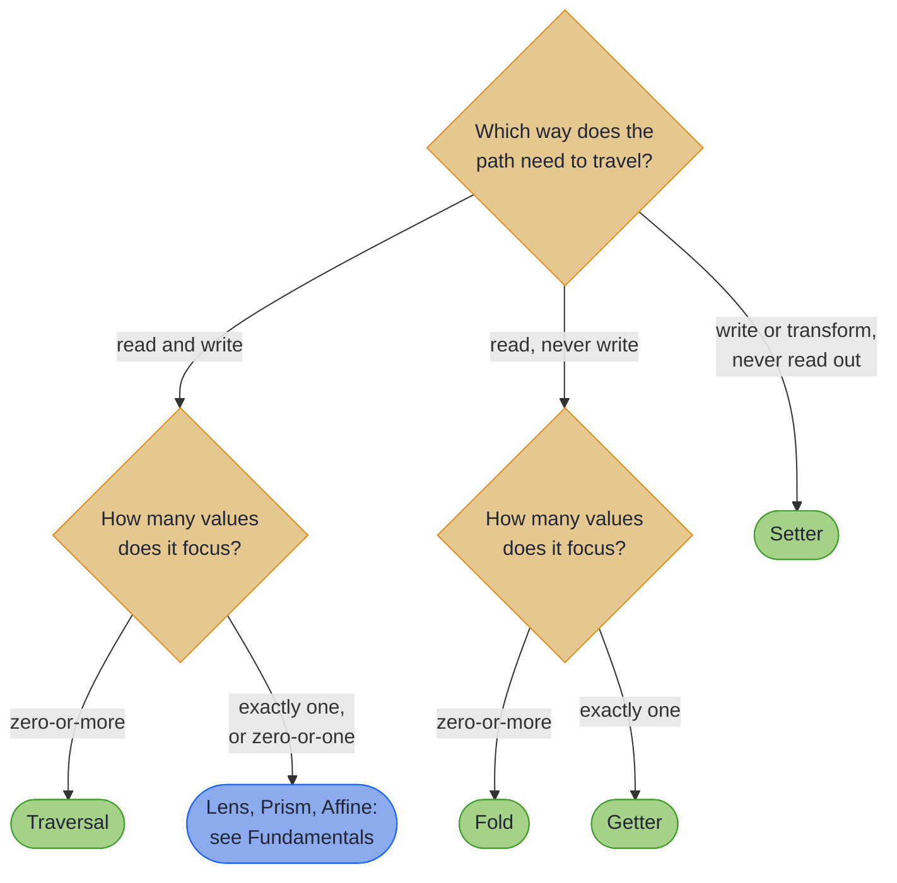
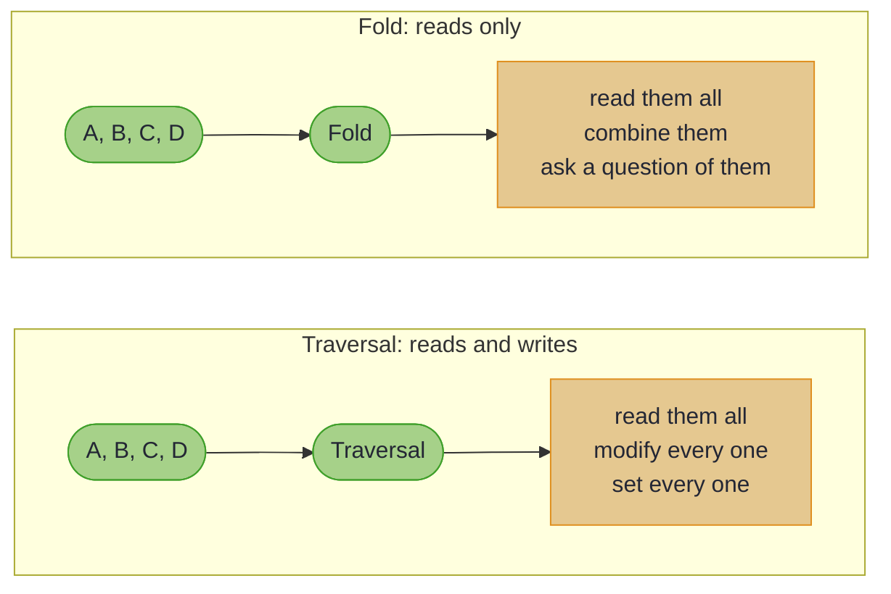

# Collections

> *"The world is full of abandoned meanings."*
>
> – Don DeLillo, *White Noise*

---

Single values are straightforward enough. The challenge, as with so many things in programming, arrives when you need to handle *many* of them.

Consider an order containing a list of items, each with a price. Applying a discount to every price using standard Java means a stream, a map, a collector, and the nagging suspicion that there must be a better way. There is. Here it is, before any theory: one reusable path from a league to every player's score, and a bulk update through it. Every line compiles against the real library on every build:

<!-- verify -->
```java
var everyScore = LeagueTraversals.teams()
    .andThen(TeamTraversals.players())
    .andThen(PlayerLenses.score().asTraversal());

League bonus = Traversals.modify(everyScore, score -> score + 5, league);
// Traversals.getAll(everyScore, league) -> [100, 90, 110, 120]
// Traversals.getAll(everyScore, bonus)  -> [105, 95, 115, 125]
// every team and player is rebuilt for you; league itself is untouched
```

~~~admonish tip title="Why this matters"
A stream pipeline that rebuilds nested records is code you write again for every operation. A composed traversal is a value: define the path once and reuse it for pure updates, for queries, and (through `modifyF`) for validating or asynchronous passes over every element. And when a path should never write, `asFold()` or a Getter says so in the type, so read-only intent is checked by the compiler rather than promised in a comment.
~~~

Traversals operate on zero-or-more values, typically the elements of a collection embedded within a larger structure. Where a Lens says "there is exactly one thing here," a Traversal says "there may be several things here, and I'd like to work with all of them, please." The politeness is implicit.

Folds are Traversal's read-only cousin. If you need to query, search, aggregate, or summarise without modification, a Fold makes your intent explicit. This matters more than it might seem: code that cannot accidentally modify data is code that behaves predictably at three in the morning when something has gone wrong.

This section covers both, along with Getters and Setters (the asymmetric specialists) and practical patterns for working with common Java collections. The monoid-based aggregation in Folds may initially seem academic, but it has a way of becoming indispensable once you've used it a few times.

## Which optic do you need?



The diagram signposts Lens, Prism, and Affine rather than covering them: those single-value optics belong to [Fundamentals](ch1_intro.md). The four this section owns are Traversal, Fold, Getter, and Setter.

## Traversal vs Fold

The distinction is worth understanding clearly:



Both focus zero or more elements, and both can read. Only a `Traversal` can write. Where the operation *lives* differs too, which is the part that trips people up: a `Fold` declares its query family directly, while a `Traversal` declares only `modifyF` and reaches the rest through the `Traversals` utility or `asFold()`.

| You want to | On a `Traversal` | On a `Fold` |
|---|---|---|
| read every focus | `Traversals.getAll(t, s)` | `getAll(s)` |
| combine the focuses | `t.asFold().foldMap(...)` | `foldMap(monoid, f, s)` |
| ask whether any matches | `t.asFold().exists(...)` | `exists(p, s)` |
| change every focus | `Traversals.modify(t, f, s)` | not available |
| set every focus | `Traversals.modify(t, a -> x, s)` | not available |

~~~admonish info title="Hands-On Learning"
Practice this section in the [Traversals & Practice Journey](../tutorials/optics/traversals_journey.md) (27 exercises, ~40 minutes).
~~~

~~~admonish tip title="See Also"
- [Annotations at a Glance](annotations_at_a_glance.md): every traversal, fold, getter, and setter in this section is generated by an annotation
~~~

---

~~~admonish info title="In This Chapter"
- **Traversals** – Focus on zero-or-more elements within a structure. Apply the same modification to every item in a list, or extract all values matching a path.
- **Folds** – Read-only traversal that aggregates results using a Monoid. Sum all prices, count matching elements, or check if any element satisfies a predicate. Combine multiple folds with `plus` to extract values from different paths in a single query.
- **Getters** – A read-only Lens. When you need to extract a value but never modify it, a Getter documents that intent in the type.
- **Setters** – A write-only optic. Modify values without reading them first, useful when the modification doesn't depend on the current value.
- **Common Data Structures** – Ready-made traversals for Java's standard collections. Iterate over List elements, Map entries, Set members, and more.
- **Limiting Traversals** – Take the first N elements, skip elements, or focus only on specific indices. Control exactly which elements a Traversal affects.
- **List Decomposition** – Functional list patterns using cons (head/tail) and snoc (init/last). Decompose lists from either end for pattern matching and recursive algorithms.
~~~

---

## Chapter Contents

1. [Traversals](traversals.md) - Bulk operations on collection elements
2. [Folds](folds.md) - Read-only queries with monoid-based aggregation and multi-path combination
3. [Getters](getters.md) - Read-only focus on single values
4. [Setters](setters.md) - Write-only modification without reading
5. [Common Data Structures](common_data_structure_traversals.md) - Patterns for List, Map, Set, and more
6. [Limiting Traversals](limiting_traversals.md) - First-N, take, and drop operations
7. [List Decomposition](list_decomposition.md) - Cons and snoc patterns for list manipulation

---

**Next:** [Traversals](traversals.md)
