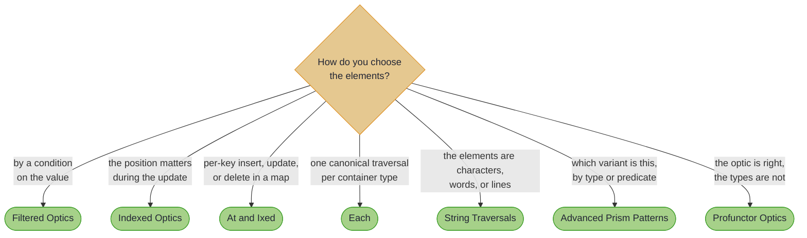
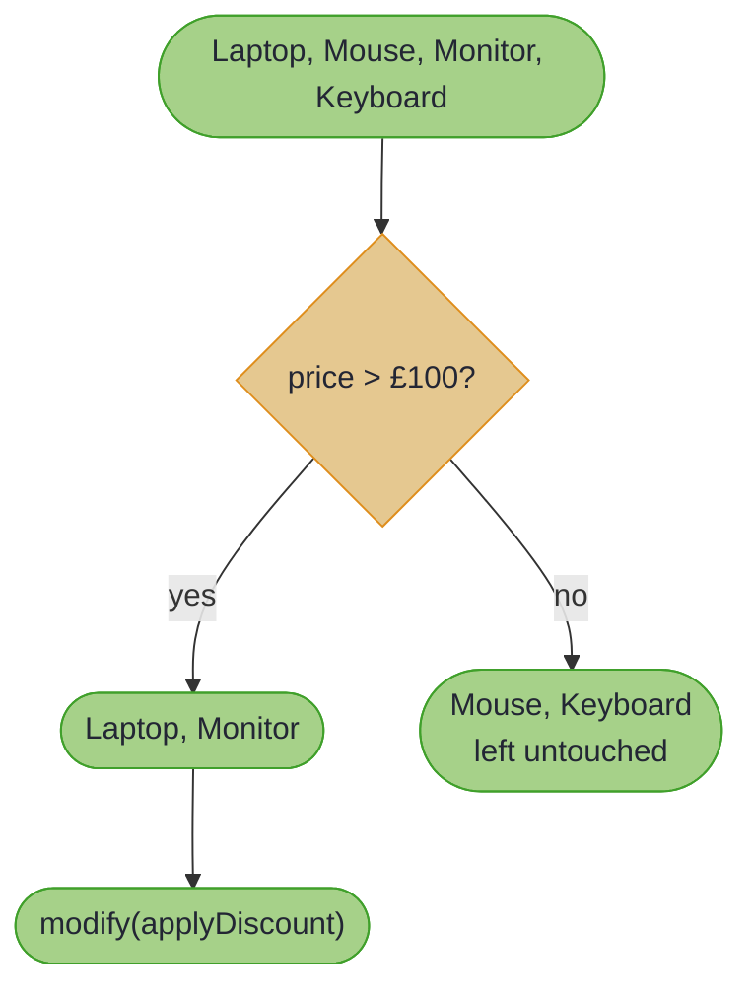
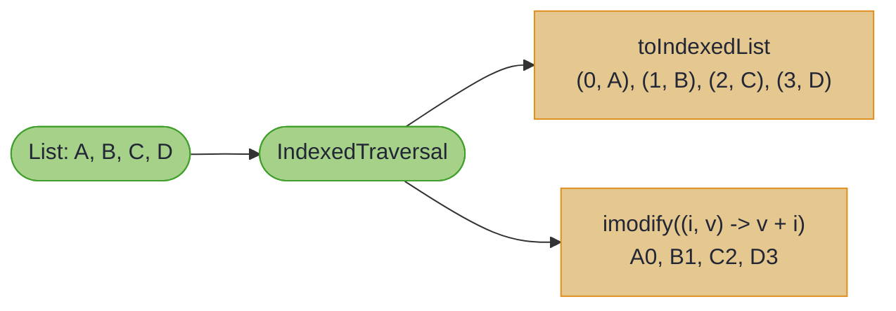

# Precision and Filtering

> *"I believe the angle and direction of the lines are full of secret meaning."*
>
> – J.G. Ballard, *Crash*

---

Sometimes you don't want *all* the elements. Sometimes you want the expensive ones. Or the ones at specific indices. Or the ones that match a condition known only at runtime.

Optics handle this through filtering and indexing: techniques that narrow focus to exactly the subset you need. A filtered Traversal only operates on elements matching a predicate. An indexed Traversal carries position information alongside each element. Together, they provide surgical precision that would otherwise require verbose, error-prone manual iteration. Here is the destination, before any theory: a Collections-style bulk update, narrowed to only the items that cost more than £100. Every line compiles against the real library on every build:

<!-- verify -->
```java
var pricey = OrderTraversals.items()
    .andThen(ItemLenses.price().asTraversal())
    .filtered(price -> price > 100.0);

Order discounted = Traversals.modify(pricey, price -> price - 50.0, order);
// Traversals.getAll(pricey, order)      -> [500.0, 200.0]
// Traversals.getAll(pricey, discounted) -> [450.0, 150.0]
// the £25 mouse is untouched, and so is order itself
```

~~~admonish tip title="Why this matters"
The predicate travels with the path, not with the loop body. Write `if` checks inside iteration and every caller must remember them; build the filter into the optic and the rule is declared once, composes with any lens or traversal, and cannot be forgotten at a call site. The same holds for position: an indexed traversal carries the index in the type instead of in a manually-threaded counter.
~~~

The At and Ixed type classes extend this precision to maps and indexed collections, offering principled ways to access, insert, or remove elements at specific keys. If you've ever written `map.get(key)` followed by null checks and conditional puts, you'll appreciate what these abstractions provide.

This section also revisits Prisms with advanced patterns: the `nearly` prism for predicate-based matching, `doesNotMatch` for exclusion filtering, and composition strategies for complex sealed interface hierarchies. These are the tools you reach for when the basic patterns no longer suffice.

Most readers only need filtered traversals, covered first. The rest solve specific problems: reach for indexed optics when position drives the logic, `At`/`Ixed` for per-key map access, `Each` for a canonical traversal per container, string traversals for text, and profunctor adaptations when the optic is right but the types are not. Read those pages when you hit them, not before.

## Which tool do you need?



~~~admonish info title="Hands-On Learning"
The [Traversals & Practice Journey](../tutorials/optics/traversals_journey.md) (27 exercises, ~40 minutes) covers filtering and indexed patterns alongside the basics.
~~~

~~~admonish tip title="See Also"
- [Annotations at a Glance](annotations_at_a_glance.md): the underlying optics are still annotation-generated
~~~

---

## Filtering in Action

The concept is straightforward; the power is in the composition:



The filter becomes part of the optic itself, not scattered through your business logic.

---

## Indexed Access

When position matters:



---

~~~admonish info title="In This Chapter"
- **Filtered Optics** – Apply predicates to narrow which elements a Traversal affects. Only modify items over a certain price, or extract elements matching a condition.
- **Indexed Optics** – Carry position information alongside values. Know which index you're modifying, or transform values based on their position in a collection.
- **Each Typeclass** – Provides canonical traversals for container types. Get a Traversal for any List, Map, Optional, or custom container through a uniform interface, with optional indexed access.
- **String Traversals** – Treat strings as collections of characters. Modify individual characters, filter by character properties, or transform text character-by-character.
- **At and Ixed** – Type classes for indexed access. `At` handles keys that may or may not exist (like Map entries); `Ixed` handles indices that should exist (like List positions).
- **Advanced Prism Patterns** – Beyond basic sum types: production routing for configuration, API responses, events, and state machines, plus `nearly` for matching a predicate rather than a type and `doesNotMatch` for naming the negative case.
- **Profunctor Optics** – Transform the input and output types of optics. Adapt an optic for a different representation without rewriting it.
~~~

---

## Chapter Contents

1. [Filtered Optics](filtered_optics.md) - Predicate-based targeting within traversals
2. [Indexed Optics](indexed_optics.md) - Position-aware operations on collections
    - [Indexed Optics: Advanced Patterns](indexed_optics_advanced.md) - Paired indices and audit trails
3. [Each Typeclass](each_typeclass.md) - Canonical element-wise traversal for containers
4. [String Traversals](string_traversals.md) - Character-level operations on text
5. [Indexed Access](indexed_access.md) - At and Ixed type classes for indexed access patterns
6. [Advanced Prism Patterns](advanced_prism_patterns.md) - Production routing patterns, `nearly`, and `doesNotMatch`
    - [Advanced Prism Patterns: Recipes](advanced_prism_patterns_recipes.md) - Caching and testing recipes
7. [Profunctor Optics](profunctor_optics.md) - Adapting an optic to different types
    - [Profunctor Optics: Recipes](profunctor_optics_recipes.md) - Wrapper and migration adapters

---

**Next:** [Filtered Optics](filtered_optics.md)
