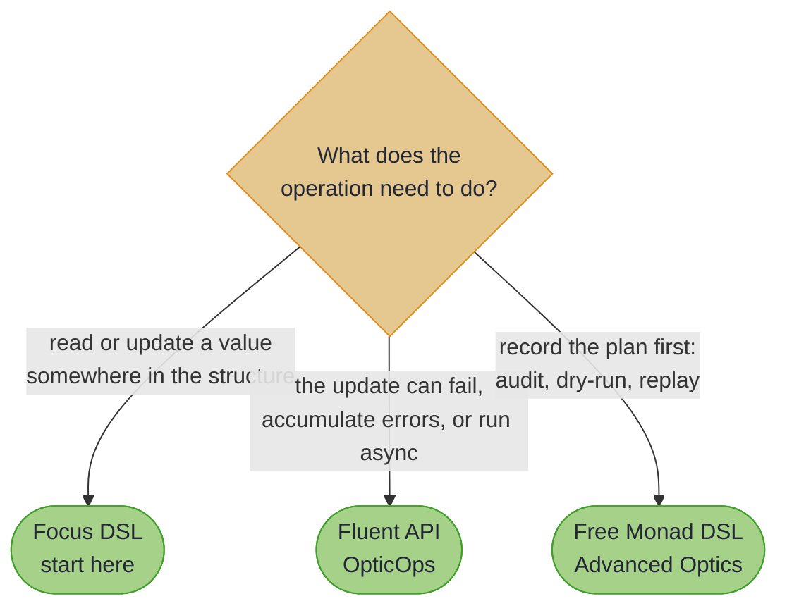

# Java-Friendly APIs

> *"There was no particular reason to respect the language of the Establishment."*
>
> – Norman Mailer, *The Armies of the Night*

---

Optics originated in Haskell, a language with rather different conventions to Java. Method names like `view`, `over`, and `preview` do not match what Java developers expect, and the parameter ordering (value before source) feels backwards to anyone accustomed to the receiver-first style.

This chapter closes that gap. Here is the destination, before any theory: a deep read and a bulk update over a company graph, written the way a Java developer would want to write them. Every line compiles against the real library and the real annotation processor on every build:

<!-- verify -->
```java
// Company -> headquarters -> city: a single field access, generated
String hq = CompanyFocus.headquarters().city().get(acme);
// "London"

// Company -> departments[] -> staff[] -> salary: every salary, in one expression
Company afterRise =
    CompanyFocus.departments()
        .via(DepartmentFocus.staff())
        .via(EmployeeFocus.salary())
        .modifyAll(s -> s.multiply(new BigDecimal("1.10")), acme);
// every salary is 10% higher; acme itself is untouched
```

No casting, no null checks, no loops, and no `Optional` gymnastics. Both paths are generated from four annotated records by `@GenerateFocus(generateNavigators = true)`: `Company(name, headquarters, departments)`, `Department(name, staff)`, `Employee(name, salary)` and an `Address` with a `city`. The pages that follow shape their own models to the point they are making, so read the field names from each page rather than carrying these forward.

~~~admonish tip title="Why this matters"
That chain is not a string, a reflective path expression, or a runtime lookup. `headquarters()`, `city()`, `staff()` and `salary()` are ordinary methods generated at compile time, so a renamed field is a compilation error rather than a `NullPointerException` in production, and the IDE autocompletes each step. It is also a *value*: store the path in a static field, pass it to a method, reuse it. The chain reads like a field access and behaves like an optic.
~~~

The two lines differ for a reason worth knowing early. `headquarters` is a plain field whose type is itself annotated, so the processor generates a *navigator* and `.city()` chains straight off it. `departments` is a `List`, which the processor already unwraps to a `TraversalPath` over the elements, so the next hop is spelled `.via(...)`. [Navigation and Composition](focus_navigation.md#fluent-navigation-with-generated-navigators) sets out exactly which fields get which.

---

## Which API Should I Use?

Three APIs sit on the same optics. Pick by what the operation has to do, not by taste:



They compose rather than compete: a Focus path hands its underlying optic to `OpticOps` through `toLens()`, `toAffine()` or `toTraversal()`, so choosing one first never locks the others out.

**Focus DSL** is path-based navigation that mirrors the shape of the data. `@GenerateFocus` generates the path builders; `.each()`, `.some()`, `.at(i)` and `instanceOf()` extend them through collections, optionals and sealed types.

**Fluent API** is `OpticOps`: static methods and builders for operations that involve validation or effects, including four dedicated validation methods that would otherwise mean wiring an `Applicative` by hand.

**Free Monad DSL** builds optic programs you can interpret more than one way, for when the interesting artefact is the *plan* rather than the result. It lives in [Advanced Optics](ch6_intro.md).

---

~~~admonish info title="In This Chapter"
- **Focus DSL** – The recommended starting point, replacing manual lens composition with fluent, path-based navigation. The compiler tracks every step, so the IDE can autocomplete the full path through your data.
- **Optics for External Types** – Generate optics for types you do not own (Jackson, JOOQ, Lombok, JDK classes) using `@ImportOptics` for shapes the processor can analyse directly. When a type resists auto-detection, an interface extending `OpticsSpec<S>` lets you declare each optic and tell the processor how to build it: `@InstanceOf` and `@MatchWhen` for prisms, `@ViaBuilder`, `@Wither`, `@ViaConstructor` and `@ViaCopyAndSet` for lenses.
- **Focus DSL with External Libraries** – Focus navigation stops at the boundary of the types you own. `.via()` carries it across into Immutables, Lombok, AutoValue and Protobuf values, so a path can run from your record into a library's value object without a helper method per field.
- **Kind Field Support** – A record field typed `Kind<F, A>` needs no annotation at all: the processor recognises the library witnesses by name, applies the right `Traverse`, and picks the path type from the witness's cardinality. `@TraverseField` covers the witnesses it does not know.
- **Fluent API** – When a modification can fail, accumulates errors, or runs asynchronously, `OpticOps` is the right tool. Static methods cover one-off cases; the fluent builders give you discoverable chaining for composing with `Either`, `Maybe`, `Validated`, and any other `Applicative`.
~~~

~~~admonish info title="Hands-On Learning"
- Practice the Focus DSL in the [Focus DSL Journey](../tutorials/optics/focus_dsl_journey.md) (9 tutorials, ~80 exercises, ~75 minutes).
- Practice the Fluent and Free APIs in the [Fluent & Free DSL Journey](../tutorials/optics/fluent_free_journey.md) (22 exercises, ~35 minutes).
~~~

~~~admonish tip title="See Also"
- [Annotations at a Glance](annotations_at_a_glance.md): the path builders, prisms and traversals used here are all generated by annotations
~~~

---

## Chapter Contents

1. [Focus DSL](focus_dsl.md) - Path-based navigation with type safety and IDE support
   - [Navigation and Composition](focus_navigation.md) - Collection navigation, `.via()` composition, and generated navigators
   - [Type Class and Effect Integration](focus_effects.md) - Effectful operations, monoid aggregation, and Effect path bridging
   - [Custom Containers and Code Generation](focus_containers.md) - SPI container types, generated class structure, and registration
   - [Focus DSL Reference](focus_reference.md) - Decision guide, common patterns, performance, pitfalls, and FAQ
2. [Optics for External Types](importing_optics.md) - Generate optics for types you do not own
3. [Taming JSON with Jackson](optics_spec_interfaces.md) - Spec interfaces for complex external types
4. [Database Records with JOOQ](copy_strategies.md) - Copy strategies for builder-based types
5. [Focus DSL with External Libraries](focus_external_bridging.md) - Bridging Focus navigation into Immutables, Lombok, and beyond
6. [Kind Field Support](kind_field_support.md) - Automatic traversal for `Kind<F, A>` record fields
7. [Fluent API](fluent_api.md) - Static methods and builders for validation-aware modifications
   - [Fluent API Field Guide](fluent_api_field_guide.md) - Style choice, idioms, performance, and pitfalls

For the domain to DTO boundary (`@GenerateMapping` and friends), see the dedicated [Mapping at the Boundary](../mapping/ch_intro.md) chapter. For the Free Monad DSL and interpreters, see [Advanced Optics](ch6_intro.md).

---

**Next:** [Focus DSL](focus_dsl.md)
