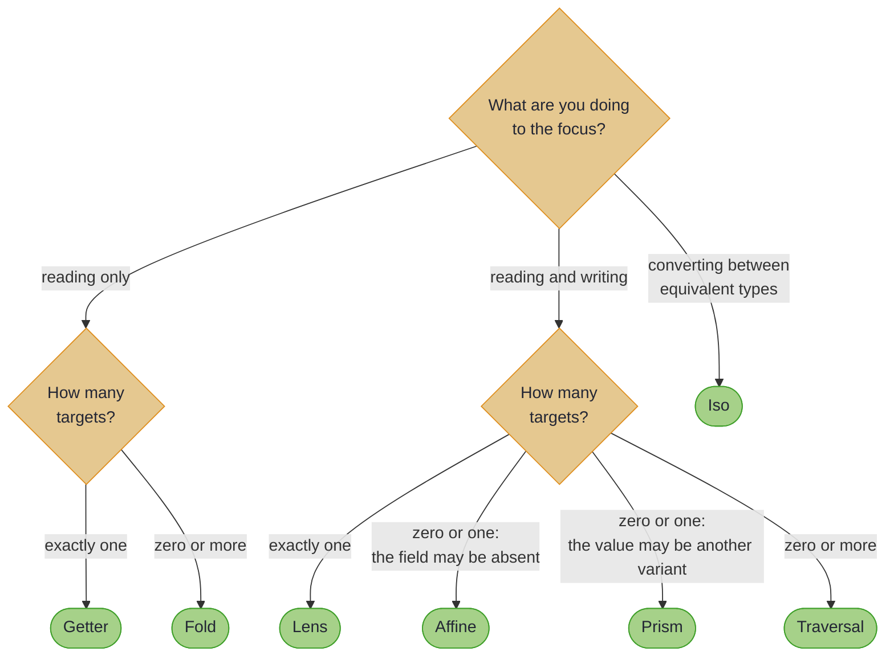
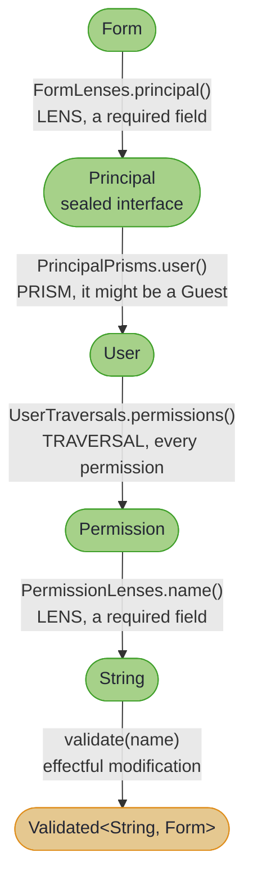

# Integration and Recipes

> *"Anything worth doing is worth doing right."*
>
> – Hunter S. Thompson, *Fear and Loathing in Las Vegas*

---

Theory is useful; working code is better. Here is the chapter's capstone in miniature, before any of the reasoning behind it. One path runs from a form, through a sealed principal, across a list of permissions, down to each permission's name; one call validates every one of them and collects the failures. Every line compiles against the real library on every build:

<!-- verify -->
```java
Traversal<Form, String> everyPermissionName =
    FormLenses.principal().asTraversal()
        .andThen(PrincipalPrisms.user().asTraversal())
        .andThen(UserTraversals.permissions())
        .andThen(PermissionLenses.name().asTraversal());

Validated<String, Form> checked =
    VALIDATED.narrow(
        everyPermissionName.modifyF(
            Fixture::validatePermission, Fixture.form, Instances.validated(Semigroups.string("; "))));
// Invalid("Invalid permission: PERM_FLY")
// A Guest principal would simply have no permissions in focus, and validate clean.
```

The sample `Form` holds a `User` with two permissions, `PERM_READ` and `PERM_FLY`, and only the first is on the allowed list. `Fixture` is the compiled example's own setup, not library API.

~~~admonish tip title="Why this matters"
Four optics of three different kinds compose into one value, and that value is reusable in both directions: run it with a plain function to update every permission, or with an `Applicative` to validate them and accumulate the failures. The prism in the middle is what makes it safe. A `Form` holding a `Guest` has nothing in focus, so the same expression returns a clean result rather than a `ClassCastException`, and no branch had to be written for that case.
~~~

This section brings together everything from the previous four into practical patterns you can apply directly. The capstone example demonstrates a complete validation workflow: composing Lens, Prism, and Traversal to validate permissions nested deep within a form structure. It's the sort of problem that would require dozens of lines of imperative code, handled in a few declarative compositions.

The integration sections cover how optics work with higher-kinded-j's core types: extending Lenses and Traversals with additional capabilities, using Prisms for Optional, Either, and other standard containers. If you've wondered how to combine optics with the rest of the library, this is where you'll find answers.

Three pages then deal with the operations that fall between one edit and one query. **Multi-Edit** applies N independent edits at different paths in a single reusable operation, including the sparse REST `PATCH` that reports every bad field at once. **Optic-Driven Batching** attaches a batching strategy to a traversal, so N foci become one backend call, and **Plan Introspection and Guardrails** lets you see and bound that call before it leaves the JVM.

The cookbook provides ready-to-use recipes for common problems: updating nested optionals, modifying specific sum type variants, bulk collection operations with filtering, and configuration management. Each recipe states the problem and gives the solution, with a note on why it works where the mechanism is not obvious. Audit trail generation gets a page of its own after it.

Copy freely. That's what they're for.

~~~admonish info title="Hands-On Learning"
The [Optics Tutorial Track](../tutorials/optics/ch_intro.md) groups all six journeys (134 exercises, ~225 minutes).
~~~

~~~admonish tip title="See Also"
- [Annotations at a Glance](annotations_at_a_glance.md): every optic in the recipes below is annotation-generated
~~~

---

## Which Optic Do I Need?

When facing a new problem, this flowchart helps:



The two zero-or-one branches are the ones worth reading twice. An `Affine` reaches a value that may not be there, such as an optional field. A `Prism` reaches a value that may be a *different variant*, and can build the structure back up from it. The capstone above uses a `Prism` for exactly that reason: a `Principal` is either a `User` or a `Guest`.

---

## The Complete Pipeline

Optics compose to handle complex real-world scenarios:



All permissions validated. All errors accumulated. Original structure preserved.

---

~~~admonish info title="In This Chapter"
- **Composing Optics** – A complete walkthrough building a validation pipeline that composes Lens, Prism, and Traversal to validate deeply nested permissions in a form structure.
- **Core Type Integration** – How optics work with the library's functional types. Use Prisms to focus on Right values in Either, or Some values in Maybe.
- **Multi-Edit and Sparse Updates** – Apply N independent edits at different paths in one reusable operation with `Edits.combine`, including the sparse, all-errors-at-once REST PATCH shape via `Edits.accumulate`.
- **Optics Extensions** – Additional capabilities beyond the basics. Extended Lens operations, Traversal utilities, and convenience methods for common patterns.
- **Optic-Driven Batching** – Plan and execute bulk reads and writes through optics, so one traversal drives one batched operation instead of N round trips.
- **Plan Introspection and Guardrails** – Inspect a batching plan before running it, and bound its blast radius with guardrails.
- **Cookbook** – Copy-paste solutions for frequent problems. Updating nested optionals, modifying specific sum type variants, bulk collection operations, configuration management.
- **Auditing Complex Data** – A production-ready example generating audit trails. Track every change to a complex nested structure with full before/after comparisons.

See also [Capstone: Effects Meet Optics](../effect/capstone_focus_effect.md) for a complete example combining optics with effect paths in a single pipeline.
~~~

---

## Chapter Contents

1. [Composing Optics](composing_optics.md) - A complete validation workflow example
2. [Core Type Integration](core_type_integration.md) - Using optics with Either, Maybe, Validated, and Optional
3. [Multi-Edit and Sparse Updates](multi_edit.md) - N edits in one operation, including validated REST PATCH
4. [Optics Extensions](optics_extensions.md) - Extended capabilities for Lens and Traversal
5. [Optic-Driven Batching](optic_batching.md) - Bulk reads and writes planned through optics
6. [Plan Introspection and Guardrails](optic_batching_guardrails.md) - Inspecting and bounding batch plans
7. [Cookbook](cookbook.md) - Ready-to-use recipes for common problems
8. [Auditing Complex Data](auditing_complex_data_example.md) - Real-world audit trail generation

---

**Next:** [Composing Optics](composing_optics.md)
