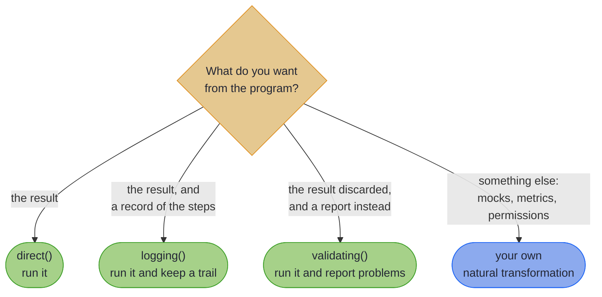

# Advanced Optics

> _"Any sufficiently advanced technology is indistinguishable from magic."_
>
> – Arthur C. Clarke

---

Most optic work involves the everyday tools: lenses, prisms, traversals, and the Focus DSL on top of them. But sometimes the problem at hand is not "update this nested field" but "describe a sequence of optic operations as data, then decide later how to run them."

This chapter is for those occasions. The Free Monad DSL turns optic operations into a value you can pass around, inspect, and execute under different strategies (production, audit, dry-run, mock). Interpreters are the strategies that turn descriptions into results.

Here is the whole idea before any of the theory. One program, described once, run three different ways. Every line compiles against the real library on every build:

<!-- verify -->
```java
// A description, not an action: nothing has touched the account yet
Free<OpticOpKind.Witness, Account> withdrawal = Fixture.withdraw(Fixture.account, 30);

// Run it for real
DirectOpticInterpreter direct = OpticInterpreters.direct();
Account settled = direct.run(withdrawal);
// Account[id=ACC-1, balance=70]

// Run the same value again, recording every optic operation on the way
LoggingOpticInterpreter logging = OpticInterpreters.logging();
Account audited = logging.run(withdrawal);
List<String> trail = logging.getLog();
// one entry per optic operation the program performed

// Or run it and get a report of what went wrong instead of the result
ValidationOpticInterpreter validator = OpticInterpreters.validating();
ValidationOpticInterpreter.ValidationResult check = validator.validate(withdrawal);
boolean safeToRun = check.isValid();
// true: no nulls written, no modifier threw
```

The account starts on 100 and the withdrawal is 30. `Fixture` is the compiled example's own setup, not library API.

~~~admonish warning title="`validating()` is a checked run, not a dry run"
Despite the name, `validate` **executes** the program. Its own javadoc is explicit: operations are run so that `flatMap` chaining produces the right values, and the validation is collected alongside. A `modify` modifier is applied twice, once to check it and once to perform it. So it is safe for pure modifiers over immutable data, and unsafe for anything with a side effect.

For genuine inspection with nothing executed, use `ProgramAnalyser.analyse(program)`, whose traversal is structural and never runs a step.
~~~

~~~admonish tip title="Why this matters"
The three blocks differ by one line. `withdrawal` is an ordinary value: it can be stored in a field, passed to a method, returned from one, and run later or never. That is the property the rest of this chapter trades on. An audit trail stops being logging statements scattered through the code and becomes a second interpreter over the same description; a structural analysis of what a program contains stops being guesswork and becomes a walk over the value.
~~~

If you have not yet hit a problem that needs this, you do not need this chapter. Come back when an audit requirement, a testability concern, or a multi-mode execution scenario forces the issue.

~~~admonish info title="In This Chapter"
- **Free Monad DSL** – Describe optic operations as composable data structures rather than executing them immediately. Enables dry-runs, audit trails, and the same program running under different execution policies.
- **Interpreters** – The execution strategies for Free Monad DSL programs. Covers direct execution for production, logging for debugging, validating for safety, and how to define your own interpreter for custom needs.
~~~

~~~admonish tip title="See Also"
- [Java-Friendly APIs](ch4_intro.md): the everyday optic APIs, Focus DSL and Fluent API
- [Effect Handlers](../effect/effect_handlers_intro.md): the Effect Path equivalent, free-monad-style algebraic effects for computations rather than optics
~~~

---

## Which interpreter do you need?



Note the third branch: `validating()` carries `validate`, not `run`. That names the *return type*, not the behaviour. It still executes; what you get back is a report rather than the value. Genuine no-execution inspection is `ProgramAnalyser.analyse`.

---

## Chapter Contents

1. [Free Monad DSL](free_monad_dsl.md): building optic programs as composable data
2. [Interpreters](interpreters.md): multiple execution strategies for the same program

---

**Next:** [Free Monad DSL](free_monad_dsl.md)
