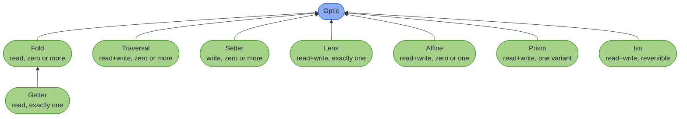

# Optics


> _"What we see depends mainly on what we look for."_
>
> – John Lubbock, *The Beauties of Nature and the Wonders of the World We Live In*

---

Immutable records in Java are safer, easier to reason about, and, when you need to change something three layers down, a bit of an ordeal. The conventional approach is to copy and rebuild each layer by hand; the result is the sort of code nobody enjoys writing and reviewers quietly resent reading.

An **optic** is a first-class, composable path from a whole structure to one or more of its parts. Once you have the path, reading, writing, and transforming the focused value all come for free, and the paths themselves compose: a lens into a record composed with a prism into a sealed field composed with a traversal over a list is a single optic that knows how to operate on the whole route.

Higher-Kinded-J's optics are **annotation-driven**. You write a record, add `@GenerateLenses` and `@GenerateFocus`, and the processor writes a typed path builder for you. The same applies to sealed types (`@GeneratePrisms`), collections (`@GenerateTraversals`), and even types you can't modify (`@ImportOptics` for Jackson, JOOQ, JDK types). No boilerplate, no runtime reflection, no manual composition unless you want it.

```java
@GenerateLenses @GenerateFocus
public record Street(String name, int number) {}

@GenerateLenses @GenerateFocus
public record Address(Street street, String city) {}

@GenerateLenses @GenerateFocus
public record User(String name, Address address) {}

User updated = UserFocus.address().street().name().set("New Street", user);
```

The same record can carry several annotations, each generating its own companion class for a different use case. The seven sections of this chapter take you from the foundational optics through the Java-friendly APIs and the recipe cookbook, and end at a reference you can look things up in.

---

## How the optic types relate

Eight optic types, one shared supertype, and one real specialisation between them:



Each arrow reads *extends*, pointing from a type to the one it extends: `Fold extends Optic`, `Getter extends Fold`. That last is the **only** inheritance between two optic types: everything else extends `Optic` directly, which makes them siblings rather than a hierarchy. So a `Lens` is not a `Fold`, and you cannot pass one where a `Fold` is expected. `lens.asFold()` is an explicit conversion, and [Conversions](conversions.md) lists every conversion that exists.

What the diagram groups instead is capability, and that is the useful question: how many values does the optic focus, and may you write through it? Those two answers pick your optic, which is what [Decision Trees](decision_trees.md) walks you through.

---

~~~admonish info title="In This Chapter"
- **Fundamentals** – Lens, Prism, Affine, and Iso: the four optics for working with single values. Introduces the composition rules and the paired-lens pattern for fields that share invariants. Start here if you are new to optics.
- **Collections** – Traversals and Folds for zero-or-more focus, plus the asymmetric specialists Getter (read-only) and Setter (write-only). Covers the ready-made traversals for Java's standard collections and monoid-based aggregation.
- **Precision and Filtering** – Narrow focus by predicate or index. Filtered and indexed traversals, the `Each`, `At`, and `Ixed` type classes, character-level string traversals, and advanced Prism patterns, including predicate matching with `nearly`.
- **Java-Friendly APIs** – Three complementary APIs that make optics feel native to Java: the Focus DSL for path-based navigation, the Fluent API for validation-aware updates, and the Free Monad DSL for programs-as-data. Backed by annotation-driven code generation (`@GenerateLenses`, `@GenerateFocus`, `@GeneratePrisms`, and friends). For the domain ↔ DTO boundary, see the dedicated [Mapping at the Boundary](../mapping/ch_intro.md) chapter.
- **Integration and Recipes** – A complete walkthrough composing Lens, Prism, and Traversal into a validation pipeline, integration with the library's core types (Either, Maybe, Validated, Optional), multi-edit and sparse REST PATCH updates, and a cookbook of ready-to-use solutions for the nested-update problems you will actually meet in production.
- **Advanced Optics** – Optic operations built as a value first and executed second: the Free Monad DSL that describes the program, and the interpreters that run, log or check it.
- **Reference** – The lookup half of the chapter. What each optic type declares, how to convert between them, what the processor's error messages mean, and the decision trees for picking one.
~~~

---

## Chapter Contents

1. [Quickstart](quickstart.md) - Three runnable examples in 100 lines
2. [Annotations at a Glance](annotations_at_a_glance.md) - Every annotation, what it generates, and when to use it
3. [Fundamentals](ch1_intro.md) - Lens, Prism, Affine, Iso, composition rules, coupled fields
4. [Collections](ch2_intro.md) - Traversal, Fold, Getter, Setter, and collection patterns
5. [Precision and Filtering](ch3_intro.md) - Filtered, indexed, and predicate-based optics
6. [Java-Friendly APIs](ch4_intro.md) - Focus DSL, Fluent API, code generation
7. [Integration and Recipes](ch5_intro.md) - Validation workflows, multi-edit and PATCH, cookbook
8. [Advanced Optics](ch6_intro.md) - Free Monad DSL, interpreters, programs as data
9. [Reference](ch7_intro.md) - Capabilities, conversions, compiler errors, decision trees

---

~~~admonish tip title="Start Here"
- **Want to see optics in action?** Read the [Quickstart](quickstart.md), three runnable examples in 100 lines.
- **Looking for a specific annotation?** [Annotations at a Glance](annotations_at_a_glance.md) is the lookup table.
- **Just need to update a nested record right now?** Skip straight to the [Focus DSL](focus_dsl.md) and come back to the foundational material when you need it.
- **Mapping a domain record to/from a wire DTO?** Go straight to [Record Mapping](../mapping/ch_intro.md); it needs none of the optics curriculum first.
- **New to the concepts?** Start with [Fundamentals](ch1_intro.md).
~~~

---

~~~admonish tip title="See Also"
- [Decision Trees](decision_trees.md): pick the optic, the API and the annotation by answering a question at a time
- [Optic Capabilities](optic_capabilities.md): what each optic type declares, and what it reaches only by conversion
- [Mapping at the Boundary](../mapping/ch_intro.md): the domain to wire problem, which needs none of this chapter first
- [Optics Tutorial Track](../tutorials/optics/ch_intro.md): the same material as exercises, if you learn by doing
~~~

---

**Next:** [Quickstart](quickstart.md)
