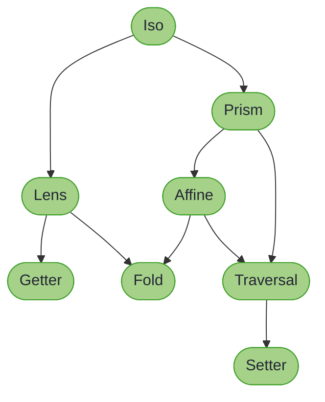

# Optic Composition Rules

## _Understanding How Different Optics Compose_

~~~admonish info title="What You'll Learn"
- The mathematical rules governing optic composition
- When composition returns the same optic type vs a more general one
- Practical implications for your code
- Quick reference table for all composition patterns
~~~

When composing optics, the resulting optic type follows precise mathematical rules. Understanding these rules helps you predict what type of optic you'll get and why.

---

## The Optic Hierarchy

Optics order themselves by capability, from most specific (most operations available) to most general (fewest). An arrow points from an optic to one that can do less:



~~~admonish note title="Capability, not Java subtyping"
These arrows rank what each optic can do; they are not `extends` edges. `Getter extends Fold` is the only inheritance between two optic types, and every other step across this diagram is an explicit conversion such as `asFold()` or `asTraversal()`. [Conversions](conversions.md) lists the ones that exist, and [Optic Capabilities](optic_capabilities.md) has the per-method table.
~~~

**What is Affine?** An Affine optic focuses on **zero or one** element within a structure. It combines the partial access of a Prism with the update capability of a Lens. Common use cases include:

- Accessing `Optional<T>` fields in records
- Working with nullable properties
- Navigating through optional intermediate structures

**Key insight**: When composing two different optic types, the result is always the **most specific optic type that can represent both operations**.

---

## Composition Rules Table

| First Optic | >>> | Second Optic | = | Result Optic | Reason |
|-------------|-----|--------------|---|--------------|--------|
| **Iso** | >>> | Iso | = | **Iso** | Both directions preserved |
| **Iso** | >>> | Lens | = | **Lens** | Lens is more restrictive |
| **Iso** | >>> | Prism | = | **Prism** | Prism is more restrictive |
| **Iso** | >>> | Affine | = | **Affine** | Affine is more restrictive |
| **Iso** | >>> | Traversal | = | **Traversal** | Traversal is most general |
| **Lens** | >>> | Lens | = | **Lens** | Same type |
| **Lens** | >>> | Prism | = | **Affine** | May not match (0-1 targets) |
| **Lens** | >>> | Affine | = | **Affine** | Affine preserves partiality |
| **Lens** | >>> | Traversal | = | **Traversal** | Traversal is more general |
| **Lens** | >>> | Iso | = | **Lens** | Iso subsumes Lens |
| **Prism** | >>> | Prism | = | **Prism** | Same type |
| **Prism** | >>> | Lens | = | **Affine** | May not match + field access |
| **Prism** | >>> | Affine | = | **Affine** | Affine preserves partiality |
| **Prism** | >>> | Traversal | = | **Traversal** | Traversal is more general |
| **Prism** | >>> | Iso | = | **Prism** | Iso subsumes Prism |
| **Affine** | >>> | Affine | = | **Affine** | Same type |
| **Affine** | >>> | Lens | = | **Affine** | Affine preserves partiality |
| **Affine** | >>> | Prism | = | **Affine** | Both may not match |
| **Affine** | >>> | Traversal | = | **Traversal** | Traversal is more general |
| **Affine** | >>> | Iso | = | **Affine** | Iso subsumes Affine |
| **Traversal** | >>> | any | = | **Traversal** | Traversal is already general |

---

## Why Lens >>> Prism = Affine

This is perhaps the most important composition rule to understand.

### The Intuition

A **Lens** guarantees exactly one focus. A **Prism** provides zero-or-one focuses (it may not match).

When you compose them:
- The Lens always gets you to `A`
- The Prism may or may not get you from `A` to `B`

Result: **zero-or-one** focuses, which is an **Affine** optic.

### Example

```java
// Domain model
record Config(Optional<DatabaseSettings> database) {}
record DatabaseSettings(String host, int port) {}

// The Lens always gets the Optional<DatabaseSettings>
Lens<Config, Optional<DatabaseSettings>> databaseLens =
    Lens.of(Config::database, (c, db) -> new Config(db));

// The Prism may or may not extract the DatabaseSettings
Prism<Optional<DatabaseSettings>, DatabaseSettings> somePrism = Prisms.some();

// Composition: Lens >>> Prism = Affine
Affine<Config, DatabaseSettings> databaseAffine =
    databaseLens.andThen(somePrism);

// Usage
Config config1 = new Config(Optional.of(new DatabaseSettings("localhost", 5432)));
Optional<DatabaseSettings> result1 = databaseAffine.getOptional(config1);
// result1 = Optional[DatabaseSettings[host=localhost, port=5432]]

Config config2 = new Config(Optional.empty());
Optional<DatabaseSettings> result2 = databaseAffine.getOptional(config2);
// result2 = Optional.empty() (the prism didn't match)

// Setting always succeeds
Config updated = databaseAffine.set(new DatabaseSettings("newhost", 3306), config2);
// updated = Config[database=Optional[DatabaseSettings[host=newhost, port=3306]]]
```

---

## Why Prism >>> Lens = Affine

Similarly, composing a Prism first and then a Lens also yields an Affine.

### The Intuition

A **Prism** may or may not match. If it matches, the **Lens** always gets you to the field.

Result: **zero-or-one** focuses, depending on whether the Prism matched.

### Example

```java
// Domain model with sealed interface
sealed interface Shape permits Circle, Rectangle {}
record Circle(double radius, String colour) implements Shape {}
record Rectangle(double width, double height, String colour) implements Shape {}

// The Prism may or may not match Circle
Prism<Shape, Circle> circlePrism = Prism.of(
    shape -> shape instanceof Circle c ? Optional.of(c) : Optional.empty(),
    c -> c
);

// The Lens always gets the radius from a Circle
Lens<Circle, Double> radiusLens =
    Lens.of(Circle::radius, (c, r) -> new Circle(r, c.colour()));

// Composition: Prism >>> Lens = Affine
Affine<Shape, Double> circleRadiusAffine = circlePrism.andThen(radiusLens);

// Usage
Shape circle = new Circle(5.0, "red");
Optional<Double> radius = circleRadiusAffine.getOptional(circle);
// radius = Optional[5.0]

Shape rectangle = new Rectangle(10.0, 20.0, "blue");
Optional<Double> empty = circleRadiusAffine.getOptional(rectangle);
// empty = Optional.empty() (prism didn't match)

// Modification only affects circles
Shape modified = circleRadiusAffine.modify(r -> r * 2, circle);
// modified = Circle[radius=10.0, colour=red]

Shape unchanged = circleRadiusAffine.modify(r -> r * 2, rectangle);
// unchanged = Rectangle[width=10.0, height=20.0, colour=blue] (unchanged)
```

---

## Available Composition Methods

### Direct Composition (Recommended)

higher-kinded-j provides direct `andThen` methods that automatically return the correct type:

```java
// Lens >>> Lens = Lens
Lens<A, C> result = lensAB.andThen(lensBC);

// Lens >>> Prism = Affine
Affine<A, C> result = lensAB.andThen(prismBC);

// Prism >>> Prism = Prism
Prism<A, C> result = prismAB.andThen(prismBC);

// Prism >>> Lens = Affine
Affine<A, C> result = prismAB.andThen(lensBC);

// Affine >>> Affine = Affine
Affine<A, C> result = affineAB.andThen(affineBC);

// Affine >>> Lens = Affine
Affine<A, C> result = affineAB.andThen(lensBC);

// Traversal >>> Traversal = Traversal
Traversal<A, C> result = traversalAB.andThen(traversalBC);
```

### Via asTraversal (Universal Fallback)

When you need to compose optics in a generic way, convert everything to Traversal:

```java
// Any optic composition via Traversal
Traversal<A, D> result =
    optic1.asTraversal()
        .andThen(optic2.asTraversal())
        .andThen(optic3.asTraversal());
```

This approach always works but loses type information (you get a Traversal even when a more specific type would be possible).

---

## Practical Guidelines

### 1. Use Direct Composition When Possible

```java
// Preferred: uses direct andThen for correct return type
Traversal<Config, String> hostTraversal =
    databaseLens.andThen(somePrism).andThen(hostLens.asTraversal());
```

### 2. Chain Multiple Compositions

```java
// Multiple compositions
Traversal<Order, String> customerEmail =
    orderCustomerLens           // Lens<Order, Customer>
        .andThen(customerContactPrism)   // Prism<Customer, ContactInfo>
        .andThen(contactEmailLens.asTraversal());  // Lens<ContactInfo, String>
```

### 3. Store Complex Compositions as Constants

```java
public final class OrderOptics {
    // Reusable compositions
    public static final Traversal<Order, String> CUSTOMER_EMAIL =
        OrderLenses.customer()
            .andThen(CustomerPrisms.activeCustomer())
            .andThen(CustomerLenses.email().asTraversal());

    public static final Traversal<Order, Money> LINE_ITEM_PRICES =
        OrderTraversals.lineItems()
            .andThen(LineItemLenses.price().asTraversal());
}
```

---

## Parallel Composition with `Fold.plus()`

The composition rules above describe **sequential** composition (`andThen`): navigating deeper into a structure. Higher-Kinded-J also supports **parallel** composition via `Fold.plus()`, which combines results from multiple paths at the same level.

| Operation | Type | Purpose |
|-----------|------|---------|
| `andThen` | Sequential | Navigate deeper: `A -> B -> C` |
| `plus` | Parallel | Combine results: `A -> B` and `A -> C` into `A -> (B + C)` |

```java
// Sequential: navigate deeper into the structure
Fold<Customer, Item> items = ordersFold.andThen(itemsFold);

// Parallel: combine results from different paths
Fold<Person, String> allNames = firstNameFold.plus(lastNameFold);

// Both together: compose then combine
Fold<Team, String> allEmails = Fold.sum(
    leadLens.asFold().andThen(emailLens.asFold()),
    membersFold.andThen(emailLens.asFold())
);
```

`plus` produces a `Fold` regardless of the input optic types, since the combined result is always read-only. Convert other optics via `asFold()` before combining.

---

## Common Patterns

### Pattern 1: Optional Field Access

Navigate to an optional field that may not exist:

```java
record User(String name, Optional<Address> address) {}
record Address(String street, String city) {}

// Lens to Optional, Prism to extract, Lens to field
Traversal<User, String> userCity =
    UserLenses.address()           // Lens<User, Optional<Address>>
        .andThen(Prisms.some())    // Prism<Optional<Address>, Address>
        .andThen(AddressLenses.city().asTraversal()); // Lens<Address, String>
```

### Pattern 2: Sum Type Field Access

Navigate into a specific case of a sealed interface:

```java
sealed interface Payment permits CreditCard, BankTransfer {}
record CreditCard(String number, String expiry) implements Payment {}
record BankTransfer(String iban, String bic) implements Payment {}

// Prism to case, Lens to field
Traversal<Payment, String> creditCardNumber =
    PaymentPrisms.creditCard()     // Prism<Payment, CreditCard>
        .andThen(CreditCardLenses.number()); // Lens<CreditCard, String>
```

### Pattern 3: Conditional Collection Access

Navigate into items that match a condition:

```java
// Traversal over list, filter by predicate
Traversal<List<Order>, Order> activeOrders =
    Traversals.<Order>forList()
        .andThen(Traversals.filtered(Order::isActive));
```

---

## Summary

| Composition | Result | Use Case |
|-------------|--------|----------|
| Lens >>> Lens | Lens | Nested product types (records) |
| Lens >>> Prism | Affine | Product containing sum type |
| Prism >>> Lens | Affine | Sum type containing product |
| Prism >>> Prism | Prism | Nested sum types |
| Affine >>> Affine | Affine | Chained optional access |
| Affine >>> Lens | Affine | Optional then field access |
| Affine >>> Prism | Affine | Optional then variant match |
| Any >>> Traversal | Traversal | Collection access |
| Iso >>> Any | Same as second | Type conversion first |

~~~admonish tip title="Why this matters"
The result type of a composition is not a convenience, it is a promise. When `Lens >>> Prism` hands you an `Affine`, the type is telling you the focus can be absent, and the compiler will not let you forget it; when a chain stays a `Lens`, totality survived every step and no absence handling is needed. That is the same discipline the mapping chapter later formalises as [truthful tiers](../mapping/tiers.md): the API only ever offers what the composition can lawfully support, so a whole class of "worked in the demo, failed in production" bugs becomes unrepresentable.
~~~

~~~admonish info title="Key Takeaways"
* **The result is the most specific type that honours both**: composing two optics yields the least powerful interface both operations can satisfy
* **A prism anywhere makes absence possible**: mixed with a `Lens` or `Affine` the chain drops to `Affine`, and through a `Traversal` the whole chain is a `Traversal`; `Prism >>> Prism` itself stays a `Prism`, still zero-or-one but keeping `build`
* **`Iso` is invisible in composition**: `Iso >>> X = X`, which is what makes it the universal adapter
* **`andThen` keeps precise types; `asTraversal` is the generic fallback**; `plus()` combines parallel paths read-only, as a `Fold`
* **Store complex compositions as constants**: the rules make their types predictable, so name them once and reuse
~~~

~~~admonish tip title="See Also"
- [Affines](affine.md): the zero-or-one optic most compositions land on
- [Cheat Sheet](../cheatsheet.md): the whole optics API on one page
~~~

~~~admonish info title="Hands-On Learning"
Practice lens composition in [Tutorial 02: Lens Composition](https://github.com/higher-kinded-j/higher-kinded-j/blob/main/hkj-examples/src/test/java/org/higherkindedj/tutorial/optics/Tutorial02_LensComposition.java) (7 exercises, ~10 minutes).
~~~

---

**Previous:** [Isomorphisms](iso.md)
**Next:** [Coupled Fields](coupled_fields.md)
