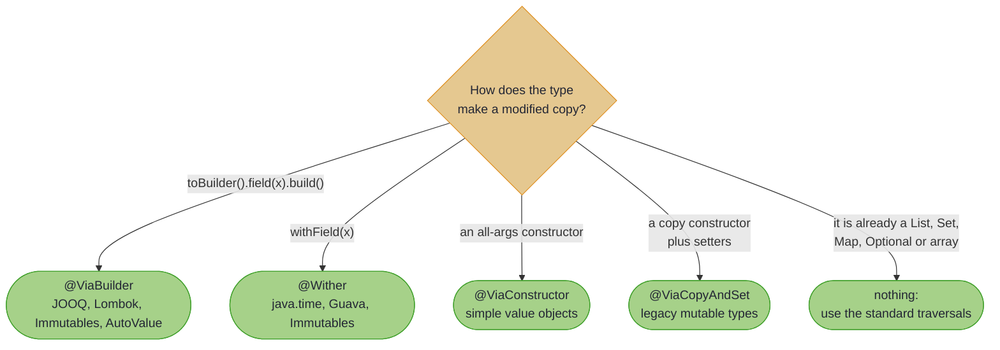

# Database Records with JOOQ

## _Copy Strategies for Builder-Based Types_

> *"First, solve the problem. Then, write the code."*
>
> – attributed to John Johnson

---

The problem is not "how do I update a field in a JOOQ record". It is "how do I express a domain transformation clearly while respecting immutability". Builders solve the immutability half; optics solve the composition half. A copy strategy is how you tell the processor which builder-shaped door this particular type opens.

~~~admonish info title="What You'll Learn"
- How `@ViaBuilder` turns a builder-pattern type into lenses
- The other three strategies (`@Wither`, `@ViaConstructor`, `@ViaCopyAndSet`) and when each applies
- `@ThroughField`, which gives you a traversal into a collection field
- Which types need no strategy at all
~~~

---

## The JOOQ Pattern

JOOQ generates immutable POJOs that copy through a builder, and it is far from alone: Lombok's `@Builder`, Immutables, AutoValue, Protocol Buffers and most hand-written immutable classes do the same.

```java
public final class Customer {
  public String name() { ... }
  public BigDecimal creditLimit() { ... }
  public Builder toBuilder() { ... }

  public static final class Builder {
    public Builder name(String name) { ... }
    public Builder creditLimit(BigDecimal limit) { ... }
    public Customer build() { ... }
  }
}
```

There is no wither and no all-args constructor, so `@ImportOptics` auto-detection has nothing to latch onto. Declare the shape instead:

<!-- verify -->
```java
@ImportOptics
interface CustomerOpticsSpec extends OpticsSpec<Customer> {

  @ViaBuilder
  Lens<Customer, String> name();

  @ViaBuilder
  Lens<Customer, BigDecimal> creditLimit();
}
```

`@ViaBuilder` with no arguments assumes the common conventions: the getter and the builder setter are both named after the optic method, the builder comes from `toBuilder()`, and it finishes with `build()`. That is enough to generate real lenses:

<!-- verify -->
```java
Customer promoted =
    CustomerOptics.creditLimit().modify(limit -> limit.multiply(new BigDecimal("1.1")), alice);
// creditLimit 1000 becomes 1100.0; alice itself is unchanged

String name = CustomerOptics.name().get(alice);   // "Alice"
```

~~~admonish tip title="Why this matters"
Four annotated lines replaced a copy method per field, and what you get back is not a bespoke helper: it is a `Lens`, so it composes with every other optic in the library. `OrderOptics.customer().andThen(CustomerOptics.creditLimit())` is a lens from an order to a credit limit. It obeys the lens laws as long as the builder round-trips faithfully: `toBuilder()`, the setter and `build()` have to give back the value they were handed and leave every other component alone. A builder that normalises, defaults or drops a field breaks that, and no annotation can detect it for you.
~~~

---

## Non-Standard Naming

Conventions vary, so every part of the interaction is nameable:

```java
// Lombok: @Builder(toBuilder = true, setterPrefix = "with"), JavaBean getters
@ViaBuilder(getter = "getOrderId", setter = "withOrderId")
Lens<Order, String> orderId();

// A legacy type that spells all four differently
@ViaBuilder(
    getter = "getName",       // how to read the current value
    toBuilder = "newBuilder",  // how to obtain a builder
    setter = "setName",        // how to set on the builder
    build = "create")          // how to finish
Lens<LegacyType, String> name();
```

---

## Reaching Into Collections with `@ThroughField`

A lens to a `List` field is rarely what you want; you want a traversal into its elements. `@ThroughField` composes the two, detecting the right element traversal from the field's type:

<!-- verify -->
```java
@ImportOptics
interface OrderOpticsSpec extends OpticsSpec<Order> {

  @ViaBuilder
  Lens<Order, List<Customer>> customers();

  @ThroughField(field = "customers")
  Traversal<Order, Customer> eachCustomer();
}
```

<!-- verify -->
```java
// Read every customer's credit limit
List<BigDecimal> limits =
    Traversals.getAll(
        OrderOptics.eachCustomer().andThen(CustomerOptics.creditLimit()), order);
// [1000, 500]

// Raise all of them by 5%
Order raised =
    Traversals.modify(
        OrderOptics.eachCustomer().andThen(CustomerOptics.creditLimit()),
        limit -> limit.multiply(new BigDecimal("1.05")),
        order);

// Only the ones already above a threshold
Order topUp =
    Traversals.modify(
        OrderOptics.eachCustomer()
            .andThen(CustomerOptics.creditLimit())
            .filtered(limit -> limit.compareTo(new BigDecimal("750")) > 0),
        limit -> limit.add(new BigDecimal("100")),
        order);
```

### `@ThroughField` Auto-Detection

| Lens focus for the field | Auto-detected traversal |
|--------------------------|-------------------------|
| `List<A>` | `Traversals.forList()` |
| `Set<A>` | `Traversals.forSet()` |
| `Collection<A>` | `Traversals.forCollection()` |
| `Optional<A>` | `Traversals.forOptional()` |
| `A[]`, `A` a reference type | `Traversals.forArray()` |
| `Map<K, V>` | `Traversals.forMapValues()` |

Detection reads the focus of the spec's own lens for the field, which is the lens the generated traversal composes with (a spec that declares no lens for the field is refused), and the match is on the interface itself. A lens focusing something narrower, a concrete container (`ArrayList<LineItem>`, `HashSet<Tag>`, `TreeMap<K, V>`) or another interface (`Deque`, `SortedSet`), is refused at the declaration, because each standard traversal promises no more than the interface type (`forList()` hands back an unmodifiable `List`) and the field could not take that value back: the generated traversal would throw `ClassCastException` on first use. (Under the subtype matching of earlier releases a `HashMap` field survived, because the map traversal rebuilds a `HashMap`; that was an implementation detail the promise does not cover, and `HashMap` is refused like any other concrete type.) An array of a primitive (`int[]`) is refused for the same reason, since the array traversal walks an `Object[]`. Name a traversal that rebuilds the declared type, built with `Traversals.forIterableCollecting(ArrayList::new)` for a list-shaped container or `Traversals.forMapValuesCollecting(TreeMap::new)` for a map and exposed as a static method, or, where the type is yours, declare the field as the interface:

```java
@ThroughField(field = "entries", traversal = "com.example.CustomTraversals.forMyContainer()")
Traversal<MyType, Entry> eachEntry();
```

~~~admonish warning title="`Traversal` has no instance `modify`"
Reads and writes through a bare `Traversal` go through the `Traversals` utility: `Traversals.getAll(traversal, source)` and `Traversals.modify(traversal, f, source)`. The instance methods are `andThen`, `filtered`, `filterBy`, `asFold`, `modifyF`, `modifyWhen` and `branch`; `asFold()` is how you reach the read side, as in `traversal.asFold().foldMap(...)`. (A `TraversalPath` from the [Focus DSL](focus_dsl.md) does carry `getAll` and `modifyAll` directly, which is often the more comfortable surface.)
~~~

---

## The Other Three Strategies

### `@Wither`: types with `withX()` methods

<!-- verify -->
```java
@ImportOptics
interface MoneyOpticsSpec extends OpticsSpec<Money> {

  @Wither(value = "withAmount", getter = "getAmount")
  Lens<Money, Long> amount();
}
```

Naming both halves explicitly is what makes this strategy work where auto-detection cannot: `@ImportOptics` requires the getter's return type to match the wither's parameter exactly, and here you simply say which pair to use.

### `@ViaConstructor`: constructor-only value types

<!-- verify -->
```java
@ImportOptics
interface PointOpticsSpec extends OpticsSpec<Point> {

  @ViaConstructor(parameterOrder = {"x", "y"})
  Lens<Point, Integer> x();

  @ViaConstructor(parameterOrder = {"x", "y"})
  Lens<Point, Integer> y();
}
```

`parameterOrder` names the getters to call, in the order the constructor takes them. It has an empty default in the annotation, but the generated code needs it: without it the optic throws `UnsupportedOperationException` when invoked, so treat it as required.

### `@ViaCopyAndSet`: legacy types with a copy constructor and setters

<!-- verify -->
```java
@ImportOptics
interface ConfigOpticsSpec extends OpticsSpec<Config> {

  @ViaCopyAndSet(setter = "setHost")
  Lens<Config, String> host();
}
```

~~~admonish warning title="Lens laws and mutable types"
`@ViaCopyAndSet` copies, then mutates the copy. That is lawful only if the copy constructor really copies everything: a shallow copy that shares a mutable field means a "set" can be seen through the original, which breaks the lens laws in the most confusing way possible. Verify with `LensLaws` on a type where this matters.

`copyConstructor` adds a second way to lose state, and it is quieter. Naming a supertype selects the constructor that takes it, and that constructor can only copy what it can see: if `balance` is declared on `Ledger` and you name `LedgerBase`, every `set` returns a copy with `balance` back at its default. That is a perfectly *deep* copy of everything in scope — the field is simply not in scope. The processor cannot check this for you, so the narrower the type you name, the more `LensLaws` is worth running.
~~~

`copyConstructor` is for the one case the default cannot express: an overloaded constructor. `new Config(source)` picks the most specific applicable overload, which is what you want almost always — a lone `Config(BaseConfig other)` already takes the source by widening. Name a supertype, fully qualified, and the source is passed under that type instead:

```java
public class Endpoint extends BaseEndpoint implements Audited {
  public Endpoint(BaseEndpoint other) { ... }
  public Endpoint(Audited other) { ... }   // new Endpoint(source) is ambiguous
  public void setHost(String host) { ... }
}
```

<!-- verify -->
```java
@ImportOptics
interface EndpointOpticsSpec extends OpticsSpec<Endpoint> {

  @ViaCopyAndSet(copyConstructor = "org.higherkindedj.example.book.optics.BaseEndpoint",
                 setter = "setHost")
  Lens<Endpoint, String> host();          // new Endpoint((BaseEndpoint) source)
}
```

The name is a plain string, so it is not resolved against the interface's imports: give it fully qualified, the class alone with no type arguments, and a nested class as `com.example.Outer.Base`. Four names are rejected at the declaration rather than generating a cast javac cannot compile: one that does not resolve, one naming a type `Endpoint` does not extend or implement, one the generated class cannot see, and one no `Endpoint` constructor accepts. What the processor cannot check is whether the constructor it picks copies everything — see the warning above.

---

## When You Need No Strategy at All

JOOQ's `Result<R>` implements `List<R>`, and standard collections are already covered by the standard traversals:

```java
Result<CustomerRecord> customers = ctx.selectFrom(CUSTOMER).where(CUSTOMER.ACTIVE.isTrue()).fetch();

// Read straight through the list traversal
List<BigDecimal> limits =
    Traversals.getAll(
        Traversals.<CustomerRecord>forList().andThen(CustomerOptics.creditLimit()), customers);
```

Reading is free. Writing is where the shortcut ends: `Traversals.forList()` is a `Traversal<List<A>, A>`, so a modification rebuilds a plain `List`, not a `Result`. When you need the container type preserved, use `Traversals.forIterableCollecting(collector)` and supply the rebuild.

---

## Choosing a Strategy



Start with `@ViaBuilder`: it is the pattern most generated code uses. Fall back to the others when the type does not fit.

---

## The fine print: strategy parameters

~~~admonish note title="Every parameter, with its default"
```java
@ViaBuilder(
    getter = "",              // default: the optic method's name
    toBuilder = "toBuilder",
    setter = "",              // default: the optic method's name
    build = "build")

@Wither(
    value = "withName",       // required: the wither method
    getter = "")              // default: the optic method's name

@ViaConstructor(
    parameterOrder = {"x", "y"})   // effectively required, see above

@ViaCopyAndSet(
    copyConstructor = "",     // default: pass the source unchanged; else a fully qualified supertype of S
    setter = "setHost")       // required

@ThroughField(
    field = "items",          // required: the container field
    traversal = "")           // default: auto-detected from the field type
```
~~~

---

~~~admonish info title="Key Takeaways"
* **`@ViaBuilder` is the default choice**, and covers JOOQ, Lombok, AutoValue and Protobuf between them. Immutables generates both a builder and withers, so either strategy works there.
* **Every name is overridable.** Getter, builder accessor, setter and build method can each be spelled out when a library's conventions differ, and `@ViaCopyAndSet(copyConstructor = ...)` picks between overloaded copy constructors.
* **`@ThroughField` reaches into collection fields**, auto-detecting the traversal for a field declared as `List`, `Set`, `Collection`, `Map`, `Optional` or an array; a concrete container type is refused with the remedy named, and an explicit `traversal` covers it.
* **`Traversal` reads and writes through `Traversals`**, not through a plain instance `modify`; `andThen`, `filtered`, `filterBy`, `asFold`, `modifyF`, `modifyWhen` and `branch` do live on the optic.
* **Not everything needs a strategy.** A type that already implements `List`, `Map` or `Optional` works with the standard traversals for reads, though rebuilding the exact container type needs `forIterableCollecting`.
~~~

~~~admonish tip title="See Also"
- [Optics for External Types](importing_optics.md): `@ImportOptics` and what auto-detection covers
- [Taming JSON with Jackson](optics_spec_interfaces.md): spec interfaces for predicate-based type discrimination
- [Focus DSL with External Libraries](focus_external_bridging.md): bridging Focus navigation into these generated optics
~~~

~~~admonish tip title="Further Reading"
- **jOOQ**: [jooq.org](https://www.jooq.org/): type-safe SQL in Java, and its [immutable POJO generation](https://www.jooq.org/doc/latest/manual/code-generation/codegen-pojos/)
- **Lombok**: [projectlombok.org](https://projectlombok.org/): `@Builder`, `@Value`, and the `setterPrefix` option this page's naming examples assume
- **Protocol Buffers**: [protobuf.dev](https://protobuf.dev/reference/java/java-generated/): generated builders, a natural `@ViaBuilder` target
~~~

---

**Previous:** [Taming JSON with Jackson](optics_spec_interfaces.md)
**Next:** [Focus DSL with External Libraries](focus_external_bridging.md)
