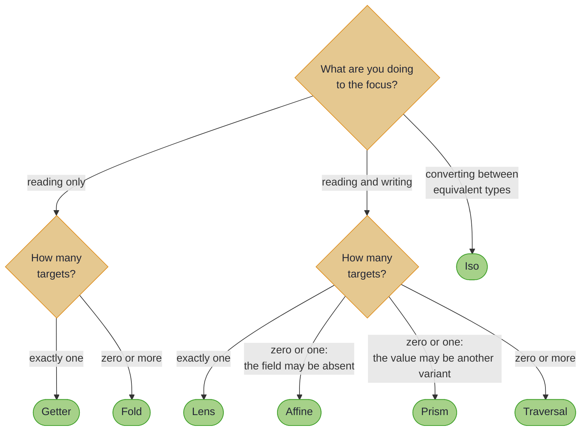
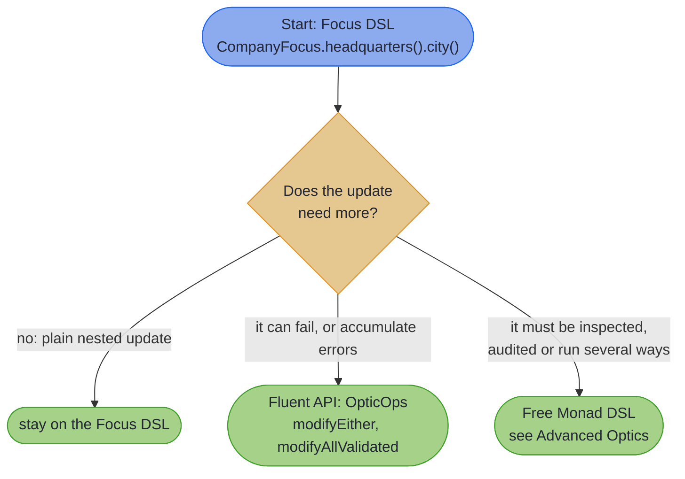
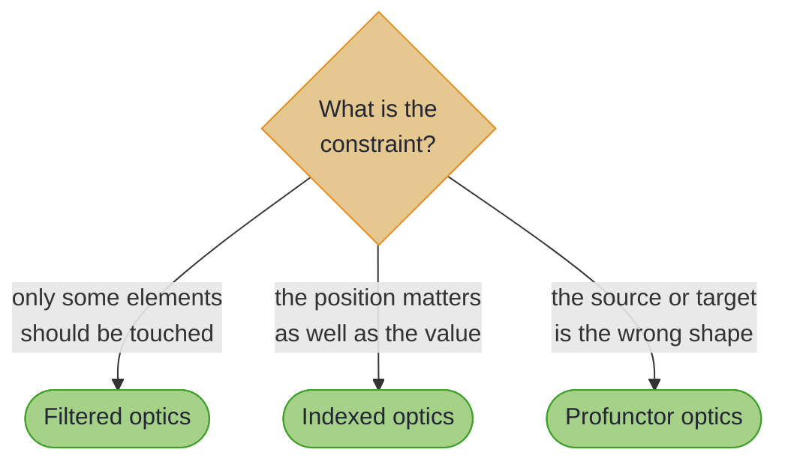

# Decision Trees

## _Three trees, one page_

~~~admonish info title="What You'll Learn"
- Which optic type to choose for a given data shape and access pattern.
- Which API style (Focus DSL, manual composition, Fluent API, Free Monad DSL) to choose for a given task.
- Which advanced feature (filtered, indexed, profunctor) solves which specific problem.
~~~

The decision trees that appear in scattered form across the chapter intros are consolidated here. Use this page when you need to route quickly to the right tool.

---

## Tree 1: Which optic do I need?

Write-only access is the one case the tree does not reach: that is a [Setter](setters.md), and you arrive at it by knowing you never read.

| You have... | You want to... | Reach for |
|---|---|---|
| A required field on a record | Get and set | [Lens](lenses.md) |
| A variant of a sealed type | Match and modify the variant | [Prism](prisms.md) |
| An optional field (nullable, `Optional`-wrapped) | Get and set if present | [Affine](affine.md) |
| Two equivalent representations | Convert losslessly | [Iso](iso.md) |
| A collection field | Apply an operation to every element | [Traversal](traversals.md) |
| A collection field, read-only | Query, search, aggregate | [Fold](folds.md) |
| Read-only access to a single field | Get only | [Getter](getters.md) |
| Write-only access, one or many targets | Set or modify, never read | [Setter](setters.md) |

---

## Tree 2: Which API style?

| Your task | Use |
|---|---|
| Update a nested record field | [Focus DSL](focus_dsl.md) |
| Compose optics across types you own | [Focus DSL](focus_dsl.md) |
| Validate as you modify (`Either`, `Validated`, `Maybe`) | [Fluent API](fluent_api.md) |
| Fan out an effect across a collection | [Fluent API `modifyAllF`](fluent_api.md) |
| Build optic operations as data, run later | [Free Monad DSL](free_monad_dsl.md) |
| Audit trail of every optic operation | [Free Monad DSL with logging interpreter](interpreters.md) |
| Reuse an optic for a type you cannot annotate | [`@ImportOptics`](importing_optics.md) or an [`OpticsSpec`](optics_spec_interfaces.md) interface |
| Adapt an optic to a different data shape | [Compose when the source nests, an `Iso` when the shapes are equivalent, `Lens.of` when it is lopsided, `dimap` when it is one-way](profunctor_optics.md) |

---

## Tree 3: Which advanced feature?

| Your problem | Reach for |
|---|---|
| "Apply only to elements matching a predicate" | [Filtered Optics](filtered_optics.md) |
| "I need the index alongside each element" | [Indexed Optics](indexed_optics.md) |
| "Access by key in a `Map`" | [Indexed Access](indexed_access.md): the `At` (full CRUD) and `Ixed` (read/update) type classes |
| "Apply over every element of a custom container" | [Each Typeclass](each_typeclass.md) |
| "Operate on individual characters of a `String`" | [String Traversals](string_traversals.md) |
| "Adapt a lens for a different source record type" | Compose: `outerLens.andThen(innerLens)` ([Profunctor Optics](profunctor_optics.md)) |
| "The two shapes hold the same information" | An [`Iso`](iso.md), then compose: `Iso >>> Lens = Lens` |
| "One-way conversion inside an effectful pipeline" | `optic.dimap(...)` ([Profunctor Optics](profunctor_optics.md)) |
| "Match a value by a predicate, not by type" | [`Prisms.nearly`](advanced_prism_patterns.md#predicate-matching-with-prismsnearly) |

---

~~~admonish info title="Key Takeaways"
* **Direction first, cardinality second.** The tree asks what you are doing to the focus, then how many values it reaches; those two answers pick the optic between them.
* **The two zero-or-one optics are not interchangeable.** An `Affine` reaches a value that may be absent; a `Prism` reaches a value that may be another variant, and can rebuild the structure from it.
* **Start on the Focus DSL and leave it only when forced.** Failure, accumulation and effects move you to `OpticOps`; inspection and multi-mode execution move you to the Free Monad DSL.
* **The advanced features are constraint-shaped.** Subset means filtered, position means indexed, wrong shape means an adapter.
* **These are entry points, not conclusions.** Every leaf here has a page; the trees route, the pages decide.
~~~

~~~admonish tip title="See Also"
- [Optic Capabilities](optic_capabilities.md): what each optic can do once you have chosen one
- [Composition Rules](composition_rules.md): what type results from composing two optics
- [Annotations at a Glance](annotations_at_a_glance.md): which annotation generates each optic
~~~

---

**Previous:** [Production Readiness](production_readiness.md)
**Next:** [Mapping at the Boundary](../mapping/ch_intro.md)
