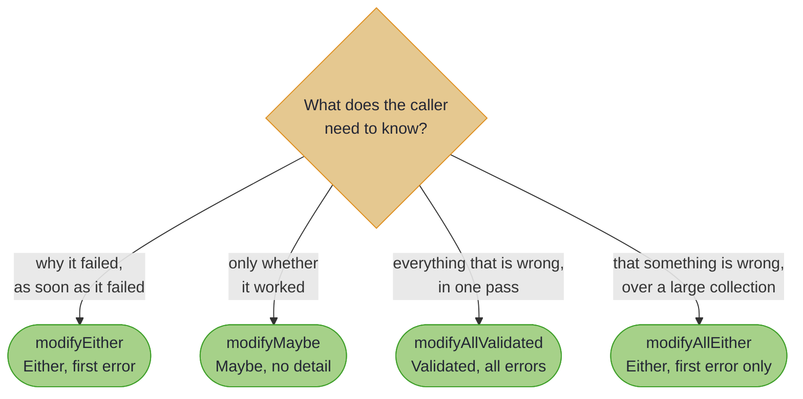

# Fluent API for Optics: Java-Friendly Optic Operations


~~~admonish info title="What You'll Learn"
- Two styles of optic operation: static methods and fluent builders
- Reading, writing and querying through any optic with `OpticOps`
- Four validation strategies, and which one each situation wants
- Effectful modification with `modifyF`, and when the dedicated methods replace it
~~~

~~~admonish example title="See Example Code"
[FluentOpticOpsExample](https://github.com/higher-kinded-j/higher-kinded-j/blob/main/hkj-examples/src/main/java/org/higherkindedj/example/optics/fluent/FluentOpticOpsExample.java) | [FluentValidationExample](https://github.com/higher-kinded-j/higher-kinded-j/blob/main/hkj-examples/src/main/java/org/higherkindedj/example/optics/fluent/FluentValidationExample.java)
~~~

Optics arrived in Java from Haskell, and the traditional names came with them: `view`, `over`, `preview`, with the value before the source. `OpticOps` restates the same operations in the order and vocabulary a Java developer expects, and adds the thing plain optics do not have: a modification that is allowed to fail.

Here is the payoff first, an update that validates every element and reports *all* the failures:

<!-- verify -->
```java
Validated<List<String>, Order> checked =
    OpticOps.modifyAllValidated(order, Fixture.orderPrices, Fixture::validatePrice);
// Invalid(["Price cannot be negative: -10.00", "Price exceeds maximum: 15000.00"])
```

One call, both bad prices named. No `Applicative` wiring, no `Kind` in sight.

---

## The Two Styles

Nearly every operation exists as a concise static method and as a fluent builder. They compile to the same thing; pick per call site:

<!-- verify -->
```java
// Static style
int age = OpticOps.get(alice, PersonLenses.age());
Person older = OpticOps.modify(alice, PersonLenses.age(), a -> a + 1);

// Builder style
int sameAge = OpticOps.getting(alice).through(PersonLenses.age());
Person alsoOlder = OpticOps.modifying(alice).through(PersonLenses.age(), a -> a + 1);
```

The static form is shorter; the builder form reads better when the optic expression is long, and the IDE's completion list after `OpticOps.modifying(order).` is a decent map of what is possible.

---

## Part 1: Reading, Writing, Querying

`OpticOps` is overloaded on the optic type, so the same names work whatever you hand them:

<!-- verify -->
```java
// Read
String name = OpticOps.get(alice, PersonLenses.name());
List<Integer> scores = OpticOps.getAll(team, Fixture.playerScores);
Optional<Integer> firstScore = OpticOps.preview(team, Fixture.playerScores);

// Write
Person updated = OpticOps.set(alice, PersonLenses.age(), 30);
Team flattened = OpticOps.setAll(team, Fixture.playerScores, 100);
Team doubled = OpticOps.modifyAll(team, Fixture.playerScores, score -> score * 2);

// Query, without modifying anything
boolean hasHighScorer = OpticOps.exists(team, Fixture.playerScores, score -> score > 90);
boolean allPassed = OpticOps.all(team, Fixture.playerScores, score -> score >= 50);
int playerCount = OpticOps.count(team, TeamTraversals.players());
boolean empty = OpticOps.isEmpty(team, TeamTraversals.players());
Optional<Player> top = OpticOps.find(team, TeamTraversals.players(), p -> p.score() > 90);
```

The builders cover the same ground under four verbs:

<!-- verify -->
```java
List<Integer> allScores = OpticOps.getting(team).allThrough(Fixture.playerScores);
Team reset = OpticOps.setting(team).allThrough(Fixture.playerScores, 0);
Team bumped = OpticOps.modifying(team).allThrough(Fixture.playerScores, s -> s + 5);
boolean any = OpticOps.querying(team).anyMatch(Fixture.playerScores, s -> s > 90);
```

| Builder | Verbs |
|---------|-------|
| `getting(source)` | `through`, `maybeThrough`, `allThrough` |
| `setting(source)` | `through`, `allThrough` |
| `modifying(source)` | `through`, `allThrough`, `throughF`, `allThroughF` |
| `querying(source)` | `anyMatch`, `allMatch`, `findFirst`, `count`, `isEmpty` |
| `modifyingWithValidation(source)` | `throughEither`, `throughMaybe`, `allThroughValidated`, `allThroughEither` |

---

## Part 2: Validation-Aware Modification

An ordinary `modify` assumes the transformation succeeds. Real updates often cannot:

```java
// The problem: no way to reject the new value
Person updated = OpticOps.modify(alice, PersonLenses.age(), age -> age + 1);
// What if the result is out of range? modify has nowhere to put that.
```

Four methods close the gap, differing only in what they do with failure:

| Method | Result | Behaviour | Best for |
|--------|--------|-----------|----------|
| `modifyEither` | `Either<E, S>` | First error wins | Sequential validation, fail fast |
| `modifyMaybe` | `Maybe<S>` | Success or nothing, no detail | Optional enrichment |
| `modifyAllValidated` | `Validated<List<E>, S>` | Accumulates every error | Forms, imports, user feedback |
| `modifyAllEither` | `Either<E, S>` | First error wins (every element is still evaluated) | Large collections, one error is enough |



### One Field, Fail Fast

<!-- verify -->
```java
Either<String, User> result =
    OpticOps.modifyEither(user, UserLenses.email(), Fixture::validateEmail);

String message = result.fold(error -> "rejected: " + error, u -> "accepted: " + u.email());
```

### One Field, Silent Failure

<!-- verify -->
```java
Maybe<User> normalised =
    OpticOps.modifyMaybe(user, UserLenses.username(), Fixture::normaliseUsername);
// Just(user with a trimmed username), or Nothing when it is the wrong length

User safe = normalised.orElse(user);
```

`modifyMaybe` has the same shape as `modifyEither`, minus the explanation. Use it when the caller's next move is a fallback rather than a message.

### Every Element, Every Error

<!-- verify -->
```java
Validated<List<String>, Order> accumulated =
    OpticOps.modifyAllValidated(order, Fixture.orderPrices, Fixture::validatePrice);

String report =
    accumulated.fold(
        errors -> errors.size() + " invalid prices: " + String.join("; ", errors),
        valid -> "all prices accepted");
// "2 invalid prices: Price cannot be negative: -10.00; Price exceeds maximum: 15000.00"
```

Note the error type: your validator returns `Validated<E, A>` and the result collects them as `Validated<List<E>, S>`. The lifting into a list is done for you.

### Every Element, First Error Only

<!-- verify -->
```java
Either<String, Order> firstFailure =
    OpticOps.modifyAllEither(order, Fixture.orderPrices, Fixture::validatePriceEither);
// Left("Price cannot be negative: -10.00"): the first failure wins, though every price is validated
```

~~~admonish tip title="Why this matters"
The difference between these two is a product decision, not a technical one. A user filling in a form wants every problem at once; a batch job wants one error and no report. Both are one method call, and the type you get back tells the next reader which decision was made. Note what `Either` does and does not buy you: the *result* keeps only the first error, but the traversal still applies your function to every element before the applicative combines them, so this is not a way to avoid the work.
~~~

### The Same Four, as Builders

<!-- verify -->
```java
Either<String, User> a =
    OpticOps.modifyingWithValidation(user).throughEither(UserLenses.email(), Fixture::validateEmail);

Validated<List<String>, Order> b =
    OpticOps.modifyingWithValidation(order)
        .allThroughValidated(Fixture.orderPrices, Fixture::validatePrice);

Either<String, Order> c =
    OpticOps.modifyingWithValidation(order)
        .allThroughEither(Fixture.orderPrices, Fixture::validatePriceEither);
```

### Sequential Validation

`Either` chains, so a fail-fast registration flow is a `flatMap` per field:

<!-- verify -->
```java
Either<String, User> registered =
    OpticOps.modifyEither(user, UserLenses.email(), Fixture::validateEmail)
        .flatMap(
            u ->
                OpticOps.modifyEither(
                    u,
                    UserLenses.username(),
                    name ->
                        name.length() >= 3
                            ? Either.right(name)
                            : Either.left("Username must be at least 3 characters")));
```

---

## Part 3: Arbitrary Effects with `modifyF`

The four validation methods cover `Either`, `Maybe` and `Validated`. For anything else, `modifyF` takes the effect's `Applicative` and speaks `Kind`:

<!-- verify -->
```java
Applicative<CompletableFutureKind.Witness> futures = Instances.applicative(completableFuture());

Kind<CompletableFutureKind.Witness, Team> pending =
    OpticOps.modifyAllF(
        team, Fixture.playerScores, score -> FUTURE.widen(Fixture.fetchBonus(score)), futures);

CompletableFuture<Team> withBonuses = FUTURE.narrow(pending);
```

The same call with a `Validated` applicative is what `modifyAllValidated` does for you, widening and narrowing included:

<!-- verify -->
```java
// The long way round, for comparison
Applicative<ValidatedKind.Witness<List<String>>> validated =
    Instances.validated(Semigroups.<String>list());

Kind<ValidatedKind.Witness<List<String>>, Order> kind =
    OpticOps.modifyAllF(
        order,
        Fixture.orderPrices,
        price -> VALIDATED.widen(Fixture.validatePrice(price).mapError(List::of)),
        validated);

Validated<List<String>, Order> sameAsBefore = VALIDATED.narrow(kind);
```

~~~admonish note title="When `modifyF` is still the right tool"
- Effects beyond `Either`, `Maybe` and `Validated`: `IO`, `CompletableFuture`, `VTask`, your own
- Asynchronous validation, where the check itself is an effect
- Anywhere you already hold an `Applicative` and want the optic to use it

For the three common cases, the dedicated methods say the same thing with less ceremony and no `Kind` at the call site.
~~~

---

~~~admonish info title="Key Takeaways"
* **Two styles, one implementation.** Static methods for short call sites, builders when the optic expression is long or discoverability matters.
* **`OpticOps` is overloaded on the optic.** `get`, `getAll`, `preview`, `set`, `setAll`, `modify`, `modifyAll` and the query family all take whichever optic fits.
* **Four validation strategies, chosen by what the caller needs to hear.** Accumulate every error for humans, keep only the first for machines; neither skips evaluating an element.
* **The validation methods do the widening.** Your function returns `Either`, `Maybe` or `Validated`; no `Kind` appears at the call site.
* **`modifyF` remains the general case.** Any `Applicative`, at the price of `widen` and `narrow` around the edges.
~~~

~~~admonish info title="Hands-On Learning"
Practice the fluent API in [Tutorial 09: Fluent Optics API](https://github.com/higher-kinded-j/higher-kinded-j/blob/main/hkj-examples/src/test/java/org/higherkindedj/tutorial/optics/Tutorial09_FluentOpticsAPI.java) (7 exercises, ~10 minutes).
~~~

~~~admonish tip title="See Also"
- [Fluent API Field Guide](fluent_api_field_guide.md): style choice, idioms, performance notes, and pitfalls
- [Focus DSL](focus_dsl.md): path-based navigation, which produces the optics `OpticOps` consumes
- [Validated](../monads/validated_monad.md): the accumulating type behind `modifyAllValidated`
~~~

---

**Previous:** [Kind Field Support](kind_field_support.md)
**Next:** [Fluent API Field Guide](fluent_api_field_guide.md)
