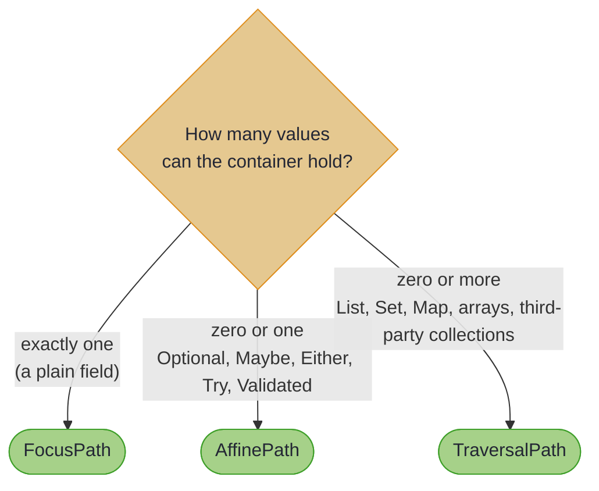

# Focus DSL: Custom Containers and Code Generation

~~~admonish info title="What You'll Learn"
- What the annotation processor emits for each field shape
- How container cardinality (`ZERO_OR_ONE` versus `ZERO_OR_MORE`) determines the generated path type
- What `widenCollections = true` changes, and when you want it
- The container types supported out of the box, across HKJ, the JDK, Eclipse Collections, Guava, Vavr, Apache Commons, and PCollections
- How to register your own container type through the `TraversableGenerator` SPI
~~~

The Focus DSL never asks you which path type you want. It reads the field's type and picks: exactly one, zero or one, or zero or more. This page is the rule book for that choice.

---

## Generated Class Structure

Given a record with one field of each interesting shape:

```java
@GenerateLenses
@GenerateFocus
record Employee(
    String name,
    int age,
    Optional<String> email,
    List<Skill> skills,
    Either<String, Integer> timeout,
    Map<String, Integer> scores) {}
```

the processor generates one method per component, each already carrying the widening its type calls for:

<!-- verify -->
```java
FocusPath<Employee, String> name = EmployeeFocus.name();          // plain field
FocusPath<Employee, Integer> age = EmployeeFocus.age();           // boxed primitive

AffinePath<Employee, String> email = EmployeeFocus.email();       // .some()
TraversalPath<Employee, Skill> skills = EmployeeFocus.skills();   // .each()

// SPI ZERO_OR_ONE: .some(Affines.eitherRight())
AffinePath<Employee, Integer> timeout = EmployeeFocus.timeout();

// SPI ZERO_OR_MORE: not widened by default, so the path still focuses the Map
FocusPath<Employee, Map<String, Integer>> scores = EmployeeFocus.scores();
TraversalPath<Employee, Integer> allScores = scores.each(EachInstances.mapValuesEach());
```

Two things are worth noticing. There is exactly one method per component, so indexed accessors such as `skill(0)` are not generated; index with `.at(0)` from `FocusPath.of(EmployeeLenses.skills())` instead. And the `Map` field is the odd one out, which the next section explains.

---

## Cardinality: the Rule Behind the Choice

Every container holds its values in one of two ways. It either wraps *at most one* value (`Either` holds a success or a failure) or *zero or more* (a `Map` holds many entries). The Focus DSL calls this the container's **cardinality**, and it decides the generated path type:



The diagram gives the tier a container's cardinality *implies*. Which of them a static Focus method actually widens to is the next section's subject: `List`, `Set` and `Collection` always do, and the rest wait for `widenCollections`.

Nested containers compose the same rule up to three levels: `Optional<List<String>>` becomes `.some().each()` and lands on a `TraversalPath`. See [Nested Container Widening](focus_navigation.md#nested-container-widening).

### The `ZERO_OR_MORE` Asymmetry, and `widenCollections`

`List`, `Set` and `Collection` are recognised directly by the processor and widened at the static method. Every *other* `ZERO_OR_MORE` container arrives through the service-provider interface (SPI) (`Map`, arrays, and the third-party collections below) and is left un-widened by default, for backwards compatibility. One flag turns the widening on:

<!-- verify -->
```java
// Default: the static method stops at the container
FocusPath<Employee, Map<String, Integer>> scores = EmployeeFocus.scores();

// @GenerateFocus(widenCollections = true): the static method steps into it
TraversalPath<WidenedEmployee, Integer> widened = WidenedEmployeeFocus.scores();
```

~~~admonish tip title="Why this matters"
`widenCollections = true` is usually what you want on a new record: it makes `Map` fields behave exactly like `List` fields, and the same flag applies one level down inside a nested container. It is opt-in only because turning it on changes a method's return type, and that is a source-breaking change for anyone already calling it. New code has nothing to break.
~~~

There is one exception, and it is the one navigators need: a container whose *element* is itself a `@GenerateFocus` record is always stepped into, because the navigator that record's field hands back has to reach it. So `Map<String, Address>` on a navigator-enabled record gives you an `AddressNavigator` over the values without the flag, while `Map<String, String>` waits for it.

Whichever way you reach a field — the static method, or a navigator on a record that holds this one — you get the same path type. The setting that decides it belongs to the record that *declares* the component, not to the one navigating to it.

---

## Supported Container Types

`ZERO_OR_ONE` containers, which produce an `AffinePath`:

| Container | Source | Optic used |
|-----------|--------|------------|
| `Optional<A>` | JDK | `.some()` (recognised directly) |
| `Maybe<A>` | HKJ | `Affines.just()` |
| `Either<L, R>` | HKJ | `Affines.eitherRight()` |
| `Try<A>` | HKJ | `Affines.trySuccess()` |
| `Validated<E, A>` | HKJ | `Affines.validatedValid()` |

`ZERO_OR_MORE` containers, which produce a `TraversalPath` (at the static method for the first three rows, which are recognised by name, and for the rest only under `widenCollections = true`):

| Container | Source | Optic used |
|-----------|--------|------------|
| `List<A>` | JDK | `.each()` (recognised directly) |
| `Set<A>` | JDK | `EachInstances.setEach()` (recognised directly) |
| `Collection<A>` | JDK | `EachInstances.collectionEach()` (recognised directly) |
| `Map<K, V>` | JDK | `EachInstances.mapValuesEach()` |
| `A[]` | JDK | `EachInstances.arrayEach()` |
| `ImmutableList`, `MutableList`, `ImmutableSet`, `MutableSet`, `ImmutableBag`, `MutableBag`, `ImmutableSortedSet`, `MutableSortedSet` | Eclipse Collections | `EachInstances.fromIterableCollecting(...)` |
| `ImmutableList`, `ImmutableSet` | Guava | `EachInstances.fromIterableCollecting(...)` |
| `List`, `Set` | Vavr | `EachInstances.fromIterableCollecting(...)` |
| `HashBag`, `UnmodifiableList` | Apache Commons | `EachInstances.fromIterableCollecting(...)` |
| `PVector`, `PStack`, `PSet`, `PSortedSet`, `PBag` | PCollections | `EachInstances.fromIterableCollecting(...)` |
| `PMap`, `PSortedMap` | PCollections | `EachInstances.mapValuesEachCollecting(...)` |

The three JDK collections are recognised by name rather than by the SPI, but they do not share one traversal: the no-argument `.each()` carries a `List` one, so a `Set` field is widened with `EachInstances.setEach()` and a `Collection` field with `EachInstances.collectionEach()`. Each rebuilds a value the component can take back, which is what lets the modified result go home:

<!-- verify -->
```java
// Each of these widened at the static method, through its own Each instance
TraversalPath<Team, Skill> teamSkills = TeamFocus.skills();
TraversalPath<Team, String> teamTags = TeamFocus.tags();

// The path is a TraversalPath, so the Set widened at the static method
Team promoted = teamSkills.via(SkillFocus.level()).modifyAll(level -> level + 1, team);
```

A `Collection` names no ordering and no uniqueness, so `collectionEach()` rebuilds whichever it was given: a set-valued `Collection` comes back a set — a `LinkedHashSet`, so a `TreeSet` or other `SortedSet` source keeps its elements but not its ordering contract — and anything else comes back a `List`. A `Collection` that is neither, such as an `ArrayDeque`, also comes back a `List`; those types inherit identity `equals`, so no rebuild could return a collection equal to the one it was handed.

Every third-party *collection* generator goes through `EachInstances.fromIterableCollecting(collector)`, a generic factory that iterates the container, traverses the elements with the applicative, and rebuilds the container through the collector it is given; the map-shaped ones go through `mapValuesEachCollecting` instead. No extra HKJ module is needed: the library itself you supply, and a project that names one of these types in a record already has it on the classpath.

<!-- verify -->
```java
// Eclipse Collections, no manual wiring: the SPI generator supplies the Each instance
FocusPath<AssetClass, ImmutableList<Position>> positions = AssetClassFocus.positions();

TraversalPath<AssetClass, Position> eachPosition =
    positions.each(EachInstances.fromIterableCollecting(list -> Lists.immutable.ofAll(list)));

AssetClass rebalanced =
    eachPosition
        .via(PositionFocus.weight())
        .modifyAll(w -> w * 1.05, assetClass);
```

~~~admonish warning title="Raw and wildcard container type arguments"
An SPI container widens by receiving an optic **instance** — `.some(Affines.eitherRight())`, `.each(EachInstances.mapValuesEach())` — whose own type arguments javac infers from the field type. A raw container offers none to infer from, and a wildcard has no ground instantiation, so `@GenerateFocus` rejects the component rather than emitting a call that cannot compile:

```java
// Rejected: no Affine can be denoted for a wildcard type argument
@GenerateFocus
public record Holder(Either<String, ? extends Leaf> boundedEither) {}

// Accepted
@GenerateFocus
public record Holder(Either<String, Leaf> either) {}
```

Both of the container's own type arguments count, focused or not, so `Either<?, Leaf>` is rejected too. A wildcard nested *inside* an argument is fine: `Either<String, List<? extends Leaf>>` still has a ground instantiation and widens to `.some(Affines.eitherRight()).each()`.

The recognised `Optional`, `Maybe` and `List` widenings take a wildcard without complaint, because `.some()` and the no-argument `.each()` are methods with a free type variable and no optic argument to unify. `List<? extends Leaf>` widens to `TraversalPath<Holder, Leaf>` as usual.

`Set` and `Collection` are recognised directly too, but each widens by naming an `Each` instance, so the rule above applies to them exactly as it does to an SPI container: `Set<?>`, `Set<? extends Leaf>` and a raw `Set` are rejected at the declaration.

A `ZERO_OR_MORE` SPI container is rejected only when something actually widens it — `widenCollections = true`, or a navigator taking it. At the default settings it stays a `FocusPath`, and the wildcard costs it nothing. Nor does one beneath it: `Map<String, Either<String, ? extends Leaf>>` compiles at the default settings, because the `Map` is never widened and so the `Either` inside it is never asked for an optic.

A generator that names no optic expression is exempt: it widens through `.nullable()` or `.each()`, whose free type variable takes a raw or wildcard argument without complaint. Every generator shipped with HKJ names one.

This is a rule about **composing an optic instance**, so it is `@GenerateFocus`'s alone. `@GenerateTraversals` reads the same component and emits a `Traversal` over the type the wildcard stands for: nothing is inferred, so there is nothing to fail. Where a path does widen — the recognised `Optional`, `Maybe` and `List` above — it reaches that same element type. See [Wildcard Element Types](traversals.md#wildcard-element-types).
~~~

### Cross-Ecosystem Navigation

Real projects mix collection libraries: JDK collections for ordinary code, Eclipse Collections for high-performance immutable data, HKJ types for typed error handling. Focus navigates all of them from one annotation, composing chains that cross ecosystem boundaries without ceremony. For a full walkthrough on a financial portfolio model, see [Portfolio Risk Analysis](../examples/examples_portfolio_risk.md).

---

## The fine print: registering your own container type

A library can teach the processor about its own container by implementing `TraversableGenerator`. The interface is small: say which types you handle, what cardinality they have, which type argument is the focus, what optic expression to emit, and (the one method with no default) how to emit `modifyF`.

```java
@ServiceProvider(TraversableGenerator.class)
public final class ResultGenerator extends BaseTraversableGenerator {

  @Override
  public boolean supports(TypeMirror type) {
    return type instanceof DeclaredType d && d.asElement().toString().equals("com.example.Result");
  }

  @Override
  public Cardinality getCardinality() {
    return Cardinality.ZERO_OR_ONE;   // Result holds zero or one success value
  }

  @Override
  public int getFocusTypeArgumentIndex() {
    return 1;                          // Result<E, A> focuses on A
  }

  @Override
  public String generateOpticExpression() {
    return "ResultAffines.success()";  // a Java expression returning an Affine
  }

  @Override
  public Set<String> getRequiredImports() {
    return Set.of("com.example.optics.ResultAffines");
  }

  @Override
  public CodeBlock generateModifyF(
      RecordComponentElement component,
      ClassName recordClassName,
      List<? extends RecordComponentElement> allComponents) {
    // The body of the generated Traversal.modifyF for this container.
    // EitherGenerator in hkj-processor-plugins is a worked implementation.
  }
}
```

`generateModifyF` is the only member without a default, so a generator that omits it will not compile: `BaseTraversableGenerator` supplies the generic-type and constructor-argument helpers, not this.

`@ServiceProvider` (from Avaje) writes the `META-INF/services` entry and checks the `module-info.java` `provides` clause for you. Once the generator is on the annotation processor path, any `@GenerateFocus` record with a `Result<E, A>` field generates an `AffinePath` that calls `.some(ResultAffines.success())`.

~~~admonish tip title="See Also"
[Traversal Generator Plugins](../tooling/generator_plugins.md) is the full implementation guide: generator discovery, priority, the `modifyF` code generation hook, and the testing approach.
~~~

---

~~~admonish info title="Key Takeaways"
* **The field type picks the path type, through cardinality.** Zero or one gives an `AffinePath`, `List`/`Set`/`Collection` a `TraversalPath`, anything else a `FocusPath`. Every other zero-or-more container stops at the container until `widenCollections` says otherwise.
* **`List`, `Set`, `Collection` and `Optional` are built in.** Everything else, including `Map` and arrays, arrives through the `TraversableGenerator` SPI.
* **`widenCollections = true` removes the asymmetry.** Without it, an SPI `ZERO_OR_MORE` container stops at the container, in static Focus methods and navigator methods alike; a container holding a navigable element is stepped into either way, because that is how its navigator reaches the element.
* **Third-party collections need no extra HKJ module.** One generic `fromIterableCollecting` factory covers Eclipse Collections, Guava, Vavr, Apache Commons and PCollections, on top of the ecosystem dependency you already declare to name the type.
* **The SPI is open.** Implement `supports`, `getCardinality`, `getFocusTypeArgumentIndex`, `generateOpticExpression` and the one method with no default, `generateModifyF`; register with `@ServiceProvider`, and your container becomes a first-class Focus field.
~~~

~~~admonish info title="Hands-On Learning"
Practice container navigation in [Tutorial 20: Custom Container Navigation](https://github.com/higher-kinded-j/higher-kinded-j/blob/main/hkj-examples/src/test/java/org/higherkindedj/tutorial/optics/Tutorial20_ContainerNavigation.java) (4 exercises, ~10 minutes).
~~~

~~~admonish tip title="See Also"
- [Navigation and Composition](focus_navigation.md): widening rules, navigators, and nested containers
- [Traversal Generator Plugins](../tooling/generator_plugins.md): the full SPI implementation guide
- [Portfolio Risk Analysis](../examples/examples_portfolio_risk.md): cross-ecosystem navigation end to end
~~~

---

**Previous:** [Type Class and Effect Integration](focus_effects.md)
**Next:** [Focus DSL Reference](focus_reference.md)
