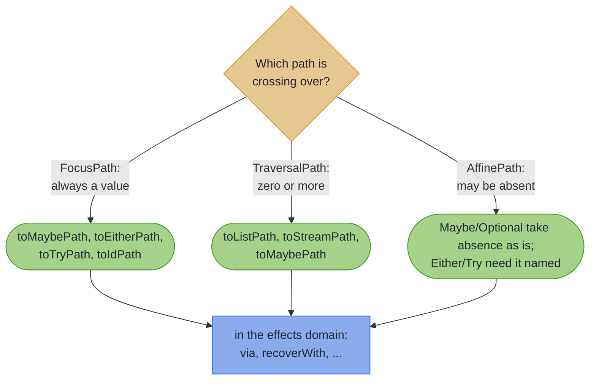

# Focus DSL: Type Class and Effect Integration

~~~admonish info title="What You'll Learn"
- Effectful modification with `modifyF()` using an `Applicative` or `Monad` instance
- Monoid-based aggregation with `foldMap()` on traversal paths
- Generic collection traversal with `traverseOver()` for `Kind<F, A>` fields
- Conditional modification with `modifyWhen()` and sum type access with `instanceOf()`
- Path debugging with `traced()`
- Bridging between Focus paths and Effect paths in both directions
~~~

~~~admonish example title="See Example Code"
[TraverseIntegrationExample](https://github.com/higher-kinded-j/higher-kinded-j/blob/main/hkj-examples/src/main/java/org/higherkindedj/example/optics/focus/TraverseIntegrationExample.java) | [ValidationPipelineExample](https://github.com/higher-kinded-j/higher-kinded-j/blob/main/hkj-examples/src/main/java/org/higherkindedj/example/optics/focus/ValidationPipelineExample.java)
~~~

The examples here use a flatter model than the previous pages: an `Agency` holding its `Employee`s directly. Two sections need shapes an `Agency` does not have and name their own: a `RoleBox` holding a `Kind<ListKind.Witness, Role>`, and a `Drawing` holding a sealed `Shape` that permits `Circle` and `Square`.

An ordinary `modify` takes `A -> A`. Once the transformation can fail, accumulate errors, or reach out to the network, it returns `A` wrapped in an effect, and the update has to thread that effect back out through the structure. That is what this page is about: the same paths, with effects along for the ride.

---

## Effectful Modification with `modifyF()`

~~~admonish tip title="Why this matters"
The path does not change. The same `AgencyFocus.employees().via(EmployeeFocus.salary())` you use for a pure `modifyAll` serves an accumulating validation, an `Either` that stops at the first problem, and an asynchronous fetch, with only the `Applicative` you hand it differing. Navigation and effect are separate concerns here, so adding validation to an update is not a rewrite of how you reach the data.
~~~

Every path type has `modifyF()`. The function returns the new value inside a `Kind`, and the whole modified structure comes back inside the same effect. The effect is chosen by the instance you pass, not by the path:

<!-- verify -->
```java
// A side-effecting read, deferred in IO
Kind<IOKind.Witness, Agency> deferred =
    AgencyFocus.name()
        .modifyF(
            name -> IO_OP.widen(IO.delay(() -> name.trim())), agency, Instances.monad(io()));
```

~~~admonish warning title="`modifyF` speaks `Kind`, not the concrete type"
The function must return `Kind<F, A>` and the result is `Kind<F, S>`, so an `IO` goes in through `IO_OP.widen(...)` and a `Validated` comes out through `VALIDATED.narrow(...)`. The [Fluent API](fluent_api.md#part-2-validation-aware-modification)'s four validation methods do that widening for you for `Either`, `Maybe` and `Validated`; reach for `modifyF` when the effect is something else, or when you already hold the `Applicative`.
~~~

Accumulating validation is the same call with a `Validated` applicative, and shows the one piece of ceremony worth knowing about: the witness has to be written out, because nothing in the argument list mentions `List<String>`.

<!-- verify -->
```java
// Validate every employee email, accumulating all failures
Applicative<ValidatedKind.Witness<List<String>>> applicative =
    Instances.validated(Semigroups.<String>list());

Kind<ValidatedKind.Witness<List<String>>, Agency> result =
    AgencyFocus.employees()
        .via(EmployeeFocus.email())
        .modifyF(email -> VALIDATED.widen(Fixture.validateEmail(email)), agency, applicative);

Validated<List<String>, Agency> validated = VALIDATED.narrow(result);
// Valid(agency) when every address holds; Invalid([...]) listing every one that does not
```

---

## Monoid-Based Aggregation with `foldMap()`

`TraversalPath` folds every focused element into a single value through a `Monoid`:

<!-- verify -->
```java
TraversalPath<Agency, Employee> employees = AgencyFocus.employees();

int payroll = employees.foldMap(Monoids.integerAddition(), Employee::salary, agency);
// 115000

String roster = employees.foldMap(Monoids.string(), Employee::name, agency);
// "AliceBob"
```

`fold(monoid, source)` is the same operation when the focused type is already the monoid's type.

---

## Generic Collection Traversal with `traverseOver()`

When a field holds `Kind<F, A>` rather than a plain collection, `traverseOver()` steps into it with a `Traverse` instance:

<!-- verify -->
```java
FocusPath<RoleBox, Kind<ListKind.Witness, Role>> rolesPath = FocusPath.of(Fixture.rolesLens);

TraversalPath<RoleBox, Role> allRoles =
    rolesPath.<ListKind.Witness, Role>traverseOver(ListTraverse.INSTANCE);

List<Role> roles = allRoles.getAll(roleBox);
RoleBox promoted = allRoles.modifyAll(Fixture::promote, roleBox);
```

The explicit type witnesses are load-bearing: Java cannot infer `F` and `E` from the `Traverse` argument alone. (A *witness* is the marker type that stands in for the higher-kinded `F`; see [Higher-Kinded Types](../hkts/hkt_introduction.md) if the term is new.)

| Field shape | Use |
|-------------|-----|
| `List<T>`, `Set<T>` | `each()`, already applied by the generated method |
| `Kind<F, T>` on an annotated record | nothing: the processor applies `traverseOver` for you |
| `Kind<F, T>` behind a hand-written lens | `traverseOver(SomeTraverse.INSTANCE)` |

~~~admonish tip title="See Also"
When the `Kind<F, A>` field is on a `@GenerateFocus` record, the processor recognises the witness and generates the traversal itself. See [Kind Field Support](kind_field_support.md).
~~~

---

## Conditional Modification with `modifyWhen()`

`modifyWhen` applies the transformation only to elements that satisfy a predicate, leaving the rest untouched:

<!-- verify -->
```java
Agency afterRise =
    AgencyFocus.employees()
        .modifyWhen(
            e -> e.salary() < 58000,
            e -> new Employee(e.name(), e.email(), e.nickname(), e.salary() + 2000),
            agency);
```

It is `filter(...).modifyAll(...)` with one fewer intermediate, and it reads as the business rule it encodes.

---

## Working with Sum Types using `instanceOf()`

`AffinePath.instanceOf(Class)` focuses one variant of a sealed hierarchy, matching when the runtime type fits and doing nothing when it does not:

<!-- verify -->
```java
// Only the circles, and only their radii
TraversalPath<Drawing, Double> circleRadii =
    DrawingFocus.shapes().via(AffinePath.instanceOf(Circle.class)).via(CircleFocus.radius());

List<Double> radii = circleRadii.getAll(drawing);          // the squares are skipped
Drawing doubled = circleRadii.modifyAll(r -> r * 2, drawing);
```

For a sealed interface you own, `@GeneratePrisms` gives the same access with a name per variant; `instanceOf` is the answer when the hierarchy is someone else's.

---

## Path Debugging with `traced()`

`traced()` returns the same path with an observer attached, so you can see what a chain actually focused without dismantling it:

<!-- verify -->
```java
TraversalPath<Agency, Employee> traced =
    AgencyFocus.employees()
        .traced((source, found) -> System.out.println("focused " + found.size() + " employees"));

List<Employee> employees = traced.getAll(agency);
```

The observer receives the focused values in the shape the path guarantees: an `A` for `FocusPath`, an `Optional<A>` for `AffinePath`, and a `List<A>` for `TraversalPath`.

---

## Bridging to Effect Paths

Focus paths and Effect paths share the `via` composition operator but navigate different domains: one moves through structure, the other through failure. The bridge runs both ways.

What the crossing costs is set by the effect, not by the direction of travel. A `FocusPath` always has a value, so it enters an effect as a success either way. An `AffinePath` may not, and then the effect decides: `Maybe` and `Optional` already model absence, so they take it as it comes. The failure-carrying effects have no such slot, so they want the absent case named going in (`toEitherPath` an error, `toTryPath` a `Supplier`) and equally coming back, which is why `EitherPath.focus(path, error)` below asks for one too:



### Direction 1: Focus Path to Effect Path

Extract a value with optics and continue in an effect pipeline. A `FocusPath` always succeeds, so its bridges never produce the failure case; an `AffinePath` may be empty, so its bridges take the value to use when it is:

<!-- verify -->
```java
// FocusPath: always present
MaybePath<String> name = AgencyFocus.name().toMaybePath(agency);
EitherPath<String, String> alwaysRight = AgencyFocus.name().toEitherPath(agency);

// AffinePath: absence is a real outcome, so name it
EitherPath<String, String> nickname =
    EmployeeFocus.nickname().toEitherPath(alice, "No nickname on file");
// Left("No nickname on file"), because Alice has none
```

**Bridge methods on `FocusPath`:**

| Method | Return Type | Description |
|--------|-------------|-------------|
| `toMaybePath(S)` | `MaybePath<A>` | Always `Just(value)` |
| `toEitherPath(S)` | `EitherPath<E, A>` | Always `Right(value)` |
| `toTryPath(S)` | `TryPath<A>` | Always `Success(value)` |
| `toIdPath(S)` | `IdPath<A>` | Trivial effect wrapper |

**Bridge methods on `AffinePath`:**

| Method | Return Type | Description |
|--------|-------------|-------------|
| `toMaybePath(S)` | `MaybePath<A>` | `Just` if present, `Nothing` otherwise |
| `toEitherPath(S, E)` | `EitherPath<E, A>` | `Right` if present, `Left(error)` otherwise |
| `toTryPath(S, Supplier<Throwable>)` | `TryPath<A>` | `Success` or `Failure` |
| `toOptionalPath(S)` | `OptionalPath<A>` | Wraps in the Java `Optional` effect |

**Bridge methods on `TraversalPath`:**

| Method | Return Type | Description |
|--------|-------------|-------------|
| `toListPath(S)` | `ListPath<A>` | All focused values as a list |
| `toStreamPath(S)` | `StreamPath<A>` | Lazy stream of the values |
| `toVStreamPath(S)` | `VStreamPath<A>` | Virtual-thread stream of the values |
| `toMaybePath(S)` | `MaybePath<A>` | The first value, if any |

### Direction 2: `EffectPath.focus()`

When a service call has already put the structure inside an effect, `focus()` navigates without unwrapping:

<!-- verify -->
```java
EitherPath<String, Agency> loaded = Path.right(agency);

EitherPath<String, String> agencyName = loaded.focus(AgencyFocus.name());

// An AffinePath needs the error for the absent case
EitherPath<String, String> firstNickname =
    loaded
        .focus(AgencyFocus.employees().headOption(), "No employees")
        .focus(EmployeeFocus.nickname(), "No nickname on file");
```

**`focus()` signatures:**

| Effect Type | With a `FocusPath` | With an `AffinePath` |
|-------------|--------------------|----------------------|
| `MaybePath<A>` | `MaybePath<B>` | `MaybePath<B>` |
| `EitherPath<E, A>` | `EitherPath<E, B>` | `EitherPath<E, B>`, given an `E` |
| `TryPath<A>` | `TryPath<B>` | `TryPath<B>`, given a `Supplier<Throwable>` |
| `IOPath<A>` | `IOPath<B>` | `IOPath<B>`, given a `Supplier<RuntimeException>` |
| `ValidationPath<E, A>` | `ValidationPath<E, B>` | `ValidationPath<E, B>`, given an `E` |
| `OptionalPath<A>` | `OptionalPath<B>` | `OptionalPath<B>` |
| `IdPath<A>` | `IdPath<B>` | `MaybePath<B>` |

`IdPath` is the one row that changes effect: `Id` has nowhere to record an absent focus, so focusing an `AffinePath` through one hands back a `MaybePath`.

### Which Direction?

**Start in the optics domain** when you hold the data and want an effect pipeline: extract a value, then validate or fetch.

**Start in the effects domain** when a call has already returned an effect and you want to drill into its payload.

<!-- verify -->
```java
// Optics first: extract, then validate
EitherPath<String, String> checked =
    EmployeeFocus.nickname()
        .toEitherPath(bob, "No nickname on file")
        .via(nick -> nick.length() >= 3 ? Path.right(nick) : Path.left("Nickname too short"));

// Effect first: navigate what the call returned
EitherPath<String, Integer> salary =
    Path.<String, Employee>right(bob).focus(EmployeeFocus.salary());
```

---

~~~admonish info title="Key Takeaways"
* **`modifyF` is the effectful `modify`.** The instance you pass picks the effect; the path is unchanged. Widen going in, narrow coming out.
* **`foldMap` turns a traversal into a query.** Any `Monoid` will do, so sums, joins and set unions are the same call.
* **`traverseOver` is `each` for `Kind<F, A>`.** Explicit type witnesses are required, because inference cannot recover `F` from the `Traverse` argument.
* **`instanceOf` reaches into sealed hierarchies you do not own.** For your own sealed types, `@GeneratePrisms` names the variants.
* **The bridge runs both ways, and the effect sets the toll.** `toMaybePath`/`toEitherPath`/`toTryPath` move optics results into an effect; `focus()` moves optic navigation inside one. In either direction an `AffinePath` meeting a failure-carrying effect must name the absent case, while `Maybe` and `Optional` take absence as it comes.
~~~

~~~admonish info title="Hands-On Learning"
[Tutorial13_AdvancedFocusDSL.java](https://github.com/higher-kinded-j/higher-kinded-j/blob/main/hkj-examples/src/test/java/org/higherkindedj/tutorial/optics/Tutorial13_AdvancedFocusDSL.java)
~~~

~~~admonish tip title="See Also"
- [Effect Path Overview](../effect/effect_path_overview.md): railway model and effect composition
- [Focus-Effect Integration](../effect/focus_integration.md): the complete bridging guide
- [Capability Interfaces](../effect/capabilities.md): the powers behind effect operations
- [Fluent API](fluent_api.md): validation-aware modification without hand-wiring an `Applicative`
~~~

---

**Previous:** [Navigation and Composition](focus_navigation.md)
**Next:** [Custom Containers and Code Generation](focus_containers.md)
