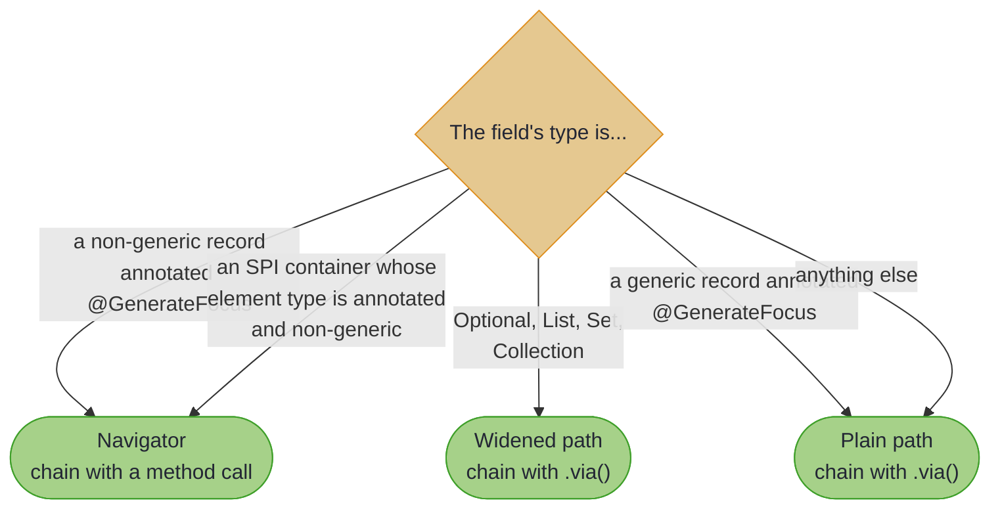

# Focus DSL: Navigation and Composition

~~~admonish info title="What You'll Learn"
- Collection navigation with `.each()`, `.each(Each)`, `.at()`, `.atKey()`, `.some()`, `.some(Affine)`, and `.nullable()`
- Path widening: how a field's container decides the path type, on its own and nested
- List decomposition with `ListPrisms`, and why it starts from the lens rather than the generated path
- Composing Focus paths with existing lenses, prisms, and traversals through `.via()`
- Which fields get a generated navigator, and what a navigator can and cannot do
- SPI-aware widening, compound widening, and nested container chains
- Controlling navigator generation with depth limits and field filters
~~~

~~~admonish example title="See Example Code"
[NavigatorExample](https://github.com/higher-kinded-j/higher-kinded-j/blob/main/hkj-examples/src/main/java/org/higherkindedj/example/optics/focus/NavigatorExample.java) | [ContainerNavigationExample](https://github.com/higher-kinded-j/higher-kinded-j/blob/main/hkj-examples/src/main/java/org/higherkindedj/example/optics/focus/ContainerNavigationExample.java)
~~~

The previous page gave you one method per record component. This page is about the hops the processor did not generate for you: stepping into a container it does not recognise, indexing a list, unwrapping an `Either`, and joining a path to an optic that came from somewhere else. One rule sits under all of them, and it has a name: widening.

---

## Collection Navigation

### `.each()`: Traverse All Elements

`.each()` steps from a collection into its elements. For a `List`, `Set` or `Collection` field the generated method has already applied the right one, which is why `ContainerFocus.items()` focuses each `Item`:

<!-- verify -->
```java
// Generated: FocusPath.of(lens).each()
TraversalPath<Container, Item> allItems = ContainerFocus.items();
List<Item> items = allItems.getAll(container);

// Applying .each() yourself, starting from the lens to the whole list
TraversalPath<Container, Item> sameThing = FocusPath.of(ContainerLenses.items()).each();
```

### `.each(Each)`: Traverse with a Custom Each Instance

The no-argument `.each()` carries a `List` traversal and nothing else. Every other container — a `Set`, a `Collection`, a `Map`, an array, a third-party collection — takes an explicit `Each` instead. The generated method already does this for you: `EachInstances.setEach()` for a `Set` field, `EachInstances.collectionEach()` for a `Collection`. Hand-built paths have to say it themselves, and this works on `FocusPath`, `AffinePath` and `TraversalPath` alike:

<!-- verify -->
```java
// A Map field: traverse the values
TraversalPath<Config, Setting> allSettings =
    ConfigFocus.settings().each(EachInstances.mapValuesEach());

// An HKJ container held behind a hand-written lens
TraversalPath<Wrapper, Setting> maybeSetting =
    FocusPath.of(Fixture.settingLens).each(EachExtensions.maybeEach());
```

For available `Each` instances and how to create your own, see [Each](each_typeclass.md).

### Access by Index

`.at(index)` focuses a single element of a list, and `.atKey(key)` a single value of a map. On a `FocusPath` or an `AffinePath` both return an `AffinePath`, because the position may not be occupied; on a `TraversalPath` the result stays a `TraversalPath`.

The generated Focus class has exactly one method per record component, so there is no generated `container.item(0)` accessor. Index from the path that still focuses the container. When the result feeds straight into another composition, spell the element type out (`FocusPath.of(ContainerLenses.items()).<Item>at(0)`): nothing in the argument list mentions `Item`, so inference has nothing to work from.

<!-- verify -->
```java
// A List field: start from the lens, because the generated path is element-level
AffinePath<Container, Item> firstItem = FocusPath.of(ContainerLenses.items()).at(0);
Optional<Item> first = firstItem.getOptional(container);   // empty if out of bounds

// Or narrow the generated traversal to its first element. Mind the asymmetry:
// headOption reads the first element but writes to all of them
AffinePath<Container, Item> alsoFirst = ContainerFocus.items().headOption();

// A Map field: the generated path still focuses the whole map, so .atKey() applies
AffinePath<Config, Setting> database = ConfigFocus.settings().atKey("database");
Optional<Setting> setting = database.getOptional(config);
```

~~~admonish warning title="Element-level versus container-level"
`ContainerFocus.items()` focuses each `Item`; `FocusPath.of(ContainerLenses.items())` focuses the `List<Item>`. Anything that operates on the container as a whole (indexing, `ListPrisms`, a custom list-level optic) has to start from the second. Reach for the generated path when you want to act on every element, and for the lens when you want to act on the collection.
~~~

### `.some()`: Unwrap Optional

An `Optional<T>` field is unwrapped for you: the generated method applies `.some()` and returns an `AffinePath`. Call `.some()` yourself when the `Optional` sits behind a hand-written lens.

### `.some(Affine)`: Navigate SPI Container Types

Container types registered through the `TraversableGenerator` service-provider interface (SPI) that hold zero or one element take an `Affine` describing which side to focus:

<!-- verify -->
```java
// Either<String, String> field: the generated method already applies
// .some(Affines.eitherRight()), focusing the Right value
AffinePath<Warehouse, String> verified = WarehouseFocus.verifiedName();

Optional<String> name = verified.getOptional(warehouse);   // empty for a Left
Warehouse renamed = verified.set("Northern", warehouse);   // replaces the Left with Right("Northern")
Warehouse untouched = verified.modify(String::toUpperCase, warehouse);   // this one is the no-op
```

The following `Affine` instances cover the built-in SPI types:

| Container type | Affine instance | Focuses on |
|----------------|-----------------|------------|
| `Either<L, R>` | `Affines.eitherRight()` | The `Right` value |
| `Try<A>` | `Affines.trySuccess()` | The `Success` value |
| `Validated<E, A>` | `Affines.validatedValid()` | The `Valid` value |
| `Maybe<A>` | `Affines.just()` | The `Just` value |

For a runnable example covering all container types, see [ContainerNavigationExample.java](https://github.com/higher-kinded-j/higher-kinded-j/blob/main/hkj-examples/src/main/java/org/higherkindedj/example/optics/focus/ContainerNavigationExample.java).

### List Decomposition with `ListPrisms`

`ListPrisms` optics work on the list itself, so compose them onto a path that focuses the whole list:

<!-- verify -->
```java
FocusPath<Container, List<Item>> items = FocusPath.of(ContainerLenses.items());

AffinePath<Container, Item> firstItem = items.via(ListPrisms.head());
Optional<Item> first = firstItem.getOptional(container);

AffinePath<Container, Item> lastItem = items.via(ListPrisms.last());

// Pattern match with cons (head, tail)
AffinePath<Container, Pair<Item, List<Item>>> consPath = items.via(ListPrisms.cons());
consPath
    .getOptional(container)
    .ifPresent(
        pair -> {
          Item head = pair.first();
          List<Item> tail = pair.second();
        });
```

| ListPrisms Method | Type | Description |
|-------------------|------|-------------|
| `ListPrisms.head()` | `Affine<List<A>, A>` | Focus on first element |
| `ListPrisms.last()` | `Affine<List<A>, A>` | Focus on last element |
| `ListPrisms.tail()` | `Affine<List<A>, List<A>>` | Focus on all but first |
| `ListPrisms.init()` | `Affine<List<A>, List<A>>` | Focus on all but last |
| `ListPrisms.cons()` | `Prism<List<A>, Pair<A, List<A>>>` | Decompose as (head, tail) |
| `ListPrisms.snoc()` | `Prism<List<A>, Pair<List<A>, A>>` | Decompose as (init, last) |

The same decompositions are available directly on a path focusing a list, as `.head()`, `.last()`, `.tail()`, `.init()`, `.cons()` and `.snoc()`.

For the full treatment, including stack-safe operations on large lists, see [List Decomposition](list_decomposition.md).

### `.nullable()`: Handle Null Values

For a field that may be null, `.nullable()` turns null into absence:

<!-- verify -->
```java
FocusPath<LegacyUser, String> rawPath = LegacyUserFocus.nickname();
AffinePath<LegacyUser, String> safePath = rawPath.nullable();

Optional<String> missing = safePath.getOptional(new LegacyUser("Alice", null));
// Optional.empty()

Optional<String> present = safePath.getOptional(new LegacyUser("Bob", "Bobby"));
// Optional.of("Bobby")
```

~~~admonish tip title="A recognised `@Nullable` saves you the chain"
Annotate the component and the generated method hands you the `AffinePath` already: the processor reads all six recognised annotations wherever their own `@Target` puts them (JSpecify's `TYPE_USE` on the component's type, JetBrains', AndroidX's and SpotBugs' on the accessor, JSR-305's and Jakarta's on the component itself). Chain `.nullable()` yourself for a field nobody annotated, as `LegacyUser` above. Two rules worth knowing: a container decides its own widening, so `@Nullable List<T>` is still `.each()`, and position counts as Java defines it, so `String @Nullable []` is a nullable array while `@Nullable String[]` and `List<@Nullable String>` annotate the elements.
~~~

---

## Composition with Existing Optics

`.via()` composes a path with any optic, and the result type follows the widening lattice:

<!-- verify -->
```java
// Path + Lens = Path
FocusPath<Company, String> hqStreet =
    FocusPath.of(CompanyLenses.headquarters()).via(AddressLenses.street());

// Path + Affine (a prism is one) = AffinePath
AffinePath<Container, Item> firstItem =
    FocusPath.of(ContainerLenses.items()).via(ListPrisms.head());

// Path + Traversal = TraversalPath
TraversalPath<Company, Employee> allEmployees =
    CompanyFocus.departments().via(DepartmentFocus.employees());
```

`.via()` also accepts another Focus path, which is how you cross a type boundary the navigator did not cover: `.via(DepartmentFocus.employees())` above is `.via(DepartmentFocus.employees().toTraversal())` with the ceremony removed, and with the path labelling kept (the path overload concatenates `segments()`, the raw-optic one leaves them alone).

---

## Fluent Navigation with Generated Navigators

Set `generateNavigators = true` and the processor emits a small wrapper class per navigable field, so the next hop is a method call rather than a `.via()`:

<!-- verify -->
```java
@GenerateFocus(generateNavigators = true)
record Address(String street, String city) {}

@GenerateFocus(generateNavigators = true)
record Company(String name, Address headquarters) {}
```

<!-- verify -->
```java
// With navigators
String city = CompanyFocus.headquarters().city().get(company);

// Without them, the same path, spelled out
String same = FocusPath.of(CompanyLenses.headquarters()).via(AddressFocus.city()).get(company);
```

### Which Fields Get a Navigator

Not every field does, and knowing which is the difference between a chain that compiles and one that does not:



The middle branch is the one that surprises people. `Optional`, `List`, `Set` and `Collection` are widened by the processor before navigators are considered, so a `List<Department> departments` field gives you a `TraversalPath<Company, Department>` and never a `DepartmentsNavigator`. Container types that arrive through the SPI (a `Map`, an Eclipse Collections `ImmutableList`, an `Either`) *are* eligible, and get a navigator when their element type is itself annotated.

A target that declares type parameters of its own does not. A navigator is an inner class parameterised by the source type alone, so it has no way to name them — `Inner<String> inner` keeps the plain path, chained with `.via()`. `Map<String, Inner<String>> inners` keeps the plain path too, but focused on the *map*: an SPI container of this shape is only stepped into when `widenCollections = true` says so, and the `.via()` chain reaches the element only after that. The processor says so as a note against the field, naming the chain to write in each case.

<!-- verify -->
```java
// headquarters is a plain navigable field: navigator, so .city() chains
String city = CompanyFocus.headquarters().city().get(company);

// departments is a List: a TraversalPath, so the next hop is .via()
List<String> employeeNames =
    CompanyFocus.departments()
        .via(DepartmentFocus.employees())
        .via(EmployeeFocus.name())
        .getAll(company);
```

### What a Navigator Provides

A navigator is a thin wrapper around one path, so it exposes that path's core operations plus one method per field of the target type:

| Wrapped path | Operations on the navigator |
|--------------|-----------------------------|
| `FocusPath` | `get`, `set`, `modify`, `toLens`, `toPath` |
| `AffinePath` | `getOptional`, `set`, `modify`, `matches`, `toPath` |
| `TraversalPath` | `getAll`, `setAll`, `modifyAll`, `count`, `isEmpty`, `toPath` |

Everything else (`filter`, `modifyF`, `traced`, `via`, `foldMap`) lives on the path, so call `toPath()` first:

<!-- verify -->
```java
Company relocated =
    CompanyFocus.headquarters()
        .toPath()
        .traced((source, address) -> System.out.println("HQ: " + address.city()))
        .modify(a -> new Address(a.street(), "Manchester"), company);
```

### Controlling Navigator Generation

**Depth limiting** stops the processor generating navigator classes all the way down a deep graph:

<!-- verify -->
```java
@GenerateFocus(generateNavigators = true, maxNavigatorDepth = 2)
record Root(Level1 child) {}

// Depth 1: child() returns a navigator
// Depth 2: child().nested() returns a navigator
// Depth 3 and beyond: a plain path; compose with .via()
```

**Field filtering** picks which fields are worth a navigator:

<!-- verify -->
```java
// Only these fields get one
@GenerateFocus(generateNavigators = true, includeFields = {"primary"})
record MultiAddress(Address primary, Address secondary, Address backup) {}

// All but these do
@GenerateFocus(generateNavigators = true, excludeFields = {"internal"})
record Settings(Config user, Config internal) {}
```

### When to Use Navigators

**Enable them when** you navigate across record types often, deep navigation is common, or you want the IDE to autocomplete the whole path.

**Leave them off when** the fields reference types you cannot annotate, generated-code size matters, or the structures are shallow enough that `.via()` costs nothing.

---

## Path Widening

Widening is what turns a lens to a field into the path type the field's shape deserves: a container that may hold nothing widens to an `AffinePath`, one that may hold many widens to a `TraversalPath`. It happens for every path, navigators or not.

~~~admonish tip title="Why this matters"
Widening is settled at compile time from the declared type, which means the path type cannot lie about cardinality. A field whose type admits absence, whether an `Optional`, a `Maybe` or a recognised `@Nullable`, cannot hand you a `FocusPath` whose `get` quietly returns null, and a field that may hold many cannot hand you something with a singular `get` at all. The gap is the bare nullable reference nobody annotated: its declared type says `String`, so you get a `FocusPath` and chain `.nullable()` yourself, as `LegacyUser` does above. The shape of your data becomes the shape of the API, and the mistakes that shape rules out are compilation errors rather than production ones.
~~~

### SPI containers

Each SPI generator declares a `Cardinality`, the number of values its container can hold, and that decides the path type:

| Cardinality | Path | Types |
|-------------|------|-------|
| `ZERO_OR_ONE` | `AffinePath` | `Either<L,R>`, `Try<A>`, `Validated<E,A>`, `Optional<A>`, `Maybe<A>` |
| `ZERO_OR_MORE` | `TraversalPath`, under `widenCollections` or when the element is itself navigable | `Map<K,V>`, arrays, Eclipse Collections, Guava, Vavr, Apache Commons |

<!-- verify -->
```java
// Either is ZERO_OR_ONE via the SPI: AffinePath
AffinePath<Warehouse, String> verified = WarehouseFocus.verifiedName();

// Map is ZERO_OR_MORE via the SPI, but a static Focus method widens it only
// under widenCollections; otherwise the path still focuses the whole map
FocusPath<Warehouse, Map<String, Integer>> inventory = WarehouseFocus.inventory();
TraversalPath<Warehouse, Integer> quantities = inventory.each(EachInstances.mapValuesEach());
```

`ZERO_OR_MORE` SPI types are the one asymmetry: a Focus method leaves them un-widened by default, for backwards compatibility. Add `widenCollections = true` to the annotation and `WarehouseFocus.inventory()` returns the `TraversalPath` directly. A navigator method reports the same path type as the static method for the same component — the container is stepped into either way only when its element is a navigable record, which is how the navigator reaches it. [Custom Containers and Code Generation](focus_containers.md#the-zero_or_more-asymmetry-and-widencollections) states the rule in full, alongside the table of every supported container.

### Compound widening

Composing paths widens according to a small lattice:

| Current | + Field | = Result |
|---------|---------|----------|
| FOCUS | AFFINE | AFFINE |
| FOCUS | TRAVERSAL | TRAVERSAL |
| AFFINE | AFFINE | AFFINE |
| AFFINE | TRAVERSAL | TRAVERSAL |
| TRAVERSAL | anything | TRAVERSAL |

~~~admonish note title="Custom Generators"
If you write a `TraversableGenerator` for your own container type, override `getCardinality()` to return `ZERO_OR_ONE` for optional-like types. The default is `ZERO_OR_MORE`, which is correct for collection-like types. See [Traversal Generator Plugins](../tooling/generator_plugins.md).
~~~

### Nested container widening

A field whose type nests containers gets a composed chain, up to three levels deep:

| Field Type | Generated Chain | Return Type |
|-----------|----------------|-------------|
| `Optional<List<String>>` | `.some().each()` | `TraversalPath` |
| `List<Optional<String>>` | `.each().some()` | `TraversalPath` |
| `Optional<Optional<String>>` | `.some().some()` | `AffinePath` |
| `List<List<String>>` | `.each().each()` | `TraversalPath` |
| `Optional<Either<E, String>>` | `.some().some(Affines.eitherRight())` | `AffinePath` |
| `Either<E, List<Integer>>` | `.some(Affines.eitherRight()).each()` | `TraversalPath` |
| `Either<E, Map<K, V>>` | `.some(Affines.eitherRight())` | `AffinePath` to the `Map` |
| `Either<E, Map<K, V>>` with `widenCollections = true` | `.some(Affines.eitherRight()).each(EachInstances.mapValuesEach())` | `TraversalPath` |

The last two rows are the rule in miniature. `Optional`, `List`, `Set` and `Collection` nest unconditionally, but an inner container that arrives through the SPI is stepped into only when it is `ZERO_OR_ONE`, or `ZERO_OR_MORE` with `widenCollections` on. Otherwise the path stops at the container.

<!-- verify -->
```java
TraversalPath<NestedConfig, String> allTags = NestedConfigFocus.tags();
List<String> tagValues = allTags.getAll(nestedConfig);

AffinePath<NestedConfig, String> nestedOpt = NestedConfigFocus.nested();
Optional<String> innerValue = nestedOpt.getOptional(nestedConfig);

// Either<String, List<Integer>>: a nested List is stepped into unconditionally
TraversalPath<NestedConfig, Integer> data = NestedConfigFocus.data();

// Either<String, Map<String, Integer>>: an SPI ZERO_OR_MORE stops at the Map...
AffinePath<NestedConfig, Map<String, Integer>> meta = NestedConfigFocus.meta();

// ...unless widenCollections is on
TraversalPath<WidenedConfig, Integer> hits = WidenedConfigFocus.meta();
```

Beyond three levels, compose the rest with `.via()`.

---

~~~admonish info title="Key Takeaways"
* **A generated collection method is element-level; a generated `Map` method is not.** `.at(i)` and `ListPrisms` start from `FocusPath.of(theLens())`, because there is no generated `container.item(0)`. `.atKey(k)` applies straight to the generated path, because that path still focuses the whole map.
* **Navigators cover plain navigable fields and SPI containers.** `Optional`, `List`, `Set` and `Collection` are widened before navigators are considered and never produce one, so those hops use `.via()`.
* **`toPath()` is the escape hatch.** A navigator carries only the core operations; `filter`, `modifyF`, `traced` and `via` are one `toPath()` away.
* **`widenCollections = true` fixes the `ZERO_OR_MORE` asymmetry.** It widens `Map`, arrays and third-party collections, including one level down inside a nested container, and a navigator method reports what the static method reports.
~~~

~~~admonish info title="Hands-On Learning"
- [Tutorial12_FocusDSL.java](https://github.com/higher-kinded-j/higher-kinded-j/blob/main/hkj-examples/src/test/java/org/higherkindedj/tutorial/optics/Tutorial12_FocusDSL.java)
- [Tutorial19_NavigatorGeneration.java](https://github.com/higher-kinded-j/higher-kinded-j/blob/main/hkj-examples/src/test/java/org/higherkindedj/tutorial/optics/Tutorial19_NavigatorGeneration.java)
~~~

~~~admonish tip title="See Also"
- [Custom Containers and Code Generation](focus_containers.md): what the processor emits per field type, and the SPI
- [Each](each_typeclass.md): the `Each` instances `.each(Each)` takes
- [List Decomposition](list_decomposition.md): `ListPrisms` in full
~~~

---

**Previous:** [Focus DSL](focus_dsl.md)
**Next:** [Type Class and Effect Integration](focus_effects.md)
