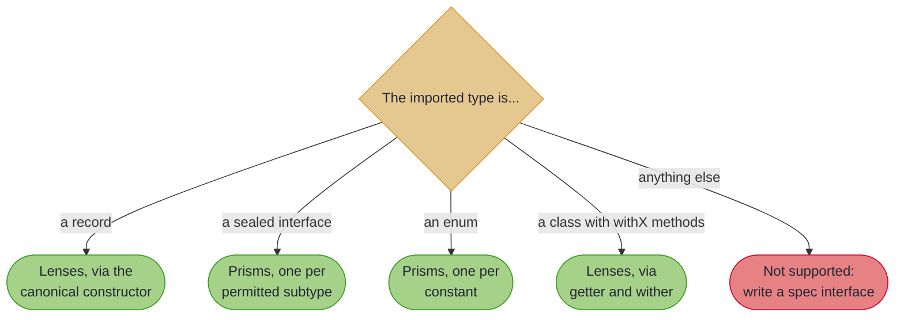

# Optics for External Types

## _Extending Your Reach Beyond Your Own Code_

> *"The real voyage of discovery consists not in seeking new landscapes, but in having new eyes."*
>
> – Marcel Proust

---

The landscape (JDK classes, database libraries, JSON parsers) already exists. What changes is how we *see* it. With `@ImportOptics` we gain new eyes: `LocalDate`, `JsonNode` or any external type becomes a participant in compositional, type-safe transformations. We are not adding code to those libraries; we are generating a view onto them.

~~~admonish info title="What You'll Learn"
- How to generate optics for types you cannot modify (JDK classes, third-party libraries)
- What auto-detection recognises, and the exact rule it uses for wither classes
- A practical workflow for composing external optics with your own
- When auto-detection is not enough, and what to reach for instead
~~~

---

## The Frustration

Optics work beautifully across your own records. Then you hit a type you do not own:

```java
@GenerateLenses
record Order(String id, LocalDate orderDate, List<String> lines) {}

// How do we bump just the year inside orderDate?
// LocalDate lives in java.time. We cannot annotate it.
```

**This is what `@ImportOptics` solves.**

---

## The Quick Win

Put the annotation on a `package-info.java` in your optics package:

```java
@ImportOptics(java.time.LocalDate.class)
package com.myapp.optics;

import org.higherkindedj.optics.annotations.ImportOptics;
```

The processor analyses `LocalDate`, finds the *wither* methods it can pair with a getter (`getX()` reads, `withX(value)` returns a modified copy), and generates `LocalDateLenses`. Now external and local optics compose as equals:

<!-- verify -->
```java
// orderDate() is ours (@GenerateLenses); year() is the JDK's (@ImportOptics)
Order nextYear =
    OrderLenses.orderDate().andThen(LocalDateLenses.year()).modify(y -> y + 1, order);
// 2026-03-14 becomes 2027-03-14

int year = OrderLenses.orderDate().andThen(LocalDateLenses.year()).get(order);
```

One annotation, and a JDK type joins the pipeline.

~~~admonish tip title="Why this matters"
Nothing here is reflective and nothing is a string. `LocalDateLenses.year()` is a generated `Lens<LocalDate, Integer>` built from `getYear()` and `withYear(int)`, so it composes with your own optics, obeys the lens laws, and fails at compile time if the library changes under you. The alternative, hand-writing `Lens.of(LocalDate::getYear, LocalDate::withYear)` for every field of every external type, is the same code you would have written, minus the typing.
~~~

---

## How Auto-Detection Works

The processor looks at each imported type and picks a strategy from its shape:



### Records to Lenses

```java
// The external library has:
public record Coordinate(double lat, double lon) {}

// You get:
CoordinateLenses.lat()   // Lens<Coordinate, Double>
CoordinateLenses.lon()   // Lens<Coordinate, Double>
```

Records are the easy case: the canonical constructor is the copy mechanism.

### Sealed Types to Prisms

```java
public sealed interface PaymentMethod permits CreditCard, BankTransfer, Crypto {}

PaymentMethodPrisms.creditCard()    // Prism<PaymentMethod, CreditCard>
PaymentMethodPrisms.bankTransfer()  // Prism<PaymentMethod, BankTransfer>
PaymentMethodPrisms.crypto()        // Prism<PaymentMethod, Crypto>
```

### Enums to Prisms

```java
public enum OrderStatus { PENDING, SHIPPED, DELIVERED, CANCELLED }

OrderStatusPrisms.pending()    // Prism<OrderStatus, OrderStatus>
OrderStatusPrisms.shipped()    // and so on, one per constant
```

### Wither Classes to Lenses

Immutable JDK types and many library types follow the wither pattern: `getX()` reads, `withX(value)` returns a modified copy.

~~~admonish warning title="The pairing rule, exactly"
A lens is generated for `withXxx(T)` only when the type also has a public no-arg method named `xxx()`, `getXxx()` or `isXxx()` **returning exactly `T`**. That is stricter than it looks. `LocalDate` gets `year()`, `dayOfMonth()` and `dayOfYear()`, but *not* a month lens: `withMonth` takes an `int`, while `getMonth()` returns `Month`, so the pair does not typecheck and the field is skipped. When a wither you expected is missing from the generated class, this rule is almost always why: reach for a [spec interface](optics_spec_interfaces.md) and name the getter yourself.
~~~

---

## Container Fields Get Traversals

When an imported record has a collection field, you get both a lens to the collection and a traversal into its elements, named `<field>Traversal`:

```java
// External:
public record Department(String name, List<Employee> staff) {}

// Generated:
DepartmentLenses.name()            // Lens<Department, String>
DepartmentLenses.staff()           // Lens<Department, List<Employee>>
DepartmentLenses.staffTraversal()  // Traversal<Department, Employee>
```

---

## A Real Workflow: Fiscal Year Normalisation

Composing across the boundary reads the same as composing within it:

<!-- verify -->
```java
// The year of the order date, as one optic
Lens<Order, Integer> orderYear = OrderLenses.orderDate().andThen(LocalDateLenses.year());

Order normalised = orderYear.set(2027, order);
boolean inFiscalYear = orderYear.get(order) == 2026;

// The generated wither helpers are there too, when a lens is more than you need
LocalDate quarterStart = LocalDateLenses.withDayOfMonth(order.orderDate(), 1);
```

`orderDate().andThen(year())` reads as English: the year of the order date. Local and external optics are the same kind of value.

---

## When Auto-Detection Is Not Enough

Some types resist it:

**Builder patterns.** No withers, no all-args constructor. JOOQ POJOs, Lombok `@Builder`, Immutables, AutoValue, Protobuf messages all copy through a builder, and there is no naming convention the processor can assume.

**Non-standard naming.** `config.derivedWith(newValue)` rather than `withX`, or a getter whose return type does not match the wither parameter (the `LocalDate.getMonth()` case above).

**Predicate-based type discrimination.** Jackson's `JsonNode` uses `isObject()` and `isArray()` rather than a sealed hierarchy, so there is nothing to enumerate.

For these, declare what you want explicitly with a **spec interface**: an interface extending `OpticsSpec<S>` whose methods carry annotations telling the processor how to build each optic.

---

~~~admonish note title="Quick Reference"
```java
// Simple import: auto-detection handles the rest
@ImportOptics({
  java.time.LocalDate.class,
  java.time.LocalTime.class,
  com.library.SimpleRecord.class
})
package com.myapp.optics;

// The options, when you need them
@ImportOptics(
    value = {MutableConfig.class},
    allowMutable = true,                    // acknowledge the lens-law limitation
    targetPackage = "com.myapp.generated")
```

`@ImportOptics` goes on a `package-info.java` or on a type declaration; both generate into the annotated element's package unless `targetPackage` says otherwise.
~~~

---

## Choosing an Approach for a New Library

1. **Can you annotate the type?** It is your code: use `@GenerateLenses` and friends directly.
2. **Is it a record, sealed type, enum, or a wither class whose getters line up?** `@ImportOptics`, and you are done.
3. **Does it use builders, predicates, or non-standard naming?** Write a [spec interface](optics_spec_interfaces.md) and declare the optics you want.
4. **Does it already implement `List`, `Map` or `Optional`?** You may need nothing at all: the standard traversals work on it directly.

---

~~~admonish info title="Key Takeaways"
* **`@ImportOptics` brings types you do not own into the same optic algebra as your own.** The generated optics compose with `andThen` exactly like the ones generated from your own records.
* **Four shapes are auto-detected**: records and wither classes give lenses, sealed types and enums give prisms.
* **The wither rule is strict about types.** `withX(T)` needs a getter returning exactly `T`, which is why `LocalDate` has no month lens.
* **Collection fields get a traversal too**, named `<field>Traversal`.
* **Builders and predicate-based types need a spec interface**, which is the subject of the next two pages.
~~~

~~~admonish tip title="See Also"
- [Taming JSON with Jackson](optics_spec_interfaces.md): spec interfaces, `@InstanceOf` and `@MatchWhen`, worked on `JsonNode`
- [Database Records with JOOQ](copy_strategies.md): `@ViaBuilder` and the other copy strategies
- [Focus DSL with External Libraries](focus_external_bridging.md): bridging Focus navigation into generated external optics
~~~

~~~admonish tip title="Further Reading"
- **Oracle**: [java.time API](https://docs.oracle.com/en/java/javase/25/docs/api/java.base/java/time/package-summary.html): `LocalDate`, `LocalTime`, `Instant` and friends, the canonical wither-pattern types
- **Immutables**: [immutables.github.io](https://immutables.github.io/): value objects with generated builders and withers
- **AutoValue**: [github.com/google/auto](https://github.com/google/auto/tree/main/value): google's immutable value types
~~~

---

**Previous:** [Focus DSL Reference](focus_reference.md)
**Next:** [Taming JSON with Jackson](optics_spec_interfaces.md)
