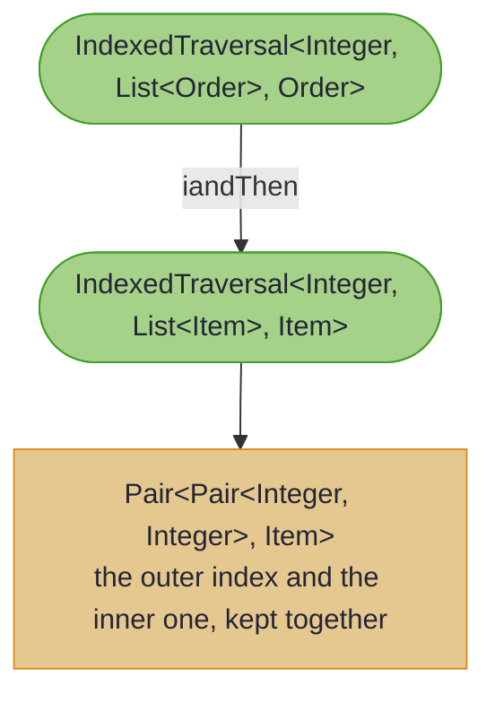

# Indexed Optics: Advanced Patterns

## _Advanced composition patterns and the Haskell heritage_

~~~admonish info title="What You'll Learn"
- How indexed optics compose: paired indices through nested structures, index-aware filtering, and bulk transformations.
- The relationship between Higher-Kinded-J's indexed optics and the canonical Haskell lens encoding, for readers coming from a functional background.
- A concise summary of the trade-offs that make indexed optics worth reaching for.
~~~

This page collects the advanced composition patterns and reference material that follow on from [Indexed Optics](indexed_optics.md). The narrative introduction, mental model, and step-by-step walkthrough live there; this page is for the deeper compositions and the cross-language background.

---

## Advanced Composition Patterns

### Composing Indexed Optics with Paired Indices

When you compose two indexed optics, the indices form a **pair** representing the path through nested structures.



Each item arrives carrying the whole path that reached it, outer index first:

| Path | Item |
|---|---|
| `(0, 0)` | `Laptop` |
| `(0, 1)` | `Mouse` |
| `(1, 0)` | `Keyboard` |
| `(1, 1)` | `Monitor` |
| `(1, 2)` | `Cable` |

<!-- verify -->
```java
import org.higherkindedj.optics.indexed.Pair;

// Nested structure: List of Orders, each with List of Items
record Order(String id, List<LineItem> items) {}

// First level: indexed traversal for orders
IndexedTraversal<Integer, List<Order>, Order> ordersIndexed =
    IndexedTraversals.forList();

// Second level: lens to items field
Lens<Order, List<LineItem>> itemsLens =
    Lens.of(Order::items, (order, items) -> new Order(order.id(), items));

// Third level: indexed traversal for items
IndexedTraversal<Integer, List<LineItem>, LineItem> itemsIndexed =
    IndexedTraversals.forList();

// Compose: orders → items field → each item with PAIRED indices
IndexedTraversal<Pair<Integer, Integer>, List<Order>, LineItem> composed =
    ordersIndexed
        .andThen(itemsLens.asTraversal())
        .iandThen(itemsIndexed);

List<Order> orders = List.of(
    new Order("ORD-1", List.of(
        new LineItem("Laptop", 1, 999.99),
        new LineItem("Mouse", 1, 24.99)
    )),
    new Order("ORD-2", List.of(
        new LineItem("Keyboard", 1, 79.99),
        new LineItem("Monitor", 1, 299.99)
    ))
);

// Access with paired indices: (order index, item index)
List<Pair<Pair<Integer, Integer>, LineItem>> all =
    IndexedTraversals.toIndexedList(composed, orders);

for (Pair<Pair<Integer, Integer>, LineItem> entry : all) {
    Pair<Integer, Integer> indices = entry.first();
    LineItem item = entry.second();
    System.out.printf("Order %d, Item %d: %s%n",
        indices.first(), indices.second(), item.productName());
}
// Output:
// Order 0, Item 0: Laptop
// Order 0, Item 1: Mouse
// Order 1, Item 0: Keyboard
// Order 1, Item 1: Monitor
```

**Use case**: Generating globally unique identifiers like "Order 3, Item 5" or "Row 2, Column 7".

---

### Index Transformation

There is no separate re-indexing combinator; transform the index inside the `imodify` function. Converting zero-based positions to one-based display numbers looks like this:

<!-- verify -->
```java
IndexedTraversal<Integer, List<LineItem>, LineItem> zeroIndexed =
    IndexedTraversals.forList();

List<LineItem> numbered = IndexedTraversals.imodify(zeroIndexed, (zeroBasedIndex, item) -> {
    int oneBasedIndex = zeroBasedIndex + 1;
    return new LineItem("Item " + oneBasedIndex + ": " + item.productName(),
                        item.quantity(), item.price());
}, items);
// productNames: ["Item 1: Laptop", "Item 2: Mouse", "Item 3: Keyboard"]
```

---

### Combining Index Filtering with Value Filtering

You can layer multiple filters for precise control.

<!-- verify -->
```java
IndexedTraversal<Integer, List<LineItem>, LineItem> itemsIndexed =
    IndexedTraversals.forList();

// Filter: even positions AND expensive items
IndexedTraversal<Integer, List<LineItem>, LineItem> targeted =
    itemsIndexed
        .filterIndex(i -> i % 2 == 0)              // Even positions only
        .filtered(item -> item.price() > 50);       // Expensive items only

List<LineItem> items = List.of(
    new LineItem("Laptop", 1, 999.99),    // Index 0, expensive ✓
    new LineItem("Pen", 1, 2.99),         // Index 1, cheap ✗
    new LineItem("Keyboard", 1, 79.99),   // Index 2, expensive ✓
    new LineItem("Mouse", 1, 24.99),      // Index 3, cheap ✗
    new LineItem("Monitor", 1, 299.99)    // Index 4, expensive ✓
);

List<Pair<Integer, LineItem>> results =
    IndexedTraversals.toIndexedList(targeted, items);
// Returns: [(0, Laptop), (2, Keyboard), (4, Monitor)]
// All at even positions AND expensive
```

---

### Audit Trail Pattern: Field Change Tracking

A powerful real-world pattern is tracking *which* fields change in your domain objects.

<!-- verify -->
```java
// Generic field audit logger
public class AuditLog {
    public record FieldChange<A>(
        String fieldName,
        A oldValue,
        A newValue,
        Instant timestamp
    ) {}

    public static <A> BiFunction<String, A, A> loggedModification(
        Function<A, A> transformation,
        List<FieldChange<?>> auditLog
    ) {
        return (fieldName, oldValue) -> {
            A newValue = transformation.apply(oldValue);

            if (!oldValue.equals(newValue)) {
                auditLog.add(new FieldChange<>(
                    fieldName,
                    oldValue,
                    newValue,
                    Instant.now()
                ));
            }

            return newValue;
        };
    }
}

// Usage with indexed lens
IndexedLens<String, Customer, String> emailLens = IndexedLens.of(
    "email",
    Customer::email,
    (c, email) -> new Customer(c.name(), email)
);

List<AuditLog.FieldChange<?>> audit = new ArrayList<>();

Customer customer = new Customer("Alice", "alice@old.com");

Customer updated = emailLens.imodify(
    AuditLog.loggedModification(
        email -> "alice@new.com",
        audit
    ),
    customer
);

// Check audit log
for (AuditLog.FieldChange<?> change : audit) {
    System.out.printf("Field '%s' changed from %s to %s at %s%n",
        change.fieldName(),
        change.oldValue(),
        change.newValue(),
        change.timestamp()
    );
}
// Output: Field 'email' changed from alice@old.com to alice@new.com at 2025-01-15T10:30:00Z
```

---

### Debugging Pattern: Path Tracking in Nested Updates

When debugging complex nested updates, indexed optics reveal the complete path to each modification.

<!-- verify -->
```java
// Nested structure with multiple levels
record Item(String name, double price) {}
record Order(List<Item> items) {}
record Buyer(String name, List<Order> orders) {}

// Build an indexed path through the structure
IndexedTraversal<Integer, List<Buyer>, Buyer> buyersIdx =
    IndexedTraversals.forList();

Lens<Buyer, List<Order>> ordersLens =
    Lens.of(Buyer::orders, (b, o) -> new Buyer(b.name(), o));

IndexedTraversal<Integer, List<Order>, Order> ordersIdx =
    IndexedTraversals.forList();

Lens<Order, List<Item>> itemsLens =
    Lens.of(Order::items, (order, items) -> new Order(items));

IndexedTraversal<Integer, List<Item>, Item> itemsIdx =
    IndexedTraversals.forList();

Lens<Item, Double> priceLens =
    Lens.of(Item::price, (item, price) -> new Item(item.name(), price));

// Compose the full indexed path
IndexedTraversal<Pair<Pair<Integer, Integer>, Integer>, List<Buyer>, Double> fullPath =
    buyersIdx
        .andThen(ordersLens.asTraversal())
        .iandThen(ordersIdx)
        .andThen(itemsLens.asTraversal())
        .iandThen(itemsIdx)
        .andThen(priceLens.asTraversal());

List<Buyer> buyers = List.of(/* ... */);

// Modify with full path visibility
List<Buyer> updated = IndexedTraversals.imodify(fullPath,
    (indices, price) -> {
        int buyerIdx = indices.first().first();
        int orderIdx = indices.first().second();
        int itemIdx = indices.second();

        System.out.printf(
            "Updating price at [buyer=%d, order=%d, item=%d]: %.2f -> %.2f%n",
            buyerIdx, orderIdx, itemIdx, price, price * 1.1
        );

        return price * 1.1;  // 10% increase
    },
    buyers
);
// Output shows complete path to every modified price:
// Updating price at [buyer=0, order=0, item=0]: 999.99 -> 1099.99
// Updating price at [buyer=0, order=0, item=1]: 24.99 -> 27.49
// Updating price at [buyer=0, order=1, item=0]: 79.99 -> 87.99
// ...
```

---

### Working with Pair Utilities

The `Pair<A, B>` type provides utility methods for manipulation.

<!-- verify -->
```java
import org.higherkindedj.optics.indexed.Pair;

Pair<Integer, String> pair = new Pair<>(1, "Hello");

// Access components
int first = pair.first();       // 1
String second = pair.second();  // "Hello"

// Transform components
Pair<Integer, String> modified = pair.withSecond("World");
// Result: Pair(1, "World")

Pair<String, String> transformed = pair.withFirst("One");
// Result: Pair("One", "Hello")

// Swap
Pair<String, Integer> swapped = pair.swap();
// Result: Pair("Hello", 1)

// Factory method
Pair<String, Integer> created = Pair.of("Key", 42);
```

For converting to/from `Tuple2` (when working with hkj-core utilities):

<!-- verify -->
```java
import org.higherkindedj.hkt.tuple.Tuple2;
import org.higherkindedj.optics.util.IndexedTraversals;

Pair<String, Integer> pair = Pair.of("key", 100);

// Convert to Tuple2
Tuple2<String, Integer> tuple = IndexedTraversals.pairToTuple2(pair);

// Convert back to Pair
Pair<String, Integer> converted = IndexedTraversals.tuple2ToPair(tuple);
```

---

### Real-World Example: Order Fulfilment Dashboard

Here's a comprehensive example demonstrating indexed optics in a business context.

<!-- verify -->
```java
package org.higherkindedj.example.optics;

import java.time.Instant;
import java.util.*;
import org.higherkindedj.optics.indexed.*;
import org.higherkindedj.optics.util.IndexedTraversals;

public class OrderFulfilmentDashboard {

    public record LineItem(String productName, int quantity, double price) {}

    public record Order(
        String orderId,
        List<LineItem> items,
        Map<String, String> metadata
    ) {}

    private static Map<String, String> metadataInOrder() {
        Map<String, String> metadata = new LinkedHashMap<>();
        metadata.put("priority", "express");
        metadata.put("gift-wrap", "true");
        metadata.put("delivery-note", "Leave at door");
        return metadata;
    }

    public static void main(String[] args) {
        Order order = new Order(
            "ORD-12345",
            List.of(
                new LineItem("Laptop", 1, 999.99),
                new LineItem("Mouse", 2, 24.99),
                new LineItem("Keyboard", 1, 79.99),
                new LineItem("Monitor", 1, 299.99)
            ),
            // Insertion order matters for the output below, so put() in order:
            // wrapping Map.of would inherit its randomised iteration order.
            metadataInOrder()
        );

        System.out.println("=== ORDER FULFILMENT DASHBOARD ===\n");

        // --- Task 1: Generate Packing Slip ---
        System.out.println("--- Packing Slip ---");
        generatePackingSlip(order);

        // --- Task 2: Apply Position-Based Discounts ---
        System.out.println("\n--- Position-Based Discounts ---");
        Order discounted = applyPositionDiscounts(order);
        System.out.printf("Original total: £%.2f%n", calculateTotal(order));
        System.out.printf("Discounted total: £%.2f%n", calculateTotal(discounted));

        // --- Task 3: Process Metadata with Key Awareness ---
        System.out.println("\n--- Metadata Processing ---");
        processMetadata(order);

        // --- Task 4: Identify High-Value Positions ---
        System.out.println("\n--- High-Value Items ---");
        identifyHighValuePositions(order);

        System.out.println("\n=== END OF DASHBOARD ===");
    }

    private static void generatePackingSlip(Order order) {
        IndexedTraversal<Integer, List<LineItem>, LineItem> itemsIndexed =
            IndexedTraversals.forList();

        List<Pair<Integer, LineItem>> indexedItems =
            IndexedTraversals.toIndexedList(itemsIndexed, order.items());

        System.out.println("Order: " + order.orderId());
        for (Pair<Integer, LineItem> pair : indexedItems) {
            int position = pair.first() + 1;  // 1-based for display
            LineItem item = pair.second();
            System.out.printf("  Item %d: %s (Qty: %d) - £%.2f%n",
                position,
                item.productName(),
                item.quantity(),
                item.price() * item.quantity()
            );
        }
    }

    private static Order applyPositionDiscounts(Order order) {
        IndexedTraversal<Integer, List<LineItem>, LineItem> itemsIndexed =
            IndexedTraversals.forList();

        // Every 3rd item gets 15% off (positions 2, 5, 8...)
        List<LineItem> discounted = IndexedTraversals.imodify(
            itemsIndexed,
            (index, item) -> {
                if ((index + 1) % 3 == 0) {
                    double newPrice = item.price() * 0.85;
                    System.out.printf("  Position %d (%s): £%.2f → £%.2f (15%% off)%n",
                        index + 1, item.productName(), item.price(), newPrice);
                    return new LineItem(item.productName(), item.quantity(), newPrice);
                }
                return item;
            },
            order.items()
        );

        return new Order(order.orderId(), discounted, order.metadata());
    }

    private static void processMetadata(Order order) {
        IndexedTraversal<String, Map<String, String>, String> metadataIndexed =
            IndexedTraversals.forMap();

        IndexedFold<String, Map<String, String>, String> fold =
            metadataIndexed.asIndexedFold();

        List<Pair<String, String>> entries = fold.toIndexedList(order.metadata());

        for (Pair<String, String> entry : entries) {
            String key = entry.first();
            String value = entry.second();

            // Process based on key
            switch (key) {
                case "priority" ->
                    System.out.println("  Shipping priority: " + value.toUpperCase());
                case "gift-wrap" ->
                    System.out.println("  Gift wrapping: " +
                        (value.equals("true") ? "Required" : "Not required"));
                case "delivery-note" ->
                    System.out.println("  Special instructions: " + value);
                default ->
                    System.out.println("  " + key + ": " + value);
            }
        }
    }

    private static void identifyHighValuePositions(Order order) {
        IndexedTraversal<Integer, List<LineItem>, LineItem> itemsIndexed =
            IndexedTraversals.forList();

        // Filter to items over £100
        IndexedTraversal<Integer, List<LineItem>, LineItem> highValue =
            itemsIndexed.filteredWithIndex((index, item) -> item.price() > 100);

        List<Pair<Integer, LineItem>> expensive =
            IndexedTraversals.toIndexedList(highValue, order.items());

        System.out.println("  Items over £100 (require special handling):");
        for (Pair<Integer, LineItem> pair : expensive) {
            System.out.printf("    Position %d: %s (£%.2f)%n",
                pair.first() + 1,
                pair.second().productName(),
                pair.second().price()
            );
        }
    }

    private static double calculateTotal(Order order) {
        return order.items().stream()
            .mapToDouble(item -> item.price() * item.quantity())
            .sum();
    }
}
```

**Expected Output:**

```
=== ORDER FULFILMENT DASHBOARD ===

--- Packing Slip ---
Order: ORD-12345
  Item 1: Laptop (Qty: 1) - £999.99
  Item 2: Mouse (Qty: 2) - £49.98
  Item 3: Keyboard (Qty: 1) - £79.99
  Item 4: Monitor (Qty: 1) - £299.99

--- Position-Based Discounts ---
  Position 3 (Keyboard): £79.99 → £67.99 (15% off)
Original total: £1429.95
Discounted total: £1417.95

--- Metadata Processing ---
  Shipping priority: EXPRESS
  Gift wrapping: Required
  Special instructions: Leave at door

--- High-Value Items ---
  Items over £100 (require special handling):
    Position 1: Laptop (£999.99)
    Position 4: Monitor (£299.99)

=== END OF DASHBOARD ===
```

---

## The Relationship to Haskell's Lens Library

For those familiar with functional programming, Higher-Kinded-J's indexed optics are inspired by Haskell's [lens library](https://hackage.haskell.org/package/lens), specifically indexed traversals and indexed folds.

In Haskell:
```haskell
itraversed :: IndexedTraversal Int ([] a) a
```

This creates an indexed traversal over lists where the index is an integer: exactly what our `IndexedTraversals.forList()` provides.

**Key differences:**
- Higher-Kinded-J uses explicit `Applicative` instances rather than implicit type class resolution
- Java's type system requires explicit `Pair<I, A>` for index-value pairs
- The `imodify` and `iget` methods provide a more Java-friendly API
- Map-based traversals (`forMap`) are a practical extension for Java's collection library

---

## Summary: The Power of Indexed Optics

Indexed optics bring **position awareness** into your functional data transformations:

* **IndexedTraversal\<I, S, A>**: Bulk operations with index tracking
* **IndexedFold\<I, S, A>**: Read-only queries with position information
* **IndexedLens\<I, S, A>**: Single-field access with field name tracking

These tools transform how you work with collections and records:

| Before (Manual Index Tracking) | After (Declarative Indexed Optics) |
|-------------------------------|-----------------------------------|
| Manual loop counters | Built-in index access |
| AtomicInteger for streams | Type-safe `imodify` |
| Breaking into Map.entrySet() | Direct key-value processing |
| Complex audit logging logic | Field tracking with `IndexedLens` |
| Scattered position logic | Composable indexed transformations |

~~~admonish info title="Key Takeaways"
* **`iandThen` pairs the indices**: composing indexed traversals yields `Pair<I, J>` paths, so "customer 0, order 1, item 2" is a value, not a log line
* **Transform indices inside `imodify`**: there is no separate re-indexing combinator, and none is needed
* **Layered filters compose**: `filterIndex` for position, `filtered` for value, `filteredWithIndex` for both at once
* **`IndexedLens` powers audit trails**: the field name arrives with the old value, so change logging needs no reflection
* **`Pair` is a first-class utility**: `withFirst`/`withSecond`/`swap`, plus `pairToTuple2`/`tuple2ToPair` to bridge into hkj-core
~~~

~~~admonish tip title="See Also"
- [Indexed Optics](indexed_optics.md): the basics this page builds on
- [Position-Aware Traversals with ForIndexed](../functional/for_optics.md#position-aware-traversals-with-forindexed): comprehension-style position-aware filtering, modifying, and collecting
- [Indexed Access](indexed_access.md): At and Ixed for single-key operations
~~~

~~~admonish tip title="Further Reading"
- **Haskell**: [Lens Tutorial: Indexed Optics](https://hackage.haskell.org/package/lens-tutorial-1.0.4/docs/Control-Lens-Tutorial.html): original inspiration
- **Chris Penner**: [Optics By Example](https://leanpub.com/optics-by-example): chapter on indexed optics
- **Scala**: [Monocle](https://www.optics.dev/Monocle/): similar indexed optics for Scala
~~~

---

**Previous:** [Indexed Optics](indexed_optics.md)
**Next:** [Each Typeclass](each_typeclass.md)
