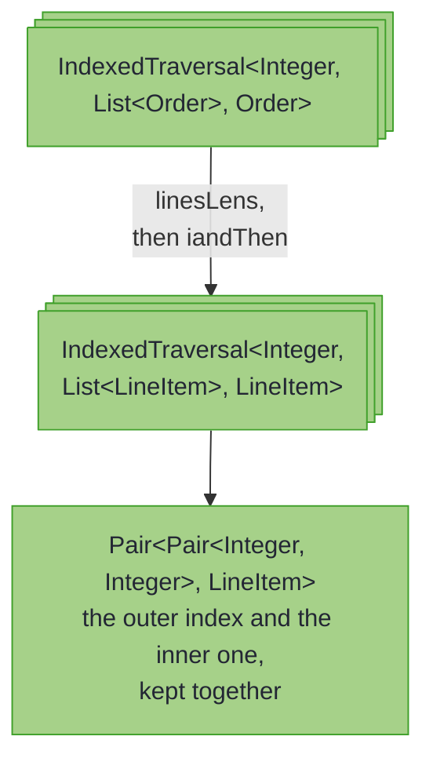

# Indexed Optics: Advanced Patterns

_Compose indexed optics through nested lists so every value arrives with the full path that reached it._

~~~admonish info title="What You'll Learn"
- Compose indexed traversals with `iandThen`, and log the full index path to each value a nested update changes
- Turn zero-based positions into display numbers inside `imodify`, with no re-indexing combinator
- Narrow by position, value or both by layering `filterIndex`, `filtered` and `filteredWithIndex`
- Write an audit trail that records each changed field's name and old value with an `IndexedLens`
~~~

This page collects the advanced composition patterns and reference material that follow on from [Indexed Optics](indexed_optics.md). The narrative introduction, mental model, and step-by-step walkthrough live there; this page is for the deeper compositions and the cross-language background.

---

## Advanced Composition Patterns

### Composing Indexed Optics with Paired Indices

When you compose two indexed optics, the indices form a **pair** representing the path through nested structures.


```mermaid
flowchart TD
    accTitle: Two indexed traversals composed
    accDescr: An indexed traversal over a list of orders, composed through each order's lines lens and then with iandThen onto an indexed traversal over a list of line items, focuses each LineItem paired with a Pair of the outer index and the inner one.
    A@{ shape: st-rect, label: "IndexedTraversal&lt;Integer, List&lt;Order&gt;, Order&gt;" }
    B@{ shape: st-rect, label: "IndexedTraversal&lt;Integer,<br/>List&lt;LineItem&gt;, LineItem&gt;" }
    R["Pair&lt;Pair&lt;Integer, Integer&gt;, LineItem&gt;<br/>the outer index and the inner one,<br/>kept together"]
    A -->|"linesLens,<br/>then iandThen"| B --> R

    classDef rw fill:#a6d189,stroke:#40a02b,color:#232634
    classDef out fill:#a6d189,stroke:#40a02b,color:#232634
    class A,B rw
    class R out
```

Each item arrives carrying the whole path that reached it, outer index first:

| Path | Item |
|---|---|
| `(0, 0)` | `LAPTOP` |
| `(0, 1)` | `MOUSE` |
| `(1, 0)` | `KEYBOARD` |
| `(1, 1)` | `MONITOR` |
| `(1, 2)` | `CABLE` |

``` java
{{#include ../../../hkj-examples/src/main/java/org/higherkindedj/example/book/optics/indexed/IndexedAdvancedBook.java:paired_indices}}
```

**Use case**: Generating globally unique identifiers like "Order 3, Item 5" or "Row 2, Column 7".

---

### Index Transformation

There is no separate re-indexing combinator; transform the index inside the `imodify` function. Converting zero-based positions to one-based display numbers looks like this:

``` java
{{#include ../../../hkj-examples/src/main/java/org/higherkindedj/example/book/optics/indexed/IndexedAdvancedBook.java:index_transformation}}
```

---

### Combining Index Filtering with Value Filtering

You can layer multiple filters for precise control.

``` java
{{#include ../../../hkj-examples/src/main/java/org/higherkindedj/example/book/optics/indexed/IndexedAdvancedBook.java:layered_filters}}
```

---

### Audit Trail Pattern: Field Change Tracking

A powerful real-world pattern is tracking *which* fields change in your domain objects. A small logger wraps a change so that it records the field's name, both values and the moment:

``` java
{{#include ../../../hkj-examples/src/main/java/org/higherkindedj/example/book/optics/indexed/IndexedAdvancedBook.java:audit_log}}
```

An indexed lens hands the logger the field's name with each change:

``` java
{{#include ../../../hkj-examples/src/main/java/org/higherkindedj/example/book/optics/indexed/IndexedAdvancedBook.java:audit_usage}}
```

---

### Debugging Pattern: Path Tracking in Nested Updates

When debugging complex nested updates, indexed optics reveal the complete path to each modification.

``` java
{{#include ../../../hkj-examples/src/main/java/org/higherkindedj/example/book/optics/indexed/IndexedAdvancedBook.java:path_tracking}}
```

---

### Working with Pair Utilities

The `Pair<A, B>` type provides utility methods for manipulation. Import `org.higherkindedj.optics.indexed.Pair`, the one indexed optics hand back: `org.higherkindedj.hkt.Pair` has no `withFirst`, `withSecond` or `swap`.

``` java
{{#include ../../../hkj-examples/src/main/java/org/higherkindedj/example/book/optics/indexed/IndexedAdvancedBook.java:pair_utilities}}
```

For converting to/from `Tuple2` (when working with hkj-core utilities):

<!-- verify -->
```java
import org.higherkindedj.hkt.tuple.Tuple2;
import org.higherkindedj.optics.util.IndexedTraversals;

Pair<String, Integer> pair = Pair.of("key", 100);

// Convert to Tuple2
Tuple2<String, Integer> tuple = IndexedTraversals.pairToTuple2(pair);

// Convert back to Pair
Pair<String, Integer> converted = IndexedTraversals.tuple2ToPair(tuple);
```

---

### Real-World Example: Order Fulfilment Dashboard

Here's a comprehensive example demonstrating indexed optics in a business context.

``` java
{{#include ../../../hkj-examples/src/main/java/org/higherkindedj/example/book/optics/indexed/OrderFulfilmentDashboard.java:imports}}

{{#include ../../../hkj-examples/src/main/java/org/higherkindedj/example/book/optics/indexed/OrderFulfilmentDashboard.java:dashboard}}
```

**Expected Output:**

```
{{#include ../../../hkj-examples/src/test/resources/golden/optics-indexed-dashboard-output.txt.golden}}
```

---

## The Relationship to Haskell's Lens Library

For those familiar with functional programming, Higher-Kinded-J's indexed optics are inspired by Haskell's [lens library](https://hackage.haskell.org/package/lens), specifically indexed traversals and indexed folds.

In Haskell:
```haskell
itraversed :: IndexedTraversal Int ([] a) a
```

This creates an indexed traversal over lists where the index is an integer: exactly what our `IndexedTraversals.forList()` provides.

**Key differences:**
- Higher-Kinded-J uses explicit `Applicative` instances rather than implicit type class resolution
- Java's type system requires explicit `Pair<I, A>` for index-value pairs
- The `imodify` and `iget` methods provide a more Java-friendly API
- Map-based traversals (`forMap`) are a practical extension for Java's collection library

---

## Before and after {#summary-the-power-of-indexed-optics}

What each manual pattern becomes with indexed optics:

| Before (Manual Index Tracking) | After (Declarative Indexed Optics) |
|-------------------------------|-----------------------------------|
| Manual loop counters | Built-in index access |
| AtomicInteger for streams | Type-safe `imodify` |
| Breaking into Map.entrySet() | Direct key-value processing |
| Complex audit logging logic | Field tracking with `IndexedLens` |
| Scattered position logic | Composable indexed transformations |

~~~admonish info title="Key Takeaways"
* **`iandThen` pairs the indices**: composing indexed traversals yields `Pair<I, J>` paths, so "history 0, order 1, item 2" is a value, not a log line
* **Transform indices inside `imodify`**: there is no separate re-indexing combinator, and none is needed
* **Layered filters compose**: `filterIndex` for position, `filtered` for value, `filteredWithIndex` for both at once
* **`IndexedLens` powers audit trails**: the field name arrives with the old value, so change logging needs no reflection
* **`Pair` is a first-class utility**: `withFirst`/`withSecond`/`swap`, plus `pairToTuple2`/`tuple2ToPair` to bridge into hkj-core
~~~

~~~admonish tip title="See Also"
- [Indexed Optics](indexed_optics.md): the basics this page builds on
- [Position-Aware Traversals with ForIndexed](../functional/for_optics.md#position-aware-traversals-with-forindexed): comprehension-style position-aware filtering, modifying, and collecting
- [Indexed Access](indexed_access.md): At and Ixed for single-key operations
~~~

~~~admonish tip title="Further Reading"
- **Haskell**: [Lens Tutorial: Indexed Optics](https://hackage.haskell.org/package/lens-tutorial-1.0.4/docs/Control-Lens-Tutorial.html): original inspiration
- **Chris Penner**: [Optics By Example](https://leanpub.com/optics-by-example): chapter on indexed optics
- **Scala**: [Monocle](https://www.optics.dev/Monocle/): similar indexed optics for Scala
~~~

---

**Previous:** [Indexed Optics](indexed_optics.md)
**Next:** [Each Type Class](each_typeclass.md)
