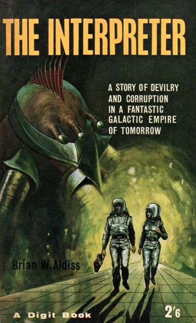

# Optic Interpreters: Multiple Execution Strategies

## _One Program, Several Answers_



~~~admonish info title="What You'll Learn"
- How the Interpreter pattern separates description from execution
- The three built-in interpreters: Direct, Logging, and Validation
- When to use each interpreter effectively
- How to create custom interpreters for specific needs
- Combining interpreters for powerful workflows
- Real-world applications: audit trails, testing, and optimisation
~~~

~~~admonish example title="See Example Code"
[OpticInterpretersExample](https://github.com/higher-kinded-j/higher-kinded-j/blob/main/hkj-examples/src/main/java/org/higherkindedj/example/optics/fluent/OpticInterpretersExample.java)
~~~

## Introduction: The Power of Interpretation

In the [Free Monad DSL](free_monad_dsl.md) guide, we learnt how to build optic operations as programs: data structures that describe what to do, rather than doing it immediately. But a description alone is useless without execution. That's where **interpreters** come in.

An interpreter takes a program and executes it in a specific way. By providing different interpreters, you can run the same program with completely different behaviours:

- **DirectOpticInterpreter**: Executes operations immediately (production use)
- **LoggingOpticInterpreter**: Records every operation for audit trails
- **ValidationOpticInterpreter**: runs the program and reports problems instead of the result
- **Custom interpreters**: Performance profiling, testing, mocking, and more

This separation of concerns, *what to do* vs *how to do it*, is the essence of the Interpreter pattern and the key to the Free monad's flexibility.

~~~admonish tip title="Why this matters"
Write your business logic once as a program. Execute it in multiple ways: validate it in tests, log it in production, mock it during development, and optimise it for performance, all without changing the business logic itself.
~~~

---

## Part 1: The Interpreter Pattern Explained

### From Design Patterns to Functional Programming

The Interpreter pattern, described in the Gang of Four's *Design Patterns*, suggests representing operations as objects in an abstract syntax tree (AST), then traversing that tree to execute them. The Free monad is essentially a functional programming implementation of this pattern.

```java
// Our "AST" - a program built from operations
Free<OpticOpKind.Witness, Person> program =
    OpticPrograms.get(person, PersonLenses.age())
        .flatMap(age ->
            OpticPrograms.modify(person, PersonLenses.age(), a -> a + 1)
        );

// Our "interpreter" - executes the AST
DirectOpticInterpreter interpreter = OpticInterpreters.direct();
Person result = interpreter.run(program);
```

### Why Multiple Interpreters?

Different situations require different execution strategies:

| **Situation** | **Interpreter** | **Why** |
|--------------|----------------|---------|
| Production execution | Direct | Fast, straightforward |
| Compliance & auditing | Logging | Records every change |
| Pre-flight checks | Validation | Runs it and reports what failed |
| Unit testing | Mock/Custom | No real data needed |
| Performance tuning | Profiling/Custom | Measures execution time |
| Structural analysis | `ProgramAnalyser` | Counts the steps, executes none |

---

## Part 2: The Direct Interpreter

The `DirectOpticInterpreter` is the simplest interpreter: it executes optic operations immediately, exactly as you'd expect.

### Basic Usage

```java
@GenerateLenses
public record Person(String name, int age) {}

Person person = new Person("Alice", 25);

// Build a program
Free<OpticOpKind.Witness, Person> program =
    OpticPrograms.modify(person, PersonLenses.age(), age -> age + 1);

// Execute with direct interpreter
DirectOpticInterpreter interpreter = OpticInterpreters.direct();
Person result = interpreter.run(program);

System.out.println(result);  // Person[name=Alice, age=26]
```

### When to Use

**Production execution**: When you just want to run the operations
**Simple workflows**: When audit trails or validation aren't needed
**Performance-critical paths**: Minimal overhead

### Characteristics

- **Fastest of the three**: no log, no validation pass. Still slower than calling the optic directly, because a program is allocated and folded
- **Simple**: Executes exactly as described
- **No side effects of its own**: the interpreter adds none, though your modifiers may have their own

~~~admonish example title="Production Workflow"
```java
@GenerateLenses
record Employee(String name, int salary, String status) {}

enum PerformanceRating { EXCELLENT, GOOD, SATISFACTORY, POOR }

// Employee management system
public Employee processAnnualReview(
    Employee employee,
    PerformanceRating rating
) {
    Free<OpticOpKind.Witness, Employee> program =
        buildReviewProgram(employee, rating);

    // Direct execution in production
    return OpticInterpreters.direct().run(program);
}
```
~~~

---

## Part 3: The Logging Interpreter

The `LoggingOpticInterpreter` executes operations whilst recording detailed logs of every operation performed. This is invaluable for:

- **Audit trails**: Compliance requirements (GDPR, SOX, etc.)
- **Debugging**: Understanding what happened when
- **Monitoring**: Tracking data changes in production

### Basic Usage

```java
@GenerateLenses
public record Account(String accountId, BigDecimal balance) {}

Account account = new Account("ACC001", new BigDecimal("1000.00"));

// Build a program
Free<OpticOpKind.Witness, Account> program =
    OpticPrograms.modify(
        account,
        AccountLenses.balance(),
        balance -> balance.subtract(new BigDecimal("100.00"))
    );

// Execute with logging
LoggingOpticInterpreter logger = OpticInterpreters.logging();
Account result = logger.run(program);

// Review the log
List<String> log = logger.getLog();
log.forEach(System.out::println);
/* Output:
MODIFY: Lens$7 from 1000.00 to 900.00
*/
```

### Comprehensive Example: Financial Transaction Audit

```java
@GenerateLenses
public record Transaction(
    String txnId,
    Account from,
    Account to,
    BigDecimal amount,
    LocalDateTime timestamp
) {}

// Build a transfer program
Free<OpticOpKind.Witness, Transaction> transferProgram(Transaction txn) {
    return OpticPrograms.get(txn, TransactionLenses.amount())
        .flatMap(amount ->
            // Debit source account
            OpticPrograms.modify(
                txn,
                TransactionLenses.from().andThen(AccountLenses.balance()),
                balance -> balance.subtract(amount)
            )
        )
        .flatMap(debited ->
            // Credit destination account
            OpticPrograms.modify(
                debited,
                TransactionLenses.to().andThen(AccountLenses.balance()),
                balance -> balance.add(debited.amount())
            )
        );
}

// Execute with audit logging
Transaction txn = new Transaction(
    "TXN-12345",
    new Account("ACC001", new BigDecimal("1000.00")),
    new Account("ACC002", new BigDecimal("500.00")),
    new BigDecimal("250.00"),
    LocalDateTime.now()
);

LoggingOpticInterpreter logger = OpticInterpreters.logging();
Transaction result = logger.run(transferProgram(txn));

// Persist audit trail to database
logger.getLog().forEach(entry -> auditService.record(txn.txnId(), entry));
```

### Log Format

The logging interpreter provides detailed, human-readable logs:

```text
GET: OpticPrograms$$Lambda/0x... -> 250.00
MODIFY: Lens$3 from 1000.00 to 750.00
MODIFY: Lens$3 from 500.00 to 750.00
```

~~~admonish warning title="The log names optics by runtime class, not by accessor"
`LoggingOpticInterpreter` identifies an optic with `getClass().getSimpleName()`. Generated and composed optics are anonymous classes, so what you actually see is `Lens$N`, and a `get` is wrapped in a `Getter` first, so it shows as an `OpticPrograms` lambda. The log tells you which **operation** ran and what changed, not which named accessor was used. For meaningful names, label the path (`segments()`/`pathString()`) or write an interpreter that carries the label.
~~~

### Managing Logs

```java
LoggingOpticInterpreter logger = OpticInterpreters.logging();

// getLog() is a LIVE unmodifiable view over the interpreter's list, not a
// snapshot: copy it if it must survive clearLog().
logger.run(program1);
List<String> firstLog = List.copyOf(logger.getLog());

logger.clearLog();

logger.run(program2);
List<String> secondLog = List.copyOf(logger.getLog());
```

~~~admonish warning title="Performance Consideration"
The logging interpreter does add overhead (string formatting, list management). For high-frequency operations, consider:
- Using sampling (log every Nth transaction)
- Async logging (log to queue, process later)
- Conditional logging (only for high-value transactions)
~~~

---

## Part 4: The Validation Interpreter

The `ValidationOpticInterpreter` runs your program and hands back the problems it met instead of the value it produced.

~~~admonish warning title="It executes: this is a checked run, not a dry run"
The name suggests inspection, but `validate` **executes** every operation, by design: the library's own javadoc says operations are run so `flatMap` chaining produces the right values. A `modify` modifier is applied twice, once when checking it and once when performing it. Use it for pure modifiers over immutable data; do not use it to preview anything with a side effect.

For inspection that genuinely runs nothing, `ProgramAnalyser.analyse(program)` walks the `Free` tree structurally.
~~~

It suits:

- **Pre-flight checks**: Validate before committing
- **Testing**: check that a program's operations all succeed on given data
- **Pre-flight checks**: collect every problem before you accept the result

### Basic Usage

```java
@GenerateLenses
public record Person(String name, int age) {}

Person person = new Person("Alice", 25);

// Build a program
Free<OpticOpKind.Witness, Person> program =
    OpticPrograms.set(person, PersonLenses.name(), null);  // Oops!

// Run it, and take the report rather than the value
ValidationOpticInterpreter validator = OpticInterpreters.validating();
ValidationOpticInterpreter.ValidationResult result = validator.validate(program);

if (!result.isValid()) {
    // Has errors
    result.errors().forEach(System.err::println);
}

if (result.hasWarnings()) {
    // Has warnings
    result.warnings().forEach(System.out::println);
    // Output: "SET operation with null value: org.higherkindedj.optics.Lens$7@31befd9f"
// The optic is identified by toString(), so the message names the operation, not the field.
}
```

### Validation Rules

The validation interpreter checks for:

1. **Null values**: warns when a `set` would write `null`
2. **Modifier failures**: records an error when a modifier function throws

A `modify` whose modifier returns `null` produces a *warning*; a modifier that throws produces an error, and for a `modify` that error is recorded twice, once from the check and once from the execution.

~~~admonish warning title="Only modifier failures are caught"
The interpreter wraps the function you pass to `set`, `modify` and their `All` variants. A throw from inside a `flatMap` *continuation* runs outside that guard and propagates out of `validate`, so a loop that expects to collect failures will die on the first one instead. Put the check in a modifier if you want it reported rather than thrown.
~~~

Anything beyond those two belongs in an interpreter of your own. `ValidationOpticInterpreter`
is `final`, so there is nothing to subclass; see [Creating Custom Interpreters](#part-5-creating-custom-interpreters).

### Real-World Example: Data Migration Validation

```java
@GenerateLenses
public record UserV1(String username, String email, Integer age) {}

@GenerateLenses
public record UserV2(
    String username,
    String email,
    int age,  // Now non-null!
    boolean verified
) {}

// Migration program
Free<OpticOpKind.Witness, UserV2> migrateUser(UserV1 oldUser) {
    return OpticPrograms.get(oldUser, UserV1Lenses.age())
        .flatMap(age -> {
            if (age == null) {
                // This would fail!
                throw new IllegalArgumentException("Age cannot be null in V2");
            }

            UserV2 newUser = new UserV2(
                oldUser.username(),
                oldUser.email(),
                age,
                false
            );

            return OpticPrograms.pure(newUser);
        });
}

// Validate migration for each user
List<UserV1> oldUsers = loadOldUsers();
List<ValidationResult> validations = new ArrayList<>();

for (UserV1 user : oldUsers) {
    Free<OpticOpKind.Witness, UserV2> program = migrateUser(user);

    ValidationOpticInterpreter validator = OpticInterpreters.validating();
    ValidationResult validation = validator.validate(program);

    validations.add(validation);

    if (!validation.isValid()) {
        System.err.println("User " + user.username() + " failed validation:");
        validation.errors().forEach(System.err::println);
    }
}

// Only proceed if all valid
if (validations.stream().allMatch(ValidationResult::isValid)) {
    // Execute migrations with direct interpreter
    oldUsers.forEach(user -> {
        Free<OpticOpKind.Witness, UserV2> program = migrateUser(user);
        UserV2 migrated = OpticInterpreters.direct().run(program);
        saveNewUser(migrated);
    });
}
```

### Validation Result API

```java
// Simple exception for validation failures
class ValidationException extends RuntimeException {
    public ValidationException(String message) {
        super(message);
    }
    public ValidationException(List<String> errors) {
        super("Validation failed: " + String.join(", ", errors));
    }
}

// Simple exception for business logic failures
class BusinessException extends RuntimeException {
    public BusinessException(String message, Throwable cause) {
        super(message, cause);
    }
}

public record ValidationResult(
    List<String> errors,    // Blocking issues
    List<String> warnings   // Non-blocking concerns
) {
    public boolean isValid() {
        return errors.isEmpty();
    }

    public boolean hasWarnings() {
        return !warnings.isEmpty();
    }
}
```

~~~admonish tip title="Testing Tip"
Use the validation interpreter in unit tests to assert that a program's operations all succeed against given data:

```java
@Test
void testProgramLogic() {
    Free<OpticOpKind.Witness, Person> program =
        buildComplexProgram(testData);

    ValidationOpticInterpreter validator = OpticInterpreters.validating();
    ValidationResult result = validator.validate(program);

    // Verify no errors in logic
    assertTrue(result.isValid());
}
```
~~~

---

## Part 5: Creating Custom Interpreters

You can create custom interpreters for specific needs: performance profiling, mocking, optimisation, or any other execution strategy.

### What an interpreter actually is

There is no `OpticInterpreter` interface to implement. `DirectOpticInterpreter`,
`LoggingOpticInterpreter` and `ValidationOpticInterpreter` are three independent
`final` classes, and they deliberately do not share a supertype: the first two expose
`run`, while `validating()` exposes `validate`, because it never executes anything.

What they have in common is the shape inside them. Each supplies a natural
transformation, a function taking one `OpticOp` to a value in some effect type, and
folds it over the whole program:

```java
// One OpticOp in, one effect out. foldMap walks the program applying it.
Function<Kind<OpticOpKind.Witness, ?>, Kind<IdKind.Witness, ?>> transform = op -> ...;
```

Your own interpreter is a class that does the same. It does not extend or implement
anything from the library.

### Example 1: Performance Profiling Interpreter

```java
public final class ProfilingOpticInterpreter {
    private final Map<String, Long> executionTimes = new HashMap<>();
    private final Map<String, Integer> executionCounts = new HashMap<>();

    public <A> A run(Free<OpticOpKind.Witness, A> program) {
        Function<Kind<OpticOpKind.Witness, ?>, Kind<IdKind.Witness, ?>> transform =
            kind -> {
                OpticOp<?, ?> op = OpticOpKindHelper.OP.narrow(
                    (Kind<OpticOpKind.Witness, Object>) kind
                );

                String opName = getOperationName(op);
                long startTime = System.nanoTime();

                // Execute the operation
                Object result = executeOperation(op);

                long endTime = System.nanoTime();
                long duration = endTime - startTime;

                // Record metrics
                executionTimes.merge(opName, duration, Long::sum);
                executionCounts.merge(opName, 1, Integer::sum);

                return Id.of(Free.pure(result));   // the fold expects the next Free node, not the bare value
            };

        Kind<IdKind.Witness, A> resultKind =
            program.foldMap(transform, Instances.monad(id()));
        return IdKindHelper.ID.narrow(resultKind).value();
    }

    public Map<String, Long> getAverageExecutionTimes() {
        Map<String, Long> averages = new HashMap<>();
        executionTimes.forEach((op, totalTime) -> {
            int count = executionCounts.get(op);
            averages.put(op, totalTime / count);
        });
        return averages;
    }

    private String getOperationName(OpticOp<?, ?> op) {
        return switch (op) {
            case OpticOp.Get<?, ?> get -> "GET: " + get.optic().getClass().getSimpleName();
            case OpticOp.Set<?, ?> set -> "SET: " + set.optic().getClass().getSimpleName();
            case OpticOp.Modify<?, ?> mod -> "MODIFY: " + mod.optic().getClass().getSimpleName();
            // ... other cases
            default -> "UNKNOWN";
        };
    }

    // Each mention of a wildcard pattern variable is a FRESH capture, so
    // op.optic() and op.source() would not agree in a single expression.
    // Dispatch to a generic helper, which is what every library interpreter does.
    private Object executeOperation(OpticOp<?, ?> op) {
        return switch (op) {
            case OpticOp.Get<?, ?> get -> executeGet(get);
            case OpticOp.Set<?, ?> set -> executeSet(set);
            case OpticOp.Modify<?, ?> mod -> executeModify(mod);
            default -> throw new UnsupportedOperationException(op.getClass().getSimpleName());
        };
    }

    private <S, A> A executeGet(OpticOp.Get<S, A> op) {
        return op.optic().get(op.source());
    }

    private <S, A> S executeSet(OpticOp.Set<S, A> op) {
        return op.optic().set(op.newValue(), op.source());
    }

    private <S, A> S executeModify(OpticOp.Modify<S, A> op) {
        return op.optic().modify(op.modifier(), op.source());
    }
}
```

**Usage:**

```java
Free<OpticOpKind.Witness, Team> program = buildComplexTeamUpdate(team);

ProfilingOpticInterpreter profiler = new ProfilingOpticInterpreter();
Team result = profiler.run(program);

// Analyse performance
Map<String, Long> avgTimes = profiler.getAverageExecutionTimes();
avgTimes.forEach((op, time) ->
    System.out.println(op + ": " + time + "ns average")
);
```

---

### Example 2: Mock Interpreter for Testing

```java
public final class MockOpticInterpreter<S> {
    private final S mockData;

    public MockOpticInterpreter(S mockData) {
        this.mockData = mockData;
    }

    @SuppressWarnings("unchecked")
    public <A> A run(Free<OpticOpKind.Witness, A> program) {
        Function<Kind<OpticOpKind.Witness, ?>, Kind<IdKind.Witness, ?>> transform =
            kind -> {
                OpticOp<?, ?> op = OpticOpKindHelper.OP.narrow(
                    (Kind<OpticOpKind.Witness, Object>) kind
                );

                // All operations just return mock data
                Object result = switch (op) {
                    case OpticOp.Get<?, ?> ignored -> mockData;
                    case OpticOp.Set<?, ?> ignored -> mockData;
                    case OpticOp.Modify<?, ?> ignored -> mockData;
                    case OpticOp.GetAll<?, ?> ignored -> List.of(mockData);
                    case OpticOp.Preview<?, ?> ignored -> Optional.of(mockData);
                    default -> throw new UnsupportedOperationException(
                        "Unsupported operation: " + op.getClass().getSimpleName()
                    );
                };

                return Id.of(Free.pure(result));   // the fold expects the next Free node, not the bare value
            };

        Kind<IdKind.Witness, A> resultKind =
            program.foldMap(transform, Instances.monad(id()));
        return IdKindHelper.ID.narrow(resultKind).value();
    }
}
```

**Usage in tests:**

```java
@Test
void testBusinessLogic() {
    // Create mock data
    Person mockPerson = new Person("MockUser", 99);

    // Build program (business logic)
    Free<OpticOpKind.Witness, Person> program =
        buildComplexBusinessLogic(mockPerson);

    // Execute with mock interpreter (no real data needed!)
    MockOpticInterpreter<Person> mock = new MockOpticInterpreter<>(mockPerson);
    Person result = mock.run(program);

    // Verify result
    assertEquals("MockUser", result.name());
}
```

---

## Part 6: Combining Interpreters

You can run the same program through multiple interpreters for powerful workflows:

### Pattern 1: Validate-Then-Execute

```java
Free<OpticOpKind.Witness, Order> orderProcessing = buildOrderProgram(order);

// Step 1: Validate
ValidationOpticInterpreter validator = OpticInterpreters.validating();
ValidationResult validation = validator.validate(orderProcessing);

if (!validation.isValid()) {
    validation.errors().forEach(System.err::println);
    throw new ValidationException("Order processing failed validation");
}

// Step 2: Execute with logging
LoggingOpticInterpreter logger = OpticInterpreters.logging();
Order result = logger.run(orderProcessing);

// Step 3: Persist audit trail
logger.getLog().forEach(entry -> auditRepository.save(order.id(), entry));
```

---

### Pattern 2: Profile-Optimise-Execute

```java
Free<OpticOpKind.Witness, Dataset> dataProcessing = buildDataPipeline(dataset);

// Step 1: Profile to find bottlenecks
ProfilingOpticInterpreter profiler = new ProfilingOpticInterpreter();
profiler.run(dataProcessing);

Map<String, Long> times = profiler.getAverageExecutionTimes();
String slowest = times.entrySet().stream()
    .max(Map.Entry.comparingByValue())
    .map(Map.Entry::getKey)
    .orElse("none");

System.out.println("Slowest operation: " + slowest);

// Step 2: Optimise program based on profiling
Free<OpticOpKind.Witness, Dataset> optimised = optimiseProgram(
    dataProcessing,
    slowest
);

// Step 3: Execute optimised program
Dataset result = OpticInterpreters.direct().run(optimised);
```

---

### Pattern 3: Test-Validate-Execute Pipeline

```java
// Development: Mock interpreter
MockOpticInterpreter<Order> mockInterp = new MockOpticInterpreter<>(mockOrder);
Order mockResult = mockInterp.run(program);
assert mockResult.status() == OrderStatus.COMPLETED;

// Staging: Validation interpreter
ValidationResult validation = OpticInterpreters.validating().validate(program);
assert validation.isValid();

// Production: Logging interpreter
LoggingOpticInterpreter logger = OpticInterpreters.logging();
Order prodResult = logger.run(program);
logger.getLog().forEach(auditService::record);
```

---

## Part 7: Best Practices

### Choose the Right Interpreter

| **Use Case** | **Interpreter** | **Reason** |
|-------------|----------------|-----------|
| Production CRUD | Direct | Fast, simple |
| Financial transactions | Logging | Audit trail |
| Data migration | Validation | Safety checks |
| Unit tests | Mock/Custom | No dependencies |
| Performance tuning | Profiling | Measure impact |
| Compliance | Logging | Regulatory requirements |

---

### Interpreter Lifecycle

```java
// Good: Reuse interpreter for multiple programs
LoggingOpticInterpreter logger = OpticInterpreters.logging();

for (Transaction txn : transactions) {
    Free<OpticOpKind.Witness, Transaction> program = buildTransfer(txn);
    Transaction result = logger.run(program);
    // Log accumulates across programs
}

List<String> fullAuditTrail = logger.getLog();

// Bad: Creating new interpreter each time loses history
for (Transaction txn : transactions) {
    LoggingOpticInterpreter logger = OpticInterpreters.logging();  // New each time!
    Transaction result = logger.run(buildTransfer(txn));
    // Can only see this program's log
}
```

---

### Error Handling

```java
Free<OpticOpKind.Witness, Order> program = buildOrderProcessing(order);

// Wrap interpreter execution in try-catch
try {
    // Validate first
    ValidationResult validation = OpticInterpreters.validating().validate(program);

    if (!validation.isValid()) {
        throw new ValidationException(validation.errors());
    }

    // Execute with logging
    LoggingOpticInterpreter logger = OpticInterpreters.logging();
    Order result = logger.run(program);

    // Success - persist log
    auditRepository.saveAll(logger.getLog());

    return result;

} catch (ValidationException e) {
    // Handle validation errors
    logger.error("Validation failed", e);
    throw new BusinessException("Order processing failed validation", e);

} catch (Exception e) {
    // Handle execution errors
    logger.error("Execution failed", e);
    throw new BusinessException("Order processing failed", e);
}
```

---

~~~admonish info title="Key Takeaways"
* **An interpreter is a natural transformation, not an implemented interface.** It maps each `OpticOp` into some target effect, which is why swapping one changes everything about how a program runs and nothing about what it says. There is no supertype to implement, and the three built-ins are `final`.
* **Three come with the library, and all three execute.** `direct()` returns the value, `logging()` returns it and records the steps, `validating()` discards it and returns a report.
* **`validate` names the return type, not the behaviour.** It still runs the program, and applies a `modify` modifier twice. `ProgramAnalyser.analyse` is the facility that inspects without executing.
* **The log belongs to the interpreter, not the program.** `LoggingOpticInterpreter.getLog()` accumulates across runs, so `clearLog()` between them is on you.
* **Your own interpreter is the extension point.** Anything that can fold an `OpticOp` into an effect qualifies: mocking, metrics, permission checks, replay.
~~~

~~~admonish tip title="See Also"
- [Free Monad DSL](free_monad_dsl.md): building the programs these interpreters consume
- [Fluent API](fluent_api.md): direct execution, when no description is needed
- [Effect Handlers](../effect/effect_handlers_intro.md): the same idea applied to computations rather than optics
~~~

~~~admonish tip title="Further Reading"
- **Bartosz Milewski**: [Category Theory for Programmers](https://bartoszmilewski.com/2014/10/28/category-theory-for-programmers-the-preface/): natural transformations and functors
- **Gabriel Gonzalez**: [Why Free Monads Matter](https://www.haskellforall.com/2012/06/you-could-have-invented-free-monads.html): free monad interpreters
~~~

---

**Previous:** [Free Monad DSL](free_monad_dsl.md)
**Next:** [Reference](ch7_intro.md)
