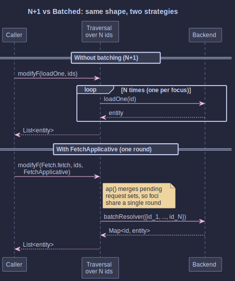
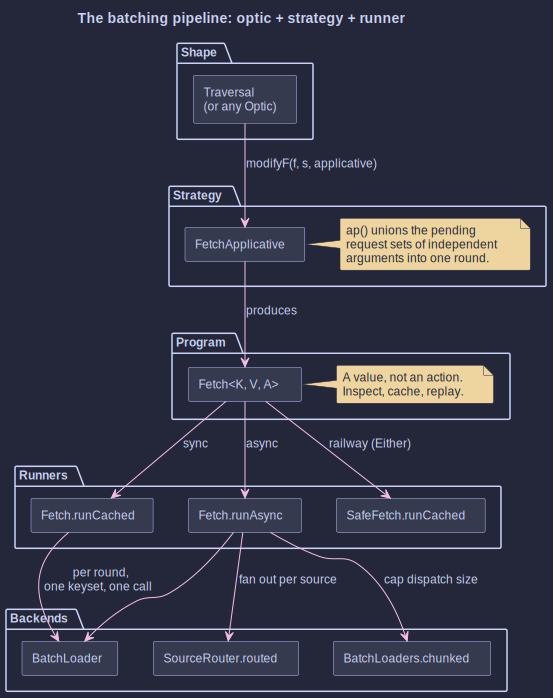
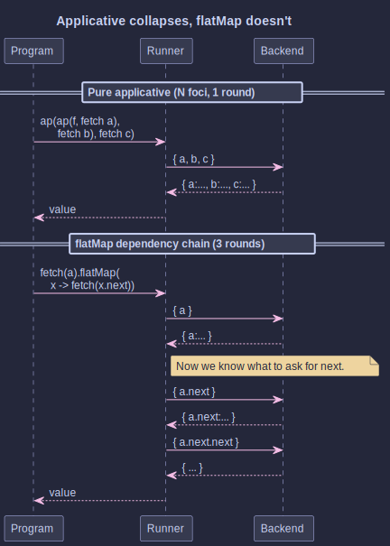

# Optic-Driven Request Batching

## _Eliminating N+1 at the Optic Seam_

~~~admonish info title="What You'll Learn"
- Why the N+1 query is the most reliable bug in service code, and how a single line change to a traversal collapses it to one call
- How a batching `Applicative` plugged into `Optic.modifyF` keeps the optic graph untouched while changing how the work runs
- `FetchOptics.fetchEach` for the `Id -> Entity` case the codegen can't produce
- `SourceRouter` and `BatchLoaders.chunked` for real backends (multiple sources, per-request size caps)
- `SafeFetch` for failures that belong on the value channel rather than in a stack trace
- Where batching stops working: the applicative-monad boundary
~~~

~~~admonish example title="See Example Code"
- [Tutorial 21: Optic-Driven Request Batching](https://github.com/higher-kinded-j/higher-kinded-j/blob/main/hkj-examples/src/test/java/org/higherkindedj/tutorial/optics/Tutorial21_OpticBatching.java)
- [Solution](https://github.com/higher-kinded-j/higher-kinded-j/blob/main/hkj-examples/src/test/java/org/higherkindedj/tutorial/solutions/optics/Tutorial21_OpticBatching_Solution.java)
~~~

## The Bug You've Written More Than Once

You have a list of ids. For each one, you load the entity. The code is one line in a stream and looks blameless. In staging, with three rows, it flies. In production, with two hundred rows, it stalls, and the trace shows two hundred near-identical queries lined up in single file.

This is the N+1, and optics by themselves do not save you from it. A `Traversal` is the *shape* of the problem ("every element"); it does not have an opinion about *how* the per-element work runs. Hand a sequential strategy to a traversal of N foci, you get N round-trips.

The `org.higherkindedj.optics.fetch` package changes the strategy and leaves the optic alone:



Top half: the loop you didn't mean to write. Bottom half: the same traversal, the same source, the same backend, plus one new piece, `FetchApplicative`. One round, one batched call, every focus resolved.

---

## The Pattern, Drawn

The pipeline has three pieces. The optic owns the shape. The applicative is the strategy. The runner is the boundary that actually talks to the backend:



Everything else in this chapter is a variation on those three pieces.

```java
// 1. The optic describes the shape (a list-traversal here).
Traversal<List<Integer>, Integer> ids = FocusPaths.listElements();

// 2. The applicative is the strategy: FetchApplicative batches.
var program = ids.modifyF(
    id -> FETCH.widen(Fetch.<Integer, Integer>fetch(id)),
    List.of(1, 2, 3, 4, 5),
    FetchApplicative.<Integer, Integer>instance());

// 3. The runner hands a whole round's keyset to the resolver in one call.
Fetch.RunResult<Integer, List<Integer>> result =
    Fetch.runCached(FETCH.narrow(program), backend::loadAll);

assertThat(result.rounds()).isEqualTo(1);          // one round
assertThat(result.backendCalls()).isEqualTo(1);    // one batched call
```

The trick is in step 2. `FetchApplicative.ap` merges the pending request sets of its two independent arguments. The optic walks the foci, applicative composition stacks them up, and the runner sees a single keyset by the time the dust settles.

~~~admonish note title="What just happened?"
You did not write a `loadAll`. You did not write a for-loop, a buffer, or a `thenCombine` chain. You handed the optic a different value (`FetchApplicative.instance()`) and the same traversal you would have written for a one-element case suddenly batches. The optic is the *shape*; the applicative is the *plan*; the runner is the *boundary*. Swap the plan, change the world.
~~~

---

## When the Optic Can't Spell It: `Id -> Entity`

The codegen produces type-preserving optics: a `Traversal<Team, UserId>` is `UserId` in and `UserId` out. So how do you express "load each `UserId` into a `User`" when the focus type *changes*?

`FetchOptics.fetchEach` builds the type-changing list-traversal the codegen does not produce:

```java
record Team(String name, List<UserId> memberIds) {}
record EnrichedTeam(String name, List<User> members) {}

Optic<Team, EnrichedTeam, UserId, User> memberFetch =
    FetchOptics.fetchEach(
        Team::memberIds,
        (team, users) -> new EnrichedTeam(team.name(), users));

var program = memberFetch.modifyF(
    id -> FETCH.widen(Fetch.<UserId, User>fetch(id)),
    team,
    FetchApplicative.<UserId, User>instance());

Fetch.RunResult<UserId, EnrichedTeam> result =
    Fetch.runCached(FETCH.narrow(program), userResolver);
```

The reader is the list-shaped field. The rebuilder reassembles the parent around the resolved values. One round, one batched call, regardless of how many members are in the team. The aggregate goes in `Team`, comes out `EnrichedTeam`.

---

## When Keys Come From Several Backends

Real rounds are not tidy. You ask for a list of identifiers, and half of them are user ids and half are product skus, served by two different services. The naive shape is a switch statement inside the loader; the result is per-key calls again.

`SourceRouter.routed` composes per-source `BatchLoader`s with a classifier into one loader the runner can call. Each backend sees its own keys; the round is still one round; the per-source dispatches run concurrently:

```java
BatchLoader<String, String> users    = /* user-directory loader   */;
BatchLoader<String, String> products = /* product-catalog loader  */;

BatchLoader<String, String> routed =
    SourceRouter.routed(
        key -> key.startsWith("u:") ? "users" : "products",
        Map.of("users", users, "products", products));

Fetch.RunResult<String, List<String>> result =
    Fetch.runAsync(FETCH.narrow(program), routed, new ConcurrentHashMap<>()).get();
```

`BatchLoaders.chunked(loader, maxSize)` caps a single dispatch's size if a downstream backend enforces a per-request limit (an `$in` clause cap, an HTTP query-string ceiling, a GraphQL batch limit). The substrate still sees one round; the loader splits the keyset into chunks behind the curtain.

---

## When Failures Belong on the Value Channel

Exceptions are great when nobody else needs to know about them. The moment a failure has to flow through composition (partition successes and failures, retry only the failures, present the failures to the caller as data) they become a problem. `SafeFetch` wraps a run so that resolver exceptions, missing-key reports, loader failures, and deadlines become `Either.left` values instead of thrown exceptions. The run never throws, and the safe-async future never completes exceptionally:

```java
Either<Throwable, Fetch.RunResult<UserId, User>> outcome =
    SafeFetch.runCached(program, failingResolver);
```

When a backend can report per-key failure without poisoning the whole round, the value type is `Either<E, V>` and `SafeFetch.partition` splits the result into successes and failures:

```java
Function<Set<UserId>, Map<UserId, Either<String, User>>> partial = /* per-key Either */;

Fetch.RunResult<UserId, List<Either<String, User>>> result =
    Fetch.runCached(FETCH.narrow(program), partial);

SafeFetch.Partitioned<String, User> split = SafeFetch.partition(result.value());
split.successes(); // List<User>
split.failures();  // List<String>
```

A backend that returns no entry for a requested key is surfaced as `MissingKeyException`. This is on purpose: a silent `null` in the result list would be a worse signal than a typed failure.

---

## The Wall: Where Batching Stops Working

Applicative composition collapses because the arguments are independent. `flatMap` cannot collapse, because the continuation's requests depend on the value the previous round produced. The library does not paper over this; it lays the boundary out where you can see it:



The practical rule is one line: *anything you can express with `map2`, `ap`, or an optic traversal collapses to one round; every `flatMap` in a chain is another round.* Express data dependencies as `flatMap` when you have one; do not reach for it when you don't.

~~~admonish tip title="A useful litmus test"
If you can write the program with `FetchApplicative.map2` (or an optic over a collection), batching applies. If you cannot, because step two's request *literally needs* step one's value, you have a real dependency and the round cost is the price you pay. Don't force one into the shape of the other.
~~~

---

## What the `RunResult` Tells You

`Fetch.RunResult` is a record, so you can inspect, log, and assert against the run:

| Field | Meaning |
|-------|---------|
| `value()` | The final value the program produced. |
| `rounds()` | Number of `Blocked` nodes resolved (one per applicative layer that needed dispatch). |
| `backendCalls()` | Rounds that actually hit the resolver (a round whose keys are all cached costs zero). |
| `fetchedBatches()` | The keyset sent to the resolver on each backend call. |
| `cacheHits()` | Individual keys served from the per-run cache. |

In tests, this is exactly what you want: `assertThat(result.backendCalls()).isEqualTo(1)` is how you prove that you actually killed the N+1 and didn't just hide it. The cache is per-invocation and in-JVM. A key requested again in a later round (say, across a `flatMap` dependency) is served from the cache and never re-fetched.

---

## Limits, Stated Up Front

- **Applicative-only batching.** A `flatMap` data dependency costs an extra round. This is the Haxl law (see further reading), not a defect.
- **Per-run cache.** No distributed cache; concurrent `runAsync` calls must each be given their own cache map.
- **Optics are post-fetch.** No predicate pushdown to the backend; the backend sees the keyset, not the optic's filter expression.

---

~~~admonish info title="Hands-On Learning"
Practice the four pieces (batching, heterogeneous fetch, multi-source routing, railway errors) in [Tutorial 21: Optic-Driven Request Batching](https://github.com/higher-kinded-j/higher-kinded-j/blob/main/hkj-examples/src/test/java/org/higherkindedj/tutorial/optics/Tutorial21_OpticBatching.java) (5 exercises, ~15 minutes).
~~~

~~~admonish tip title="See Also"
- [Traversals](traversals.md) - The optic shape this strategy attaches to.
- [Optics Extensions](optics_extensions.md) - Validated, per-element error handling on the value side.
- [Core Type Integration](core_type_integration.md) - `Either`, `Try`, `Validated` as railway types.
~~~

~~~admonish tip title="Further Reading"
- **Apollo Tutorials**: [Data loaders under the hood](https://www.apollographql.com/tutorials/dataloaders-dgs/03-data-loaders-under-the-hood) - A diagrammed, language-agnostic walk through the same batching idea Haxl popularised (Java framing in the worked example, accessible without prior functional-programming background).
~~~

---

[Previous: Optics Extensions](optics_extensions.md) | [Next: Cookbook](cookbook.md)
