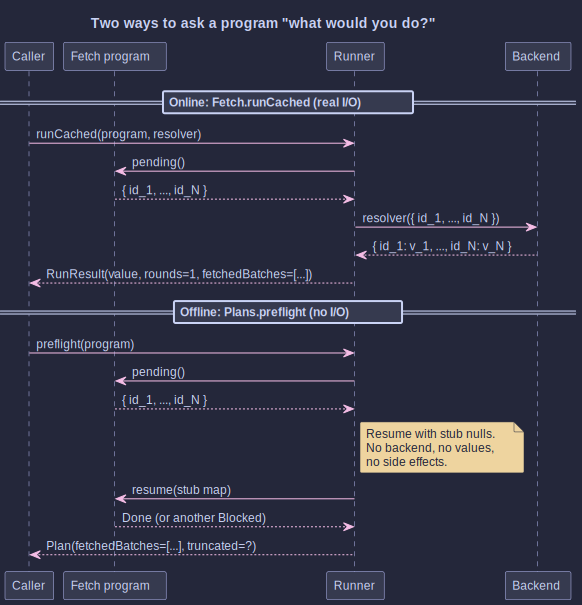
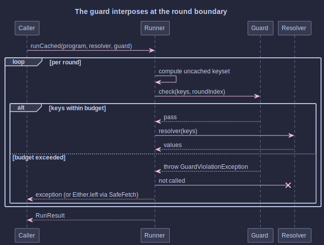

# Plan Introspection and Guardrails

## _Knowing What an Optic Run Would Do, Before It Does It_

~~~admonish info title="What You'll Learn"
- How to fold a `Fetch` program into a structural `Plan` with zero I/O, for audit logs and dry-run output
- Why round 1's keyset is always reliable and what makes later rounds value-dependent
- How a `Guard` interposes at the round boundary to refuse runaway batches before they leave the JVM
- The standard guards: `maxKeysPerRound`, `maxRounds`, `maxBackendCalls`, `audit`, and how to compose them
- How `SafeFetch.runCachedWithGuard` turns a refusal into a value on the `Either` channel
~~~

~~~admonish example title="See Example Code"
- [Tutorial 22: Plan Introspection and Guardrails](https://github.com/higher-kinded-j/higher-kinded-j/blob/main/hkj-examples/src/test/java/org/higherkindedj/tutorial/optics/Tutorial22_OpticBatchingGuardrails.java)
- [Solution](https://github.com/higher-kinded-j/higher-kinded-j/blob/main/hkj-examples/src/test/java/org/higherkindedj/tutorial/solutions/optics/Tutorial22_OpticBatchingGuardrails_Solution.java)
~~~

## The Friday-Afternoon Call

It's quarter to five. The on-call channel pings: "What did that endpoint *actually* do? It just hammered the user service with twelve thousand ids in one call and the SREs are unhappy." You look at the code. It's an optic traversal. It batched, just as designed. The optic did exactly what you asked it to do. The problem is that nobody asked beforehand whether that was a sensible thing to ask.

That is what this chapter is about. Three things you want, once an optic run has any chance of producing a sizeable batch.

| Question | When you ask it | Answer |
|---|---|---|
| "What would this dispatch, if I let it?" | Before the call leaves the JVM | `Plans.preflight(program)` |
| "Stop me if I'm about to do something stupid." | At the round boundary, every round | `Guards.maxKeysPerRound(n)` and friends |
| "Tell me, as data, that you stopped me." | At the failure site | `SafeFetch.runCachedWithGuard(...)` |

Two small primitives, one familiar railway pattern, no surprises.

---

## "What Would Round 1 Be?"

A `Fetch` program is a value. It hasn't run yet. You can pull its first round's pending-key set out without touching a backend, which is what `Plans.preflight` does:



Top half: the real run, the one that bills your cloud account. Bottom half: the inspection, the one you can put inside an `assertThat`. Same keysets. Different boundary.

```java
Plan<UserId> plan = Plans.preflight(program);
plan.rounds();           // how many rounds it observed
plan.fetchedBatches();   // each round's keyset, in order
plan.totalKeyCount();    // sum across observed rounds
plan.truncated();        // could the walk see all rounds?
```

The walk uses stub `null` values where the real run would have real ones. Two outcomes:

- The combine logic survives the null (`"foo" + null` is `"foonull"`, `ArrayList::add(null)` is fine). The walk reaches `Done`; `truncated` is `false`; the plan is complete.
- Something rejects the null (`List.of(first)`, an `Objects.equals` on a primitive, a `flatMap` that actually reads the value). The walk halts where it stood; `truncated` is `true`. **Round 1 is still accurate**, and that's the dispatch you care about for an audit log or a budget guard.

~~~admonish note title="Why round 1 is special"
A traversal that collapses N foci to a single batched call is *one round*. Its keyset is *the* dispatch. That's the headline case for optic batching, and it's exactly the case preflight observes reliably. Past round 1, programs that mix `flatMap` dependencies with null-rejecting combines lose visibility, and that's honest: a monadic dependency really does need a value to decide what to fetch next.
~~~

---

## "Stop Me If I'm About To Do Something Stupid."

The other half of the chapter doesn't ask offline; it asks at the round boundary, during the real run, just before each dispatch. That's a `Guard`:



```java
// Refuse a round that would dispatch more than 500 keys.
Guard<UserId> ceiling = Guards.maxKeysPerRound(500);

// Cap rounds (kill runaway flatMap chains).
Guard<UserId> bounded = Guards.maxRounds(8);

// Cap backend calls across the whole run.
Guard<UserId> calls = Guards.maxBackendCalls(4);

// Log every dispatched round.
Guard<UserId> audit = Guards.audit((keys, round) ->
    log.info("optic dispatch round={} keys={}", round, keys.size()));

// Compose: audit everything, but refuse the oversized.
Guard<UserId> composed = audit.and(ceiling);

Fetch.RunResult<UserId, Team> result =
    Guards.runCached(program, backend::loadAll, composed);
```

A guard inspects, then either passes (the runner dispatches) or throws `GuardViolationException`. A refusal aborts the run *before* the resolver runs: the dispatch never leaves the JVM, the SREs stay happy, and the exception carries the offending round index and keyset so the rejection is loggable.

`Guards.runCached` and `Guards.runAsync` are drop-in replacements for the substrate runners with the guard threaded in.

---

## Refusal as a Value

For callers that compose with `Either`, the railway wrappers move guard refusal onto the value channel:

```java
Either<Throwable, Fetch.RunResult<UserId, Team>> outcome =
    SafeFetch.runCachedWithGuard(program, backend::loadAll, composed);

return outcome.fold(
    failure -> badRequest(failure.getMessage()),
    success -> ok(success.value()));
```

`Either.left` carries the `GuardViolationException` (or any other failure the run produced). `Either.right` carries the `RunResult`. The run never throws; the safe-async future never completes exceptionally. Same shape every controller already knows.

---

## Quick Reference

| You want to ... | Use |
|---|---|
| Log the keyset before any I/O | `Plans.preflight(program)` |
| Assert "this optic would dispatch these keys" in a test | `Plans.preflight(program)` |
| Refuse a run if it would dispatch more than N keys | `Guards.maxKeysPerRound(n)` + `Guards.runCached` |
| Cap a runaway `flatMap` chain at N rounds | `Guards.maxRounds(n)` |
| Cap total backend calls (multi-round programs) | `Guards.maxBackendCalls(n)` |
| Log every dispatched round | `Guards.audit(sink)` |
| Turn a refusal into `Either.left` | `SafeFetch.runCachedWithGuard` |

---

## Limits, Stated Up Front

- **Round 1 only is universally observable offline.** Past round 1, `Plans.preflight` walks programs whose combines accept `null`; the rest truncate. `Plan.truncated()` is the honest signal.
- **Guards do not retry.** A refused round aborts the run; it does not "wait and try a smaller batch". Compose with `BatchLoaders.chunked` upstream of the guard if you want size capping with continuation.
- **`maxBackendCalls` counts non-empty rounds only.** A round whose keys are all already cached costs no backend call and does not consume a budget slot.

---

~~~admonish info title="Hands-On Learning"
Practice the five exercises (preflight, truncation, refusal, audit, railway) in [Tutorial 22: Plan Introspection and Guardrails](https://github.com/higher-kinded-j/higher-kinded-j/blob/main/hkj-examples/src/test/java/org/higherkindedj/tutorial/optics/Tutorial22_OpticBatchingGuardrails.java) (5 exercises, ~12 minutes).
~~~

~~~admonish tip title="See Also"
- [Optic-Driven Batching](optic_batching.md): The substrate this chapter builds on.
- [Optics Extensions](optics_extensions.md): Validated, per-element error handling on the value side.
- [Core Type Integration](core_type_integration.md): `Either` as the railway type for guard refusal.
~~~

~~~admonish tip title="Further Reading"
- **OWASP**: [GraphQL Cheat Sheet (Query limiting)](https://cheatsheetseries.owasp.org/cheatsheets/GraphQL_Cheat_Sheet.html#query-limiting-depth-amount) walks through the same idea in the GraphQL setting that Java developers will know from `graphql-java`'s `MaxQueryComplexityInstrumentation` and `MaxQueryDepthInstrumentation`: refuse at the boundary, by cost, before the work runs.
~~~

---

[Previous: Optic-Driven Batching](optic_batching.md) | [Next: Cookbook](cookbook.md)
