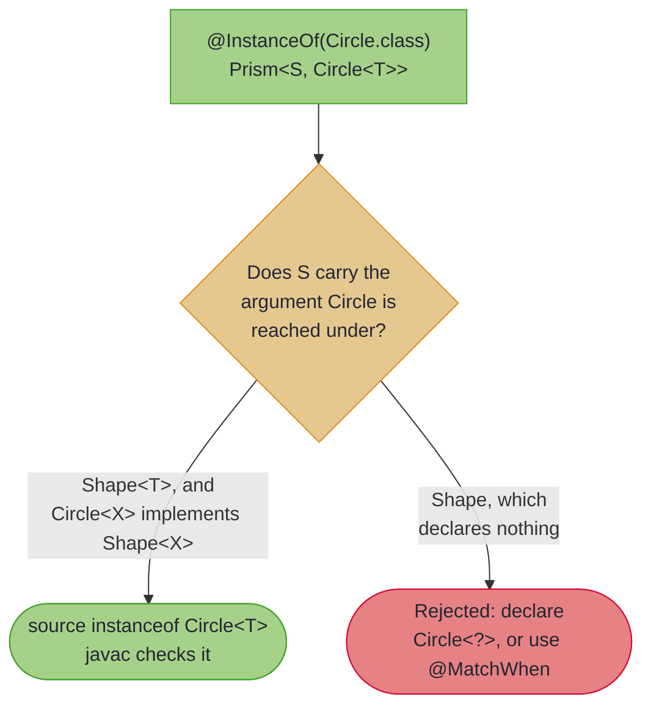

# Taming JSON with Jackson

## _Spec Interfaces for Jackson and Beyond_

> *"The art of programming is the art of organising complexity, of mastering multitude and avoiding its bastard chaos."*
>
> – Edsger W. Dijkstra

---

Dijkstra's words ring especially true when facing JSON: a nested, dynamically-typed structure with optional fields, variable array contents, and no compile-time guarantees. The imperative approach fights that with defensive code, null checks upon null checks, type assertions, deeply nested conditionals.

Spec interfaces take the other path. You declare the *shapes* the data might take, the processor generates type-safe prisms for them, and navigation becomes composition. Here is the destination first, on a real API response:

```java
{{#include ../../../hkj-examples/src/main/java/org/higherkindedj/example/book/optics/JsonApiBook.java:read}}
```

No null checks, no casts, no nested conditionals. And the write direction is the same paths, run backwards:

```java
{{#include ../../../hkj-examples/src/main/java/org/higherkindedj/example/book/optics/JsonApiBook.java:write}}
```

~~~admonish info title="What You'll Learn"
- How a spec interface gives you precise control over an external type
- Building a complete optics toolkit for Jackson's `JsonNode`
- `@InstanceOf` and `@MatchWhen`, and when each applies
- Where composed helpers belong, and why not in the spec interface
~~~

~~~admonish example title="See Example Code"
[JsonNodeOpticsSpec.java](https://github.com/higher-kinded-j/higher-kinded-j/blob/main/hkj-examples/src/main/java/org/higherkindedj/example/book/optics/JsonNodeOpticsSpec.java) | [JsonPaths.java](https://github.com/higher-kinded-j/higher-kinded-j/blob/main/hkj-examples/src/main/java/org/higherkindedj/example/book/optics/JsonPaths.java) | [JsonApiBook.java](https://github.com/higher-kinded-j/higher-kinded-j/blob/main/hkj-examples/src/main/java/org/higherkindedj/example/book/optics/JsonApiBook.java)

The page includes these directly, so the build compiles every line above. The output comments were produced by running the class.
~~~

---

## Why `JsonNode` Resists Auto-Detection

Point `@ImportOptics` at `JsonNode` and it has nothing to work with:

1. **No sealed hierarchy.** `ObjectNode`, `ArrayNode` and `StringNode` exist, but `JsonNode` is not sealed, so the processor cannot enumerate the variants.
2. **No copy strategy to detect.** `ObjectNode` and `ArrayNode` are mutable, and `deepCopy()` will isolate an edit, which is what `JsonPaths.field` below does before calling `set`. What is missing is anything declarative: no builder, no withers, no all-args constructor for the processor to rebuild a changed node through.
3. **Predicate-based type checks.** Jackson offers `isObject()` and `isArray()`, which auto-detection has no rule for.

Types like this need you to say what you want. That is a **spec interface**.

---

## The Spec Interface

An interface extending `OpticsSpec<S>`, with one annotated abstract method per optic:

```java
{{#include ../../../hkj-examples/src/main/java/org/higherkindedj/example/book/optics/JsonNodeOpticsSpec.java:spec}}
```

`@InstanceOf` tells the processor to generate a prism that matches when the node is an instance of the given class, rebuilding through identity. From this declaration you get a class of static prisms:

```java
JsonNodeOptics.object()   // Prism<JsonNode, ObjectNode>
JsonNodeOptics.array()    // Prism<JsonNode, ArrayNode>
JsonNodeOptics.text()     // Prism<JsonNode, StringNode>
JsonNodeOptics.numeric()  // Prism<JsonNode, NumericNode>
JsonNodeOptics.bool()     // Prism<JsonNode, BooleanNode>
```

~~~admonish note title="The generated class name"
An interface whose name ends in `Spec` loses that suffix: `JsonNodeOpticsSpec` generates `JsonNodeOptics`. Any other name gains `Impl` instead, so `JsonOptics` would generate `JsonOpticsImpl`. Naming the interface `...Spec` is the convention worth following: it keeps the name you actually call short.
~~~

---

## Building Richer Tools

The generated prisms are primitives. Real JSON work wants field access, array traversal and value extraction, which are compositions of those primitives. Put them in an ordinary utility class:

```java
{{#include ../../../hkj-examples/src/main/java/org/higherkindedj/example/book/optics/JsonPaths.java:field}}
```

```java
{{#include ../../../hkj-examples/src/main/java/org/higherkindedj/example/book/optics/JsonPaths.java:elements}}
```

```java
{{#include ../../../hkj-examples/src/main/java/org/higherkindedj/example/book/optics/JsonPaths.java:values}}
```

Each is a prism composed with a hand-written `Affine` or `Traversal`, and the result types tell the story: `field` may miss (an `Affine`), `elements` may hit many (a `Traversal`).

~~~admonish warning title="Composed optics do not belong in the spec interface"
A `default` method on a spec interface looks like the natural home for these, but it is not: the processor cannot read a method body during annotation processing, so there is nothing for the generated class to carry. The processor rejects one at the declaration ([#712](https://github.com/higher-kinded-j/higher-kinded-j/issues/712)), naming the two homes composition does have. Keep the spec interface to annotated abstract methods, and build everything else either in a `static` method on the interface or, as here, in a normal class; both call the generated statics.
~~~

---

## A Real Pipeline: API Response Processing

The response this page works on:

```json
{
  "status": "success",
  "data": {
    "users": [
      { "id": 1, "name": "Alice", "email": "alice@example.com", "age": 32 },
      { "id": 2, "name": "Bob",   "email": "bob@example.com",   "age": 28 },
      { "id": 3, "name": "Carol", "email": "carol@example.com", "age": 45 }
    ],
    "page": 1
  }
}
```

Name the paths once, at the top of the class, and the business logic reads as intent:

```java
{{#include ../../../hkj-examples/src/main/java/org/higherkindedj/example/book/optics/JsonApiBook.java:paths}}
```

Those four constants are the whole abstraction. `Traversals.getAll` reads through them, `Traversals.modify` writes through them, and `filtered` narrows them, exactly as shown at the top of this page.

~~~admonish tip title="Why this matters"
The JSON structure is now stated in one place. When the API moves `users` under a `payload` wrapper, you change one composition and every reader and writer follows. Compare the defensive version, where the shape is restated at every access site as a chain of `has()` and `isArray()` checks, and a structural change means finding all of them.
~~~

~~~admonish warning title="Composing a Traversal with an Affine"
`Traversal` has `andThen` overloads for `Traversal`, `Lens` and `Prism`, but not for `Affine`. Convert first: `traversal.andThen(affine.asTraversal())`. The result is a `Traversal` either way, since a traversal composed with anything stays a traversal.
~~~

---

## `@InstanceOf` versus `@MatchWhen`

**`@InstanceOf`** is for hierarchies whose variants are real Java subtypes:

```java
@InstanceOf(ObjectNode.class)
Prism<JsonNode, ObjectNode> object();
// generates: node instanceof ObjectNode o ? Optional.of(o) : Optional.empty()
```

**`@MatchWhen`** is for libraries that expose a check-then-extract pair instead of subtypes:

```java
@MatchWhen(predicate = "isString", getter = "asString")
Prism<Value, String> string();
// generates: value.isString() ? Optional.of(value.asString()) : Optional.empty()
```

Both produce a `Prism`, so both compose the same way afterwards. Pick by what the library gives you: a type to test, or a method to ask.

### Parameterised Targets

`@InstanceOf` takes a class constant, which is always raw, and the generated test runs after erasure. A parameterised target may therefore only be narrowed to the type arguments the source type *pins down* — the ones a value of that source type must already have had to reach the test at all.



A generic hierarchy pins its own argument, so the prism can promise it. `T` is the spec's own type parameter, and `Circle<X> implements Shape<X>` is what lets the test check it:

```java
sealed interface Shape<X> permits Circle {}
record Circle<X>(X tag) implements Shape<X> {}

@ImportOptics
interface ShapeOpticsSpec<T> extends OpticsSpec<Shape<T>> {

    @InstanceOf(Circle.class)
    Prism<Shape<T>, Circle<T>> circle();
    // generates: source instanceof Circle<T> t ? Optional.of(t) : Optional.empty()
}
```

A base that says nothing about the argument pins nothing. Every instantiation passes the same test, so the same declaration is rejected:

```java
class Shape {}
class Circle<X> extends Shape {}

@ImportOptics
interface ShapeOpticsSpec<T> extends OpticsSpec<Shape> {

    @InstanceOf(Circle.class)
    Prism<Shape, Circle<T>> circle();   // rejected: nothing checks T
}
```

Widened to the wildcard, which is what the test earns, it is accepted — and the spec needs no type parameter of its own once the prism stops promising one:

```java
@ImportOptics
interface ShapeOpticsSpec extends OpticsSpec<Shape> {

    @InstanceOf(Circle.class)
    Prism<Shape, Circle<?>> circle();
    // generates: source instanceof Circle<?> t ? Optional.of(t) : Optional.empty()
}
```

~~~admonish info title="Where the argument matters"
Widening to `Circle<?>` keeps the prism, at the cost of the argument. Where you need the argument, `@MatchWhen` is the sound alternative: it narrows through a predicate and getter of the source type, so the argument is the source's to honour rather than the test's to invent.
~~~

---

## Layering Domain Optics

The paths above are still shaped like the JSON. One more layer names them in the language of the domain, so the rest of the code never mentions `field("data")` at all:

```java
public final class UserJson {

  public static Traversal<JsonNode, String> emails() { return JsonApiBook.USER_EMAILS; }

  public static Traversal<JsonNode, Double> ages() { return JsonApiBook.USER_AGES; }

  public static Affine<JsonNode, Double> page() { return JsonApiBook.PAGE; }
}
```

Now a service reads `UserJson.emails()`, and the wire format is an implementation detail of one class. (`USER_EMAILS`, `USER_AGES` and `PAGE` are package-private in the compiled example, so this facade sits in the same package as them; in your own code make them `public` or put the facade alongside.)

---

## Generic Spec Interfaces

A spec interface can carry type parameters of its own, and the source type can name them:

```java
@ImportOptics
public interface BoxOpticsSpec<U> extends OpticsSpec<Box<U>> {
    @Wither("withLabel")
    Lens<Box<U>, String> label();
}
```

generates `public static <U> Lens<Box<U>, String> label()`. The parameters are the *spec's*, not the source type's, so you name them: `Box<T>`'s own `T` never appears.

Each method declares the parameters **its own** source and focus types reach, which is what makes the two edges work:

| the spec declares | the method | why |
|---|---|---|
| `<U>`, source `Box<U>` | `static <U> Lens<Box<U>, String>` | reached by the source type |
| nothing, source `Box<String>` | `static Lens<Box<String>, String>` | a concrete instantiation reaches nothing |
| `<T>`, source `Shape` | `static <T> Prism<Shape, Circle<T>>` | reached by the **focus** alone |
| `<T, UNUSED>`, source `Box<T>` | `static <T> Lens<Box<T>, String>` | `UNUSED` is reached by neither |

The third row is worth noting: the source type need not be generic at all. A prism or traversal whose *focus* is parameterised brings the parameter in on its own.

One parameter is carried without being reached directly — one that a kept parameter's bound names, since the bound has to resolve. `interface SubjectOpticsSpec<T, V extends List<T>> extends OpticsSpec<Box<V>>` focused through `V` generates `static <T, V extends List<T>> Lens<Box<V>, String> label()`: `T` appears nowhere in the signature's source or focus, and is declared anyway so that `V`'s bound means something.

An optic method cannot declare parameters of its own. The source type is fixed by `OpticsSpec<S>`, so nothing could ever bind them, and `<X> Lens<Box<String>, X> content()` is rejected at the declaration rather than generating a method no call could resolve.

---

## The fine print: error reporting

A raw optic answers "is it there?" and nothing more: a missing field and a field of the wrong type both come back as an empty `Optional`. When you need to know *which* it was, the answer is not a special optic but the surrounding machinery:

- **[ValidatedPrism](validated_prism.md)** parses instead of matching, returning `Validated<NonEmptyList<FieldError>, A>` with a located error per failure.
- **[`OpticOps` validation methods](fluent_api.md#part-2-validation-aware-modification)** run a validating function through a traversal, accumulating every failure.
- **[Mapping at the Boundary](../mapping/ch_intro.md)** is the whole-boundary answer: a generated `parse` that reports every bad field at once, each located by path.

Reach for optics to *navigate*, and for one of those to *diagnose*.

---

## Beyond Jackson

The same pattern fits any external type that resists auto-detection: Protocol Buffers (`@MatchWhen` on the generated `hasX`/`getX` oneof accessors), XML DOM (prisms for element types), compiler or parser ASTs, and awkward legacy library types. The next page covers the other half of the story, the copy strategies (`@ViaBuilder`, `@Wither`, `@ViaConstructor`, `@ViaCopyAndSet`) that give you lenses rather than prisms.

---

~~~admonish info title="Key Takeaways"
* **A spec interface declares primitives, nothing more.** One annotated abstract method per optic, and the processor generates a class of statics.
* **`@InstanceOf` for real subtypes, `@MatchWhen` for check-and-extract APIs.** Both yield prisms.
* **Composed helpers belong in a plain class**, or in a `static` method on the spec interface. A `default` method is rejected at the declaration, because its body cannot be carried into the generated class.
* **A `Spec` suffix is stripped from the generated name**, so `JsonNodeOpticsSpec` gives you `JsonNodeOptics`; any other name gains `Impl`.
* **Name the paths once.** Structure lives in the composition, so an API change is a one-line edit rather than a search.
~~~

~~~admonish example title="Testing a spec interface's optics"
The generated prisms are ordinary optics, so the law harness applies:

```java
PrismLaws.assertPrismLaws(JsonNodeOptics.object(), anObjectNode, aStringNode);
```

See [Test Assertions](../tooling/test_assertions.md#optic-laws) for the full family.
~~~

~~~admonish tip title="See Also"
- [Optics for External Types](importing_optics.md): `@ImportOptics` and what auto-detection covers
- [Database Records with JOOQ](copy_strategies.md): `@ViaBuilder` and the other copy strategies
- [Validated Prisms](validated_prism.md): parsing rather than matching, with located errors
~~~

~~~admonish tip title="Further Reading"
- **Jackson**: [jackson-databind](https://github.com/FasterXML/jackson-databind): core databinding. Jackson 3.x moved the packages from `com.fasterxml.jackson` to `tools.jackson`, and renamed `TextNode` to `StringNode`
- **Gson**: [github.com/google/gson](https://github.com/google/gson): the same spec-interface pattern fits its `JsonElement` hierarchy
- **Jakarta JSON Processing**: [jakarta.ee](https://jakarta.ee/specifications/jsonp/): the standard API, another `@InstanceOf` candidate
~~~

---

**Previous:** [Optics for External Types](importing_optics.md)
**Next:** [Database Records with JOOQ](copy_strategies.md)
