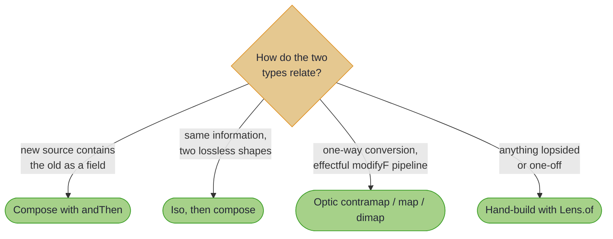

# Profunctor Optics: Advanced Data Transformation

## *Adapting Optics to Different Data Types*

~~~admonish info title="What You'll Learn"
- Why every optic is a profunctor, and what `contramap`, `map`, and `dimap` really adapt
- The write-side asymmetry: why `contramap` alone changes where reads come from but not what updates produce
- Getting a fully-typed optic back: composition for nested sources, `Iso` for equivalent shapes, `Lens.of` for hand-rolled adapters
- When the raw `Optic`-level operations are the right tool (one-way conversions, effectful pipelines)
- When to adapt an existing optic versus creating a new one from scratch
~~~

~~~admonish example title="See Example Code"
[OpticProfunctorExample](https://github.com/higher-kinded-j/higher-kinded-j/blob/main/hkj-examples/src/main/java/org/higherkindedj/example/optics/profunctor/OpticProfunctorExample.java)
~~~

In the previous optics guides, we explored how to work with data structures directly using `Lens`, `Prism`, `Iso`, and `Traversal`. But what happens when you need to use an optic designed for one data type with a completely different data structure? What if you want to adapt an existing optic to work with new input or output formats?

This is where the **profunctor** nature of optics becomes invaluable. Every optic in Higher-Kinded-J is fundamentally an `Optic<S, T, A, B>`, and that shared interface carries the profunctor operations. Just as importantly, the everyday answers to "adapt this optic" are often the composition tools you already know; this page shows you which tool fits which job.

---

## The Challenge: Type Mismatch in Real Systems

In real-world applications, you frequently encounter situations where:

* **Legacy Integration**: You have optics designed for old data structures but need to work with new ones
* **API Adaptation**: External APIs use different field names or data formats than your internal models
* **Type Safety**: You want to work with strongly-typed wrapper classes but reuse optics designed for raw values
* **Data Migration**: You're transitioning between data formats and need optics that work with both

Consider this scenario: you have a well-tested `Lens` that operates on a `Person` record, but you need to use it with an `Employee` record that contains a `Person` as a nested field. Rather than rewriting the lens, you can **adapt** it.

## Think of Profunctor Adaptations Like...

* **Universal adapters**: Like electrical plug adapters that make devices work in different countries
* **Translation layers**: Converting between different "languages" of data representation
* **Lens filters**: Modifying what the optic sees (input) and what it produces (output)
* **Pipeline adapters**: Connecting optics that weren't originally designed to work together

---

## The Three Profunctor Operations

Every optic extends `Optic<S, T, A, B>`, which provides three adaptation methods:

| Operation | Signature (simplified) | Adapts |
|-----------|------------------------|--------|
| `contramap(f)` | `(C -> S) -> Optic<C, T, A, B>` | Where reads come *from* |
| `map(g)` | `(T -> U) -> Optic<S, U, A, B>` | What updates *produce* |
| `dimap(f, g)` | `(C -> S, T -> U) -> Optic<C, U, A, B>` | Both at once |

Two things about this API matter in practice:

1. **The result is an `Optic`, not a `Lens` or `Traversal`.** An `Optic` supports `andThen` and the effectful `modifyF`, but not the convenience surface (`get`, `set`, `modify`). The profunctor operations shine in effectful pipelines; for everyday field access you usually want one of the typed routes below.
2. **`contramap` alone is asymmetric.** `EmployeeLenses.department().contramap(dtoToEmployee)` reads from an `EmployeeDto`, but a modification still *produces* an `Employee` (the original structure type `T`). To get a full bridge you must also `map` the output back, which is exactly what `dimap` does:

<!-- verify -->
```java
Optic<EmployeeDto, EmployeeDto, String, String> departmentBridge =
    EmployeeLenses.department().dimap(Adapters::dtoToEmployee, Adapters::employeeToDto);

// An Optic is driven through modifyF. Id is the no-op effect: it runs the
// update purely, with no failure, async, or accumulation behaviour attached.
EmployeeDto promoted =
    ID.narrow(departmentBridge.modifyF(
            dept -> Id.of("Senior " + dept), dto, IdMonad.instance()))
        .value();
```

~~~admonish tip title="Why this matters"
The profunctor operations are what make `modifyF` pipelines adaptable without rebuilding them: a validating update written against your domain model can be pointed at a wire DTO by supplying the two conversion functions, and nothing else changes. When you find yourself *also* wanting `get` and `set` on the adapted optic, that is the signal you have an isomorphism, and the next section gives you the full API back.
~~~

---

## Getting a Typed Optic Back

The raw operations return `Optic`. In most day-to-day code you want a real `Lens` or `Traversal` back, and there are three idiomatic routes.

### Route 1: Composition, when the new source *contains* the old

The most common "contramap" wish is really a nested-field access, and `andThen` already does it, keeping every convenience method:

<!-- verify -->
```java
// Employee contains a Person; compose instead of adapting
Lens<Employee, String> employeeFirstName =
    EmployeeLenses.personalInfo().andThen(PersonLenses.firstName());

String name = employeeFirstName.get(employee);
Employee shouted = employeeFirstName.modify(String::toUpperCase, employee);
```

### Route 2: An `Iso`, when the two shapes hold the same information

If your conversion functions form a lossless pair, they are an [Iso](iso.md), and composing with one keeps the whole API in either direction (`Lens >>> Iso = Lens`, and `Iso >>> Lens = Lens`). This is `dimap` with the power retained:

<!-- verify -->
```java
// UserId is a wrapper around String: a textbook Iso
Iso<UserId, String> userIdValue = Iso.of(UserId::value, UserId::new);

// Reuse any String-side optic against the wrapper
Lens<Account, UserId> accountUser = AccountLenses.userId();
Lens<Account, String> accountUserRaw = accountUser.andThen(userIdValue);

Account renamed = accountUserRaw.modify(String::toUpperCase, account);
```

### Route 3: `Lens.of`, when the adaptation is genuinely one-off

When neither composition nor an Iso fits (the conversion is lopsided, or you only need one field bridged), build the adapted lens directly. This is the "profunctor-style" adaptation the runnable example demonstrates:

```java
Lens<Employee, String> employeeFirstNameLens =
    Lens.of(
        employee -> PersonLenses.firstName().get(employee.personalInfo()),
        (employee, newName) ->
            new Employee(
                employee.id(),
                PersonLenses.firstName().set(newName, employee.personalInfo()),
                employee.department()));
```

---

## Decision Guide: Which Adaptation Do You Need?



---

## Common Pitfalls

### Don't Do This:

```java
// Rebuilding the same adapter inline repeatedly
var lens1 = EmployeeLenses.personalInfo().andThen(PersonLenses.firstName());
var lens2 = EmployeeLenses.personalInfo().andThen(PersonLenses.firstName());

// Expecting contramap alone to give a full bridge
// (reads take a DTO, but updates still produce an Employee)
var readOnlyBridge = EmployeeLenses.department().contramap(Adapters::dtoToEmployee);

// Pretending a lossy conversion is an Iso
Iso<PersonDto, Person> lossy = Iso.of(
    dto -> new Person(dto.fullName().split(" ")[0], "", null, List.of()),
    person -> new PersonDto(person.firstName(), "", List.of()));  // Round trip loses data!
```

### Do This Instead:

```java
// Create adapters once, reuse everywhere
public static final Lens<Employee, String> EMPLOYEE_FIRST_NAME =
    EmployeeLenses.personalInfo().andThen(PersonLenses.firstName());

// Use dimap when you need the bridge, and drive it through modifyF
public static final Optic<EmployeeDto, EmployeeDto, String, String> DEPARTMENT_BRIDGE =
    EmployeeLenses.department().dimap(Adapters::dtoToEmployee, Adapters::employeeToDto);

// Reserve Iso for genuinely lossless pairs (wrappers, equivalent records)
public static final Iso<UserId, String> USER_ID_VALUE = Iso.of(UserId::value, UserId::new);
```

~~~admonish warning title="An Iso must not lose data"
`Iso.of(get, reverseGet)` promises a lossless round trip, and the `IsoLaws` [law harness](../tooling/test_assertions.md) will hold you to it. A DTO conversion that drops or invents fields is not an Iso; route it through `@GenerateMapping` or a [Validated Prism](validated_prism.md) instead.
~~~

---

## Performance Notes

* **Adapters are thin**: each operation wraps the underlying optic with the conversion functions; there is no reflection and no copying beyond what the conversions themselves do
* **Reuse beats rebuilding**: store composed or adapted optics as constants, the same discipline as every other page
* **Conversion cost is your cost**: a `dimap` bridge runs your two functions on every pass, so keep them cheap and total

---

## Real-World Example: API Integration

The runnable [OpticProfunctorExample](https://github.com/higher-kinded-j/higher-kinded-j/blob/main/hkj-examples/src/main/java/org/higherkindedj/example/optics/profunctor/OpticProfunctorExample.java) walks a complete integration: an internal `Employee`/`Person` model, an external `EmployeeDto`/`PersonDto` wire format, and adapters hand-built with `Lens.of` (Route 3), including a formatted-date bridge that reads through a formatter and writes back through a parser, plus a conversion pair driven through `modifyF`. It compiles and runs on every build, so it is the reference when you wire your own.

The shape to copy:

```java
public class ApiIntegration {

    // One pair of conversion utilities, written once and tested
    static Employee dtoToEmployee(EmployeeDto dto) { /* ... */ }
    static EmployeeDto employeeToDto(Employee employee) { /* ... */ }

    // Typed optics for everyday access, via composition
    public static final Lens<Employee, String> FIRST_NAME =
        EmployeeLenses.personalInfo().andThen(PersonLenses.firstName());

    // A dimap bridge where the pipeline is effectful anyway
    public static final Optic<EmployeeDto, EmployeeDto, String, String> DEPARTMENT =
        EmployeeLenses.department().dimap(
            ApiIntegration::dtoToEmployee,
            ApiIntegration::employeeToDto);
}
```

---

~~~admonish info title="Key Takeaways"
* **Every optic is an `Optic<S, T, A, B>`**: `contramap`, `map`, and `dimap` live there, adapting the `modifyF` pipeline and returning an `Optic`
* **`contramap` alone is read-side only**: updates still produce the original structure type; a full bridge needs `dimap`
* **Composition is the everyday "contramap"**: when the new source contains the old, `andThen` keeps the full typed API
* **A lossless pair is an `Iso`**: compose it and keep `get`/`set`/`modify`; that is `dimap` with the power retained
* **`Lens.of` is the honest fallback**: hand-build the adapter when the relationship is lopsided or one-off
~~~

~~~admonish tip title="See Also"
- [Profunctor Optics: Recipes](profunctor_optics_recipes.md): wrapper-type recipes, V1/V2 migration adapters, and a complete runnable example
- [Isomorphisms](iso.md): the lossless conversions that keep the full optic API
- [Composition Rules](composition_rules.md): what `andThen` yields for every optic pairing
~~~

---

**Previous:** [Advanced Prism Patterns: Recipes](advanced_prism_patterns_recipes.md)
**Next:** [Profunctor Optics: Recipes](profunctor_optics_recipes.md)
