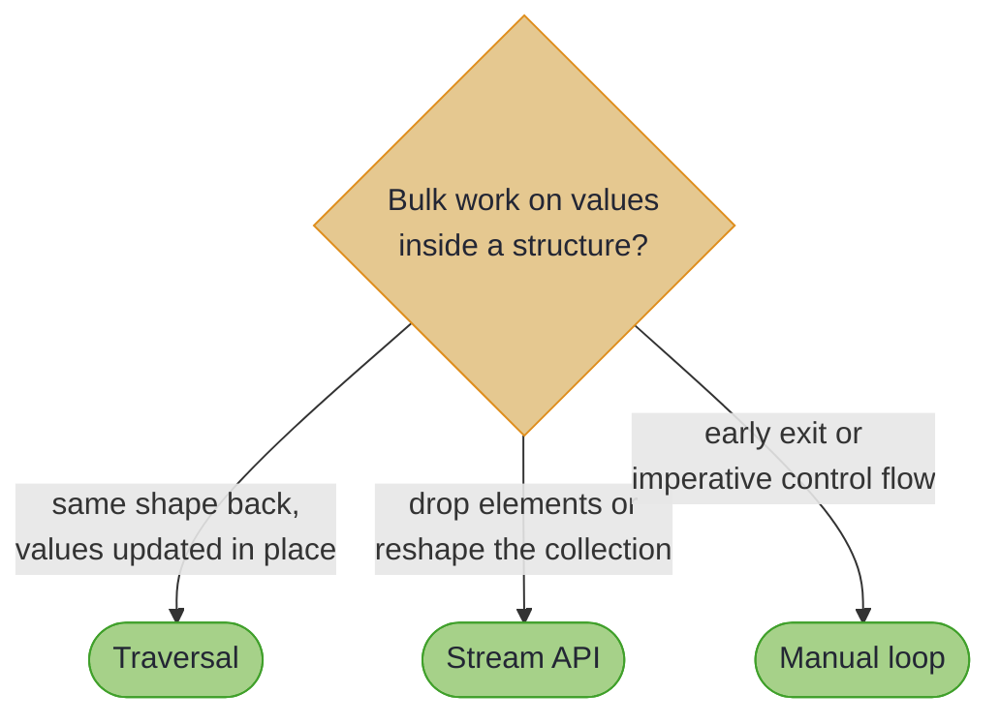

# Traversals: Practical Guide

## _Handling Bulk Updates_

~~~admonish info title="What You'll Learn"
- How to perform bulk operations on collections within immutable structures
- Using `@GenerateTraversals` for automatic collection optics
- Composing traversals with lenses and prisms for deep bulk updates
- The `Traversals.modify()` and `Traversals.getAll()` utility methods
- Treating all focused elements as one list with `partsOf` (sorting, reversing, deduplicating)
- Converting a Traversal to a read-only Fold with `asFold()` for queries and aggregation
- Understanding zero-or-more target semantics
- When to use traversals vs streams vs manual loops for collection processing
~~~

~~~admonish example title="See Example Code"
[TraversalUsageExample](https://github.com/higher-kinded-j/higher-kinded-j/blob/main/hkj-examples/src/main/java/org/higherkindedj/example/optics/TraversalUsageExample.java)
~~~

So far, our journey through optics has shown us how to handle singular focus:

* A **`Lens`** targets a part that *must* exist.
* A **`Prism`** targets a part that *might* exist in one specific shape.
* An **`Affine`** targets a part that may be absent: zero or one.
* An **`Iso`** provides a two-way bridge between *equivalent* types.

But what about operating on *many* items at once? How do we apply a single change to every element in a nested list? For this, we need the most general and powerful optic in our toolkit: the **Traversal**.

## The Scenario: Updating an Entire League

A `Traversal` is a functional "search-and-replace." It gives you a single tool to focus on zero or more items within a larger structure, allowing you to `get`, `set`, or `modify` all of them in one go.

This makes it the perfect optic for working with collections. Consider this data model of a sports league:

**The Data Model:**

<!-- verify -->
```java
public record Player(String name, int score) {}
public record Team(String name, List<Player> players) {}
public record League(String name, List<Team> teams) {}
```

**Our Goal:** We need to give every single player in the entire league 5 bonus points. The traditional approach involves nested loops or streams, forcing us to manually reconstruct each immutable object along the way.

<!-- verify -->
```java
// Manual, verbose bulk update
List<Team> newTeams = league.teams().stream()
    .map(team -> {
        List<Player> newPlayers = team.players().stream()
            .map(player -> new Player(player.name(), player.score() + 5))
            .collect(Collectors.toList());
        return new Team(team.name(), newPlayers);
    })
    .collect(Collectors.toList());
League updatedLeague = new League(league.name(), newTeams);
```

This code is deeply nested and mixes the *what* (add 5 to a score) with the *how* (looping, collecting, and reconstructing). A `Traversal` lets us abstract away the "how" completely.

## Think of Traversals Like...

* **A spotlight**: Illuminates many targets at once within a structure
* **A search-and-replace tool**: Finds all matching items and transforms them
* **A bulk editor**: Applies the same operation to multiple items efficiently
* **A magnifying glass array**: Like a lens, but for zero-to-many targets instead of exactly one

## A Step-by-Step Walkthrough

### Step 1: Generating Traversals

The library provides a rich set of tools for creating `Traversal` instances, found in the **`Traversals`** utility class and through annotations.

* **`@GenerateTraversals`**: Annotating a record generates a `Traversal` for every component whose container a generator recognises: `List`, `Set`, `Collection`, `Map` (its values), `Optional` and arrays from the JDK; `Maybe`, `Either`, `Try` and `Validated` from HKJ; and the third-party collections the [generator plugins](../tooling/generator_plugins.md) cover. A component that holds elements but reaches no traversal — a `Deque`, a `SortedMap`, a raw `List` — is reported as a compile-time **note** where it is declared, because the generated class compiles perfectly well without the method and the gap would otherwise be found at the call site. A component that is not a container at all is passed over silently.

**Standard Container Traversals:**

| Method | Container Type | Description |
|--------|---------------|-------------|
| `Traversals.forList()` | `List<A>` | Traverses all elements of a list |
| `Traversals.forSet()` | `Set<A>` | Traverses all elements of a set |
| `Traversals.forCollection()` | `Collection<A>` | Traverses all elements; rebuilds a set source as a set and any other source as a list |
| `Traversals.forOptional()` | `Optional<A>` | Traverses the value if present (0 or 1 element) |
| `Traversals.forArray()` | `A[]` | Traverses all elements of an array |
| `Traversals.forMapValues()` | `Map<K, V>` | Traverses all values in a map |
| `Traversals.forMap(key)` | `Map<K, V>` | Traverses a specific key's value |

These traversals accept any implementation as input: `forList()` reads an `ArrayList` or a `LinkedList` as readily as a `List.of(...)`. What each hands back is a value of the interface type (`forList()` rebuilds an unmodifiable `List`), which is why `@ThroughField` auto-detection matches the interface only and refuses a field declared as `ArrayList`; see [`@ThroughField` auto-detection](copy_strategies.md#throughfield-auto-detection). (`@GenerateTraversals` reports the same component with a note rather than an error: it has no per-component opt-out, where `@ThroughField` is an explicit request on one method.)

<!-- verify -->
```java
import org.higherkindedj.optics.annotations.GenerateTraversals;
import java.util.List;

// We also add @GenerateLenses to get access to player fields
@GenerateLenses
public record Player(String name, int score) {}

@GenerateLenses
@GenerateTraversals // Traversal for List<Player>
public record Team(String name, List<Player> players) {}

@GenerateLenses
@GenerateTraversals // Traversal for List<Team>
public record League(String name, List<Team> teams) {}
```

#### Customising the Generated Package

By default, generated classes are placed in the same package as the annotated record. You can specify a different package using the `targetPackage` attribute:

```java
// Generated class will be placed in org.example.generated.optics
@GenerateTraversals(targetPackage = "org.example.generated.optics")
public record Team(String name, List<Player> players) {}
```

This is useful when you need to avoid name collisions or organise generated code separately.

#### Wildcard Element Types

A container's element type may be written as a wildcard. The generated traversal focuses **the type the wildcard stands for**: `? extends Player` is focused as `Player`, and `?` or `? super Player` as `Object`.

<!-- verify -->
```java
@GenerateTraversals
record Roster(String coach, List<? extends Player> players) {}

// `? extends Player` is focused as `Player`
Traversal<Roster, Player> everyPlayer = RosterTraversals.players();
```

A wildcard cannot be written into the generated source — `Traversal<Roster, ? extends Player>` is not a type an implementation can be declared with — so the bound is what the method hands back. It is the element type [`@GenerateFocus`](focus_containers.md) reads wherever it looks inside a container, so a Focus path over the same component reaches `Player` too. That annotation has the stricter job of composing an optic instance to widen an **SPI** container, and rejects a wildcard there rather than guessing one.

Modifying through the traversal builds a **fresh** container and hands it to the record's constructor, so a narrower list the field was constructed from is never written into.

#### Generic Records

A record that declares type parameters of its own gets them on the generated method, so a traversal over `Holder<T>` focuses `T` rather than losing it:

<!-- verify -->
```java
@GenerateTraversals
record Squad<T>(String coach, List<T> members) {}

// Generated: public static <T> Traversal<Squad<T>, T> members()
Traversal<Squad<Player>, Player> everyMember = SquadTraversals.members();
```

Arrays work the same way, whatever their element type: an `int[]` is focused as `Integer` and boxed on the way through, and an element type the traversal cannot name in a `new` expression — `List<Player>[]`, `Player[][]`, `T[]` — is rebuilt by copying the source array to length, which keeps its runtime component type.

#### Collection Components

A component declared as the `Collection` interface itself gets a traversal too:

<!-- verify -->
```java
@GenerateTraversals
record Crew(String name, Collection<Player> members) {}

Traversal<Crew, Player> everyMember = CrewTraversals.members();
```

A `Collection` names no more than "holds elements", so the generated traversal does not settle on a shape of its own. It calls `Traversals.traverseCollection`, which rebuilds a `Set` source as an unmodifiable set in the source's iteration order and every other source as a list — the one rebuild policy behind `Traversals.forCollection()` and `EachInstances.collectionEach()`, so a `Collection` reached through `@GenerateTraversals`, [`@GenerateFocus`](focus_containers.md#supported-container-types), `@ImportOptics` or `@ThroughField` comes back the same way. Rebuilding a set as a list would let a modification that maps two elements onto the same value leave duplicates in a collection that had none.

Two limits follow from `Collection` being all the declaration says, and `Traversals.forCollection()` documents both: a `SortedSet` source keeps its elements but not its comparator, and a source that is neither a `List` nor a `Set` — an `ArrayDeque`, a `PriorityQueue` — comes back a `List`. Declare the component as the `List` or `Set` it really is if that matters.

A component declared as some *other* `Collection` subtype — `Deque<Task>`, `SortedSet<Tag>`, `ArrayList<String>` — has no generator, and is not silently skipped: the processor reports a note on the component, naming the type nothing supports and what to do about it. A note rather than a warning, because the annotation has no per-component opt-out and a processor warning would fail a `-Werror` build with no way to answer it. See [Compiler Errors](compiler_errors.md#generatetraversals-no-traversal-was-generated-for-component-xy-of-type-dequet-a-note).

### Step 2: Composing a Deep Traversal

Just like other optics, `Traversal`s can be composed with `andThen`. We can chain them together to create a single, deep traversal from the `League` all the way down to each player's `score`.

<!-- verify -->
```java
// Get generated optics
Traversal<League, Team> leagueToTeams = LeagueTraversals.teams();
Traversal<Team, Player> teamToPlayers = TeamTraversals.players();
Lens<Player, Integer> playerToScore = PlayerLenses.score();

// Compose them to create a single, deep traversal.
Traversal<League, Integer> leagueToAllPlayerScores =
    leagueToTeams
        .andThen(teamToPlayers)
        .andThen(playerToScore.asTraversal()); // Convert the final Lens
```

The result is a single `Traversal<League, Integer>` that declaratively represents the path to all player scores.

### Step 3: Using the Traversal with Helper Methods

The `Traversals` utility class provides convenient helper methods to perform the most common operations.

* **`Traversals.modify(traversal, function, source)`**: Applies a pure function to all targets of a traversal.

<!-- verify -->
```java
  // Use the composed traversal to add 5 bonus points to every score.
  League updatedLeague = Traversals.modify(leagueToAllPlayerScores, score -> score + 5, league);
```

* **`Traversals.getAll(traversal, source)`**: Extracts all targets of a traversal into a `List`.

<!-- verify -->
```java
  // Get a flat list of all player scores in the league.
  List<Integer> allScores = Traversals.getAll(leagueToAllPlayerScores, league);
  // Result: [100, 90, 110, 120]
```

## When to Use Traversals vs Other Approaches



### Use Traversals When:

* **Bulk operations on nested collections** - Applying the same operation to many items
* **Type-safe collection manipulation** - Working with collections inside immutable structures
* **Reusable bulk logic** - Creating operations that can be applied across different instances
* **Effectful operations** - Using `modifyF` for operations that might fail or have side effects

<!-- verify -->
```java
// Perfect for bulk updates with type safety
Traversal<Company, String> allEmails = CompanyTraversals.employees()
    .andThen(EmployeeTraversals.contactInfo())
    .andThen(ContactInfoLenses.email().asTraversal());

Company withNormalisedEmails = Traversals.modify(allEmails, String::toLowerCase, company);
```

### Use Streams When:

* **Complex transformations** - Multiple operations that don't map cleanly to traversals
* **Filtering and collecting** - You need to change the collection structure
* **Performance critical paths** - Minimal abstraction overhead needed

<!-- verify -->
```java
// Better with streams for complex logic
List<String> activePlayerNames = league.teams().stream()
    .flatMap(team -> team.players().stream())
    .filter(player -> player.score() > 50)
    .map(Player::name)
    .sorted()
    .collect(toList());
```

### Use Manual Loops When:

* **Early termination needed** - You might want to stop processing early
* **Complex control flow** - Multiple conditions and branches
* **Imperative mindset** - The operation is inherently procedural


<!-- verify -->
```java
// Sometimes a loop is clearest
for (Team team : league.teams()) {
    for (Player player : team.players()) {
        if (player.score() < 0) {
            throw new IllegalStateException("Negative score found: " + player);
        }
    }
}
```

---

## Common Pitfalls

### Don't Do This:


<!-- verify -->
```java
// Inefficient: Creating traversals repeatedly
teams.forEach(team -> {
    var traversal = TeamTraversals.players().andThen(PlayerLenses.score().asTraversal());
    Traversals.modify(traversal, score -> score + 1, team);
});

// Over-engineering: Using traversals for simple cases
Traversal<Player, String> playerName = PlayerLenses.name().asTraversal();
String name = Traversals.getAll(playerName, player).get(0); // Just use player.name()!

// Type confusion: Forgetting that traversals work on zero-or-more targets
League emptyLeague = new League("Empty", List.of());
List<Integer> scores = Traversals.getAll(leagueToAllPlayerScores, emptyLeague); // Returns empty list
```

### Do This Instead:


<!-- verify -->
```java
// Efficient: Create traversals once, use many times
var scoreTraversal = LeagueTraversals.teams()
    .andThen(TeamTraversals.players())
    .andThen(PlayerLenses.score().asTraversal());

League bonusLeague = Traversals.modify(scoreTraversal, score -> score + 5, league);
League doubledLeague = Traversals.modify(scoreTraversal, score -> score * 2, league);

// Right tool for the job: Use direct access for single items
String playerName = player.name(); // Simple and clear

// Defensive: Handle empty collections gracefully  
List<Integer> allScores = Traversals.getAll(scoreTraversal, league);
OptionalDouble average = allScores.stream().mapToInt(Integer::intValue).average();
```

---

## Performance Notes

Traversals are optimised for immutable updates:

* **Structural sharing**: only the spine along the focused path is rebuilt; branches the path does not touch are reused as-is
* **Batch operations**: `modifyF` processes all targets in a single pass
* **No hidden laziness**: every focused element is visited and the path spine is rebuilt on each `modify`, so cost is proportional to the number of targets

**Best Practice**: For frequently used traversal combinations, create them once and store as constants:

<!-- verify -->
```java
public class LeagueOptics {
    public static final Traversal<League, Integer> ALL_PLAYER_SCORES = 
        LeagueTraversals.teams()
            .andThen(TeamTraversals.players())
            .andThen(PlayerLenses.score().asTraversal());
      
    public static final Traversal<League, String> ALL_PLAYER_NAMES = 
        LeagueTraversals.teams()
            .andThen(TeamTraversals.players())
            .andThen(PlayerLenses.name().asTraversal());
}
```

---

## Common Patterns

### Validation with Error Accumulation


<!-- verify -->
```java
// Validate every email address in the company
Traversal<Company, String> allEmails = CompanyTraversals.employees()
    .andThen(EmployeeTraversals.contactInfo())
    .andThen(ContactInfoLenses.email().asTraversal());

Function<String, Kind<ValidatedKind.Witness<List<String>>, String>> validateEmail = 
    email -> email.contains("@") 
        ? VALIDATED.widen(Validated.valid(email))
        : VALIDATED.widen(Validated.invalid(List.of("Invalid email: " + email)));

Validated<List<String>, Company> result = VALIDATED.narrow(
    allEmails.modifyF(validateEmail, company, Instances.validated(Semigroups.list()))
);
```

~~~admonish tip title="Why this matters"
This is the pattern streams cannot express cleanly: one composed path, one pass, and every invalid element reported, not just the first. The same traversal that added bonus points earlier is here running a `Validated` effect through `modifyF`; swap in `CompletableFuture` and it becomes an asynchronous fan-out. The path is fixed once; the effect is a parameter.
~~~

### Conditional Updates


<!-- verify -->
```java
// Give bonus points only to high-performing players
Function<Integer, Integer> conditionalBonus = score -> 
    score >= 80 ? score + 10 : score;

League bonusLeague = Traversals.modify(
    LeagueOptics.ALL_PLAYER_SCORES, 
    conditionalBonus, 
    league
);
```

### Data Transformation


<!-- verify -->
```java
// Normalise all player names to title case
Function<String, String> titleCase = name -> 
    Arrays.stream(name.toLowerCase().split(" "))
        .map(word -> word.substring(0, 1).toUpperCase() + word.substring(1))
        .collect(joining(" "));

League normalisedLeague = Traversals.modify(
    LeagueOptics.ALL_PLAYER_NAMES,
    titleCase,
    league
);
```

### Asynchronous Operations

<!-- verify -->
```java
// Recalculate every score asynchronously (FUTURE is CompletableFutureKindHelper.FUTURE)
Function<Integer, CompletableFuture<Integer>> recalculateScore =
    score -> statsService.recalculate(score);

CompletableFuture<League> enrichedLeague = FUTURE.narrow(
    LeagueOptics.ALL_PLAYER_SCORES.modifyF(
        score -> FUTURE.widen(recalculateScore.apply(score)),
        league,
        Instances.monadError(completableFuture())
    )
);
```

---

## Real-World Example: Configuration Validation

The same `modifyF` pattern scales from one composed path to a whole configuration model:

<!-- verify -->
```java
// Configuration model
@GenerateLenses
@GenerateTraversals
public record ServerConfig(String name, List<DatabaseConfig> databases) {}

@GenerateLenses  
public record DatabaseConfig(String host, int port, String name) {}

// Validation traversal
public class ConfigValidation {
    private static final Traversal<ServerConfig, Integer> ALL_DB_PORTS = 
        ServerConfigTraversals.databases()
            .andThen(DatabaseConfigLenses.port().asTraversal());
  
    public static Validated<List<String>, ServerConfig> validateConfig(ServerConfig config) {
        Function<Integer, Kind<ValidatedKind.Witness<List<String>>, Integer>> validatePort = 
            port -> {
                if (port >= 1024 && port <= 65535) {
                    return VALIDATED.widen(Validated.valid(port));
                } else {
                    return VALIDATED.widen(Validated.invalid(
                        List.of("Port " + port + " is out of valid range (1024-65535)")
                    ));
                }
            };
  
        return VALIDATED.narrow(
            ALL_DB_PORTS.modifyF(
                validatePort, 
                config, 
                Instances.validated(Semigroups.list())
            )
        );
    }
}
```


## List Manipulation with `partsOf`

### _Treating Traversal Focuses as Collections_

~~~admonish example title="See Example Code"
[PartsOfTraversalExample](https://github.com/higher-kinded-j/higher-kinded-j/blob/main/hkj-examples/src/main/java/org/higherkindedj/example/optics/PartsOfTraversalExample.java)
~~~

So far, we've seen how traversals excel at applying the *same* operation to every focused element individually. But what if you need to perform operations that consider *all* focuses as a group? Sorting, reversing, or removing duplicates are inherently list-level operations: they require knowledge of the entire collection, not just individual elements.

This is where `partsOf` becomes invaluable. It bridges the gap between element-wise traversal operations and collection-level algorithms.

### Think of partsOf Like...

* **A "collect and redistribute" operation**: Gather all targets, transform them as a group, then put them back
* **A camera taking a snapshot**: Capture all focused elements, edit the photo, then overlay the changes
* **A postal sorting centre**: Collect all parcels, sort them efficiently, then redistribute to addresses
* **The bridge between trees and lists**: Temporarily flatten a structure for list operations, then restore the shape

### The Problem: Element-Wise Limitations

Consider this scenario: you have a catalogue of products across multiple categories, and you want to sort all prices from lowest to highest. With standard traversal operations, you're stuck:

<!-- verify -->
```java
// This doesn't work - modify operates on each element independently
Traversal<Catalogue, Double> allPrices = CatalogueTraversals.categories()
    .andThen(CategoryTraversals.products())
    .andThen(ProductLenses.price().asTraversal());

// This sorts nothing - each price is transformed in isolation
Catalogue result = Traversals.modify(allPrices, price -> price, catalogue);
// Prices remain in original order!
```

The traversal has no way to "see" all prices simultaneously. Each element is processed independently, making sorting impossible.

### The Solution: `partsOf`

The `partsOf` combinator transforms a `Traversal<S, A>` into a `Lens<S, List<A>>`, allowing you to:

1. **Get**: Extract all focused elements as a single list
2. **Manipulate**: Apply any list operation (sort, reverse, filter, etc.)
3. **Set**: Distribute the modified elements back to their original positions

<!-- verify -->
```java
// Convert traversal to a lens on the list of all prices
Lens<Catalogue, List<Double>> pricesLens = Traversals.partsOf(allPrices);

// Get all prices as a list
List<Double> allPricesList = pricesLens.get(catalogue);
// Result: [999.99, 499.99, 799.99, 29.99, 49.99, 19.99]

// Sort the list
List<Double> sortedPrices = new ArrayList<>(allPricesList);
Collections.sort(sortedPrices);
// Result: [19.99, 29.99, 49.99, 499.99, 799.99, 999.99]

// Set the sorted prices back
Catalogue sortedCatalogue = pricesLens.set(sortedPrices, catalogue);
```

**The Magic**: The sorted prices are distributed back to the *original positions* in the structure. The first product gets the lowest price, the second product gets the second-lowest, and so on, regardless of which category they belong to.

### Convenience Methods

The `Traversals` utility class provides convenience methods that combine `partsOf` with common list operations:

#### `sorted` - Natural Ordering

<!-- verify -->
```java
Traversal<List<Product>, Double> priceTraversal =
    Traversals.<Product>forList().andThen(ProductLenses.price().asTraversal());

// Sort prices in ascending order
List<Product> sortedProducts = Traversals.sorted(priceTraversal, products);
```

#### `sorted` - Custom Comparator

<!-- verify -->
```java
Traversal<List<Product>, String> nameTraversal =
    Traversals.<Product>forList().andThen(ProductLenses.name().asTraversal());

// Sort names case-insensitively
List<Product> sortedByName = Traversals.sorted(
    nameTraversal,
    String.CASE_INSENSITIVE_ORDER,
    products
);

// Sort by name length
List<Product> sortedByLength = Traversals.sorted(
    nameTraversal,
    Comparator.comparingInt(String::length),
    products
);
```

#### `reversed` - Invert Order

<!-- verify -->
```java
Traversal<Project, Integer> priorityTraversal =
    ProjectTraversals.tasks().andThen(TaskLenses.priority().asTraversal());

// Reverse all priorities
Project reversedProject = Traversals.reversed(priorityTraversal, project);

// Useful for: inverting priority schemes, LIFO ordering, undo stacks
```

#### `distinct` - Remove Duplicates

<!-- verify -->
```java
Traversal<List<Product>, String> tagTraversal =
    Traversals.<Product>forList().andThen(ProductLenses.tag().asTraversal());

// Remove duplicate tags (preserves first occurrence)
List<Product> deduplicatedProducts = Traversals.distinct(tagTraversal, products);
```

### Understanding Size Mismatch Behaviour

A crucial aspect of `partsOf` is how it handles size mismatches between the new list and the number of target positions:

**Fewer elements than positions**: Original values are preserved in remaining positions.

<!-- verify -->
```java
Lens<List<Product>, List<Double>> productPrices = Traversals.partsOf(priceTraversal);

// Original: 5 products with prices [100, 200, 300, 400, 500]
List<Double> partialPrices = List.of(10.0, 20.0, 30.0); // Only 3 values

List<Product> result = productPrices.set(partialPrices, products);
// Result prices: [10.0, 20.0, 30.0, 400, 500]
// First 3 updated, last 2 unchanged
```

**More elements than positions**: Extra elements are ignored.

<!-- verify -->
```java
// A three-product source, prices [100, 200, 300]
List<Product> threeProducts = products.subList(0, 3);
List<Double> extraPrices = List.of(10.0, 20.0, 30.0, 40.0, 50.0); // 5 values

List<Product> trimmed = productPrices.set(extraPrices, threeProducts);
// Result prices: [10.0, 20.0, 30.0]
// Only the first 3 values are consumed; 40.0 and 50.0 are never read
```

This graceful degradation makes `partsOf` safe to use even when you're not certain about the exact number of targets.

### Lens Laws Compliance

The `partsOf` combinator produces a lawful `Lens` when the list sizes match:

* **Get-Set Law**: `set(get(s), s) = s`
* **Set-Get Law**: `get(set(a, s)) = a` (when `a.size() = targets`)
* **Set-Set Law**: `set(b, set(a, s)) = set(b, s)`

When sizes don't match, the laws still hold for the elements that *are* provided.

### Advanced Use Cases

#### Combining with Filtered Traversals

Filtered optics are covered properly in [Filtered Optics](filtered_optics.md); here it is enough that `filtered` narrows a traversal to the elements a predicate accepts:

<!-- verify -->
```java
// Sort only in-stock product prices
Traversal<List<Product>, Double> inStockPrices =
    Traversals.<Product>forList()
        .filtered(p -> p.stockLevel() > 0)
        .andThen(ProductLenses.price().asTraversal());

List<Product> result = Traversals.sorted(inStockPrices, products);
// Out-of-stock products unchanged, in-stock prices sorted
```

#### Custom List Algorithms

<!-- verify -->
```java
Lens<Catalogue, List<Double>> pricesLens = Traversals.partsOf(allPrices);
List<Double> prices = new ArrayList<>(pricesLens.get(catalogue));

// Apply any list algorithm:
Collections.shuffle(prices);              // Randomise
Collections.rotate(prices, 3);            // Circular rotation
prices.sort(Comparator.reverseOrder());   // Descending sort
prices.removeIf(p -> p < 10.0);          // Filter (with caveats)
```

### Performance Considerations

`partsOf` operations traverse the structure twice:

1. **Once for `get`**: Collect all focused elements
2. **Once for `set`**: Distribute modified elements back

For very large structures with thousands of focuses, consider:

* Caching the lens if used repeatedly
* Using direct stream operations if structure preservation isn't required
* Profiling to ensure the abstraction overhead is acceptable

**Best Practice**: Create the `partsOf` lens once and reuse it:

<!-- verify -->
```java
public class CatalogueOptics {
    private static final Traversal<Catalogue, Double> ALL_PRICES =
        CatalogueTraversals.categories()
            .andThen(CategoryTraversals.products())
            .andThen(ProductLenses.price().asTraversal());

    public static final Lens<Catalogue, List<Double>> PRICES_AS_LIST =
        Traversals.partsOf(ALL_PRICES);
}
```

### Common Pitfalls with partsOf

#### Don't Do This:

<!-- verify -->
```java
// Expecting distinct to reduce structure size
List<Product> products = List.of(
    new Product("Widget", 25.99, "tools", 5),
    new Product("Gadget", 49.99, "tools", 3),
    new Product("Widget", 30.00, "toys", 1)  // Duplicate name
);

// This doesn't remove the third product!
List<Product> result = Traversals.distinct(nameTraversal, products);
// The new list of distinct names is shorter, so the third product keeps its original name.

// Wrong: Using partsOf when you need element-wise operations
Lens<List<Product>, List<Double>> lens = Traversals.partsOf(priceTraversal);
List<Double> prices = lens.get(products);
prices.forEach(p -> System.out.println(p)); // Just use Traversals.getAll()!
```

#### Do This Instead:

<!-- verify -->
```java
// Understand that structure is preserved, only values redistribute
List<Product> result = Traversals.distinct(nameTraversal, products);
// The distinct names fill the first positions; the third product keeps its original name

// Use partsOf when you need list-level operations
Lens<List<Product>, List<Double>> lens = Traversals.partsOf(priceTraversal);
List<Double> prices = new ArrayList<>(lens.get(products));
Collections.sort(prices); // True list operation
lens.set(prices, products);

// For simple iteration, use getAll
Traversals.getAll(priceTraversal, products).forEach(System.out::println);
```

### When to Use partsOf

**Use partsOf when:**
* Sorting focused elements by their values
* Reversing the order of focused elements
* Removing duplicates whilst preserving structure
* Applying list algorithms that require seeing all elements at once
* Redistributing values across positions (e.g., load balancing)

**Avoid partsOf when:**
* Simple iteration suffices (use `getAll`)
* Element-wise transformation is needed (use `modify`)
* You need to change the structure itself (use streams/filtering)
* Performance is critical and structure is very large

---

## Complete, Runnable Example

This example demonstrates how to use the `with*` helpers for a targeted update and how to use a composed `Traversal` with the new utility methods for bulk operations.

```java
package org.higherkindedj.example.optics;

import java.util.ArrayList;
import java.util.List;
import org.higherkindedj.optics.Traversal;
import org.higherkindedj.optics.annotations.GenerateLenses;
import org.higherkindedj.optics.annotations.GenerateTraversals;
import org.higherkindedj.optics.util.Traversals;

public class TraversalUsageExample {

    @GenerateLenses
    public record Player(String name, int score) {}
  
    @GenerateLenses
    @GenerateTraversals
    public record Team(String name, List<Player> players) {}
  
    @GenerateLenses
    @GenerateTraversals
    public record League(String name, List<Team> teams) {}
  
    public static void main(String[] args) {
        var team1 = new Team("Team Alpha", List.of(
            new Player("Alice", 100), 
            new Player("Bob", 90)
        ));
        var team2 = new Team("Team Bravo", List.of(
            new Player("Charlie", 110), 
            new Player("Diana", 120)
        ));
        var league = new League("Pro League", List.of(team1, team2));
  
        System.out.println("=== TRAVERSAL USAGE EXAMPLE ===");
        System.out.println("Original League: " + league);
        System.out.println("------------------------------------------");
  
        // --- SCENARIO 1: Using `with*` helpers for a targeted, shallow update ---
        System.out.println("--- Scenario 1: Shallow Update with `with*` Helpers ---");
        var teamToUpdate = league.teams().get(0);
        var updatedTeam = TeamLenses.withName(teamToUpdate, "Team Omega");
        var newTeamsList = new ArrayList<>(league.teams());
        newTeamsList.set(0, updatedTeam);
        var leagueWithUpdatedTeam = LeagueLenses.withTeams(league, newTeamsList);
  
        System.out.println("After updating one team's name:");
        System.out.println(leagueWithUpdatedTeam);
        System.out.println("------------------------------------------");
  
        // --- SCENARIO 2: Using composed Traversals for deep, bulk updates ---
        System.out.println("--- Scenario 2: Bulk Updates with Composed Traversals ---");
    
        // Create the composed traversal
        Traversal<League, Integer> leagueToAllPlayerScores =
            LeagueTraversals.teams()
                .andThen(TeamTraversals.players())
                .andThen(PlayerLenses.score().asTraversal());
  
        // Use the `modify` helper to add 5 bonus points to every score.
        League updatedLeague = Traversals.modify(leagueToAllPlayerScores, score -> score + 5, league);
        System.out.println("After adding 5 bonus points to all players:");
        System.out.println(updatedLeague);
        System.out.println();
    
        // --- SCENARIO 3: Extracting data with `getAll` ---
        System.out.println("--- Scenario 3: Data Extraction ---");
    
        List<Integer> allScores = Traversals.getAll(leagueToAllPlayerScores, league);
        System.out.println("All player scores: " + allScores);
        System.out.println("Total players: " + allScores.size());
        System.out.println("Average score: " + allScores.stream().mapToInt(Integer::intValue).average().orElse(0.0));
        System.out.println();
    
        // --- SCENARIO 4: Conditional updates ---
        System.out.println("--- Scenario 4: Conditional Updates ---");
    
        // Give bonus points only to players with scores >= 100
        League bonusLeague = Traversals.modify(
            leagueToAllPlayerScores, 
            score -> score >= 100 ? score + 20 : score, 
            league
        );
        System.out.println("After conditional bonus (20 points for scores >= 100):");
        System.out.println(bonusLeague);
        System.out.println();
    
        // --- SCENARIO 5: Multiple traversals ---
        System.out.println("--- Scenario 5: Multiple Traversals ---");
    
        // Create a traversal for player names
        Traversal<League, String> leagueToAllPlayerNames =
            LeagueTraversals.teams()
                .andThen(TeamTraversals.players())
                .andThen(PlayerLenses.name().asTraversal());
    
        // Normalise all names to uppercase
        League upperCaseLeague = Traversals.modify(leagueToAllPlayerNames, String::toUpperCase, league);
        System.out.println("After converting all names to uppercase:");
        System.out.println(upperCaseLeague);
        System.out.println();
    
        // --- SCENARIO 6: Working with empty collections ---
        System.out.println("--- Scenario 6: Empty Collections ---");
    
        League emptyLeague = new League("Empty League", List.of());
        List<Integer> emptyScores = Traversals.getAll(leagueToAllPlayerScores, emptyLeague);
        League emptyAfterUpdate = Traversals.modify(leagueToAllPlayerScores, score -> score + 100, emptyLeague);
    
        System.out.println("Empty league: " + emptyLeague);
        System.out.println("Scores from empty league: " + emptyScores);
        System.out.println("Empty league after update: " + emptyAfterUpdate);
    
        System.out.println("------------------------------------------");
        System.out.println("Original league unchanged: " + league);
    }
}
```

**Expected Output:**

```
=== TRAVERSAL USAGE EXAMPLE ===
Original League: League[name=Pro League, teams=[Team[name=Team Alpha, players=[Player[name=Alice, score=100], Player[name=Bob, score=90]]], Team[name=Team Bravo, players=[Player[name=Charlie, score=110], Player[name=Diana, score=120]]]]]
------------------------------------------
--- Scenario 1: Shallow Update with `with*` Helpers ---
After updating one team's name:
League[name=Pro League, teams=[Team[name=Team Omega, players=[Player[name=Alice, score=100], Player[name=Bob, score=90]]], Team[name=Team Bravo, players=[Player[name=Charlie, score=110], Player[name=Diana, score=120]]]]]
------------------------------------------
--- Scenario 2: Bulk Updates with Composed Traversals ---
After adding 5 bonus points to all players:
League[name=Pro League, teams=[Team[name=Team Alpha, players=[Player[name=Alice, score=105], Player[name=Bob, score=95]]], Team[name=Team Bravo, players=[Player[name=Charlie, score=115], Player[name=Diana, score=125]]]]]

--- Scenario 3: Data Extraction ---
All player scores: [100, 90, 110, 120]
Total players: 4
Average score: 105.0

--- Scenario 4: Conditional Updates ---
After conditional bonus (20 points for scores >= 100):
League[name=Pro League, teams=[Team[name=Team Alpha, players=[Player[name=Alice, score=120], Player[name=Bob, score=90]]], Team[name=Team Bravo, players=[Player[name=Charlie, score=130], Player[name=Diana, score=140]]]]]

--- Scenario 5: Multiple Traversals ---
After converting all names to uppercase:
League[name=Pro League, teams=[Team[name=Team Alpha, players=[Player[name=ALICE, score=100], Player[name=BOB, score=90]]], Team[name=Team Bravo, players=[Player[name=CHARLIE, score=110], Player[name=DIANA, score=120]]]]]

--- Scenario 6: Empty Collections ---
Empty league: League[name=Empty League, teams=[]]
Scores from empty league: []
Empty league after update: League[name=Empty League, teams=[]]
------------------------------------------
Original league unchanged: League[name=Pro League, teams=[Team[name=Team Alpha, players=[Player[name=Alice, score=100], Player[name=Bob, score=90]]], Team[name=Team Bravo, players=[Player[name=Charlie, score=110], Player[name=Diana, score=120]]]]]
```

The repository copy of [TraversalUsageExample](https://github.com/higher-kinded-j/higher-kinded-j/blob/main/hkj-examples/src/main/java/org/higherkindedj/example/optics/TraversalUsageExample.java) adds three further scenarios: converting the traversal to a `Fold` for aggregation (which the next section covers), selective updates with `modifyWhen`, and branching.

---

## Converting to Read-Only Folds with `asFold()`

### _Switching from Modification to Aggregation_

Sometimes you build a `Traversal` for modification but later need the same path for read-only queries, aggregation, or combining with other folds. The `asFold()` method converts any `Traversal<S, A>` into a `Fold<S, A>`, giving you access to the full Fold API: `foldMap`, `exists`, `all`, `length`, `preview`, and more.

### Why Convert?

A `Traversal` already provides `getAll` (via `Traversals.getAll()`), but converting to a `Fold` unlocks:

| Capability | Traversal | Fold (via `asFold()`) |
|---|---|---|
| Get all values | `Traversals.getAll()` | `getAll()` |
| Monoidal aggregation | Not available | `foldMap(monoid, f, source)` |
| Check existence | Not available | `exists(predicate, source)` |
| Check all match | Not available | `all(predicate, source)` |
| Count elements | Not available | `length(source)` |
| Get first element | Not available | `preview(source)` |
| Combine with other folds | Not available | `plus(otherFold)` |

**Intent clarity** is also important: using a `Fold` signals to other developers that the code path is strictly read-only.

### Basic Usage

<!-- verify -->
```java
// Build a traversal to all player scores
Traversal<League, Integer> allScores =
    LeagueTraversals.teams()
        .andThen(TeamTraversals.players())
        .andThen(PlayerLenses.score().asTraversal());

// Convert to a Fold for read-only queries
Fold<League, Integer> scoresFold = allScores.asFold();

// Now use the full Fold API
int totalScore = scoresFold.foldMap(Monoids.integerAddition(), s -> s, league);
boolean hasHighScorer = scoresFold.exists(s -> s > 100, league);
boolean allPositive = scoresFold.all(s -> s > 0, league);
int playerCount = scoresFold.length(league);
Optional<Integer> firstScore = scoresFold.preview(league);
```

That is deliberately just a taste: `foldMap`, monoids, and combining several folds into one multi-path query with `plus()` are the whole subject of the next page, [Folds](folds.md).

### How It Works Internally

The `asFold()` method leverages the existing `modifyF` infrastructure with a special `Const` applicative. Instead of modifying the structure, it accumulates monoidal values:

1. Each focused element `A` is mapped to a monoidal value `M` via the provided function
2. The `Const` applicative combines these values using the monoid, discarding structural modifications
3. The final accumulated result is extracted

This means `asFold()` traverses the structure exactly once, making it efficient even for deeply nested paths.

---

## Unifying the Concepts

A `Traversal` is the most general of the write-capable core optics. In fact, the others can all be seen as specialised `Traversal`s:

* A `Lens` is just a `Traversal` that always focuses on **exactly one** item.
* A `Prism` or an `Affine` is just a `Traversal` that focuses on **zero or one** item.
* An `Iso` is just a `Traversal` that focuses on **exactly one** item and is reversible.

This is the reason they can all be composed together so seamlessly.

~~~admonish info title="Key Takeaways"
* **A traversal is a bulk path**: zero-or-more targets, one declarative route to get, set, or modify them all
* **Compose down, then act once**: chain generated traversals and lenses with `andThen`, store the result as a constant, reuse it everywhere
* **`modifyF` makes bulk updates effectful**: validation with accumulated errors or asynchronous enrichment through the same path
* **`partsOf` bridges to list algorithms**: sort, reverse, or deduplicate focused values while the structure keeps its shape
* **`asFold()` declares read-only intent**: the full query API (`foldMap`, `exists`, `length`, `plus`) with no ability to write
~~~

~~~admonish tip title="See Also"
- [Folds](folds.md): the read-only side of this page, with monoid-based aggregation
- [Common Data Structures](common_data_structure_traversals.md): ready-made traversals for Optional, Map, and tuple types
- [Limiting Traversals](limiting_traversals.md): focusing on slices of a list instead of every element
- [Composition Rules](composition_rules.md): why `asTraversal()` appears at the end of composed chains
- [Bulk Operations with ForTraversal](../functional/for_optics.md#bulk-operations-with-fortraversal): comprehension-style filtering, modifying, and collecting through a traversal
~~~

~~~admonish info title="Hands-On Learning"
Practice traversal basics in [Tutorial 05: Traversal Basics](https://github.com/higher-kinded-j/higher-kinded-j/blob/main/hkj-examples/src/test/java/org/higherkindedj/tutorial/optics/Tutorial05_TraversalBasics.java) (8 exercises, ~12 minutes).
~~~

---

**Previous:** [Collections](ch2_intro.md)
**Next:** [Folds: Querying Immutable Data](folds.md)
