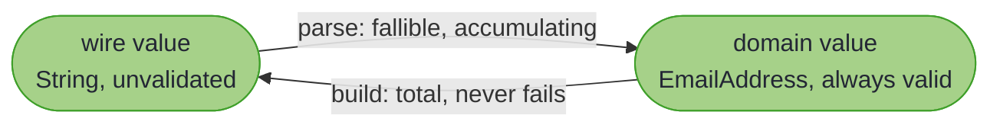
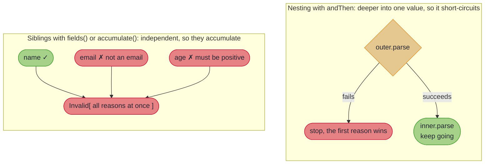

# Validated Prisms

## _The smart-constructor optic: a `Prism` whose match says why not, and all the reasons at once_

~~~admonish example title="See Example Code"
**The code on this page is [ValidatedPrismBook.java](https://github.com/higher-kinded-j/higher-kinded-j/blob/main/hkj-examples/src/main/java/org/higherkindedj/example/book/optics/ValidatedPrismBook.java)** - the page includes it directly, so it is compiled and run by the build.
~~~

~~~admonish info title="What You'll Learn"
- Why a validated boundary needs a fallible, accumulating `parse` and a total `build`: the "parse, don't validate" asymmetry captured as an optic
- Constructing a `ValidatedPrism` with `ValidatedPrism.of`, wrapping a throwing parser with the section law guarded via `ValidatedPrism.canonical`, and landing on the railway with `parsePath`
- How composition splits: `andThen` short-circuits into structure while sibling fields accumulate every reason
- Which compositions preserve the total build (`ValidatedPrism`, `Iso`, and `Prism`-with-a-reason) and why `Lens` cannot
- Bridging the optic lattice with `fromIso`, `fromPrism`, `toPrism`, and `toAffine`
- The two halves, `ValidatedParse` and `ValidatedBuild`, for a boundary crossed one way only
- The two round-trip laws, and why the second forbids a lossy, normalising `build`
~~~

A `Prism<S, A>` answers one question about a value: does it match this shape, yes or no? Its match returns `Optional<A>`, present or empty. At a **validated boundary**, where a raw wire value (a `String` off the network) must become an always-valid domain value (an `EmailAddress`), yes/no is too blunt. A rejected value needs to say *why*, and ideally give *every* reason at once (`"not an email"`, `"too long"`), each located to the field it came from. The reverse direction is never in doubt: a domain value you already hold always renders back to a string.

`ValidatedPrism<S, A>` captures that asymmetry as two directions with different shapes. `parse` is fallible and accumulating; `build` is total:



| Call | Result |
|---|---|
| `parse("  NOPE ")` | `Invalid[ "not an email" ]`, every reason at once |
| `parse("ada@corp.example")` | `Valid(EmailAddress)` |
| `build(addr)` | `"ada@corp.example"`, never fails |

In code:

``` java
import org.higherkindedj.optics.validated.ValidatedPrism;

{{#include ../../../hkj-examples/src/main/java/org/higherkindedj/example/book/optics/ValidatedPrismBook.java:prism}}

{{#include ../../../hkj-examples/src/main/java/org/higherkindedj/example/book/optics/ValidatedPrismBook.java:usage}}
```

---

## Composition: nesting short-circuits, siblings accumulate

Prisms combine in two ways, and the two behave differently when a parse fails.

**Nesting with `andThen` goes deeper into a single value, so it short-circuits.** If the outer parse fails there is no inner value to look at, so the first reason wins and parsing stops. This is the same choice `ValidationPath` makes with `via`.

**Sibling fields accumulate.** To report every bad field of a record at once, parse each field with its own prism and combine the results with [`fields()` / `accumulate()`](../monads/validated_assembly.md) or the [`Edits` builder](multi_edit.md). Because the fields are independent, every reason is collected, not just the first.



Only compositions that preserve the **total build** yield a `ValidatedPrism`:

| Compose with | Result | Notes |
|---|---|---|
| `ValidatedPrism<A, B>` | `ValidatedPrism<S, B>` | parse short-circuits; build composes |
| `Iso<A, B>` | `ValidatedPrism<S, B>` | parse maps through; build round-trips |
| `Prism<A, B>` + a `FieldError` reason | `ValidatedPrism<S, B>` | the reason speaks for the prism's empty case |
| `Lens<A, B>` | Deliberately absent | a lens needs a base to write into, so no total `B -> S` build exists |

---

## Bridging the lattice

- `ValidatedPrism.fromIso(iso)`: a parse that never fails.
- `ValidatedPrism.fromPrism(prism, reason)`: lift a plain prism by supplying the reason its `Optional.empty` cannot express.
- `toPrism()` / `toAffine()`: forget the reasons (the affine's `set` leaves non-parsing sources unchanged, preserving the affine laws).

---

## One direction at a time {#one-direction-at-a-time}

Each direction is also a type of its own. A `ValidatedPrism<S, A>` is both a **`ValidatedParse<S, A>`**, carrying `parse`, `parsePath` and the parse bulk forms, and a **`ValidatedBuild<S, A>`**, carrying `build` and the build bulk forms. Code that needs only one direction asks for that half, so every prism still fits, and so does a boundary that can only be crossed one way:

| Type | Carries | Made with |
|---|---|---|
| `ValidatedPrism<S, A>` | both directions, composition, the lattice bridges | `ValidatedPrism.of(parse, build)`, `canonical`, `fromIso`, `fromPrism` |
| `ValidatedParse<S, A>` | `parse`, `parsePath`, `parseAll`, `parseValues`, `parseKeys`, `parseEntries` | `ValidatedParse.of(parse)` |
| `ValidatedBuild<S, A>` | `build`, `buildAll`, `buildValues`, `buildKeys`, `buildEntries` | `ValidatedBuild.of(build)` |

A half has no round trip, so neither law below applies to it, and `andThen`, `toPrism` and `toAffine`, which need both directions, stay on the prism. All three types are sealed, so a test double is a value built with `of`, never a mock. `parseEntries` takes a `ValidatedParse` for the values and `buildEntries` a `ValidatedBuild`, so either side of a map may be one-directional. A [one-directional bean mapping](../mapping/beans_patch.md#one-directional-beans) exposes its surface as the half it has.

---

## Laws

A lawful validated boundary satisfies both round trips, verified with [`ValidatedPrismLaws`](../tooling/test_assertions.md) from `hkj-test`:

``` java
{{#include ../../../hkj-examples/src/test/java/org/higherkindedj/example/book/optics/ValidatedPrismBookLawsTest.java:laws}}
```

The second law is the subtle one, and it constrains the pair, not either direction alone: every accepted wire value must rebuild to exactly itself: `build(parse(s).get()) == s` whenever `s` parses. `build` is free to define the canonical spelling (zero-padded dates, lowercase hex); what the law demands is that `parse` accept exactly the spelling `build` renders. A normalising parse (trimming whitespace, folding case) accepts an `s` that `build` cannot reproduce, which is exactly the lossy round trip the law forbids. Pick the wire's canonical form (the one `build` renders), accept it alone, and reject every other spelling with a located error.

That discipline need not be hand-written. The natural way to write a codec (wrap a throwing JDK parser, render on the way out) silently violates the section law whenever the parser is more lenient than the renderer (`UUID.fromString` accepts uppercase; `toString` renders lowercase). `ValidatedPrism.canonical(message, parse, render)` builds the guard into the leaf: every accepted source is checked to render back to exactly itself, so the lenient parse is fine. The render defines the canon, and any spelling it cannot reproduce is a located rejection, never a silent normalisation. Any `RuntimeException` from the parse or the render inside the guard is the same located rejection, never an exception on wire input. The canonical form is whatever `render` says it is, so a wire whose canon differs from the JDK's is served lawfully:

``` java
{{#include ../../../hkj-examples/src/main/java/org/higherkindedj/example/book/optics/ValidatedPrismBook.java:canonical}}
```

An overload takes a pre-built `FieldError` in place of the message, the same reason type `fromPrism` takes.

Two obligations stay yours. The parse must accept what the render produces: a mismatched pair (render `dd/MM/uuuu`, parse `MM/dd/uuuu`) breaks the parse-build law *loudly*, as rejections. The subtler trap is a **non-injective render**, which the per-value guard cannot catch: with a two-digit-year date format, `build` renders 1926-07-28 as `26/07/28` (a perfectly parseable spelling, of *2026*-07-28). The guard, which only ever sees one value at a time, cannot object, and the parse-build law breaks silently. Check a custom canon with the laws:

``` java
{{#include ../../../hkj-examples/src/test/java/org/higherkindedj/example/book/optics/ValidatedPrismBookLawsTest.java:canonical_laws}}
```

The stock vocabulary in [`StandardCodecs`](../mapping/codecs.md#standard-codecs) is built on this same factory: lawful codecs for the standard families (identifiers, dates, enums, money), each accepting exactly the canonical form it renders.

---

## The bulk forms {#the-bulk-forms-parseall-and-parsevalues}

One prism lifts over whole containers, accumulating **every** failure and locating each by whatever identifies an element in that container:

| Form | Parses | Each failure locates by |
|---|---|---|
| `parseAll(List<? extends S>)` | every element | its **index** - `emails.1: not an email address`, or `customers.1.email` through a nested spec |
| `parseAll(Set<? extends S>)` | every element | the **element's own rendering** - `emails.nope`; a set has no index |
| `parseAll(S[], IntFunction<A[]>)` | every element | its **index**, as a list. The array constructor supplies the result, since a generic array cannot be created otherwise |
| `parseValues(Map<K, ? extends S>)` | the values; keys pass through | its **key** - `attributes.en: ...` |
| `parseKeys(Map<? extends S, V>)` | the keys; values pass through | the **source** key, naming what the caller sent |
| `parseEntries(Map, ValidatedParse)` | both sides; the receiver parses the **keys** | the source key, so an entry wrong on both sides reports both reasons there |

The [null doctrine](../mapping/basics.md#null-doctrine) reaches inside all of them: a `null` element or map value is a located, accumulating `must not be null`, never an exception, while a `null` container or map key stays the caller's error. A `null` set element is the unlocated `must not contain a null element`, a set holding at most one. Every build direction (`buildAll`, `buildValues`, `buildKeys`, `buildEntries`) is total like `build` and rejects nulls outright.

Mapping is not injective, so a container can **collapse**: a prism mapping both `"1"` and `"01"` to one domain value leaves a smaller set, and the source spellings cannot be recovered. A set drops the duplicate **silently** - the domain values that remain are equal to the ones dropped, so the set still holds every distinct value it was given. Two map keys parsing to one domain key are a located `duplicates an earlier key` instead: there the dropped entry takes its own value with it, and that value need not be equal to anything. Either way the prism doing it already breaks the [section law](#laws), which is what stops a lawful mapping collapsing at all.

(Bracketed index rendering, `emails[1]`, is deliberately deferred to the future sealed path-segment model; today's paths are flat dotted segments, and the positional segment matches the map-key grammar.)

---

~~~admonish info title="Key Takeaways"
* **`parse` is fallible and accumulating** (`Validated<NonEmptyList<FieldError>, A>`); **`build` is total**: the parse-don't-validate asymmetry as an optic
* **Nesting short-circuits; siblings accumulate** via the assembly builders or `Edits`
* **Only build-preserving compositions exist**: `ValidatedPrism`, `Iso`, and `Prism`-with-a-reason; `Lens` deliberately not
* **Both round-trip laws are published** in `hkj-test`; the section law forbids lossy build-normalisation
* **`canonical(message, parse, render)` guards the section law per value**: the render defines the canonical form and every spelling it cannot reproduce is rejected; that the parse accepts the renderings, injectively, stays your obligation (check with `ValidatedPrismLaws`)
* **One prism lifts over containers**: The bulk forms accumulate every element failure, located by index or key
* **`parsePath` lands on the railway** (`ValidationPath`) directly
* **Each direction is a type of its own**: `ValidatedParse` and `ValidatedBuild` serve a boundary crossed one way, and every prism is both
~~~

~~~admonish info title="Hands-On Learning"
Practice the boundary in [Tutorial 25: ValidatedPrism](https://github.com/higher-kinded-j/higher-kinded-j/blob/main/hkj-examples/src/test/java/org/higherkindedj/tutorial/optics/Tutorial25_ValidatedPrism.java) (3 exercises, ~10 minutes), and see the runnable [`ValidatedPrismExample`](https://github.com/higher-kinded-j/higher-kinded-j/blob/main/hkj-examples/src/main/java/org/higherkindedj/example/optics/ValidatedPrismExample.java).
~~~

~~~admonish tip title="See Also"
- [Prisms](prisms.md): the yes/no match this type upgrades
- [Accumulating Assembly](../monads/validated_assembly.md): sibling-field accumulation for multi-field parses
- [Multi-Edit and Sparse Updates](multi_edit.md): the update-side counterpart
- [Record Mapping](../mapping/ch_intro.md): `@GenerateMapping` derives whole-record `parse`/`build` from these leaves
~~~

---

**Previous:** [Prism Toolkit](prism_toolkit.md)
**Next:** [Affines](affine.md)
