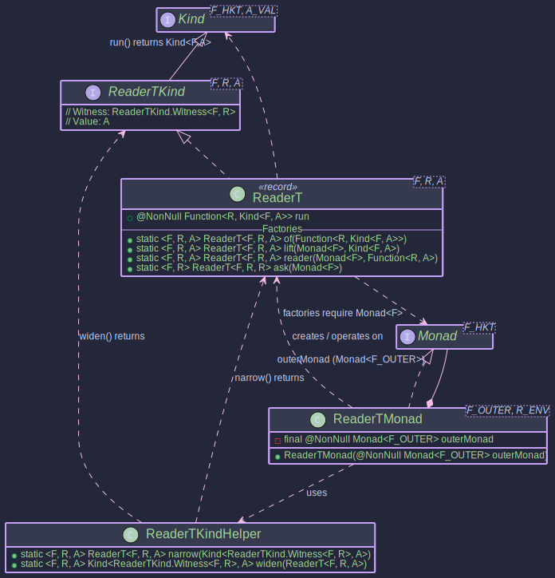

# ReaderT - Combining Monadic Effects with a Read-Only Environment

## `ReaderT` Monad Transformer

The `ReaderT` monad transformer (short for Reader Transformer) allows you to combine the capabilities of the `Reader` monad (providing a read-only environment `R`) with another outer monad `F`. It encapsulates a computation that, given an environment `R`, produces a result within the monadic context `F` (i.e., `Kind<F, A>`).

This is particularly useful when you have operations that require some configuration or context (`R`) and also involve other effects managed by `F`, such as asynchronicity (`CompletableFutureKind`), optionality (`OptionalKind`, `MaybeKind`), or error handling (`EitherKind`).

The `ReaderT<F, R, A>` structure essentially wraps a function `R -> Kind<F, A>`.

## Structure



## `ReaderT<F, R, A>`: The Core Data Type

`ReaderT<F, R, A>` is a record that encapsulates the core computation.

```java
public record ReaderT<F, R, A>(@NonNull Function<R, Kind<F, A>> run)
    implements ReaderTKind<F, R, A> {
  // ... static factory methods ...
}
```

* **`F`**: The witness type of the **outer monad** (e.g., `OptionalKind.Witness`, `CompletableFutureKind.Witness`). This monad handles an effect such as optionality or asynchronicity.
* **`R`**: The type of the **read-only environment** (context or configuration) that the computation depends on.
* **`A`**: The type of the value produced by the computation, wrapped within the outer monad `F`.
* **`run`**: The essential function `R -> Kind<F, A>`. When this function is applied to an environment of type `R`, it yields a monadic value `Kind<F, A>`.

## `ReaderTKind<F, R, A>`: The Witness Type

To integrate with Higher-Kinded-J's generic programming capabilities, `ReaderTKind<F, R, A>` serves as the witness type.

* It extends `Kind<G, A>`, where `G` (the witness for the combined `ReaderT` monad) is `ReaderTKind.Witness<F, R>`.
* The types `F` (outer monad) and `R` (environment) are fixed for a specific `ReaderT` context, while `A` is the variable value type.

```java
public interface ReaderTKind<F, R, A> extends Kind<ReaderTKind.Witness<F, R>, A> {
  // Witness type G = ReaderTKind.Witness<F, R>
  // Value type A = A
}
```

## `ReaderTKindHelper`: Utility for Wrapping and Unwrapping

`ReaderTKindHelper` provides READER_T enum essential utility methods to convert between the concrete `ReaderT<F, R, A>` type and its `Kind` representation (`Kind<ReaderTKind.Witness<F, R>, A>`).

```java
public enum ReaderTKindHelper {
   READER_T;
  
    // Unwraps Kind<ReaderTKind.Witness<F, R>, A> to ReaderT<F, R, A>
    public <F, R, A> @NonNull ReaderT<F, R, A> narrow(
        @Nullable Kind<ReaderTKind.Witness<F, R>, A> kind);

    // Wraps ReaderT<F, R, A> into ReaderTKind<F, R, A>
    public <F, R, A> @NonNull ReaderTKind<F, R, A> widen(
        @NonNull ReaderT<F, R, A> readerT);
}
```


## `ReaderTMonad<F, R>`: Operating on `ReaderT`

The `ReaderTMonad<F, R>` class implements the `Monad<ReaderTKind.Witness<F, R>>` interface, providing the standard monadic operations (`of`, `map`, `flatMap`, `ap`) for the `ReaderT` structure.

* It requires a `Monad<F>` instance for the outer monad `F` to be provided during its construction. This `outerMonad` is used internally to sequence operations within the `F` context.
* `R` is the fixed environment type for this monad instance.

```java
// Example: F = OptionalKind.Witness, R = AppConfig
// 1. Get the Monad instance for the outer monad F
OptionalMonad optionalMonad = OptionalMonad.INSTANCE;

// 2. Define your environment type
record AppConfig(String apiKey) {}

// 3. Create the ReaderTMonad
ReaderTMonad<OptionalKind.Witness, AppConfig> readerTOptionalMonad =
    new ReaderTMonad<>(optionalMonad);

// Now 'readerTOptionalMonad' can be used to operate on 
// Kind<ReaderTKind.Witness<OptionalKind.Witness, AppConfig>, A> values.
```
~~~admonish info title="Key Operations with _ReaderTMonad_"

* **`readerTMonad.of(value)`**: Lifts a pure value `A` into the `ReaderT` context. The underlying function becomes `r -> outerMonad.of(value)`. Result: `ReaderT(r -> F<A>)`.
* **`readerTMonad.map(func, readerTKind)`**: Applies a function `A -> B` to the value `A` inside the `ReaderT` structure, if present and successful within the `F` context. The transformation `A -> B` happens within the `outerMonad.map` call. Result: `ReaderT(r -> F<B>)`.
* **`readerTMonad.flatMap(func, readerTKind)`**: The core sequencing operation. Takes a function `A -> Kind<ReaderTKind.Witness<F, R>, B>` (which is effectively `A -> ReaderT<F, R, B>`). It runs the initial `ReaderT` with the environment `R` to get `Kind<F, A>`. Then, it uses `outerMonad.flatMap` to process this. If `Kind<F, A>` yields an `A`, `func` is applied to `a` to get a new `ReaderT<F, R, B>`. This new `ReaderT` is then also run with the *same original environment*`R` to yield `Kind<F, B>`. This allows composing computations that all depend on the same environment `R` while also managing the effects of `F`. Result: `ReaderT(r -> F<B>)`.
~~~

~~~admonish title="Creating _ReaderT_ Instances"

You typically create `ReaderT` instances using its static factory methods. These methods often require an instance of `Monad<F>` for the outer monad.

```java
 public void createExample(){
  // --- Setup ---
  // Outer Monad F = OptionalKind.Witness
  OptionalMonad optMonad = OptionalMonad.INSTANCE;

  // Environment Type R
  record Config(String setting) {
  }
  Config testConfig = new Config("TestValue");

  // --- Factory Methods ---

  // 1. `ReaderT.of(Function<R, Kind<F, A>> runFunction)`
  //    Constructs directly from the R -> F<A> function.
  Function<Config, Kind<OptionalKind.Witness, String>> runFn1 =
      cfg -> OPTIONAL.widen(Optional.of("Data based on " + cfg.setting()));
  ReaderT<OptionalKind.Witness, Config, String> rt1 = ReaderT.of(runFn1);
  // To run: OPTIONAL.narrow(rt1.run().apply(testConfig)) is Optional.of("Data based on TestValue")
  System.out.println(OPTIONAL.narrow(rt1.run().apply(testConfig)));

  // 2. `ReaderT.lift(Monad<F> outerMonad, Kind<F, A> fa)`
  //    Lifts an existing monadic value `Kind<F, A>` into ReaderT.
  //    The resulting ReaderT ignores the environment R and always returns `fa`.
  Kind<OptionalKind.Witness, Integer> optionalValue = OPTIONAL.widen(Optional.of(123));
  ReaderT<OptionalKind.Witness, Config, Integer> rt2 = ReaderT.lift(optMonad, optionalValue);
  // To run: OPTIONAL.narrow(rt2.run().apply(testConfig)) is Optional.of(123)
  System.out.println(OPTIONAL.narrow(rt2.run().apply(testConfig)));

  Kind<OptionalKind.Witness, Integer> emptyOptional = OPTIONAL.widen(Optional.empty());
  ReaderT<OptionalKind.Witness, Config, Integer> rt2Empty = ReaderT.lift(optMonad, emptyOptional);
  // To run: OPTIONAL.narrow(rt2Empty.run().apply(testConfig)) is Optional.empty()


  // 3. `ReaderT.reader(Monad<F> outerMonad, Function<R, A> f)`
  //    Creates a ReaderT from a function R -> A. The result A is then lifted into F using outerMonad.of(A).
  Function<Config, String> simpleReaderFn = cfg -> "Hello from " + cfg.setting();
  ReaderT<OptionalKind.Witness, Config, String> rt3 = ReaderT.reader(optMonad, simpleReaderFn);
  // To run: OPTIONAL.narrow(rt3.run().apply(testConfig)) is Optional.of("Hello from TestValue")
  System.out.println(OPTIONAL.narrow(rt3.run().apply(testConfig)));

  // 4. `ReaderT.ask(Monad<F> outerMonad)`
  //    Creates a ReaderT that, when run, provides the environment R itself as the result, lifted into F.
  //    The function is r -> outerMonad.of(r).
  ReaderT<OptionalKind.Witness, Config, Config> rt4 = ReaderT.ask(optMonad);
  // To run: OPTIONAL.narrow(rt4.run().apply(testConfig)) is Optional.of(new Config("TestValue"))
  System.out.println(OPTIONAL.narrow(rt4.run().apply(testConfig)));

  // --- Using ReaderTKindHelper.READER_T to widen/narrow for Monad operations ---
  //    Avoid a cast with var ReaderTKind<OptionalKind.Witness, Config, String> kindRt1 =
  //        (ReaderTKind<OptionalKind.Witness, Config, String>) READER_T.widen(rt1);
  var kindRt1 = READER_T.widen(rt1);
  ReaderT<OptionalKind.Witness, Config, String> unwrappedRt1 = READER_T.narrow(kindRt1);
}
```
~~~

~~~admonish example title="Example: `ReaderT` for Actions Returning `Unit`"

Sometimes, a computation dependent on an environment `R` and involving an outer monad `F` might perform an action (e.g., logging, initializing a resource, sending a fire-and-forget message) without producing a specific data value. In such cases, the result type `A` of `ReaderT<F, R, A>` can be `org.higherkindedj.hkt.unit.Unit`.

Let's extend the asynchronous example to include an action that logs a message using the `AppConfig` and completes asynchronously, returning `Unit`.

- [ReaderTAsyncUnitExample.java](https://github.com/higher-kinded-j/higher-kinded-j/tree/main/src/main/java/org/higherkindedj/example/basic/trans/readert/ReaderTAsyncUnitExample.java)

```java
    // Action: Log a message using AppConfig, complete asynchronously returning F<Unit>
    public static Kind<CompletableFutureKind.Witness, Unit> logInitializationAsync(AppConfig config) {
        CompletableFuture<Unit> future = CompletableFuture.runAsync(() -> {
            System.out.println("Thread: " + Thread.currentThread().getName() +
                " - Initializing component with API Key: " + config.apiKey() +
                " for Service URL: " + config.serviceUrl());
            // Simulate some work
            try {
                TimeUnit.MILLISECONDS.sleep(50);
            } catch (InterruptedException e) {
                Thread.currentThread().interrupt();
                throw new RuntimeException(e);
            }
            System.out.println("Thread: " + Thread.currentThread().getName() +
                " - Initialization complete for: " + config.serviceUrl());
        }, config.executor()).thenApply(v -> Unit.INSTANCE); // Ensure CompletableFuture<Unit>
        return FUTURE.widen(future);
    }

    // Wrap the action in ReaderT: R -> F<Unit>
    public static ReaderT<CompletableFutureKind.Witness, AppConfig, Unit> initializeComponentRT() {
        return ReaderT.of(ReaderTAsyncUnitExample::logInitializationAsync);
    }

    public static void main(String[] args) {
        ExecutorService executor = Executors.newFixedThreadPool(2);
        AppConfig prodConfig = new AppConfig("prod_secret_for_init", "[https://init.prod.service](https://init.prod.service)", executor);

        // Get the ReaderT for the initialization action
        ReaderT<CompletableFutureKind.Witness, AppConfig, Unit> initAction = initializeComponentRT();

        System.out.println("--- Running Initialization Action with Prod Config ---");
        // Run the action by providing the prodConfig environment
        // This returns Kind<CompletableFutureKind.Witness, Unit>
        Kind<CompletableFutureKind.Witness, Unit> futureUnit = initAction.run().apply(prodConfig);

        // Wait for completion and get the Unit result (which is just Unit.INSTANCE)
        Unit result = FUTURE.join(futureUnit);
        System.out.println("Initialization Result: " + result); // Expected: Initialization Result: ()

        executor.shutdown();
        try {
            if (!executor.awaitTermination(5, TimeUnit.SECONDS)) {
                executor.shutdownNow();
            }
        } catch (InterruptedException e) {
            executor.shutdownNow();
            Thread.currentThread().interrupt();
        }
    }
```
This example illustrates:

- An asynchronous action (`logInitializationAsync`) that depends on `AppConfig` but logically returns no specific data, so its result is `CompletableFuture<Unit>`.
- This action is wrapped into a `ReaderT<CompletableFutureKind.Witness, AppConfig, Unit>`.
- When this `ReaderT` is run with an `AppConfig`, it yields a `Kind<CompletableFutureKind.Witness, Unit>`.
- The final result of joining such a future is `Unit.INSTANCE`, signifying successful completion of the effectful, environment-dependent action.


~~~


~~~admonish example title="Example: Configuration-Dependent Asynchronous Service Calls"

Let's illustrate `ReaderT` by combining an environment dependency (`AppConfig`) with an asynchronous operation (`CompletableFuture`).

```java

public class ReaderTAsyncExample {
  // --- Monad Setup ---
  // Outer Monad F = CompletableFutureKind.Witness
  static final Monad<CompletableFutureKind.Witness> futureMonad = new CompletableFutureMonad();
  // ReaderTMonad for AppConfig and CompletableFutureKind
  static final ReaderTMonad<CompletableFutureKind.Witness, AppConfig> cfReaderTMonad =
      new ReaderTMonad<>(futureMonad);

  // Simulates an async call to an external service
  public static Kind<CompletableFutureKind.Witness, ServiceData> fetchExternalData(AppConfig config, String itemId) {
    System.out.println("Thread: " + Thread.currentThread().getName() + " - Fetching external data for " + itemId + " using API key: " + config.apiKey() + " from " + config.serviceUrl());
    CompletableFuture<ServiceData> future = CompletableFuture.supplyAsync(() -> {
      try {
        TimeUnit.MILLISECONDS.sleep(100); // Simulate network latency
      } catch (InterruptedException e) {
        Thread.currentThread().interrupt();
        throw new RuntimeException(e);
      }
      return new ServiceData("Raw data for " + itemId + " from " + config.serviceUrl());
    }, config.executor());
    return FUTURE.widen(future);
  }

  // Operation 1: Fetch data, wrapped in ReaderT
  // This is R -> F<A> which is the core of ReaderT
  public static ReaderT<CompletableFutureKind.Witness, AppConfig, ServiceData> fetchServiceDataRT(String itemId) {
    return ReaderT.of(appConfig -> fetchExternalData(appConfig, itemId));
  }

  // Operation 2: Process data (sync part, depends on AppConfig, then lifts to ReaderT)
  // This uses ReaderT.reader: R -> A, then A is lifted to F<A>
  public static ReaderT<CompletableFutureKind.Witness, AppConfig, ProcessedData> processDataRT(ServiceData sData) {
    return ReaderT.reader(futureMonad, // Outer monad to lift the result
        appConfig -> { // Function R -> A (Config -> ProcessedData)
          System.out.println("Thread: " + Thread.currentThread().getName() + " - Processing data with config: " + appConfig.apiKey());
          return new ProcessedData("Processed: " + sData.rawData().toUpperCase() + " (API Key Suffix: " + appConfig.apiKey().substring(Math.max(0, appConfig.apiKey().length() - 3)) + ")");
        });
  }


  // --- Service Logic (depends on AppConfig, returns Future<ServiceData>) ---

  public static void main(String[] args) throws Exception {
    ExecutorService executor = Executors.newFixedThreadPool(2);
    AppConfig prodConfig = new AppConfig("prod_secret_key_xyz", "https://api.prod.example.com", executor);
    AppConfig stagingConfig = new AppConfig("stag_test_key_123", "https://api.staging.example.com", executor);

    // --- Composing with ReaderTMonad.flatMap ---
    // Define a workflow: fetch data, then process it.
    // The AppConfig is threaded through automatically by ReaderT.
    Kind<ReaderTKind.Witness<CompletableFutureKind.Witness, AppConfig>, ProcessedData> workflowRTKind =
        cfReaderTMonad.flatMap(
            serviceData -> READER_T.widen(processDataRT(serviceData)), // ServiceData -> ReaderTKind<..., ProcessedData>
            READER_T.widen(fetchServiceDataRT("item123")) // Initial ReaderTKind<..., ServiceData>
        );

    // Unwrap to the concrete ReaderT to run it
    ReaderT<CompletableFutureKind.Witness, AppConfig, ProcessedData> composedWorkflow =
        READER_T.narrow(workflowRTKind);

    // --- Running the workflow with different configurations ---

    System.out.println("--- Running with Production Config ---");
    // Run the workflow by providing the 'prodConfig' environment
    // This returns Kind<CompletableFutureKind.Witness, ProcessedData>
    Kind<CompletableFutureKind.Witness, ProcessedData> futureResultProd = composedWorkflow.run().apply(prodConfig);
    ProcessedData resultProd = FUTURE.join(futureResultProd); // Blocks for result
    System.out.println("Prod Result: " + resultProd);
    // Expected output will show "prod_secret_key_xyz", "[https://api.prod.example.com](https://api.prod.example.com)" in logs
    // and "Processed: RAW DATA FOR ITEM123 FROM [https://api.prod.example.com](https://api.prod.example.com) (API Key Suffix: xyz)"


    System.out.println("\n--- Running with Staging Config ---");
    // Run the same workflow with 'stagingConfig'
    Kind<CompletableFutureKind.Witness, ProcessedData> futureResultStaging = composedWorkflow.run().apply(stagingConfig);
    ProcessedData resultStaging = FUTURE.join(futureResultStaging); // Blocks for result
    System.out.println("Staging Result: " + resultStaging);
    // Expected output will show "stag_test_key_123", "[https://api.staging.example.com](https://api.staging.example.com)" in logs
    // and "Processed: RAW DATA FOR ITEM123 FROM [https://api.staging.example.com](https://api.staging.example.com) (API Key Suffix: 123)"


    // --- Another example: Using ReaderT.ask ---
    ReaderT<CompletableFutureKind.Witness, AppConfig, AppConfig> getConfigSettingRT =
        ReaderT.ask(futureMonad); // Provides the whole AppConfig

    Kind<ReaderTKind.Witness<CompletableFutureKind.Witness, AppConfig>, String> getServiceUrlRT =
        cfReaderTMonad.map(
            (AppConfig cfg) -> "Service URL from ask: " + cfg.serviceUrl(),
            READER_T.widen(getConfigSettingRT)
        );

    String stagingServiceUrl = FUTURE.join(
        READER_T.narrow(getServiceUrlRT).run().apply(stagingConfig)
    );
    System.out.println("\nStaging Service URL via ask: " + stagingServiceUrl);


    executor.shutdown();
    try {
      if (!executor.awaitTermination(5, TimeUnit.SECONDS)) {
        executor.shutdownNow();
      }
    } catch (InterruptedException e) {
      executor.shutdownNow();
      Thread.currentThread().interrupt();
    }
  }

  // --- ReaderT-based Service Operations ---

  // --- Environment ---
  record AppConfig(String apiKey, String serviceUrl, ExecutorService executor) {
  }

  // --- Service Response ---
  record ServiceData(String rawData) {
  }

  record ProcessedData(String info) {
  }
}
```


**This** example demonstrates:

1. Defining an `AppConfig` environment.
2. Creating service operations (`WorkspaceServiceDataRT`, `processDataRT`) that return `ReaderT<CompletableFutureKind, AppConfig, A>`. These operations implicitly depend on `AppConfig`.
3. Using `cfReaderTMonad.flatMap` to chain these operations. The `AppConfig` is passed implicitly through the chain.
4. Executing the composed workflow (`composedWorkflow.run().apply(config)`) by providing a specific `AppConfig`. This "injects" the dependency at the very end.
5. The asynchronicity from `CompletableFuture` is handled by the `futureMonad` within `ReaderTMonad` and `ReaderT`'s factories.
6. Using `ReaderT.ask` to directly access the configuration within a `ReaderT` computation.
~~~

~~~ admonish important  title="Key Points:"
`ReaderT` simplifies managing computations that require a shared, read-only environment while also dealing with other monadic effects, leading to cleaner, more composable, and testable code by deferring environment injection.
~~~