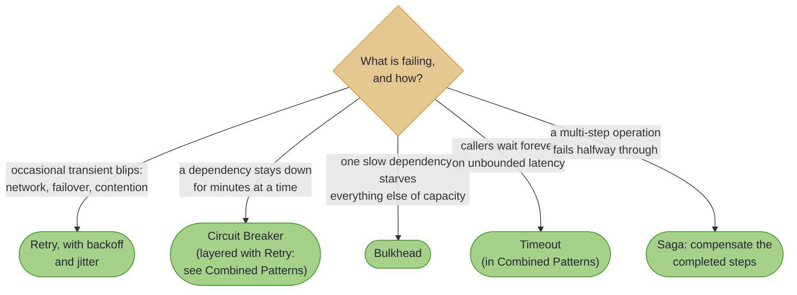

# Resilience Patterns

> *"Success consists of going from failure to failure without loss of enthusiasm."*
>
> — attributed to Winston Churchill

---

A retry loop, distilled to its essence. Churchill was describing political life, but the sentiment maps precisely onto what a well-designed distributed system does dozens of times per second. The database times out; the system retries with a longer delay. The upstream service returns a 503; the circuit breaker trips, waits, then cautiously probes again. Each failure is met not with panic but with a policy: how long to wait, how many times to try, when to stop trying, and what to do instead.

This chapter introduces four resilience patterns that encode this discipline into your code. A **Retry** policy re-attempts transient failures with configurable backoff strategies. A **Circuit Breaker** remembers recent failures and prevents your system from wasting effort on a dependency that is clearly down. A **Bulkhead** limits how many concurrent callers can access a shared resource, so that one slow service cannot consume all available capacity. A **Saga** coordinates multi-step operations with compensation logic, so that when step four of five fails, the earlier steps are automatically undone. A fifth tool, the plain **timeout**, bounds them all; it has no page of its own and lives with the layering rules in [Combined Patterns](combined.md).

Here is the destination, before any theory: one step of an order pipeline, guarded on the [typed railway](../effect/effect_path_overview.md). The whole policy is visible in the chain, and the time budget lands as a typed `Left` on the same channel as every other domain error:

<!-- verify -->
```java
VResultPath<OrderError, Reservation> guarded =
    reserveInventory(order)
        .withRetry(error -> error instanceof OrderError.SystemError,
            RetryPolicy.exponentialBackoffWithJitter(3, Duration.ofMillis(200)))
        .withTimeout(Duration.ofSeconds(5),
            () -> OrderError.SystemError.timeout("inventory", Duration.ofSeconds(5)));

// a blown time budget arrives as Left(SystemError: inventory timed out),
// on the same channel as "out of stock"
```

Fluent order is nesting order: each combinator wraps everything before it, so here the timeout bounds the whole retry loop, including its backoff waits, which is exactly the position a timeout belongs in. [Combined Patterns](combined.md) has the full layering rules.

Resilience here is not an annotation or a wrapper class: it is the same fluent vocabulary you already use for `map` and `via` (`withRetry`, `withTimeout`, `withCircuitBreaker`, `withBulkhead`), lazy and composable across the Path family. (One wrinkle, the eager `EitherPath` taking each step as a `Supplier`, is explained on the [Retry](retry.md) page.)

~~~admonish tip title="Why this matters"
On the typed-error carriers the combinators are **railway-aware**: a business `Left` ("card declined", "out of stock") is an answer, not a fault, so it is never retried and never counts as a circuit-breaker failure. [Retry](retry.md) and [Circuit Breaker](circuit_breaker.md) each show what that buys.
~~~

## Which pattern do you need?



A critical dependency usually needs several at once; [Combined Patterns](combined.md) layers them in the correct order with one builder.

## How to read this chapter

[Retry](retry.md) is the 80% case: most transient failure is solved there, and the page introduces the policy vocabulary the other patterns reuse. Read [Combined Patterns](combined.md) before shipping anything critical, because the *ordering* of layered patterns changes their meaning. In between, the decision flow above routes you to [Circuit Breaker](circuit_breaker.md), [Bulkhead](bulkhead.md), or [Saga](saga.md) as a failure mode calls for them.

---

~~~admonish info title="In This Chapter"
- **Retry** – `RetryPolicy` configuration with fixed, exponential, and jittered backoff strategies. Selective retry based on exception type. Path-native `withRetry` on every carrier, including railway-aware typed retry on `EitherPath` and `VResultPath`.

- **Circuit Breaker** – A state machine that tracks dependency health across three states (closed, open, half-open). Protects recovering services from being overwhelmed by callers that have not yet noticed the failure.

- **Bulkhead** – Semaphore-based concurrency limiting that prevents a single slow dependency from exhausting shared capacity. Configurable permits, fairness, and timeout behaviour.

- **Saga** – Compensating transactions for multi-step distributed operations. Each forward step registers a corresponding undo action; on failure, compensations execute in reverse order to restore consistency.

- **Combined Patterns** – Composing multiple resilience patterns into layered defences. The `ResilienceBuilder` applies patterns in the correct order: timeout outermost, then bulkhead, then retry, then circuit breaker innermost. Plus the per-carrier availability table for the path-native `with*` combinators and a worked per-step example.
~~~

~~~admonish example title="See Example Code"
- [ResilienceExample.java](https://github.com/higher-kinded-j/higher-kinded-j/blob/main/hkj-examples/src/main/java/org/higherkindedj/example/effect/ResilienceExample.java): Retry policies, backoff strategies, and combined patterns
- [ConfigurableOrderWorkflow.java](https://github.com/higher-kinded-j/higher-kinded-j/blob/main/hkj-examples/src/main/java/org/higherkindedj/example/order/workflow/ConfigurableOrderWorkflow.java): Production-style per-step resilience; retry confined to an idempotent pre-flight, the commit run exactly once under a typed timeout
~~~

~~~admonish info title="Hands-On Learning"
Practise the whole chapter in the [Resilience Patterns Tutorials](../tutorials/resilience/resilience_journey.md) (4 tutorials, ~40 minutes): circuit breaker, saga, retry with bulkhead, and Path API resilience.
~~~

---

## Chapter Contents

1. [Retry](retry.md) - Backoff strategies, selective retry, and exhaustion handling
2. [Circuit Breaker](circuit_breaker.md) - State machine, configuration, and service protection
3. [Bulkhead](bulkhead.md) - Concurrency limiting and resource isolation
4. [Saga](saga.md) - Compensating transactions and distributed consistency
5. [Combined Patterns](combined.md) - Layered resilience and the ResilienceBuilder

---

**Previous:** [Patterns and Recipes](../effect/patterns.md)
**Next:** [Retry](retry.md)
