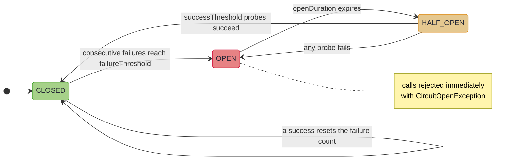

# Circuit Breaker: Learning When to Stop

~~~admonish info title="What You'll Learn"
- How the circuit breaker state machine works (CLOSED, OPEN, HALF_OPEN)
- How to configure failure thresholds, recovery timeouts, and call timeouts
- How to protect VTask operations with a shared circuit breaker
- How to chain `withCircuitBreaker` on Path carriers, and why a `Left` never trips the circuit
- How to use fallbacks when the circuit is open
- How to monitor circuit breaker health via metrics
~~~

---

A retry policy assumes that trying again will eventually work. Sometimes it will not. If the database is down, retrying every 200 milliseconds for the next 30 seconds just generates 150 doomed requests. The service needs time to recover, and hammering it with traffic makes recovery harder.

A circuit breaker solves this by tracking recent failures and, when enough accumulate, *stopping* calls entirely for a cooling-off period. After the period expires, it cautiously allows a single probe request through. If the probe succeeds, normal traffic resumes. If it fails, the circuit re-opens.

## The State Machine



| State | Behaviour | Transitions to |
|-------|-----------|----------------|
| **CLOSED** | All calls allowed. Consecutive failures counted. | OPEN (when failures reach threshold) |
| **OPEN** | All calls rejected immediately with `CircuitOpenException`. | HALF_OPEN (after open duration expires) |
| **HALF_OPEN** | One probe call allowed. | CLOSED (probe succeeds) or OPEN (probe fails) |

## Configuration

```java
CircuitBreakerConfig config = CircuitBreakerConfig.builder()
    .failureThreshold(5)                      // 5 failures before opening
    .successThreshold(3)                      // 3 probes must succeed to close
    .openDuration(Duration.ofSeconds(30))     // Stay open for 30 seconds
    .callTimeout(Duration.ofSeconds(5))       // Each call times out after 5s
    .recordFailure(ex ->                      // Only count certain exceptions
        !(ex instanceof BusinessValidationException))
    .build();
```

| Setting | Default | Description |
|---------|---------|-------------|
| `failureThreshold` | 5 | Consecutive failures before the circuit opens |
| `successThreshold` | 1 | Successful probes in HALF_OPEN before closing |
| `openDuration` | 60s | How long the circuit stays open |
| `callTimeout` | 10s | Timeout applied to each protected call |
| `recordFailure` | all exceptions | Predicate determining which exceptions count |

The `recordFailure` predicate is important: not every exception means the service is unhealthy. A `400 Bad Request` or a business validation error reflects a problem with the *request*, not the *service*. Only count failures that indicate the service itself is struggling.

## Creating a Circuit Breaker

```java
// With custom configuration
CircuitBreaker breaker = CircuitBreaker.create(config);

// With sensible defaults
CircuitBreaker breaker = CircuitBreaker.withDefaults();
```

## Protecting VTask Operations

The `protect()` method is generic. A single circuit breaker instance can protect calls that return different types:

```java
CircuitBreaker paymentBreaker = CircuitBreaker.create(
    CircuitBreakerConfig.builder()
        .failureThreshold(3)
        .openDuration(Duration.ofSeconds(30))
        .build());

// Protects a call returning String
VTask<String> getStatus = paymentBreaker.protect(
    VTask.of(() -> paymentService.getStatus(orderId)));

// Same breaker protects a call returning BigDecimal
VTask<BigDecimal> getBalance = paymentBreaker.protect(
    VTask.of(() -> paymentService.getBalance(accountId)));

// Both share state: failures from either call count towards the threshold
```

This is the correct design. A circuit breaker protects a *service endpoint*, not a specific return type.

## Fallbacks

When the circuit is open, `protect()` throws `CircuitOpenException`. Use `protectWithFallback()` to provide a default value instead:

```java
VTask<String> withFallback = paymentBreaker.protectWithFallback(
    VTask.of(() -> paymentService.getStatus(orderId)),
    ex -> "status-unavailable");
```

Or compose with `recover()` for more control:

```java
VTask<String> resilient = paymentBreaker.protect(
        VTask.of(() -> paymentService.getStatus(orderId)))
    .recover(ex -> {
        if (ex instanceof CircuitOpenException coe) {
            log.warn("Payment service down, retry after {}", coe.retryAfter());
            return cachedStatus(orderId);
        }
        return "unknown";
    });
```

## Path-Native Circuit Breakers

The lazy Path carriers chain breaker protection directly, with the same shareable breaker:

```java
IOPath<String> guarded = Path.io(() -> paymentService.getStatus(orderId))
    .withCircuitBreaker(paymentBreaker);

VTaskPath<String> guardedAsync = Path.vtask(() -> paymentService.getStatus(orderId))
    .withCircuitBreaker(paymentBreaker);
```

On the typed-error carriers the breaker is railway-aware: a `Left` is a *successfully computed value* (the service answered, just not with a `Right`), so it does **not** count as a breaker failure. Only thrown exceptions (defects) trip the circuit. A stream of "customer not found" responses will never open the circuit; a stream of connection resets will.

~~~admonish tip title="Why this matters"
A circuit breaker measures *service health*, not business outcomes. A breaker that counts every non-success trips on a healthy service the moment clients send a burst of bad requests, taking the service away from everyone else exactly when it was answering correctly. On the typed carriers the largest class of non-successes, business `Left`s, is excluded by construction; `recordFailure` then only has to classify what still arrives as a thrown exception.
~~~

The typed overloads keep an open-circuit rejection on the typed channel instead of surfacing `CircuitOpenException`:

```java
// VResultPath: instance combinator, rejection lands as a Left
VResultPath<OrderError, Reservation> guarded =
    reserveInventory(order)
        .withCircuitBreaker(
            inventoryBreaker,
            open -> OrderError.SystemError.circuitBreakerOpen("inventory"));

// EitherPath is eager, so the combinator is static and takes the step as a Supplier
EitherPath<OrderError, Reservation> reserved = EitherPath.withCircuitBreaker(
    () -> reserveInventory(order),
    inventoryBreaker,
    open -> OrderError.SystemError.circuitBreakerOpen("inventory"));
```

Without the `onOpen` argument, the rejection propagates as-is: a thrown `CircuitOpenException` on `EitherPath`, a defect on the `VTask` failure channel for `VResultPath`.

## Metrics

```java
CircuitBreakerMetrics m = breaker.metrics();

log.info("Circuit breaker: total={}, success={}, failed={}, rejected={}, transitions={}",
    m.totalCalls(), m.successfulCalls(), m.failedCalls(),
    m.rejectedCalls(), m.stateTransitions());
```

| Metric | Description |
|--------|-------------|
| `totalCalls` | Total calls attempted (including rejected) |
| `successfulCalls` | Calls that completed successfully |
| `failedCalls` | Calls that failed (counted by the failure predicate) |
| `rejectedCalls` | Calls rejected because the circuit was open |
| `stateTransitions` | Number of state transitions |
| `lastStateChange` | When the last transition occurred |

## Manual Control

```java
// Reset to CLOSED with zeroed counters
breaker.reset();

// Manually trip to OPEN (e.g., during maintenance)
breaker.tripOpen();

// Inspect current state
CircuitBreaker.Status status = breaker.currentStatus();
```

## Combining with Retry

A common pattern is to combine circuit breaker with retry. The order matters:

```java
// Circuit breaker inside retry: each retry attempt checks the circuit
VTask<String> resilient = Retry.retryTask(
    paymentBreaker.protect(VTask.of(() -> paymentService.get(url))),
    RetryPolicy.exponentialBackoff(3, Duration.ofMillis(200))
        .retryIf(ex -> !(ex instanceof CircuitOpenException)));
```

Note the retry predicate: `CircuitOpenException` should *not* be retried, because the circuit breaker has already determined the service is unhealthy. [Combined Patterns](combined.md) introduces `ResilienceBuilder`, which applies this ordering for you without manual wiring.

~~~admonish info title="Key Takeaways"
* **Three states**: CLOSED counts consecutive failures and opens at `failureThreshold`; OPEN rejects instantly for `openDuration`
* **Recovery is probed**: HALF_OPEN needs `successThreshold` probe successes to close, and any probe failure re-opens
* **One breaker per protected endpoint**: `protect()` is generic, so a single instance guards every call to that endpoint and they share failure state; unrelated endpoints get their own breakers
* **Only faults trip it**: on the typed carriers a business `Left` never counts; the `onOpen` overload lands rejections as typed `Left`s
* **Tune `recordFailure`**: a 400 or a validation error reflects the request, not the service; count only what signals an unhealthy dependency
~~~

~~~admonish tip title="See Also"
- [Retry](retry.md) - backoff strategies and retry configuration
- [Bulkhead](bulkhead.md) - concurrency limiting
- [Combined Patterns](combined.md) - composing all patterns with ResilienceBuilder
~~~

---

**Previous:** [Retry](retry.md)
**Next:** [Bulkhead](bulkhead.md)
