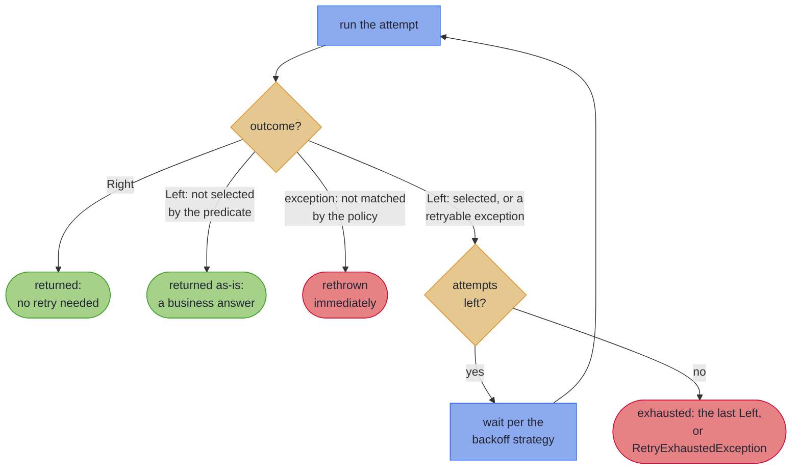

# Retry: Patience as Policy

~~~admonish info title="What You'll Learn"
- How to configure retry policies with different backoff strategies
- When to use fixed, exponential, linear, or jittered delays
- How to filter retries by exception type
- How to monitor retry attempts with `RetryEvent`
- How retry integrates with `VTask` and every Path carrier (`IOPath`, `VTaskPath`, `VResultPath`, and the eager `EitherPath`)
- Why a business `Left` is never retried, and how to opt selected transient errors into retry
~~~

---

Networks are unreliable. Services restart. Databases hiccup during failover. Most of these failures are transient: the same request that failed at 14:32:07.003 would have succeeded at 14:32:07.250. A retry policy encodes the belief that patience will be rewarded, whilst also setting a limit on how much patience to exercise.

## RetryPolicy

`RetryPolicy` is an immutable configuration object that describes how to retry: how many times, how long to wait, and which failures are worth retrying.

### Factory Methods

```java
// Fixed delay: same wait between every attempt
RetryPolicy fixed = RetryPolicy.fixed(3, Duration.ofMillis(100));
// Delays: 100ms, 100ms, 100ms

// Exponential backoff: doubling delays
RetryPolicy exponential = RetryPolicy.exponentialBackoff(5, Duration.ofSeconds(1));
// Delays: 1s, 2s, 4s, 8s, 16s (capped via withMaxDelay, below)

// Exponential with jitter: randomised to prevent thundering herd
RetryPolicy jittered = RetryPolicy.exponentialBackoffWithJitter(5, Duration.ofSeconds(1));
// Delays: ~1s, ~2s, ~4s, ~8s, ~16s (each randomised between 0 and the calculated delay)

// Linear backoff: delays increase by a fixed increment
RetryPolicy linear = RetryPolicy.linear(5, Duration.ofMillis(200));
// Delays: 200ms, 400ms, 600ms, 800ms, 1000ms

// No retry: fail immediately
RetryPolicy none = RetryPolicy.noRetry();
```

### Choosing a Backoff Strategy

```
    Fixed           Exponential        Exponential         Linear
    (predictable)   (aggressive)       + Jitter            (gentle)
                                       (distributed)

    ──X──X──X──     ──X─X──X────X──    ──X─X───X──X────   ──X──X───X────X──
      │  │  │         │ │  │    │        │ │   │  │         │  │   │    │
    100 100 100     100 200 400 800    ~100 ~200 ~400 ~800  200 400 600 800
    ms  ms  ms      ms  ms  ms  ms     ms   ms   ms   ms   ms  ms  ms  ms
```

| Strategy | Best for | Risk |
|----------|----------|------|
| Fixed | Known recovery time (e.g., lock contention) | Can overwhelm a recovering service |
| Exponential | Unknown recovery time | Slow convergence for quick recoveries |
| Exponential + Jitter | Multiple clients retrying the same service | Slightly less predictable |
| Linear | Gentle ramp-up, moderate recovery times | Slower backoff than exponential |

### Configuration

Policies are immutable. Configuration methods return new instances:

```java
RetryPolicy policy = RetryPolicy.exponentialBackoff(5, Duration.ofMillis(100))
    .withMaxDelay(Duration.ofSeconds(30))   // Cap the maximum wait
    .retryOn(IOException.class);             // Only retry I/O errors
```

#### Custom Retry Predicates

```java
RetryPolicy selective = RetryPolicy.fixed(3, Duration.ofMillis(100))
    .retryIf(ex ->
        ex instanceof IOException
        || ex instanceof TimeoutException
        || (ex instanceof HttpException http && http.statusCode() >= 500));
```

#### The Builder

For complex policies, the builder offers full control:

```java
RetryPolicy policy = RetryPolicy.builder()
    .maxAttempts(5)
    .initialDelay(Duration.ofMillis(100))
    .backoffMultiplier(2.0)
    .maxDelay(Duration.ofSeconds(30))
    .useJitter(true)
    .retryOn(IOException.class)
    .onRetry(event -> log.warn("Retry #{}: {}",
        event.attemptNumber(), event.lastException().getMessage()))
    .build();
```

---

## Using Retry

### Direct Execution

The `Retry` utility class executes an operation immediately with retry:

```java
String response = Retry.execute(policy, () -> httpClient.get(url));

// Convenience methods
String fast = Retry.withExponentialBackoff(3, Duration.ofMillis(100),
    () -> httpClient.get(url));

String fixed = Retry.withFixedDelay(3, Duration.ofMillis(100),
    () -> httpClient.get(url));
```

### VTask-Native Retry

For lazy, composable retry, use `Retry.retryTask()`:

```java
// Wrap any VTask with retry
VTask<String> resilient = Retry.retryTask(
    VTask.of(() -> httpClient.get(url)),
    RetryPolicy.exponentialBackoffWithJitter(3, Duration.ofMillis(200))
        .retryOn(IOException.class));

// Simple form with default exponential backoff
VTask<String> resilient2 = Retry.retryTask(
    VTask.of(() -> httpClient.get(url)),
    RetryPolicy.exponentialBackoff(3, Duration.ofSeconds(1)));
```

Both forms return a lazy `VTask`. Nothing executes until you call `run()`, `runSafe()`, or `runAsync()`.

### Retry with Fallback

```java
VTask<String> withFallback = Retry.retryTaskWithFallback(
    VTask.of(() -> httpClient.get(url)),
    RetryPolicy.exponentialBackoff(3, Duration.ofSeconds(1)),
    lastError -> "default response");
```

### Retry with Recovery Task

```java
VTask<String> withRecovery = Retry.retryTaskWithRecovery(
    VTask.of(() -> primaryService.get(url)),
    RetryPolicy.exponentialBackoff(3, Duration.ofSeconds(1)),
    lastError -> VTask.of(() -> backupService.get(url)));
```

### Path-Native Retry

Retry wraps a **computation**. On the lazy Path carriers (where the computation has not yet run), `withRetry` chains as an instance method:

```java
// IOPath
IOPath<Response> resilient = Path.io(() -> httpClient.get(url))
    .withRetry(RetryPolicy.exponentialBackoff(3, Duration.ofSeconds(1)));

// VTaskPath
VTaskPath<Response> resilient = Path.vtask(() -> httpClient.get(url))
    .withRetry(RetryPolicy.exponentialBackoff(3, Duration.ofSeconds(1)));

// VResultPath: async with a typed error channel
VResultPath<OrderError, Reservation> resilient =
    Path.vresultDefer(() -> inventoryService.reserve(order))
        .withRetry(RetryPolicy.exponentialBackoffWithJitter(3, Duration.ofMillis(200)));
```

`EitherPath` is an *eager* carrier: by the time an instance exists, the computation has already run, so an instance-chained retry would have nothing left to protect. On `EitherPath` the same `with*` vocabulary is therefore **static**, taking the step as a `Supplier`, applied at the point where the computation still exists:

```java
EitherPath<OrderError, Reservation> reserved =
    EitherPath.withRetry(() -> reserveInventory(order), policy);

// Typically inline, inside a chain:
pipeline.via(order -> EitherPath.withRetry(() -> reserveInventory(order), policy));
```

### Railway-Aware Retry on Typed Carriers

On the typed-error carriers (`EitherPath` and `VResultPath`) retry understands the railway. The default overload retries **thrown exceptions only**: a `Left` is a business decision, not a fault ("card declined" is an answer, and asking again will not change it), so it is returned as-is and never retried.

Some typed errors *are* transient, though (a `SystemError` wrapping a connection reset, say). The typed overload lets a predicate opt those in:

```java
// Instance form on VResultPath
VResultPath<OrderError, Reservation> resilient =
    reserveInventory(order)
        .withRetry(error -> error instanceof OrderError.SystemError, policy);

// Static form on the eager EitherPath
EitherPath<OrderError, Reservation> reserved = EitherPath.withRetry(
    () -> reserveInventory(order),
    error -> error instanceof OrderError.SystemError,
    policy);
```

The whole loop, drawn once:



| Outcome of an attempt | Behaviour |
|-----------------------|-----------|
| `Right` | Returned; no retry |
| `Left`, not selected by the predicate | Returned immediately; business errors are values |
| `Left`, selected by the predicate | Retried per the policy; on exhaustion the **last `Left`** is returned, keeping the error on the typed channel |
| Thrown exception matching the policy's predicate | Retried; on exhaustion `RetryExhaustedException` is thrown |

~~~admonish tip title="Why this matters"
An exception-only retry layer cannot see the difference between "the network dropped the request" and "the card was declined": both arrive as failures, and it is on you to encode business outcomes as exceptions and then remember to exclude every one of them from every policy. On the typed carriers that distinction already exists in the type, so the default is right by construction: answers pass through untouched, faults retry, and opting a genuinely transient typed error into retry is one visible predicate at the call site rather than a hidden convention.
~~~

Internally both typed carriers are backed by one shared railway-aware retry implementation, so `EitherPath` and `VResultPath` behave identically; the only difference is eager-static versus lazy-instance.

~~~admonish warning title="Never Retry a Non-Idempotent Step"
Retry re-invokes the whole step. Wrapping a step with side effects that must happen at most once (a payment, an email, an inventory *commit*) risks performing them twice: an attempt can succeed remotely and still throw on the way back. Confine retry to idempotent steps (reads, validations, reservations that can safely be re-issued) and run everything else exactly once. See [Combined Patterns](combined.md#path-native-resilience-per-step-protection) for a worked per-step example.
~~~

---

## Handling Exhausted Retries

When all attempts fail, `RetryExhaustedException` is thrown with the last failure as its cause:

```java
try {
    resilient.run();
} catch (RetryExhaustedException e) {
    log.error("All {} retries failed: {}", e.getAttempts(), e.getMessage());
    Throwable lastFailure = e.getCause();
    // Handle the last failure specifically
}
```

---

## Monitoring with RetryEvent

The `onRetry` listener receives a `RetryEvent` before each retry attempt:

```java
RetryPolicy monitored = RetryPolicy.exponentialBackoff(5, Duration.ofSeconds(1))
    .onRetry(event -> {
        log.warn("Attempt {} failed after {}: {}",
            event.attemptNumber(),
            event.nextDelay(),
            event.lastException().getMessage());
        metrics.incrementRetryCount(event.attemptNumber());
    });
```

`RetryEvent` contains:

| Field | Type | Description |
|-------|------|-------------|
| `attemptNumber()` | `int` | The 1-based attempt that just failed |
| `lastException()` | `Throwable` | The exception that triggered this retry |
| `nextDelay()` | `Duration` | How long the system will wait before the next attempt |
| `timestamp()` | `Instant` | When this event occurred |

---

## Composing Retry with Other Patterns

Retry composes naturally with other resilience patterns and effect combinators:

```java
VTask<Data> robust = Retry.retryTask(
        VTask.of(() -> primarySource.fetch()),
        RetryPolicy.exponentialBackoff(3, Duration.ofSeconds(1)))
    .recover(e -> {
        log.warn("Primary exhausted, trying backup", e);
        return Retry.retryTask(
            VTask.of(() -> backupSource.fetch()),
            RetryPolicy.fixed(2, Duration.ofMillis(100))
        ).run();
    })
    .recover(e -> {
        log.error("All sources failed", e);
        return Data.empty();
    });
```

---

## Quick Reference

| Pattern | Code |
|---------|------|
| Fixed delay | `RetryPolicy.fixed(3, Duration.ofMillis(100))` |
| Exponential backoff | `RetryPolicy.exponentialBackoff(5, Duration.ofSeconds(1))` |
| With jitter | `RetryPolicy.exponentialBackoffWithJitter(5, Duration.ofSeconds(1))` |
| Linear backoff | `RetryPolicy.linear(5, Duration.ofMillis(200))` |
| Cap max delay | `.withMaxDelay(Duration.ofSeconds(30))` |
| Retry specific errors | `.retryOn(IOException.class)` |
| Custom predicate | `.retryIf(ex -> ...)` |
| Monitor retries | `.onRetry(event -> ...)` |
| Apply to VTask | `Retry.retryTask(task, policy)` |
| Apply to IOPath / VTaskPath / VResultPath | `path.withRetry(policy)` |
| Wrap an eager EitherPath step | `EitherPath.withRetry(() -> step(), policy)` |
| Railway-aware typed retry | `path.withRetry(retryOn, policy)` / `EitherPath.withRetry(() -> step(), retryOn, policy)` |
| Simple retry | `Retry.retryTask(task, 3)` |
| Retry with fallback | `Retry.retryTaskWithFallback(task, policy, fallbackFn)` |
| Retry with recovery | `Retry.retryTaskWithRecovery(task, policy, recoveryFn)` |

~~~admonish info title="Key Takeaways"
* **A policy is a value**: immutable `RetryPolicy` objects describe attempts, backoff, and which failures are worth retrying; jitter prevents synchronised thundering herds
* **Retry wraps a computation**: instance-chained `withRetry` on the lazy carriers, static on the eager `EitherPath`
* **The railway is respected**: a business `Left` is an answer and is never retried by default; the typed overload opts transient errors in, and exhaustion returns the last `Left` on the typed channel
* **Only idempotent steps earn retry**: an attempt can succeed remotely and still throw on the way back, so keep payments and other one-shot effects out of retry
~~~

~~~admonish tip title="See Also"
- [Circuit Breaker](circuit_breaker.md) - protecting against persistent failures
- [Combined Patterns](combined.md) - composing retry with circuit breaker and bulkhead
- [Effect Path API: Patterns and Recipes](../effect/patterns.md) - retry in the context of IOPath
~~~

---

**Previous:** [Resilience Patterns](ch_intro.md)
**Next:** [Circuit Breaker](circuit_breaker.md)
