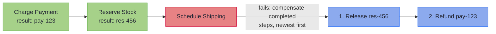

# Saga: Undoing What Cannot Be Undone

~~~admonish info title="What You'll Learn"
- How sagas coordinate multi-step operations with compensating transactions
- How to build sagas with `Saga.of()` and `SagaBuilder`
- How compensation executes in reverse order on failure
- The distinction between Saga and Resource
- How to handle compensation failures
~~~

---

Some operations span multiple services. An e-commerce order might charge a payment, reserve inventory, and schedule shipping. Each step succeeds independently, but the *business transaction* only succeeds if all three complete. If shipping fails after payment and inventory have succeeded, you need to release the inventory and refund the payment, in that order.

This is the saga pattern: each forward step registers a corresponding *compensation* action. On failure, compensations execute in reverse order to restore the system to a consistent state.

## Saga vs Resource

Both manage cleanup, but for different purposes:

| | Saga | Resource |
|---|------|----------|
| **Cleanup** | Business logic (refund, release, cancel) | Infrastructure (close file, release connection) |
| **Order** | Reverse order of completion | LIFO stack |
| **Depends on** | What the forward step produced | Fixed cleanup action |
| **Scope** | Distributed transactions | Single resource lifecycle |

Use `Resource` for files, connections, and locks. Use `Saga` for multi-step business workflows where each step's undo depends on what that step accomplished.

## The Flow



Key points:
- Shipping failed, so its compensation does not run (nothing to undo)
- Stock was reserved successfully, so its compensation releases the reservation
- Payment was charged successfully, so its compensation issues a refund
- Compensations run in **reverse** order: stock first, then payment

## Creating a Saga

### Direct Construction

<!-- verify -->
```java
Saga<String> orderSaga = Saga.of(
        VTask.of(() -> paymentService.charge(order)),
        paymentService::refund)
    .andThen(paymentId -> Saga.of(
        VTask.of(() -> inventoryService.reserve(order)),
        inventoryService::release))
    .andThen(reservationId -> Saga.of(
        VTask.of(() -> shippingService.schedule(order)),
        shippingService::cancel));
```

### Using SagaBuilder

For larger sagas, the builder provides a more readable structure:

<!-- verify -->
```java
Saga<String> orderSaga = SagaBuilder.<Unit>start()
    .step("charge-payment",
        VTask.of(() -> paymentService.charge(order)),
        paymentService::refund)
    .step("reserve-inventory",
        paymentId -> VTask.of(() -> inventoryService.reserve(order, paymentId)),
        inventoryService::release)
    .step("schedule-shipping",
        reservationId -> VTask.of(() -> shippingService.schedule(order, reservationId)),
        shippingService::cancel)
    .build();
```

Step names appear in error reporting, making it clear which step failed and which compensations ran.

### Async Compensation

When compensation itself requires an asynchronous operation, use `stepAsync`:

<!-- verify -->
```java
SagaBuilder.<Unit>start()
    .stepAsync("charge-payment",
        _ -> VTask.of(() -> paymentService.charge(order)),
        paymentId -> VTask.of(() -> {
            paymentService.refund(paymentId);
            return Unit.INSTANCE;
        }))
    .build();
```

### Steps Without Compensation

Some steps are idempotent or represent final actions that do not need undoing:

<!-- verify -->
```java
SagaBuilder.<Unit>start()
    .step("charge-payment",
        VTask.of(() -> paymentService.charge(order)),
        paymentService::refund)
    .stepNoCompensation("send-confirmation",
        paymentId -> VTask.of(() -> emailService.sendConfirmation(order, paymentId)))
    .build();
```

## Running a Saga

### run(): Throws on Failure

<!-- verify -->
```java
VTask<String> execution = orderSaga.run();

try {
    String trackingId = execution.run();
    log.info("Order complete: {}", trackingId);
} catch (SagaExecutionException e) {
    // a compensation also failed; e carries the full SagaError
    log.error("Order failed and compensation was incomplete: {}", e.getMessage());
} catch (RuntimeException original) {
    // all compensations succeeded; the step's failure surfaces directly
    // (a checked exception arrives wrapped in VTaskExecutionException)
    log.error("Order failed, fully compensated: {}", original.getMessage());
}
```

If all compensations succeed, the original exception is thrown directly. If any compensation also fails, a `SagaExecutionException` is thrown containing the full `SagaError`.

The saga's own `runSafe()` (distinct from `VTask.runSafe()`, which returns a `Try`) keeps the failure structured instead of thrown:

### runSafe(): Either with Full Details

<!-- verify -->
```java
VTask<Either<SagaError, String>> safeExecution = orderSaga.runSafe();

Either<SagaError, String> result = safeExecution.run();
result.fold(
    sagaError -> {
        log.error("Saga failed at step '{}': {}",
            sagaError.failedStep(),
            sagaError.originalError().getMessage());

        if (!sagaError.allCompensationsSucceeded()) {
            log.error("Compensation failures: {}",
                sagaError.compensationFailures());
        }
        return null;
    },
    trackingId -> {
        log.info("Order complete: {}", trackingId);
        return null;
    }
);
```

## Handling Compensation Failures

Sometimes compensation itself fails (e.g., the refund service is down). The saga records all compensation results:

<!-- verify -->
```java
// `error` is the SagaError a failed run produced

// Did all compensations succeed?
if (error.allCompensationsSucceeded()) {
    // System is consistent; handle the original error
} else {
    // System may be inconsistent; log for manual intervention
    for (SagaError.CompensationResult cr : error.compensationResults()) {
        cr.result().fold(
            failure -> {
                log.error("Compensation '{}' failed: {}", cr.stepName(), failure);
                alertOps(cr.stepName(), failure);
                return null;
            },
            success -> {
                log.info("Compensation '{}' succeeded", cr.stepName());
                return null;
            }
        );
    }
}
```

~~~admonish warning title="Compensation Is Best-Effort"
All compensations are attempted even if some fail. The saga does not stop compensating
on the first compensation failure. This maximises the chance of restoring consistency,
but means that partial compensation is possible. Design your compensations to be
idempotent where possible.
~~~

## Saga Factory Methods

| Method | Description |
|--------|-------------|
| `Saga.of(action, consumer)` | Single step with synchronous compensation |
| `Saga.of(action, function)` | Single step with async compensation (VTask) |
| `Saga.noCompensation(action)` | Single step with no compensation |
| `saga.andThen(fn)` | Chain another saga step |
| `saga.map(fn)` | Transform the final result |
| `saga.flatMap(fn)` | Chain with another saga |

~~~admonish info title="Key Takeaways"
* **Each compensatable completed step registers an undo**: compensations run in reverse order over the steps that finished; the failed step itself, a `stepNoCompensation` step, and anything a partially applied action did before failing have nothing registered to undo
* **Saga is for business cleanup, Resource for infrastructure**: refunds and releases belong here; files, connections, and locks belong to `Resource`
* **`runSafe()` tells the whole story**: `SagaError` names the failed step and carries every compensation result, so partial compensation is detectable, not silent
* **Compensation is best-effort**: all compensations are attempted even when some fail; design them idempotent so a repeated undo is harmless
~~~

~~~admonish tip title="See Also"
- [Combined Patterns](combined.md) - using saga alongside retry and circuit breaker
- [Resource Management](../effect/advanced_topics.md#resource-management) - bracket pattern for infrastructure cleanup
~~~

---

**Previous:** [Bulkhead](bulkhead.md)
**Next:** [Combined Patterns](combined.md)
