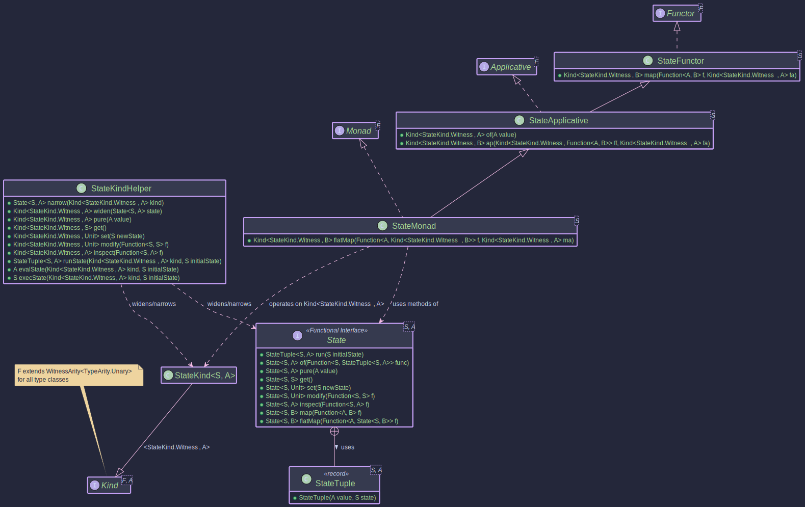

# State Monad - Managing State Functionally

## Purpose

In many applications, we need to manage computations that involve **state** that changes over time. Examples include:

* A counter being incremented.
* A configuration object being updated.
* The state of a game character.
* Parsing input where the current position needs to be tracked.

While imperative programming uses mutable variables, functional programming prefers immutability. The **State monad** provides a purely functional way to handle stateful computations without relying on mutable variables.

A `State<S, A>` represents a computation that takes an initial state `S` and produces a result value `A` along with a **new, updated state** `S`. It essentially wraps a function of the type `S -> (A, S)`.

The key benefits are:

1. **Explicit State:** The state manipulation is explicitly encoded within the type `State<S, A>`.
2. **Purity:** Functions using the State monad remain pure; they don't cause side effects by mutating external state. Instead, they describe how the state *should* transform.
3. **Composability:** State computations can be easily sequenced using standard monadic operations (`map`, `flatMap`), where the state is automatically threaded through the sequence without explicitly threading state everywhere.
4. **Decoupling**: Logic is decoupled from state handling mechanics.
5. **Testability:** Pure state transitions are easier to test and reason about than code relying on mutable side effects.


In `Higher-Kinded-J`, the State monad pattern is implemented via the `State<S, A>` interface, its associated `StateTuple<S, A>` record, the HKT simulation types (`StateKind`, `StateKindHelper`), and the type class instances (`StateMonad`, `StateApplicative`, `StateFunctor`).

## Structure



## The `State<S, A>` Type and `StateTuple<S, A>`

The core type is the `State<S, A>` functional interface:

```java
@FunctionalInterface
public interface State<S, A> {

  // Represents the result: final value A and final state S
  record StateTuple<S, A>(@Nullable A value, @NonNull S state) { /* ... */ }

  // The core function: Initial State -> (Result Value, Final State)
  @NonNull StateTuple<S, A> run(@NonNull S initialState);

  // Static factories
  static <S, A> @NonNull State<S, A> of(@NonNull Function<@NonNull S, @NonNull StateTuple<S, A>> runFunction);
  static <S, A> @NonNull State<S, A> pure(@Nullable A value); // Creates State(s -> (value, s))
  static <S> @NonNull State<S, S> get();                      // Creates State(s -> (s, s))
  static <S> @NonNull State<S, Void> set(@NonNull S newState); // Creates State(s -> (null, newState))
  static <S> @NonNull State<S, Void> modify(@NonNull Function<@NonNull S, @NonNull S> f); // Creates State(s -> (null, f(s)))
  static <S, A> @NonNull State<S, A> inspect(@NonNull Function<@NonNull S, @Nullable A> f); // Creates State(s -> (f(s), s))

  // Instance methods for composition
  default <B> @NonNull State<S, B> map(@NonNull Function<? super A, ? extends B> f);
  default <B> @NonNull State<S, B> flatMap(@NonNull Function<? super A, ? extends State<S, ? extends B>> f);
}
```

* `StateTuple<S, A>`: A simple record holding the pair `(value: A, state: S)` returned by running a `State` computation.
* `run(S initialState)`: Executes the stateful computation by providing the starting state.
* `of(...)`: The basic factory method taking the underlying function `S -> StateTuple<S, A>`.
* `pure(A value)`: Creates a computation that returns the given value `A`*without changing* the state.
* `get()`: Creates a computation that returns the *current* state `S` as its value, leaving the state unchanged.
* `set(S newState)`: Creates a computation that *replaces* the current state with `newState` and returns no meaningful value (`Void`).
* `modify(Function<S, S> f)`: Creates a computation that applies a function `f` to the current state to get the *new* state, returning no meaningful value (`Void`).
* `inspect(Function<S, A> f)`: Creates a computation that applies a function `f` to the current state to calculate a *result value*`A`, leaving the state unchanged.
* `map(...)`: Transforms the *result value*`A` to `B` after the computation runs, leaving the state transition logic untouched.
* `flatMap(...)`: The core sequencing operation. It runs the first `State` computation, takes its result value `A`, uses it to create a *second*`State` computation, and runs that second computation using the state produced by the first one. The final result and state are those from the second computation.

## State Components

To integrate `State` with Higher-Kinded-J:

* **`StateKind<S, A>`:** The marker interface extending `Kind<StateKind.Witness<S>, A>`. The witness type `F` is `StateKind.Witness<S>` (where `S` is fixed for a given monad instance), and the value type `A` is the result type `A` from `StateTuple`.
* **`StateKindHelper`:** The utility class with static methods:
  * `wrap(State<S, A>)`: Converts a `State` to `StateKind<S, A>`.
  * `unwrap(Kind<StateKind.Witness<S>, A>)`: Converts `StateKind` back to `State`. Throws `KindUnwrapException` if the input is invalid.
  * `pure(A value)`: Factory for `Kind` equivalent to `State.pure`.
  * `get()`: Factory for `Kind` equivalent to `State.get`.
  * `set(S newState)`: Factory for `Kind` equivalent to `State.set`.
  * `modify(Function<S, S> f)`: Factory for `Kind` equivalent to `State.modify`.
  * `inspect(Function<S, A> f)`: Factory for `Kind` equivalent to `State.inspect`.
  * `runState(Kind<StateKind.Witness<S>, A> kind, S initialState)`: Runs the computation and returns the `StateTuple<S, A>`.
  * `evalState(Kind<StateKind.Witness<S>, A> kind, S initialState)`: Runs the computation and returns only the final value `A`.
  * `execState(Kind<StateKind.Witness<S>, A> kind, S initialState)`: Runs the computation and returns only the final state `S`.

## Type Class Instances (`StateFunctor`, `StateApplicative`, `StateMonad`)

These classes provide the standard functional operations for `StateKind.Witness<S>`:

* **`StateFunctor<S>`:** Implements `Functor<StateKind.Witness<S>>`. Provides `map`.
* **`StateApplicative<S>`:** Extends `StateFunctor<S>`, implements `Applicative<StateKind.Witness<S>>`. Provides `of` (same as `pure`) and `ap`.
* **`StateMonad<S>`:** Extends `StateApplicative<S>`, implements `Monad<StateKind.Witness<S>>`. Provides `flatMap` for sequencing stateful computations.

You instantiate `StateMonad<S>` for the specific state type `S` you are working with.

## How to Use

### 1. Define Your State Type

```java
// Example: A simple counter state
record CounterState(int count) {}

// Example: State for a simple stack simulation
record StackState(java.util.List<Integer> stack) {}
```

### 2. Get the `StateMonad` Instance

```java
import org.higherkindedj.hkt.state.StateMonad;

StateMonad<CounterState> counterStateMonad = new StateMonad<>();
StateMonad<StackState> stackStateMonad = new StateMonad<>();
```

### 3. Create Basic State Actions

Use `StateKindHelper` factories:

```java
import org.higherkindedj.hkt.Kind;
import org.higherkindedj.hkt.state.State; // For State.modify, State.inspect, State.of
import org.higherkindedj.hkt.state.StateKind;
import org.higherkindedj.hkt.state.State.StateTuple; // For the return type of runState

import static org.higherkindedj.hkt.state.StateKindHelper.wrap;
import static org.higherkindedj.hkt.state.StateKindHelper.runState;
import static org.higherkindedj.hkt.state.StateKindHelper.evalState;
import static org.higherkindedj.hkt.state.StateKindHelper.execState;

import java.util.List;
import java.util.ArrayList;
import java.util.Collections;
import java.util.function.Function;

// Counter Example Actions:
Kind<StateKind.Witness<CounterState>, Void> incrementCounter =
  wrap(State.modify(s -> new CounterState(s.count() + 1)));

Kind<StateKind.Witness<CounterState>, Integer> getCount =
        wrap(State.inspect(CounterState::count));

// Stack Example Actions:

// Define 'push' as a Function that returns a Kind (a parameterized action)
Function<Integer, Kind<StateKind.Witness<StackState>, Void>> push = value ->
  wrap(State.modify(s -> {
    List<Integer> newList = new ArrayList<>(s.stack()); // Using diamond operator
    newList.add(value);
    return new StackState(Collections.unmodifiableList(newList));
  }));

Kind<StateKind.Witness<StackState>, Integer> pop =
  wrap(State.of(s -> {
    if (s.stack().isEmpty()) {
      return new State.StateTuple<>(0, s); // Assuming 0 for empty pop
    }
    List<Integer> currentStack = s.stack();
    int value = currentStack.get(currentStack.size() - 1);
    List<Integer> newStack = new ArrayList<>(currentStack.subList(0, currentStack.size() - 1));
    return new State.StateTuple<>(value, new StackState(Collections.unmodifiableList(newStack)));
  }));

Kind<StateKind.Witness<StackState>, Integer> peek =
  wrap(State.inspect(s -> s.stack().isEmpty() ? 0 : s.stack().get(s.stack().size() - 1))); // Assuming 0 for empty peek

```

### 4. Compose Computations using `map` and `flatMap`

Use the `stateMonad` instance (`counterStateMonad` or `stackStateMonad` in these examples). `flatMap` sequences actions, threading the state automatically.

```java
// Counter Example: Increment twice and get the final count
Kind<StateKind.Witness<CounterState>, Integer> incrementTwiceAndGet =
    counterStateMonad.flatMap( // flatMap returns Kind<StateKind.Witness<CounterState>, Void>
        ignored1 -> incrementCounter, // Run second increment
        incrementCounter // Run first increment
    ).flatMap( // flatMap returns Kind<StateKind.Witness<CounterState>, Void>
        ignored2 -> getCount, // Finally, get the count
        incrementCounter // Chained from the result of the second increment
    );


// Stack Example: Push 10, Push 20, Pop, then Pop again and sum their results
Kind<StateKind.Witness<StackState>, Integer> stackProgram =
  stackStateMonad.flatMap( // flatMap 1: applies to push.apply(10) (ma_for_flatMap1)
    _ignoredFromPush1 -> stackStateMonad.flatMap( // flatMap 2: applies to push.apply(20) (ma_for_flatMap2)
      _ignoredFromPush2 -> stackStateMonad.flatMap( // flatMap 3: applies to the first pop (ma_for_flatMap3)
          poppedValue1 -> stackStateMonad.map( // map: applies to the second pop
                  poppedValue2 -> poppedValue1 + poppedValue2, // f_for_map (Function<Integer, Integer>)
                  pop // ma_for_map (Kind<StackState, Integer> for the second pop)
          ),
          pop // ma_for_flatMap3 (Kind<StackState, Integer> for the first pop)
      ),
      push.apply(20) // ma_for_flatMap2
    ),
    push.apply(10) // ma_for_flatMap1
  );

// Example using map: Push 5, then get the value and format it.
Kind<StateKind.Witness<StackState>, Void> push5 = push.apply(5);
Kind<StateKind.Witness<StackState>, String> push5AndDescribe = stackStateMonad.map(
        push5, // kindA
        value -> "Pushed 5, the action's resulting value is " + value // `value` will be null as push returns Void
);
```

### 5. Run the Computation


```java

// To use these actions, you would typically run them with an initial state.
// For example:
CounterState initialCounter = new CounterState(0);
State.StateTuple<CounterState, Void> afterIncrement = unwrap(incrementCounter).run(initialCounter);
System.out.println("Counter after increment: " + afterIncrement.state().count()); // Output: 1

State.StateTuple<CounterState, Integer> currentCountResult = unwrap(getCount).run(afterIncrement.state());
System.out.println("Current count: " + currentCountResult.value()); // Output: 1

StackState initialStack = new StackState(Collections.emptyList());
Kind<StateKind.Witness<StackState>, Void> pushTen = push.apply(10);
Kind<StateKind.Witness<StackState>, Void> pushTwenty = push.apply(20);

// Chaining actions (simplified example, real chaining uses flatMap from StateMonad)
State.StateTuple<StackState, Void> afterPush10 = unwrap(pushTen).run(initialStack);
State.StateTuple<StackState, Void> afterPush20 = unwrap(pushTwenty).run(afterPush10.state());
System.out.println("Stack after pushes: " + afterPush20.state().stack()); // Output: [10, 20]

State.StateTuple<StackState, Integer> poppedValueResult = unwrap(pop).run(afterPush20.state());
System.out.println("Popped value: " + poppedValueResult.value()); // Output: 20
System.out.println("Stack after pop: " + poppedValueResult.state().stack()); // Output: [10]

```

## Key Points:

The State monad (`State<S, A>`, `StateKind`, `StateMonad`) provides a powerful functional abstraction for managing stateful computations in `Higher-Kinded-J`. By encapsulating state transitions within the `S -> (A, S)` function, it allows developers to write pure, composable code that explicitly tracks state changes. The HKT simulation enables using standard monadic operations (`map`, `flatMap`) via `StateMonad`, simplifying the process of sequencing complex stateful workflows while maintaining referential transparency. Key operations like `get`, `set`, `modify`, and `inspect` provide convenient ways to interact with the state within the monadic context.
