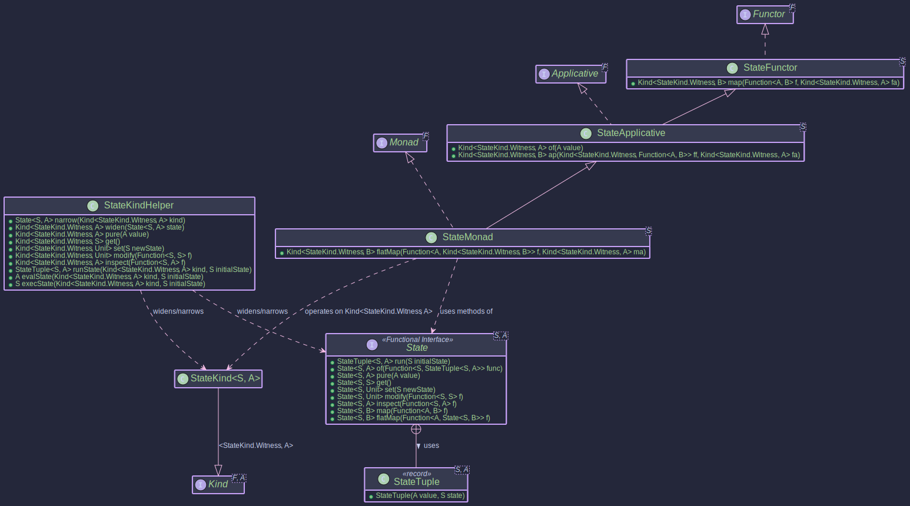

# State Monad - Managing State Functionally

## Purpose

In many applications, we need to manage computations that involve **state** that changes over time. 

Examples could include:

* A counter being incremented.
* A configuration object being updated.
* The state of a game character.
* Parsing input where the current position needs to be tracked.

While imperative programming uses mutable variables, functional programming prefers immutability. The **State monad** provides a purely functional way to handle stateful computations without relying on mutable variables.

A `State<S, A>` represents a computation that takes an initial state `S` and produces a result value `A` along with a **new, updated state** `S`. It essentially wraps a function of the type `S -> (A, S)`.

### Key Benefits

1. **Explicit State:** The state manipulation is explicitly encoded within the type `State<S, A>`.
2. **Purity:** Functions using the State monad remain pure; they don't cause side effects by mutating external state. Instead, they describe how the state *should* transform.
3. **Composability:** State computations can be easily sequenced using standard monadic operations (`map`, `flatMap`), where the state is automatically threaded through the sequence without explicitly threading state everywhere.
4. **Decoupling**: Logic is decoupled from state handling mechanics.
5. **Testability:** Pure state transitions are easier to test and reason about than code relying on mutable side effects.


In `Higher-Kinded-J`, the State monad pattern is implemented via the `State<S, A>` interface, its associated `StateTuple<S, A>` record, the HKT simulation types (`StateKind`, `StateKindHelper`), and the type class instances (`StateMonad`, `StateApplicative`, `StateFunctor`).

## Structure



## The `State<S, A>` Type and `StateTuple<S, A>`

The core type is the `State<S, A>` functional interface:

```java
@FunctionalInterface
public interface State<S, A> {

  // Represents the result: final value A and final state S
  record StateTuple<S, A>(@Nullable A value, @NonNull S state) { /* ... */ }

  // The core function: Initial State -> (Result Value, Final State)
  @NonNull StateTuple<S, A> run(@NonNull S initialState);

  // Static factories
  static <S, A> @NonNull State<S, A> of(@NonNull Function<@NonNull S, @NonNull StateTuple<S, A>> runFunction);
  static <S, A> @NonNull State<S, A> pure(@Nullable A value); // Creates State(s -> (value, s))
  static <S> @NonNull State<S, S> get();                      // Creates State(s -> (s, s))
  static <S> @NonNull State<S, Unit> set(@NonNull S newState); // Creates State(s -> (Unit.INSTANCE, newState))
  static <S> @NonNull State<S, Unit> modify(@NonNull Function<@NonNull S, @NonNull S> f); // Creates State(s -> (Unit.INSTANCE, f(s)))
  static <S, A> @NonNull State<S, A> inspect(@NonNull Function<@NonNull S, @Nullable A> f); // Creates State(s -> (f(s), s))

  // Instance methods for composition
  default <B> @NonNull State<S, B> map(@NonNull Function<? super A, ? extends B> f);
  default <B> @NonNull State<S, B> flatMap(@NonNull Function<? super A, ? extends State<S, ? extends B>> f);
}
```

* `StateTuple<S, A>`: A simple record holding the pair `(value: A, state: S)` returned by running a `State` computation.
* `run(S initialState)`: Executes the stateful computation by providing the starting state.
* `of(...)`: The basic factory method taking the underlying function `S -> StateTuple<S, A>`.
* `pure(A value)`: Creates a computation that returns the given value `A`*without changing* the state.
* `get()`: Creates a computation that returns the *current* state `S` as its value, leaving the state unchanged.
* `set(S newState)`: Creates a computation that *replaces* the current state with `newState` and returns `Unit.INSTANCE` as its result value.
* `modify(Function<S, S> f)`: Creates a computation that applies a function `f` to the current state to get the *new* state, returning Unit.INSTANCE as its result value.
* `inspect(Function<S, A> f)`: Creates a computation that applies a function `f` to the current state to calculate a *result value*`A`, leaving the state unchanged.
* `map(...)`: Transforms the *result value*`A` to `B` after the computation runs, leaving the state transition logic untouched.
* `flatMap(...)`: The core sequencing operation. It runs the first `State` computation, takes its result value `A`, uses it to create a *second*`State` computation, and runs that second computation using the state produced by the first one. The final result and state are those from the second computation.

## State Components

To integrate `State` with Higher-Kinded-J:

* **`StateKind<S, A>`:** The marker interface extending `Kind<StateKind.Witness<S>, A>`. The witness type `F` is `StateKind.Witness<S>` (where `S` is fixed for a given monad instance), and the value type `A` is the result type `A` from `StateTuple`.
* **`StateKindHelper`:** The utility class with static methods:
  * `widen(State<S, A>)`: Converts a `State` to `Kind<StateKind.Witness<S>, A>`.
  * `narrow(Kind<StateKind.Witness<S>, A>)`: Converts `StateKind` back to `State`. Throws `KindUnwrapException` if the input is invalid.
  * `pure(A value)`: Factory for `Kind` equivalent to `State.pure`.
  * `get()`: Factory for `Kind` equivalent to `State.get`.
  * `set(S newState)`: Factory for `Kind` equivalent to `State.set`.
  * `modify(Function<S, S> f)`: Factory for `Kind` equivalent to `State.modify`.
  * `inspect(Function<S, A> f)`: Factory for `Kind` equivalent to `State.inspect`.
  * `runState(Kind<StateKind.Witness<S>, A> kind, S initialState)`: Runs the computation and returns the `StateTuple<S, A>`.
  * `evalState(Kind<StateKind.Witness<S>, A> kind, S initialState)`: Runs the computation and returns only the final value `A`.
  * `execState(Kind<StateKind.Witness<S>, A> kind, S initialState)`: Runs the computation and returns only the final state `S`.

## Type Class Instances (`StateFunctor`, `StateApplicative`, `StateMonad`)

These classes provide the standard functional operations for `StateKind.Witness<S>`:

* **`StateFunctor<S>`:** Implements `Functor<StateKind.Witness<S>>`. Provides `map`.
* **`StateApplicative<S>`:** Extends `StateFunctor<S>`, implements `Applicative<StateKind.Witness<S>>`. Provides `of` (same as `pure`) and `ap`.
* **`StateMonad<S>`:** Extends `StateApplicative<S>`, implements `Monad<StateKind.Witness<S>>`. Provides `flatMap` for sequencing stateful computations.

You instantiate `StateMonad<S>` for the specific state type `S` you are working with.


~~~admonish example title="Example: Managing Bank Account Transactions"

We want to model a bank account where we can:

* Deposit funds.
* Withdraw funds (if sufficient balance).
* Get the current balance.
* Get the transaction history.

All these operations will affect or depend on the account's state (balance and history).

## 1. Define the State

First, we define a record to represent the state of our bank account.


- [AccountState.java](https://github.com/higher-kinded-j/higher-kinded-j/blob/main/hkj-examples/src/main/java/org/higherkindedj/example/basic/state/AccountState.java)


```java
public record AccountState(BigDecimal balance, List<Transaction> history) {
  public AccountState {
    requireNonNull(balance, "Balance cannot be null.");
    requireNonNull(history, "History cannot be null.");
    // Ensure history is unmodifiable and a defensive copy is made.
    history = Collections.unmodifiableList(new ArrayList<>(history));
  }

  // Convenience constructor for initial state
  public static AccountState initial(BigDecimal initialBalance) {
    requireNonNull(initialBalance, "Initial balance cannot be null");
    if (initialBalance.compareTo(BigDecimal.ZERO) < 0) {
      throw new IllegalArgumentException("Initial balance cannot be negative.");
    }
    Transaction initialTx = new Transaction(
            TransactionType.INITIAL_BALANCE,
            initialBalance,
            LocalDateTime.now(),
            "Initial account balance"
    );
    // The history now starts with this initial transaction
    return new AccountState(initialBalance, Collections.singletonList(initialTx));
  }

  public AccountState addTransaction(Transaction transaction) {
    requireNonNull(transaction, "Transaction cannot be null");
    List<Transaction> newHistory = new ArrayList<>(history); // Takes current history
    newHistory.add(transaction);                             // Adds new one
    return new AccountState(this.balance, Collections.unmodifiableList(newHistory));
  }

  public AccountState withBalance(BigDecimal newBalance) {
    requireNonNull(newBalance, "New balance cannot be null");
    return new AccountState(newBalance, this.history);
  }
}
```

### 2. Define Transaction Types

We'll also need a way to represent transactions.
- [TransactionType.java](https://github.com/higher-kinded-j/higher-kinded-j/tree/main/src/main/java/org/higherkindedj/example/basic/state/TransactionType.java)
- [Transaction.java](https://github.com/higher-kinded-j/higher-kinded-j/tree/main/src/main/java/org/higherkindedj/example/basic/state/Transaction.java)


```java
public enum TransactionType {
  INITIAL_BALANCE,
  DEPOSIT,
  WITHDRAWAL,
  REJECTED_WITHDRAWAL,
  REJECTED_DEPOSIT
}

public record Transaction(
        TransactionType type, BigDecimal amount, LocalDateTime timestamp, String description) {
  public Transaction {
    requireNonNull(type, "Transaction type cannot be null");
    requireNonNull(amount, "Transaction amount cannot be null");
    requireNonNull(timestamp, "Transaction timestamp cannot be null");
    requireNonNull(description, "Transaction description cannot be null");
    if (type != INITIAL_BALANCE && amount.compareTo(BigDecimal.ZERO) <= 0) {
      if (!(type == REJECTED_DEPOSIT && amount.compareTo(BigDecimal.ZERO) <= 0)
              && !(type == REJECTED_WITHDRAWAL && amount.compareTo(BigDecimal.ZERO) <= 0)) {
        throw new IllegalArgumentException(
                "Transaction amount must be positive for actual operations.");
      }
    }
  }
}
```

### 3. Define State Actions

Now, we define our bank operations as functions that return `Kind<StateKind.Witness<AccountState>, YourResultType>`.
These actions describe how the state should change and what value they produce.

We'll put these in a `BankAccountWorkflow.java class`.

- [BankAccountWorkflow.java](https://github.com/higher-kinded-j/higher-kinded-j/tree/main/src/main/java/org/higherkindedj/example/basic/state/BankAccountWorkflow.java)

```java
public class BankAccountWorkflow {

  private static final StateMonad<AccountState> accountStateMonad = new StateMonad<>();

  public static Function<BigDecimal, Kind<StateKind.Witness<AccountState>, Unit>> deposit(
          String description) {
    return amount ->
        STATE.widen(
          State.modify(
            currentState -> {
              if (amount.compareTo(BigDecimal.ZERO) <= 0) {
                // For rejected deposit, log the problematic amount
                Transaction rejected =
                        new Transaction(
                                TransactionType.REJECTED_DEPOSIT,
                                amount,
                                LocalDateTime.now(),
                                "Rejected Deposit: " + description + " - Invalid Amount " + amount);
                return currentState.addTransaction(rejected);
              }
              BigDecimal newBalance = currentState.balance().add(amount);
              Transaction tx =
                      new Transaction(
                              TransactionType.DEPOSIT, amount, LocalDateTime.now(), description);
              return currentState.withBalance(newBalance).addTransaction(tx);
        }));
  }

  public static Function<BigDecimal, Kind<StateKind.Witness<AccountState>, Boolean>> withdraw(
          String description) {
    return amount ->
        STATE.widen(
                State.of(
                    currentState -> {
                      if (amount.compareTo(BigDecimal.ZERO) <= 0) {
                        // For rejected withdrawal due to invalid amount, log the problematic amount
                        Transaction rejected =
                            new Transaction(
                                    TransactionType.REJECTED_WITHDRAWAL,
                                    amount,
                                    LocalDateTime.now(),
                                    "Rejected Withdrawal: " + description + " - Invalid Amount " + amount);
                        return new StateTuple<>(false, currentState.addTransaction(rejected));
                      }
                      if (currentState.balance().compareTo(amount) >= 0) {
                        BigDecimal newBalance = currentState.balance().subtract(amount);
                        Transaction tx =
                                new Transaction(
                                        TransactionType.WITHDRAWAL, amount, LocalDateTime.now(), description);
                        AccountState updatedState =
                                currentState.withBalance(newBalance).addTransaction(tx);
                        return new StateTuple<>(true, updatedState);
                      } else {
                        // For rejected withdrawal due to insufficient funds, log the amount that was
                        // attempted
                        Transaction tx =
                            new Transaction(
                                    TransactionType.REJECTED_WITHDRAWAL,
                                    amount,
                                    LocalDateTime.now(),
                                    "Rejected Withdrawal: "
                                            + description
                                            + " - Insufficient Funds. Balance: "
                                            + currentState.balance());
                        AccountState updatedState = currentState.addTransaction(tx);
                        return new StateTuple<>(false, updatedState);
                      }
                  }));
  }

  public static Kind<StateKind.Witness<AccountState>, BigDecimal> getBalance() {
    return STATE.widen(State.inspect(AccountState::balance));
  }

  public static Kind<StateKind.Witness<AccountState>, List<Transaction>> getHistory() {
    return STATE.widen(State.inspect(AccountState::history));
  }

  // ... main method will be added

}
```

### 4. Compose Computations using `map` and `flatMap`

We use `flatMap` and `map` from  `accountStateMonad` to sequence these actions. The state is threaded automatically.

```java
public class BankAccountWorkflow {
  // ... (monad instance and previous actions)
  public static void main(String[] args) {
    // Initial state: Account with £100 balance.
    AccountState initialState = AccountState.initial(new BigDecimal("100.00"));
   var workflow =
           For.from(accountStateMonad, deposit("Salary").apply(new BigDecimal("20.00")))
               .from(a -> withdraw("Bill Payment").apply(new BigDecimal("50.00")))
               .from(b -> withdraw("Groceries").apply(new BigDecimal("70.00")))
               .from(c -> getBalance())
               .from(t -> getHistory())
               .yield((deposit, w1, w2, bal, history) -> {
                 var report = new StringBuilder();
                 history.forEach(tx -> report.append("  - %s\n".formatted(tx)));
                 return report.toString();
               });

    StateTuple<AccountState, String> finalResultTuple =
        StateKindHelper.runState(workflow, initialState);

    System.out.println(finalResultTuple.value());

    System.out.println("\nDirect Final Account State:");
    System.out.println("Balance: £" + finalResultTuple.state().balance());
    System.out.println(
        "History contains " + finalResultTuple.state().history().size() + " transaction(s):");
    finalResultTuple.state().history().forEach(tx -> System.out.println("  - " + tx));
  }
}
```

### 5. Run the Computation

The `StateKindHelper.runState(workflow, initialState)` call executes the entire sequence of operations, starting with `initialState`.
It returns a StateTuple containing the final result of the _entire workflow_ (in this case, the `String` report) and the final state of the `AccountState`.

```

Direct Final Account State:
Balance: £0.00
History contains 4 transaction(s):
  - Transaction[type=INITIAL_BALANCE, amount=100.00, timestamp=2025-05-18T17:35:53.564874439, description=Initial account balance]
  - Transaction[type=DEPOSIT, amount=20.00, timestamp=2025-05-18T17:35:53.578424630, description=Salary]
  - Transaction[type=WITHDRAWAL, amount=50.00, timestamp=2025-05-18T17:35:53.579196349, description=Bill Payment]
  - Transaction[type=WITHDRAWAL, amount=70.00, timestamp=2025-05-18T17:35:53.579453984, description=Groceries]
```
~~~

~~~admonish important  title="Key Points:"
The State monad (`State<S, A>`, `StateKind`, `StateMonad`) , as provided by higher-kinded-j, offers an elegant and functional way to manage state transformations. 

By defining atomic state operations and composing them with map and flatMap, you can build complex stateful workflows that are easier to reason about, test, and maintain, as the state is explicitly managed by the monad's structure rather than through mutable side effects. The For comprehension helps simplify the workflow.

Key operations like `get`, `set`, `modify`, and `inspect` provide convenient ways to interact with the state within the monadic context.

~~~
