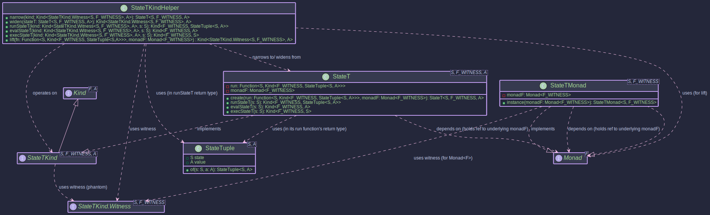

# StateT Monad Transformer

The `StateT` monad transformer is a powerful construct that allows you to add state-management capabilities to an existing monadic context. Think of it as taking the [State Monad](./state_monad.html) and making it work on top of *another* monad, like `OptionalKind`, `EitherKind`, or `IOKind`.

This is incredibly useful when you have computations that are both stateful and involve other effects, such as:

* Potentially missing values (`OptionalKind`)
* Operations that can fail (`EitherKind`, `TryKind`)
* Side-effecting computations (`IOKind`)

## What is StateT?

At its core, a `StateT<S, F, A>` represents a computation that:

1. Takes an initial state of type `S`.
2. Produces a result of type `A` along with a new state of type `S`.
3. And this entire process of producing the `(newState, value)` pair is itself wrapped in an underlying monadic context `F`.

So, the fundamental structure of a `StateT` computation can be thought of as a function:
`S -> F<StateTuple<S, A>>`

Where:

* `S`: The type of the state.
* `F`: The witness type for the underlying monad (e.g., `OptionalKind.Witness`, `IOKind.Witness`).
* `A`: The type of the computed value.
* `StateTuple<S, A>`: A simple container holding a pair of `(state, value)`.

## Key Classes and Concepts



* **`StateT<S, F, A>`**: The primary data type representing the stateful computation stacked on monad `F`. It holds the function `S -> Kind<F, StateTuple<S, A>>`.
* **`StateTKind<S, F, A>`**: The `Kind` representation for `StateT`, allowing it to be used with `higher-kinded-j`'s typeclasses like `Monad`. This is what you'll mostly interact with when using `StateT` in a generic monadic context.
* **`StateTKind.Witness<S, F>`**: The higher-kinded type witness for `StateT<S, F, _>`. Note that both the state type `S` and the underlying monad witness `F` are part of the `StateT` witness.
* **`StateTMonad<S, F>`**: The `Monad` instance for `StateT<S, F, _>`. It requires a `Monad` instance for the underlying monad `F` to function.
* **`StateTKindHelper`**: A utility class providing static methods for working with `StateTKind`, such as `narrow` (to convert `Kind<StateTKind.Witness<S, F>, A>` back to `StateT<S, F, A>`), `runStateT`, `evalStateT`, and `execStateT`.
* **`StateTuple<S, A>`**: A simple record-like class holding the pair `(S state, A value)`.

## Motivation: Why Use StateT?

Imagine you're processing a sequence of items, and for each item:

1. You need to update some running total (state).
2. The processing of an item might fail or return no result (e.g., `Optional`).

Without `StateT`, you might end up with deeply nested `Optional<StateTuple<S, A>>` and manually manage both the optionality and the state threading. `StateT<S, OptionalKind.Witness, A>` elegantly combines these concerns.

## Usage

### Creating StateT Instances

You typically create `StateT` instances in a few ways:

1. **Directly with `StateT.create()`**:
   This is the most fundamental way, providing the state function and the underlying monad instance.

   ```java
   import org.higherkindedj.hkt.Kind;
   import org.higherkindedj.hkt.optional.OptionalKind;
   import org.higherkindedj.hkt.optional.OptionalMonad;
   import org.higherkindedj.hkt.state.StateTuple;
   import org.higherkindedj.hkt.trans.state_t.StateT;
   import org.higherkindedj.hkt.trans.state_t.StateTKind;
   import org.higherkindedj.hkt.trans.state_t.StateTMonad;

   import java.util.Optional;
   import java.util.function.Function;

   // Assume S = Integer (state type), F = OptionalKind.Witness, A = String (value type)
   OptionalMonad optionalMonad = new OptionalMonad();

   Function<Integer, Kind<OptionalKind.Witness, StateTuple<Integer, String>>> runFn =
       currentState -> {
           if (currentState < 0) {
               // Underlying monad F signals absence
               return OptionalKind.empty();
           }
           // Underlying monad F signals presence of (newState, newValue)
           return OptionalKind.of(StateTuple.of(currentState + 1, "Value: " + currentState));
       };

   StateT<Integer, OptionalKind.Witness, String> stateTExplicit =
       StateT.create(runFn, optionalMonad);

   // Wrap it as a Kind for monadic operations
   Kind<StateTKind.Witness<Integer, OptionalKind.Witness>, String> stateTKind =
       StateTKind.wrap(stateTExplicit);
   ```
2. **Lifting values with `StateTMonad.of()`**:
   This lifts a pure value `A` into the `StateT` context. The state remains unchanged, and the underlying monad `F` will wrap the result using its own `of` method.

   ```java
   StateTMonad<Integer, OptionalKind.Witness> stateTMonad = StateTMonad.instance(optionalMonad);

   Kind<StateTKind.Witness<Integer, OptionalKind.Witness>, String> pureStateT =
       stateTMonad.of("pure value");
   // When run with state 10, this will result in Optional.of(StateTuple(10, "pure value"))
   ```

### Running StateT Computations

To execute a `StateT` computation and extract the result, you use methods from `StateTKindHelper` or directly from the `StateT` object:

* **`runStateT(initialState)`**: Executes the computation with an `initialState` and returns the result wrapped in the underlying monad: `Kind<F, StateTuple<S, A>>`.

  ```java
  // Continuing the stateTKind from above:
  Kind<OptionalKind.Witness, StateTuple<Integer, String>> resultOptionalTuple =
      StateTKindHelper.runStateT(stateTKind, 10); // Provide initial state 10

  Optional<StateTuple<Integer, String>> actualOptional = OptionalKind.narrow(resultOptionalTuple).unwrap();

  if (actualOptional.isPresent()) {
      StateTuple<Integer, String> tuple = actualOptional.get();
      System.out.println("New State: " + tuple.state());   // Output: New State: 11
      System.out.println("Value: " + tuple.value());     // Output: Value: Value: 10
  }

  // Example with negative initial state (expecting empty Optional)
  Kind<OptionalKind.Witness, StateTuple<Integer, String>> resultEmptyOptional =
      StateTKindHelper.runStateT(stateTKind, -5);
  Optional<StateTuple<Integer, String>> actualEmpty = OptionalKind.narrow(resultEmptyOptional).unwrap();
  System.out.println("Is empty: " + actualEmpty.isEmpty()); // Output: Is empty: true
  ```
* **`evalStateT(initialState)`**: Executes and gives you `Kind<F, A>` (the value, discarding the final state).
* **`execStateT(initialState)`**: Executes and gives you `Kind<F, S>` (the final state, discarding the value).

### Composing StateT Actions

Like any monad, `StateT` computations can be composed using `map` and `flatMap`.

* **`map(Function<A, B> fn)`**: Transforms the value `A` to `B` within the `StateT` context, leaving the state transformation logic and the underlying monad `F`'s effect untouched for that step.

  ```java
  Kind<StateTKind.Witness<Integer, OptionalKind.Witness>, Integer> initialComputation =
      StateTKind.lift(s -> OptionalKind.of(StateTuple.of(s + 1, s * 2)), optionalMonad); // s -> F<(s', val)>

  Kind<StateTKind.Witness<Integer, OptionalKind.Witness>, String> mappedComputation =
      stateTMonad.map(
          val -> "Computed: " + val,
          initialComputation
      );

  // Run mappedComputation with initial state 5:
  // 1. initialComputation runs: state becomes 6, value is 10. Wrapped in Optional.
  // 2. map's function ("Computed: " + 10) is applied to 10.
  // Result: Optional.of(StateTuple(6, "Computed: 10"))
  Optional<StateTuple<Integer, String>> mappedResult =
      OptionalKind.narrow(StateTKindHelper.runStateT(mappedComputation, 5)).unwrap();
  mappedResult.ifPresent(System.out::println); // Output: StateTuple[state=6, value=Computed: 10]
  ```
* **`flatMap(Function<A, Kind<StateTKind.Witness<S, F>, B>> fn)`**: Sequences two `StateT` computations. The state from the first computation is passed to the second. The effects of the underlying monad `F` are also sequenced according to `F`'s `flatMap`.

  ```java
  // stateTMonad and optionalMonad are defined
  Kind<StateTKind.Witness<Integer, OptionalKind.Witness>, Integer> firstStep =
      StateTKind.lift(s -> OptionalKind.of(StateTuple.of(s + 1, s * 10)), optionalMonad); // S=Int, F=Opt, A=Int

  Function<Integer, Kind<StateTKind.Witness<Integer, OptionalKind.Witness>, String>> secondStepFn =
      prevValue -> StateTKind.lift(
          s -> {
              if (prevValue > 100) {
                  return OptionalKind.of(StateTuple.of(s + prevValue, "Large: " + prevValue));
              } else {
                  return OptionalKind.empty(); // Second step can also result in empty
              }
          },
          optionalMonad
      );

  Kind<StateTKind.Witness<Integer, OptionalKind.Witness>, String> combined =
      stateTMonad.flatMap(secondStepFn, firstStep);

  // Run with initial state 15
  // 1. firstStep(15): state=16, value=150. Wrapped in Optional.of.
  // 2. secondStepFn(150) is called. It returns a new StateT.
  // 3. The new StateT is run with state=16:
  //    Its function: s' (which is 16) -> Optional.of(StateTuple(16 + 150, "Large: 150"))
  //    Result: Optional.of(StateTuple(166, "Large: 150"))
  Optional<StateTuple<Integer, String>> combinedResult =
      OptionalKind.narrow(StateTKindHelper.runStateT(combined, 15)).unwrap();
  combinedResult.ifPresent(System.out::println); // Output: StateTuple[state=166, value=Large: 150]

  // Run with initial state 5
  // 1. firstStep(5): state=6, value=50. Wrapped in Optional.of.
  // 2. secondStepFn(50) is called.
  // 3. The new StateT is run with state=6:
  //    Its function: s' (which is 6) -> Optional.empty()
  //    Result: Optional.empty()
  Optional<StateTuple<Integer, String>> combinedEmptyResult =
      OptionalKind.narrow(StateTKindHelper.runStateT(combined, 5)).unwrap();
  System.out.println("Is empty from small initial: " + combinedEmptyResult.isEmpty()); // Output: true
  ```

### State-Specific Operations

While `higher-kinded-j`'s `StateT` provides the core monadic structure, you'll often want common state operations like `get`, `set`, `modify`. These can be constructed using `StateT.create` or `StateTKind.lift`.

* **`get()`**: Retrieves the current state as the value.

  ```java
  public static <S, F> Kind<StateTKind.Witness<S, F>, S> get(Monad<F> monadF) {
      return StateTKind.lift(s -> monadF.of(StateTuple.of(s, s)), monadF);
  }
  // Usage: stateTMonad.flatMap(currentState -> ..., get(optionalMonad))
  ```
* **`set(S newState)`**: Replaces the current state with `newState`. The value is often `Void` or `Unit`.

  ```java
  public static <S, F> Kind<StateTKind.Witness<S, F>, Void> set(S newState, Monad<F> monadF) {
      return StateTKind.lift(s -> monadF.of(StateTuple.of(newState, (Void) null)), monadF);
  }
  ```
* **`modify(Function<S, S> f)`**: Modifies the state using a function.

  ```java
  public static <S, F> Kind<StateTKind.Witness<S, F>, Void> modify(Function<S, S> f, Monad<F> monadF) {
      return StateTKind.lift(s -> monadF.of(StateTuple.of(f.apply(s), (Void) null)), monadF);
  }
  ```
* **`gets(Function<S, A> f)`**: Retrieves a value derived from the current state.

  ```java
  public static <S, F, A> Kind<StateTKind.Witness<S, F>, A> gets(Function<S, A> f, Monad<F> monadF) {
      return StateTKind.lift(s -> monadF.of(StateTuple.of(s, f.apply(s))), monadF);
  }
  ```

**Example: Simple Stack Operations with `StateT<List<Integer>, OptionalKind.Witness, ...>`**

Let's simulate stack operations where the stack is a `List<Integer>` and operations might be absent if, for example, popping an empty stack.

```java
import org.higherkindedj.hkt.Kind;
import org.higherkindedj.hkt.Monad;
import org.higherkindedj.hkt.optional.OptionalKind;
import org.higherkindedj.hkt.optional.OptionalMonad;
import org.higherkindedj.hkt.state.StateTuple;
import org.higherkindedj.hkt.trans.state_t.*; // StateT, StateTKind, StateTMonad, StateTKindHelper

import java.util.Collections;
import java.util.LinkedList;
import java.util.List;
import java.util.Optional;

public class StateTStackExample {

    private static final OptionalMonad OPT_MONAD = new OptionalMonad();
    private static final StateTMonad<List<Integer>, OptionalKind.Witness> ST_OPT_MONAD =
        StateTMonad.instance(OPT_MONAD);

    // Helper to lift a state function into StateT<List<Integer>, OptionalKind.Witness, A>
    private static <A> Kind<StateTKind.Witness<List<Integer>, OptionalKind.Witness>, A> liftOpt(
        Function<List<Integer>, Kind<OptionalKind.Witness, StateTuple<List<Integer>, A>>> f) {
        return StateTKind.lift(f, OPT_MONAD);
    }

    // push operation
    public static Kind<StateTKind.Witness<List<Integer>, OptionalKind.Witness>, Void> push(Integer value) {
        return liftOpt(stack -> {
            List<Integer> newStack = new LinkedList<>(stack);
            newStack.add(0, value); // Add to front
            return OptionalKind.of(StateTuple.of(newStack, (Void) null));
        });
    }

    // pop operation
    public static Kind<StateTKind.Witness<List<Integer>, OptionalKind.Witness>, Integer> pop() {
        return liftOpt(stack -> {
            if (stack.isEmpty()) {
                return OptionalKind.empty(); // Cannot pop from empty stack
            }
            List<Integer> newStack = new LinkedList<>(stack);
            Integer poppedValue = newStack.remove(0);
            return OptionalKind.of(StateTuple.of(newStack, poppedValue));
        });
    }

    public static void main(String[] args) {
        Kind<StateTKind.Witness<List<Integer>, OptionalKind.Witness>, Integer> computation =
            ST_OPT_MONAD.flatMap(v1 -> // v1 is Void from push(10)
            ST_OPT_MONAD.flatMap(v2 -> // v2 is Void from push(20)
            ST_OPT_MONAD.flatMap(popped1 -> // popped1 should be 20
            ST_OPT_MONAD.flatMap(popped2 -> { // popped2 should be 10
                // Do something with popped1 and popped2
                System.out.println("Popped in order: " + popped1 + ", then " + popped2);
                // Final value of the computation
                return ST_OPT_MONAD.of(popped1 + popped2);
            }, pop())
            , pop())
            , push(20))
            , push(10));


        List<Integer> initialStack = Collections.emptyList();
        Kind<OptionalKind.Witness, StateTuple<List<Integer>, Integer>> resultWrapped =
            StateTKindHelper.runStateT(computation, initialStack);

        Optional<StateTuple<List<Integer>, Integer>> resultOpt =
            OptionalKind.narrow(resultWrapped).unwrap();

        resultOpt.ifPresentOrElse(
            tuple -> {
                System.out.println("Final value: " + tuple.value());       // Expected: 30
                System.out.println("Final stack: " + tuple.state());       // Expected: [] (empty)
            },
            () -> System.out.println("Computation resulted in empty Optional.")
        );

        // Example of popping an empty stack
        Kind<StateTKind.Witness<List<Integer>, OptionalKind.Witness>, Integer> popEmptyStack = pop();
        Optional<StateTuple<List<Integer>, Integer>> emptyPopResult =
            OptionalKind.narrow(StateTKindHelper.runStateT(popEmptyStack, Collections.emptyList())).unwrap();
        System.out.println("Popping empty stack was successful: " + emptyPopResult.isPresent()); // false
    }
}
```


## Relationship to State Monad

The [State Monad](./state_monad.md) (`State<S, A>`) can be seen as a specialized version of `StateT`. Specifically, `State<S, A>` is equivalent to `StateT<S, Id, A>`, where `Id` is the Identity monad (a monad that doesn't add any effects, simply `Id<A> = A`). `higher-kinded-j` doesn't currently ship with an `Id` monad out of the box, but `StateT` is designed to work with any underlying monad `F`.

## Further Reading

* [State Monad](./state_monad.md): Understand the basics of stateful computations.
* [Monad Transformers](.transformers.md): General concept of monad transformers.
* Documentation for the underlying monads you might use with `StateT`, such as:
  * [OptionalKind](./optional_monad.md)
  * [EitherKind](./either_monad.md)
  * [IOKind](./io_monad.md)

By using `StateT`, Java developers can write cleaner, more composable code when dealing with computations that involve both state and other monadic effects.
