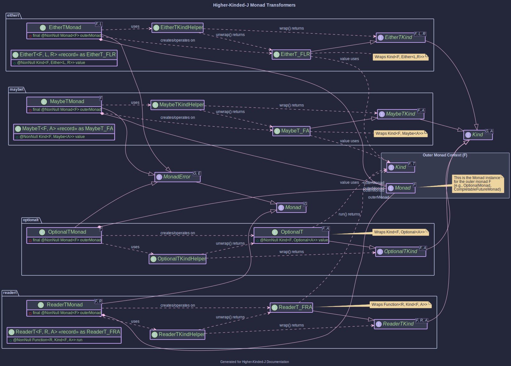
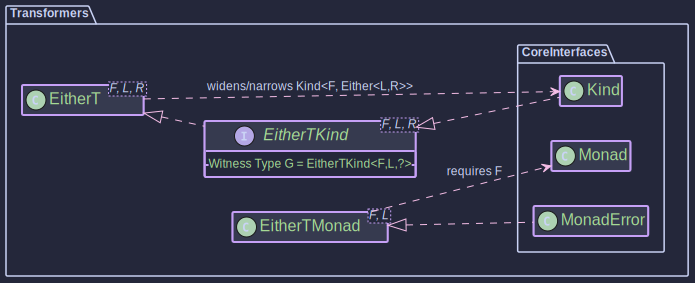

# Transformers: Combining Monadic Effects

## The Problem

When building applications, we often encounter scenarios where we need to combine different computational contexts or effects. For example:

* An operation might be **asynchronous** (represented by `CompletableFuture`).
* The same operation might also **fail with specific domain errors** (represented by `Either<DomainError, Result>`).
* An operation might need **access to a configuration** (using `Reader`) and also be **asynchronous**.
* A computation might **accumulate logs** (using `Writer`) and also **potentially fail** (using `Maybe` or `Either`).

### Monads Stack Poorly

Directly nesting these monadic types, like `CompletableFuture<Either<DomainError, Result>>` or `Reader<Config, Optional<Data>>`, leads to complex, deeply nested code ("callback hell" or nested `flatMap`/`map` calls). It becomes difficult to sequence operations and handle errors or contexts uniformly.

For instance, an operation might need to be both asynchronous *and* handle potential domain-specific errors. Representing this naively leads to nested types like:

```java
// A future that, when completed, yields either a DomainError or a SuccessValue
Kind<CompletableFutureKind.Witness, Either<DomainError, SuccessValue>> nestedResult;
```

But now, how do we `map` or `flatMap` over this stack  without lots of boilerplate?

## Monad Transformers: A _wrapper_ to simplify nested Monads

**Monad Transformers** are a design pattern in functional programming used to combine the effects of two different monads into a single, new monad. They provide a standard way to "stack" monadic contexts, allowing you to work with the combined structure more easily using familiar monadic operations like `map` and `flatMap`.

A monad transformer `T` takes a monad `M` and produces a new monad `T<M>` that combines the effects of both `T` (conceptually) and `M`.

Key characteristics:

1. **Stacking:** They allow "stacking" monadic effects in a standard way.
2. **Unified Interface:** The resulting transformed monad (e.g., `EitherT<CompletableFutureKind, ...>`) itself implements the `Monad` (and often `MonadError`, etc.) interface.
3. **Abstraction:** They hide the complexity of manually managing the nested structure. You can use standard `map`, `flatMap`, `handleErrorWith` operations on the transformed monad, and it automatically handles the logic for both underlying monads correctly.

## Transformers in Higher-Kinded-J



### 1. `EitherT<F, L, R>` (Monad Transformer)

* **Definition:** A monad transformer ([`EitherT`](https://github.com/higher-kinded-j/higher-kinded-j/tree/main/src/main/java/org/higherkindedj/hkt/trans/either_t/EitherT.java)) that combines an outer monad `F` with an inner `Either<L, R>`. Implemented as a record wrapping `Kind<F, Either<L, R>>`.
* **Kind Interface:** [`EitherTKind<F, L, R>`](https://github.com/higher-kinded-j/higher-kinded-j/tree/main/src/main/java/org/higherkindedj/hkt/trans/either_t/EitherTKind.java)
* **Witness Type `G`:** `EitherTKind.Witness<F, L>` (where `F` and `L` are fixed for a given type class instance)
* **Helper:** `EitherTKindHelper` (`wrap`, `unwrap`). Instances are primarily created via `EitherT` static factories (`fromKind`, `right`, `left`, `fromEither`, `liftF`).
* **Type Class Instances:**
  * [`EitherTMonad<F, L>`](https://github.com/higher-kinded-j/higher-kinded-j/tree/main/src/main/java/org/higherkindedj/hkt/trans/either_t/EitherTMonad.java) (`MonadError<EitherTKind.Witness<F, L>, L>`)
* **Notes:** Simplifies working with nested structures like `F<Either<L, R>>`. Requires a `Monad<F>` instance for the outer monad `F` passed to its constructor. Implements `MonadError` for the *inner* `Either`'s `Left` type `L`. See the [Order Processing Example Walkthrough](./order-walkthrough.md) for practical usage with `CompletableFuture` as `F`.
* **Usage:** [How to use the EitherT Monad Transformer](./eithert_transformer.md)

---


---------------------------------------------------

### 2. `MaybeT<F, A>` (Monad Transformer)

* **Definition:** A monad transformer ([`MaybeT`](https://github.com/higher-kinded-j/higher-kinded-j/tree/main/src/main/java/org/higherkindedj/hkt/trans/maybe_t/MaybeT.java)) that combines an outer monad `F` with an inner `Maybe<A>`. Implemented as a record wrapping `Kind<F, Maybe<A>>`.
* **Kind Interface:** [`MaybeTKind<F, A>`](https://github.com/higher-kinded-j/higher-kinded-j/tree/main/src/main/java/org/higherkindedj/hkt/trans/maybe_t/MaybeTKind.java)
* **Witness Type `G`:** `MaybeTKind.Witness<F>` (where `F` is fixed for a given type class instance)
* **Helper:** `MaybeTKindHelper` (`wrap`, `unwrap`). Instances are primarily created via `MaybeT` static factories (`fromKind`, `just`, `nothing`, `fromMaybe`, `liftF`).
* **Type Class Instances:**
  * [`MaybeTMonad<F>`](https://github.com/higher-kinded-j/higher-kinded-j/tree/main/src/main/java/org/higherkindedj/hkt/trans/maybe_t/MaybeTMonad.java) (`MonadError<MaybeTKind.Witness<F>, Void>`)
* **Notes:** Simplifies working with nested structures like `F<Maybe<A>>`. Requires a `Monad<F>` instance for the outer monad `F`. Implements `MonadError` where the error type is `Void`, corresponding to the `Nothing` state from the inner `Maybe`.
* **Usage:** [How to use the MaybeT Monad Transformer](./maybet_transformer.md)

---

### 3. `OptionalT<F, A>` (Monad Transformer)

* **Definition:** A monad transformer ([`OptionalT`](https://github.com/higher-kinded-j/higher-kinded-j/tree/main/src/main/java/org/higherkindedj/hkt/trans/optional_t/OptionalT.java)) that combines an outer monad `F` with an inner `java.util.Optional<A>`. Implemented as a record wrapping `Kind<F, Optional<A>>`.
* **Kind Interface:** [`OptionalTKind<F, A>`](https://github.com/higher-kinded-j/higher-kinded-j/tree/main/src/main/java/org/higherkindedj/hkt/trans/optional_t/OptionalTKind.java)
* **Witness Type `G`:** `OptionalTKind.Witness<F>` (where `F` is fixed for a given type class instance)
* **Helper:** `OptionalTKindHelper` (`wrap`, `unwrap`). Instances are primarily created via `OptionalT` static factories (`fromKind`, `some`, `none`, `fromOptional`, `liftF`).
* **Type Class Instances:**
  * [`OptionalTMonad<F>`](https://github.com/higher-kinded-j/higher-kinded-j/tree/main/src/main/java/org/higherkindedj/hkt/trans/optional_t/OptionalTMonad.java) (`MonadError<OptionalTKind.Witness<F>, Void>`)
* **Notes:** Simplifies working with nested structures like `F<Optional<A>>`. Requires a `Monad<F>` instance for the outer monad `F`. Implements `MonadError` where the error type is `Void`, corresponding to the `Optional.empty()` state from the inner `Optional`.
* **Usage:** [How to use the OptionalT Monad Transformer](./optionalt_transformer.md)

---

### 4. `ReaderT<F, R, A>` (Monad Transformer)

* **Definition:** A monad transformer ([`ReaderT`](https://github.com/higher-kinded-j/higher-kinded-j/tree/main/src/main/java/org/higherkindedj/hkt/trans/reader_t/ReaderT.java)) that combines an outer monad `F` with an inner `Reader<R, A>`-like behavior (dependency on environment `R`). Implemented as a record wrapping a function `R -> Kind<F, A>`.
* **Kind Interface:** [`ReaderTKind<F, R, A>`](https://github.com/higher-kinded-j/higher-kinded-j/tree/main/src/main/java/org/higherkindedj/hkt/trans/reader_t/ReaderTKind.java)
* **Witness Type `G`:** `ReaderTKind.Witness<F, R>` (where `F` and `R` are fixed for a given type class instance)
* **Helper:** `ReaderTKindHelper` (`wrap`, `unwrap`). Instances are primarily created via `ReaderT` static factories (`of`, `lift`, `reader`, `ask`).
* **Type Class Instances:**
  * [`ReaderTMonad<F, R>`](https://github.com/higher-kinded-j/higher-kinded-j/tree/main/src/main/java/org/higherkindedj/hkt/trans/reader_t/ReaderTMonad.java) (`Monad<ReaderTKind<F, R, ?>>`)
* **Notes:** Simplifies managing computations that depend on a read-only environment `R` while also involving other monadic effects from `F`. Requires a `Monad<F>` instance for the outer monad. The `run()` method of `ReaderT` takes `R` and returns `Kind<F, A>`.
* **Usage:** [How to use the ReaderT Monad Transformer](./readert_transformer.md)


### . `StateT<S, F, A>` (Monad Transformer)

* **Definition:** A monad transformer ([`StateT`](https://github.com/higher-kinded-j/higher-kinded-j/tree/main/src/main/java/org/higherkindedj/hkt/trans/state_t/StateT.java)) that adds stateful computation (type `S`) to an underlying monad `F`. It represents a function `S -> Kind<F, StateTuple<S, A>>`.
* **Kind Interface:**[`StateTKind<S, F, A>`](https://github.com/higher-kinded-j/higher-kinded-j/tree/main/src/main/java/org/higherkindedj/hkt/trans/state_t/StateTKind.java)
* **Witness Type `G`:**`StateTKind.Witness<S, F>` (where `S` for state and `F` for the underlying monad witness are fixed for a given type class instance; `A` is the value type parameter)
* **Helper:**`StateTKindHelper` (`narrow`, `wrap`, `runStateT`, `evalStateT`, `execStateT`, `lift`). Instances are created via `StateT.create()`, `StateTMonad.of()`, or `StateTKind.lift()`.
* **Type Class Instances:**
  * [`StateTMonad<S, F>`](https://github.com/higher-kinded-j/higher-kinded-j/tree/main/src/main/java/org/higherkindedj/hkt/trans/state_t/StateTMonad.java) (`Monad<StateTKind.Witness<S, F>>`)
* **Notes:** Allows combining stateful logic with other monadic effects from `F`. Requires a `Monad<F>` instance for the underlying monad. The `runStateT(initialState)` method executes the computation, returning `Kind<F, StateTuple<S, A>>`.
* **Usage:**[How to use the StateT Monad Transformer](./statet_transformer.md)
