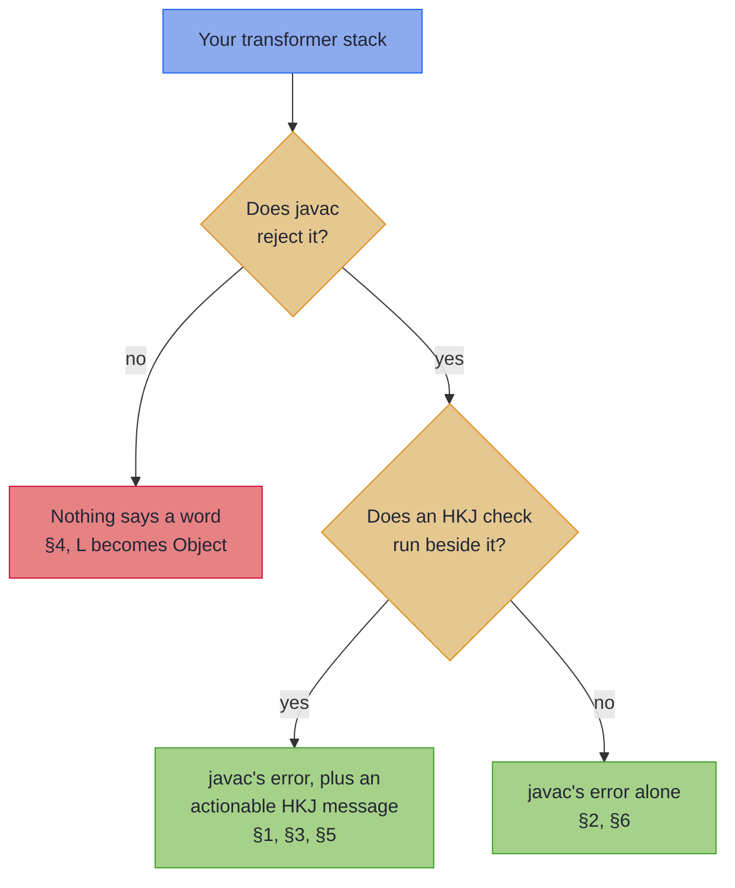

# Common Compiler Errors

Transformer code is generic-heavy by nature: a typical signature like `Kind<EitherTKind.Witness<CompletableFutureKind.Witness, DomainError>, Result>` packs three type parameters into two layers. When something goes wrong, the messages can be hard to read. Find your symptom in the table below and follow it to its section.

~~~admonish info title="What You'll Learn"
- Which transformer mistakes javac catches, which the HKJ checker adds a message to, and which nothing catches
- How to satisfy the missing-Monad constraint when constructing a transformer monad
- How to unify error types across an `EitherT` chain
- Why `StateT.mapT` takes an extra parameter that the other `mapT` methods do not
- When to call `.value()` and when to leave a transformer alone
~~~

~~~admonish tip title="Five of these six are javac errors"
The compiler is mostly on your side here, and that is not an accident. A transformer stack encodes the error type inside the witness itself (`EitherTKind.Witness<F, L>`), so a step with the wrong `L` is a genuinely different type rather than an erased one. The Effect Path API pays for its lighter syntax with exactly that guarantee: compare [Effect §5](../effect/compiler_errors.md#5-the-error-type-is-silently-erased-across-a-chain), where the same mistake compiles.

- **§1, §2, §3, §5 and §6 are javac errors.** The build stops, and the message is quoted in the section.
- **§1, §3 and §5 also carry an HKJ checker companion**, which adds an actionable message beside javac's own. §2 and §6 javac catches on its own. See [Compile-Time Checks](../tooling/compile_checks.md).
- **§4 compiles, and nothing reports it**, the checker included. `L` resolves to `Object` and stays there.
~~~

---

## Find your message

| The symptom | What it is | Caught by |
|-------------|------------|-----------|
| [`method eitherT cannot be applied`, expecting `Monad<F>`](#1-method-eithert-cannot-be-applied-to-given-types) | The outer monad was not passed to the factory | javac, plus `transformer-missing-monad` |
| [`incompatible types`, with two `EitherTKind.Witness` shapes](#2-incompatible-types-error-type-mismatch-in-eithert-chain) | Two different error types `L` in one chain | javac |
| [`mapT cannot be applied` on `StateT`](#3-method-mapt-cannot-be-applied-on-statet) | `StateT.mapT` needs a leading `Monad<G>` | javac, plus `state-t-mapt-arity` |
| [`Either.right` silently gets `L = Object`](#4-the-phantom-l-on-eithertfromeither--eitherright) | Nothing constrains `L`, so javac defaults it | Nothing. Add the witness yourself |
| [`cannot find symbol .value()` on a `Kind`](#5-cannot-find-symbol-value-on-a-kind) | `.value()` is on the concrete transformer, not on `Kind` | javac, plus `kind-value-narrow` |
| [`For.from` not applicable, naming two stack types](#6-method-forfrom-is-not-applicable-with-the-wrong-monad) | Mixed transformer stacks in one comprehension | javac |

Which line of defence answers depends on the mistake:



---

## 1. "Method `eitherT` cannot be applied to given types"

**A javac error.** Every transformer monad needs a `Monad<F>` instance for the *outer* effect, and the factory cannot infer it from thin air.

**The error:**

```
error: method eitherT in class Instances cannot be applied to given types;
    var eitherTMonad = Instances.eitherT();
                                 ^
  required: Monad<F>
  found:    no arguments
  reason:   cannot infer type-variable(s) F,L
    (actual and formal argument lists differ in length)
```

**The trigger:**

<!-- verify:rejects "method eitherT in class org.higherkindedj.hkt.instances.Instances cannot be applied" -->
```java
var eitherTMonad =
    Instances.eitherT();   // missing argument
```

**The fix:** pass the outer monad to the factory.

<!-- verify -->
```java
var futureMonad  = Instances.monadError(completableFuture());
var eitherTMonad =
    Instances.eitherT(futureMonad);
```

The same rule applies to `OptionalTMonad`, `MaybeTMonad`, `ReaderTMonad`, `StateTMonad`, and `WriterTMonad`. `WriterTMonad` additionally requires a `Monoid<W>` for the output type.

~~~admonish tip title="The HKJ checker catches this"
The `transformer-missing-monad` check is the companion to javac's own error, and names the required outer `Monad<F>`, plus the `Monoid<W>` for `WriterTMonad`. See [Compile-Time Checks](../tooling/compile_checks.md).
~~~

---

## 2. "Incompatible types: error type mismatch in EitherT chain"

**A javac error.** Every step in an `EitherT` comprehension shares one error type `L`. Mixing a step that fails with `String` and one that fails with `DomainError` will not compile.

**The error:**

```
error: incompatible types: cannot infer type-variable(s) B
    (argument mismatch; bad return type in lambda expression
      EitherT<F,String,User> cannot be converted to Kind<EitherTKind.Witness<F,DomainError>,B>)
```

**The trigger:**

<!-- verify:rejects "bad return type in lambda expression" -->
```java
// lookupUser returns EitherT<F, String, User>: error type is String, not DomainError
EitherT<CompletableFutureKind.Witness, String, User> lookupUser(String id) {
    return EitherT.fromEither(futureMonad, Either.<String, User>right(new User(id)));
}

// eitherTMonad is a MonadError<EitherTKind.Witness<F, DomainError>, DomainError>
For.from(eitherTMonad, validatedET)
    .from(id -> lookupUser(id));   // String vs DomainError mismatch
```

**The fix:** unify the error type, either by changing the function or by mapping at the boundary.

<!-- verify -->
```java
// Option 1: change lookupUser to use DomainError
EitherT<CompletableFutureKind.Witness, DomainError, User> lookupUser(String id) {
    return EitherT.fromEither(futureMonad, Either.<DomainError, User>right(new User(id)));
}
```

<!-- verify -->
```java
// Option 2: lift the foreign error type at the call site
EitherT<CompletableFutureKind.Witness, String, User> lookupUser(String id) {
    return EitherT.fromEither(futureMonad, Either.<String, User>right(new User(id)));
}

EitherT<CompletableFutureKind.Witness, DomainError, User> liftLookup(String id) {
    var raw = lookupUser(id);                                            // EitherT<F, String, User>
    return EitherT.fromKind(
        futureMonad.map(
            either -> either.mapLeft(DomainError.UserLookup::new),       // String -> DomainError
            raw.value()));
}
```

Option 1 is preferred for new code. Option 2 is useful when integrating with code you cannot change.

~~~admonish note title="Why this one is caught, and the Path equivalent is not" collapsible=true
Contrast with [Effect §5](../effect/compiler_errors.md#5-the-error-type-is-silently-erased-across-a-chain), where the error type is *silently erased*. Here it is not.

The transformer stack encodes `L` inside the witness itself (`EitherTKind.Witness<F, L>`), so a step with a different `L` is a genuinely different `Kind<…>` type, and `For.from(...).from(...)` fails to type-check. The Path API's `Chainable<B>` carries no error type, which is what makes the same mistake compile there.
~~~

---

## 3. "Method `mapT` cannot be applied" on `StateT`

**A javac error.** `StateT.mapT` is the one `mapT` that takes a leading `Monad<G>`, because the state-threading function `S -> Kind<G, (S, A)>` has to close over the new monad.

**The error:**

```
error: method mapT in record StateT<S,F,A> cannot be applied to given types;
    stateT.mapT(f);
           ^
  required: Monad<G>, Function<Kind<F,StateTuple<S,A>>,Kind<G,StateTuple<S,A>>>
  found:    (idKind)->[...]
  reason:   cannot infer type-variable(s) G
    (actual and formal argument lists differ in length)
```

**The trigger:**

<!-- verify:rejects "method mapT in record org.higherkindedj.hkt.state_t.StateT<S,F,A> cannot be applied" -->
```java
// idState is a StateT<Counter, IdKind.Witness, Integer>
var optionalState = idState.mapT(idKind -> idToOptional.apply(idKind));   // missing first argument
```

**The fix:** pass the target monad alongside the function.

<!-- verify -->
```java
var optionalMonad = Instances.monadError(optional());
var optionalState = idState.mapT(optionalMonad, idKind -> idToOptional.apply(idKind));
```

`EitherT.mapT`, `OptionalT.mapT`, `MaybeT.mapT`, `ReaderT.mapT`, and `WriterT.mapT` do not take this extra argument. Only `StateT` does.

~~~admonish tip title="The HKJ checker catches this"
The `state-t-mapt-arity` check is the companion to javac's own error, and explains that only `StateT.mapT` takes the leading `Monad<G>`. See [Compile-Time Checks](../tooling/compile_checks.md).
~~~

---

## 4. The phantom `L` on `EitherT.fromEither` / `Either.right`

**This compiles, and nothing reports it.** `Either.right(value)` has no Left, so when nothing constrains `L`, javac resolves it to `java.lang.Object` and says nothing.

**The trigger:**

<!-- verify -->
```java
// L bound to DomainError by the typed variable: fine
EitherT<CompletableFutureKind.Witness, DomainError, ValidatedOrder> step =
    EitherT.fromEither(futureMonad, Either.right(validated));

// nothing constrains L, so L = Object, and it compiles
var untypedStep = EitherT.fromEither(futureMonad, Either.right(validated));
```

**The fix:** pin `L` with an explicit type witness on the `Either`, so `Object` never leaks in:

<!-- verify -->
```java
EitherT.fromEither(futureMonad, Either.<DomainError, ValidatedOrder>right(validated));
```

The witness costs nothing at runtime and keeps the error type honest.

~~~admonish note title="Why it is silent, and what older write-ups said" collapsible=true
Older write-ups described an error here:

```
error: method fromEither ... cannot be applied to given types;
  reason: cannot infer type-variable(s) F, L, R
```

On the supported compiler this does not happen. It is the same phantom-type-parameter situation as [Effect §1](../effect/compiler_errors.md#1-the-phantom-error-type-e-on-pathright): modern `javac` resolves `L` to `java.lang.Object` and the code compiles rather than erroring. The mistake is silent, not loud.

The HKJ checker does not cover it either. This is the excluded inference family: javac raises nothing, so there is no error for a companion check to annotate, and an unconstrained `L` is not reliably distinguishable from code that means `Either<Object, …>`. The witness is the fix. See [Compile-Time Checks](../tooling/compile_checks.md) for what the checker does and does not cover.
~~~

---

## 5. "Cannot find symbol `.value()`" on a `Kind`

**A javac error.** `.value()` is defined on the concrete `EitherT<F, L, R>`, and equivalently on `OptionalT`, `MaybeT`, `ReaderT`, `StateT` and `WriterT`. It is not part of the `Kind` interface, so a `Kind` value has to be narrowed back to the concrete transformer first.

**The error:**

```
error: cannot find symbol
    var future = workflow.value();
                         ^
  symbol:   method value()
  location: variable workflow of type Kind<EitherTKind.Witness<...>, Result>
```

**The trigger:**

<!-- verify:rejects "method value()" -->
```java
Kind<EitherTKind.Witness<CompletableFutureKind.Witness, DomainError>, Result> workflow =
    eitherTMonad.flatMap(id -> fetchEither(id), validatedET);

var result = workflow.value();   // Kind has no value() method
```

**The fix:** call the matching narrow helper before extracting the underlying value.

<!-- verify -->
```java
import static org.higherkindedj.hkt.either_t.EitherTKindHelper.EITHER_T;

Kind<EitherTKind.Witness<CompletableFutureKind.Witness, DomainError>, Result> workflow =
    eitherTMonad.flatMap(id -> fetchEither(id), validatedET);

var result = EITHER_T.narrow(workflow).value();
```

This boundary conversion is unavoidable when a method is typed in `Kind` but you need a concrete operation. If you control the call site, declaring the variable as the concrete `EitherT<...>` removes the need:

<!-- verify -->
```java
EitherT<CompletableFutureKind.Witness, DomainError, Result> workflow =
    EITHER_T.narrow(eitherTMonad.flatMap(id -> fetchEither(id), validatedET));

var result = workflow.value();
```

~~~admonish tip title="The HKJ checker catches this"
The `kind-value-narrow` check is the companion to javac's own error, and points at the concrete-transformer narrow. See [Compile-Time Checks](../tooling/compile_checks.md).
~~~

---

## 6. "Method `For.from` is not applicable" with the wrong monad

**A javac error.** `For.from(monad, source)` requires the source's witness type to match the monad's. Passing an `EitherTMonad` and an `OptionalT` mixes two different transformer stacks.

**The error:**

```
error: no suitable method found for from(MonadError<EitherTKind.Witness<F,DomainError>,DomainError>,
    OptionalT<F,User>)
    method For.<M,A>from(Monad<M>,Kind<M,A>) is not applicable
      (inference variable M has incompatible equality constraints
        OptionalTKind.Witness<F>, EitherTKind.Witness<F,DomainError>)
```

**The trigger:**

<!-- verify:rejects "inference variable M has incompatible equality constraints" -->
```java
// eitherTMonad is a MonadError<EitherTKind.Witness<F, DomainError>, DomainError>
For.from(eitherTMonad, OptionalT.fromKind(future))    // mismatched witness types
    .yield(user -> user);
```

**The fix:** make sure the monad you pass to `For.from` matches the witness of every step.

<!-- verify -->
```java
// Either use EitherT throughout:
For.from(eitherTMonad, validatedET)
    .from(id -> fetchEither(id))
    .yield((id, result) -> result);
```

<!-- verify -->
```java
// Or build the matching OptionalTMonad and use OptionalT throughout:
var optionalTMonad = Instances.optionalT(futureMonad);
For.from(optionalTMonad, OptionalT.fromKind(future))
    .yield(user -> user.id());
```

If you genuinely need to combine two effect layers, typed errors *and* absence in the same workflow, you are in stacking territory. See [Tutorial 03: Stacking Transformers](../tutorials/transformers/transformers_journey.md) and [Stack Archetypes](archetypes.md).

---

~~~admonish info title="Key Takeaways"
* **The witness is what makes these errors loud.** A transformer stack carries `L` in the type, so a mismatched error type is a compile error rather than a runtime surprise.
* **Every transformer factory wants the outer monad.** `Instances.eitherT(futureMonad)`, and a `Monoid<W>` as well for `WriterTMonad`.
* **`StateT.mapT` is the one that takes a leading `Monad<G>`.** Every other transformer's `mapT` takes the function alone.
* **`.value()` lives on the concrete transformer, not on `Kind`.** Narrow first, or declare the variable concrete and skip the round trip.
* **Only §4 is silent.** An unconstrained `L` becomes `Object` with nothing to warn you, so pin it with `Either.<E, A>right(...)` at the source.
~~~

~~~admonish tip title="See Also"
- [Path or Transformer?](when_to_drop_to_transformers.md): the decision page that may save you from this chapter entirely
- [Transformers at a Glance](transformers_at_a_glance.md): reference card for every transformer
- [Effect Path Common Compiler Errors](../effect/compiler_errors.md): the equivalent for the Path API
- [Compile-Time Checks](../tooling/compile_checks.md): the checks that add a message beside javac's own
- [Migration Cookbook](migration_cookbook.md): side-by-side translations between styles
~~~

---

**Previous:** [Combining Capabilities](mtl_combining.md)
**Next:** [Capstone: A Multi-Capability Workflow](transformer_capstone.md)
