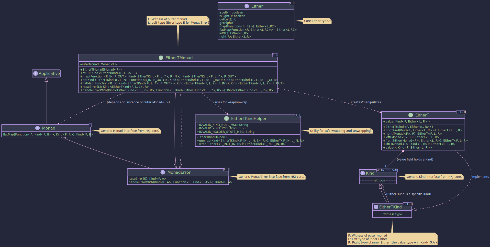

# The MaybeT Transformer:
## _Combining Monadic Effects with Optionality_

~~~admonish info title="What You'll Learn"
- How to combine Maybe's optionality with other monadic effects
- Building workflows where operations might produce Nothing within async contexts
- Understanding the difference between MaybeT and OptionalT
- Using `just`, `nothing`, and `fromMaybe` to construct MaybeT values
- Handling Nothing states with Unit as the error type in MonadError
~~~

~~~ admonish example title="See Example Code:"
[MaybeTExample.java](https://github.com/higher-kinded-j/higher-kinded-j/blob/main/hkj-examples/src/main/java/org/higherkindedj/example/basic/maybe_t/MaybeTExample.java)
~~~
## `MaybeT` Monad Transformer.



## `MaybeT<F, A>`: Combining Any Monad `F` with `Maybe<A>`

The `MaybeT` monad transformer allows you to combine the optionality of `Maybe<A>` (representing a value that might be
`Just<A>` or `Nothing`) with another outer monad `F`. It transforms a computation that results in `Kind<F, Maybe<A>>`
into a single monadic structure. This is useful for operations within an effectful context `F` (like
`CompletableFutureKind` for async operations or `ListKind` for non-deterministic computations) that can also result in
an absence of a value.

* **`F`**: The witness type of the **outer monad** (e.g., `CompletableFutureKind.Witness`, `ListKind.Witness`). This
  monad handles the primary effect (e.g., asynchronicity, non-determinism).
* **`A`**: The type of the value potentially held by the inner `Maybe`.

```
// From: org.higherkindedj.hkt.maybe_t.MaybeT
public record MaybeT<F, A>(@NonNull Kind<F, Maybe<A>> value) { 
/* ... static factories ... */ }
```

`MaybeT<F, A>` wraps a value of type `Kind<F, Maybe<A>>`. It signifies a computation in the context of `F` that will
eventually produce a `Maybe<A>`. The main benefit comes from its associated type class instance, `MaybeTMonad`, which
provides monadic operations for this combined structure.

## `MaybeTKind<F, A>`: The Witness Type

Similar to other HKTs in Higher-Kinded-J, `MaybeT` uses `MaybeTKind<F, A>` as its witness type for use in generic
functions.

* It extends `Kind<G, A>` where `G` (the witness for the combined monad) is `MaybeTKind.Witness<F>`.
* `F` is fixed for a specific `MaybeT` context, while `A` is the variable type parameter.

```java
public interface MaybeTKind<F, A> extends Kind<MaybeTKind.Witness<F>, A> {
  // Witness type G = MaybeTKind.Witness<F>
  // Value type A = A (from Maybe<A>)
}
```

## `MaybeTKindHelper`

* This utility class provides static `wrap` and `unwrap` methods for safe conversion between the concrete `MaybeT<F, A>`
  and its `Kind` representation (`Kind<MaybeTKind.Witness<F>, A>`).

```java
// To wrap:
// MaybeT<F, A> maybeT = ...;
Kind<MaybeTKind.Witness<F>, A> kind = MAYBE_T.widen(maybeT);
// To unwrap:
MaybeT<F, A> unwrappedMaybeT = MAYBE_T.narrow(kind);
```

## `MaybeTMonad<F>`: Operating on `MaybeT`

The `MaybeTMonad<F>` class implements `MonadError<MaybeTKind.Witness<F>, Unit>`. The error type `E` for `MonadError` is fixed to `Unit`, signifying that an "error" in this context is the `Maybe.nothing()` state within the `F<Maybe<A>>` structure.
`MaybeT` represents failure (or absence) as `Nothing`, which doesn't carry an error value itself.

* It requires a `Monad<F>` instance for the outer monad `F`, provided during construction. This instance is used to
  manage the effects of `F`.
* It uses `MaybeTKindHelper.wrap` and `MaybeTKindHelper.unwrap` for conversions.
* Operations like `raiseError(Unit.INSTANCE)` will create a `MaybeT` representing `F<Nothing>`.
  The `Unit.INSTANCE` signifies the `Nothing` state without carrying a separate error value.
* `handleErrorWith` allows "recovering" from a `Nothing` state by providing an alternative `MaybeT`. The handler function passed to `handleErrorWith` will receive `Unit.INSTANCE` if a `Nothing` state is encountered.

```java
// Example: F = CompletableFutureKind.Witness, Error type for MonadError is Unit
// 1. Get the Monad instance for the outer monad F
Monad<CompletableFutureKind.Witness> futureMonad = CompletableFutureMonad.INSTANCE; 

// 2. Create the MaybeTMonad, providing the outer monad instance
MonadError<MaybeTKind.Witness<CompletableFutureKind.Witness>, Unit> maybeTMonad =
    new MaybeTMonad<>(futureMonad);

// Now 'maybeTMonad' can be used to operate on Kind<MaybeTKind.Witness<CompletableFutureKind.Witness>, A> values.
```

~~~admonish info title="Key Operations with _MaybeTMonad_:"

* **`maybeTMonad.of(value)`:** Lifts a nullable value `A` into the `MaybeT` context. Result:
  `F<Maybe.fromNullable(value)>`.
* **`maybeTMonad.map(f, maybeTKind)`:** Applies function `A -> B` to the `Just` value inside the nested structure. If
  it's `Nothing`, or `f` returns `null`, it propagates `F<Nothing>`.
* **`maybeTMonad.flatMap(f, maybeTKind)`:** Sequences operations. Takes `A -> Kind<MaybeTKind.Witness<F>, B>`. If the
  input is `F<Just(a)>`, it applies `f(a)` to get the next `MaybeT<F, B>` and extracts its `Kind<F, Maybe<B>>`. If
  `F<Nothing>`, it propagates `F<Nothing>`.
* **`maybeTMonad.raiseError(Unit.INSTANCE)`:** Creates `MaybeT` representing `F<Nothing>`.
* **`maybeTMonad.handleErrorWith(maybeTKind, handler)`:** Handles a `Nothing` state. The handler
  `Unit -> Kind<MaybeTKind.Witness<F>, A>` is invoked with `null`.
~~~

----

~~~admonish title="Creating _MaybeT_ Instances"
`MaybeT` instances are typically created using its static factory methods, often requiring the outer `Monad<F>`
instance:

```java
public void createExample() {
    Monad<OptionalKind.Witness> optMonad = OptionalMonad.INSTANCE; // Outer Monad F=Optional
    String presentValue = "Hello";

    // 1. Lifting a non-null value: Optional<Just(value)>
    MaybeT<OptionalKind.Witness, String> mtJust = MaybeT.just(optMonad, presentValue);
    // Resulting wrapped value: Optional.of(Maybe.just("Hello"))

    // 2. Creating a 'Nothing' state: Optional<Nothing>
    MaybeT<OptionalKind.Witness, String> mtNothing = MaybeT.nothing(optMonad);
    // Resulting wrapped value: Optional.of(Maybe.nothing())

    // 3. Lifting a plain Maybe: Optional<Maybe(input)>
    Maybe<Integer> plainMaybe = Maybe.just(123);
    MaybeT<OptionalKind.Witness, Integer> mtFromMaybe = MaybeT.fromMaybe(optMonad, plainMaybe);
    // Resulting wrapped value: Optional.of(Maybe.just(123))

    Maybe<Integer> plainNothing = Maybe.nothing();
    MaybeT<OptionalKind.Witness, Integer> mtFromMaybeNothing = MaybeT.fromMaybe(optMonad, plainNothing);
    // Resulting wrapped value: Optional.of(Maybe.nothing())


    // 4. Lifting an outer monad value F<A>: Optional<Maybe<A>> (using fromNullable)
    Kind<OptionalKind.Witness, String> outerOptional = OPTIONAL.widen(Optional.of("World"));
    MaybeT<OptionalKind.Witness, String> mtLiftF = MaybeT.liftF(optMonad, outerOptional);
    // Resulting wrapped value: Optional.of(Maybe.just("World"))

    Kind<OptionalKind.Witness, String> outerEmptyOptional = OPTIONAL.widen(Optional.empty());
    MaybeT<OptionalKind.Witness, String> mtLiftFEmpty = MaybeT.liftF(optMonad, outerEmptyOptional);
    // Resulting wrapped value: Optional.of(Maybe.nothing())


    // 5. Wrapping an existing nested Kind: F<Maybe<A>>
    Kind<OptionalKind.Witness, Maybe<String>> nestedKind =
        OPTIONAL.widen(Optional.of(Maybe.just("Present")));
    MaybeT<OptionalKind.Witness, String> mtFromKind = MaybeT.fromKind(nestedKind);
    // Resulting wrapped value: Optional.of(Maybe.just("Present"))

    // Accessing the wrapped value:
    Kind<OptionalKind.Witness, Maybe<String>> wrappedValue = mtJust.value();
    Optional<Maybe<String>> unwrappedOptional = OPTIONAL.narrow(wrappedValue);
    // unwrappedOptional is Optional.of(Maybe.just("Hello"))
  }
```
~~~

~~~admonish Example title="Asynchronous Optional Resource Fetching"
Let's consider fetching a userLogin and then their preferences, where each step is asynchronous and might not return a value.

```java
public static class MaybeTAsyncExample {
  // --- Setup ---
  Monad<CompletableFutureKind.Witness> futureMonad = CompletableFutureMonad.INSTANCE;
  MonadError<MaybeTKind.Witness<CompletableFutureKind.Witness>, Unit> maybeTMonad =
      new MaybeTMonad<>(futureMonad);

  // Simulates fetching a userLogin asynchronously
  Kind<CompletableFutureKind.Witness, Maybe<User>> fetchUserAsync(String userId) {
    System.out.println("Fetching userLogin: " + userId);
    CompletableFuture<Maybe<User>> future = CompletableFuture.supplyAsync(() -> {
      try {
        TimeUnit.MILLISECONDS.sleep(50);
      } catch (InterruptedException e) { /* ignore */ }
      if ("user123".equals(userId)) {
        return Maybe.just(new User(userId, "Alice"));
      }
      return Maybe.nothing();
    });
    return FUTURE.widen(future);
  }

  // Simulates fetching userLogin preferences asynchronously
  Kind<CompletableFutureKind.Witness, Maybe<UserPreferences>> fetchPreferencesAsync(String userId) {
    System.out.println("Fetching preferences for userLogin: " + userId);
    CompletableFuture<Maybe<UserPreferences>> future = CompletableFuture.supplyAsync(() -> {
      try {
        TimeUnit.MILLISECONDS.sleep(30);
      } catch (InterruptedException e) { /* ignore */ }
      if ("user123".equals(userId)) {
        return Maybe.just(new UserPreferences(userId, "dark-mode"));
      }
      return Maybe.nothing(); // No preferences for other users or if userLogin fetch failed
    });
    return FUTURE.widen(future);
  }

  // --- Service Stubs (returning Future<Maybe<T>>) ---

  // Function to run the workflow for a given userId
  Kind<CompletableFutureKind.Witness, Maybe<UserPreferences>> getUserPreferencesWorkflow(String userIdToFetch) {

    // Step 1: Fetch User
    // Directly use MaybeT.fromKind as fetchUserAsync already returns F<Maybe<User>>
    Kind<MaybeTKind.Witness<CompletableFutureKind.Witness>, User> userMT =
        MAYBE_T.widen(MaybeT.fromKind(fetchUserAsync(userIdToFetch)));

    // Step 2: Fetch Preferences if User was found
    Kind<MaybeTKind.Witness<CompletableFutureKind.Witness>, UserPreferences> preferencesMT =
        maybeTMonad.flatMap(
            userLogin -> { // This lambda is only called if userMT contains F<Just(userLogin)>
              System.out.println("User found: " + userLogin.name() + ". Now fetching preferences.");
              // fetchPreferencesAsync returns Kind<CompletableFutureKind.Witness, Maybe<UserPreferences>>
              // which is F<Maybe<A>>, so we can wrap it directly.
              return MAYBE_T.widen(MaybeT.fromKind(fetchPreferencesAsync(userLogin.id())));
            },
            userMT // Input to flatMap
        );

    // Try to recover if preferences are Nothing, but userLogin was found (conceptual)
    Kind<MaybeTKind.Witness<CompletableFutureKind.Witness>, UserPreferences> preferencesWithDefaultMT =
        maybeTMonad.handleErrorWith(preferencesMT, (Unit v) -> { // Handler for Nothing
          System.out.println("Preferences not found, attempting to use default.");
          // We need userId here. For simplicity, let's assume we could get it or just return nothing.
          // This example shows returning nothing again if we can't provide a default.
          // A real scenario might try to fetch default preferences or construct one.
          return maybeTMonad.raiseError(Unit.INSTANCE); // Still Nothing, or could be MaybeT.just(defaultPrefs)
        });


    // Unwrap the final MaybeT to get the underlying Future<Maybe<UserPreferences>>
    MaybeT<CompletableFutureKind.Witness, UserPreferences> finalMaybeT =
        MAYBE_T.narrow(preferencesWithDefaultMT); // or preferencesMT if no recovery
    return finalMaybeT.value();
  }

  public void asyncExample() {
    System.out.println("--- Fetching preferences for known userLogin (user123) ---");
    Kind<CompletableFutureKind.Witness, Maybe<UserPreferences>> resultKnownUserKind =
        getUserPreferencesWorkflow("user123");
    Maybe<UserPreferences> resultKnownUser = FUTURE.join(resultKnownUserKind);
    System.out.println("Known User Result: " + resultKnownUser);
    // Expected: Just(UserPreferences[userId=user123, theme=dark-mode])

    System.out.println("\n--- Fetching preferences for unknown userLogin (user999) ---");
    Kind<CompletableFutureKind.Witness, Maybe<UserPreferences>> resultUnknownUserKind =
        getUserPreferencesWorkflow("user999");
    Maybe<UserPreferences> resultUnknownUser = FUTURE.join(resultUnknownUserKind);
    System.out.println("Unknown User Result: " + resultUnknownUser);
    // Expected: Nothing
  }

  // --- Workflow Definition using MaybeT ---

  // --- Domain Model ---
  record User(String id, String name) {
  }

  record UserPreferences(String userId, String theme) {
  }
}
```

This example illustrates:

1. Setting up `MaybeTMonad` with `CompletableFutureMonad`and `Unit` as the error type.
2. Using `MaybeT.fromKind` to lift an existing `Kind<F, Maybe<A>>` into the `MaybeT` context.
3. Sequencing operations with `maybeTMonad.flatMap`. If `WorkspaceUserAsync` results in `F<Nothing>`, the lambda for
   fetching preferences is skipped.
4. The `handleErrorWith` shows a way to potentially recover from a `Nothing` state using `Unit` in the handler and `raiseError(Unit.INSTANCE)`.
5. Finally, `.value()` is used to extract the underlying `Kind<CompletableFutureKind.Witness, Maybe<UserPreferences>>`.

~~~

~~~admonish important  title="Key Points:"

- The `MaybeT` transformer simplifies working with nested optional values within other monadic contexts by providing a
unified monadic interface, abstracting away the manual checks and propagation of `Nothing` states.
- When `MaybeTMonad` is used as a `MonadError`, the error type is `Unit`, indicating that the "error" (a `Nothing` state) doesn't carry a specific value beyond its occurrence.
~~~

---

## MaybeT vs OptionalT: When to Use Which?

Both `MaybeT` and `OptionalT` serve similar purposes—combining optionality with other monadic effects. Here's when to choose each:

### Use **MaybeT** when:
- You're working within the higher-kinded-j ecosystem and want consistency with the `Maybe` type
- You need a type that's explicitly designed for functional composition (more FP-native)
- You want to avoid Java's `Optional` and its quirks (e.g., serialisation warnings, identity-sensitive operations)
- You're building a system where `Maybe` is used throughout

### Use **OptionalT** when:
- You're integrating with existing Java code that uses `java.util.Optional`
- You want to leverage familiar Java 8+ Optional APIs
- Your team is more comfortable with standard Java types
- You're wrapping external libraries that return `Optional`

**In practice:** The choice often comes down to consistency with your existing codebase. Both offer equivalent functionality through their `MonadError` instances.

---

## Further Reading

~~~admonish tip title="Learning Path"
Start with the **Java-focused** resources to understand Maybe/Option patterns, then explore **General FP concepts** for deeper understanding, and finally check **Related Libraries** to see alternative approaches.
~~~

### Java-Focused Resources

**Beginner Level:**
- 📚 [Maybe vs Optional: Understanding the Difference](https://medium.com/@johnmcclean/maybe-monad-in-java-8-2e0b7d8e3e5a) - When to use custom Maybe over Java's Optional (10 min read)
- 📄 [Null Handling Patterns in Modern Java](https://www.baeldung.com/java-avoid-null-check) - Comprehensive guide to null safety (15 min read)

**Intermediate Level:**
- 📄 [MonadZero and Failure](https://bartoszmilewski.com/2013/09/10/monoids-monads-and-monad-zero/) - Understanding failure representation (20 min read)
- 📄 [Handling Nothing in Asynchronous Code](https://dzone.com/articles/functional-java-handling-optionals-in-completable) - DZone's practical patterns (12 min read)

### General FP Concepts

- 📖 [Maybe/Option Type](https://en.wikipedia.org/wiki/Option_type) - Wikipedia's cross-language overview
- 📖 [A Fistful of Monads (Haskell)](http://learnyouahaskell.com/a-fistful-of-monads) - Accessible introduction to Maybe (30 min read)

### Related Libraries & Comparisons

- 🔗 [Vavr Option vs Java Optional](https://www.vavr.io/vavr-docs/#_option) - Feature comparison
- 🔗 [Scala Option](https://www.scala-lang.org/api/2.13.3/scala/Option.html) - Scala's battle-tested implementation
- 🔗 [Arrow Option (Kotlin)](https://arrow-kt.io/docs/apidocs/arrow-core/arrow.core/-option/) - Kotlin FP approach

### Community & Discussion

- 💬 [Maybe vs Either for Error Handling](https://stackoverflow.com/questions/48280735/maybe-vs-either-for-error-handling) - Stack Overflow comparison
- 💬 [Why Use Maybe When We Have Optional?](https://www.reddit.com/r/java/comments/7t3q6k/why_implement_maybe_when_java_has_optional/) - Reddit discussion on use cases
