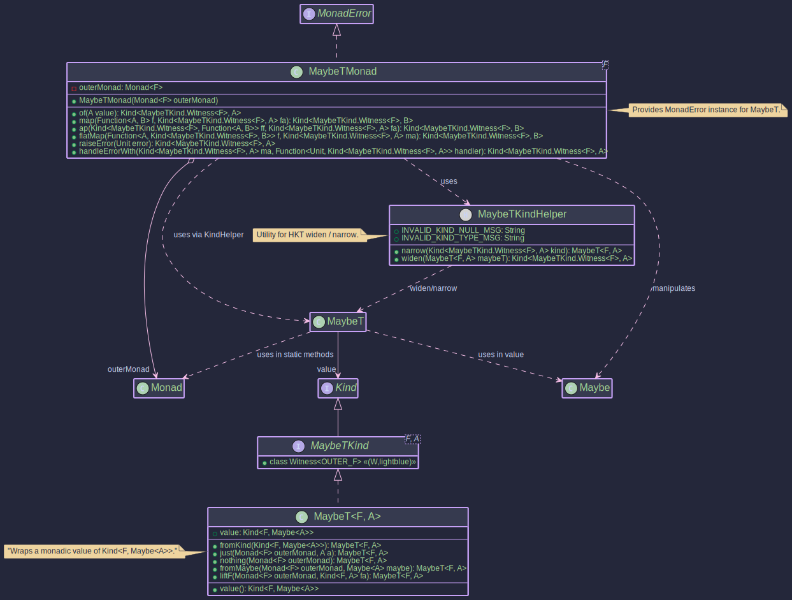

# The MaybeT Transformer:
## _Functional Optionality Across Monads_

~~~admonish info title="What You'll Learn"
- How to combine Maybe's optionality with other monadic effects
- Building workflows where operations might produce Nothing within async contexts
- Understanding the difference between MaybeT and OptionalT
- Using `just`, `nothing`, and `fromMaybe` to construct MaybeT values
- Handling Nothing states with Unit as the error type in MonadError
~~~

~~~ admonish example title="See Example Code:"
[MaybeTExample.java](https://github.com/higher-kinded-j/higher-kinded-j/blob/main/hkj-examples/src/main/java/org/higherkindedj/example/basic/maybe_t/MaybeTExample.java)
~~~

---

## The Problem: Nested Async Optionality

When an async lookup returns `Maybe` rather than `Optional`, you face the same nesting problem:

```java
// Without MaybeT: manual nesting
CompletableFuture<Maybe<UserPreferences>> getPreferences(String userId) {
    return fetchUserAsync(userId).thenCompose(maybeUser ->
        maybeUser.fold(
            () -> CompletableFuture.completedFuture(Maybe.nothing()),
            user -> fetchPreferencesAsync(user.id()).thenCompose(maybePrefs ->
                maybePrefs.fold(
                    () -> CompletableFuture.completedFuture(Maybe.nothing()),
                    prefs -> CompletableFuture.completedFuture(Maybe.just(prefs))
                ))
        ));
}
```

Each step requires folding over the `Maybe`, providing a `Nothing` fallback wrapped in a completed future, and nesting deeper. The pattern is identical to the `Optional` case but uses `Maybe`'s API.

## The Solution: MaybeT

```java
// With MaybeT: flat composition
Kind<MaybeTKind.Witness<CompletableFutureKind.Witness>, UserPreferences>
    getPreferences(String userId) {

  var userMT = MAYBE_T.widen(MaybeT.fromKind(fetchUserAsync(userId)));

  return maybeTMonad.flatMap(user ->
      MAYBE_T.widen(MaybeT.fromKind(fetchPreferencesAsync(user.id()))),
      userMT);
}
```

If `fetchUserAsync` returns `Nothing`, the preferences lookup is skipped entirely. No manual folding, no fallback wrapping.

### The Railway View

<pre style="line-height:1.5;font-size:0.95em">
    <span style="color:#4CAF50"><b>Just</b>     ═══●═══════════════●═══════════════════▶  UserPreferences</span>
    <span style="color:#4CAF50">          fetchUser       fetchPreferences</span>
    <span style="color:#4CAF50">          (flatMap)        (flatMap)</span>
                  ╲               ╲
                   ╲               ╲  Nothing: skip remaining steps
                    ╲               ╲
    <span style="color:#F44336"><b>Nothing</b>  ────●────────────────●──────────────────▶  Nothing</span>
    <span style="color:#F44336">         user absent     prefs absent</span>
                                    │
                               <span style="color:#4CAF50">handleErrorWith</span>    provide defaults
                                    │
    <span style="color:#4CAF50">                                ●═══▶  default UserPreferences</span>
</pre>

Each `flatMap` runs inside the outer monad `F` (e.g. `CompletableFuture`). If the inner `Maybe` is `Nothing`, subsequent steps are skipped. `handleErrorWith` can provide a fallback value when the chain yields nothing.

---

## How MaybeT Works

`MaybeT<F, A>` wraps a computation yielding `Kind<F, Maybe<A>>`. It represents an effectful computation in `F` that may produce `Just(value)` or `Nothing`.

<pre style="line-height:1.4;font-size:0.95em">
    ┌──────────────────────────────────────────────────────────┐
    │  MaybeT&lt;CompletableFutureKind.Witness, Value&gt;            │
    │                                                          │
    │  ┌─── CompletableFuture ──────────────────────────────┐  │
    │  │                                                    │  │
    │  │  ┌─── Maybe ───────────────────────────────────┐   │  │
    │  │  │                                             │   │  │
    │  │  │   <span style="color:#F44336">Nothing</span>            │   <span style="color:#4CAF50">Just(value)</span>        │   │  │
    │  │  │                      │                      │   │  │
    │  │  └─────────────────────────────────────────────┘   │  │
    │  │                                                    │  │
    │  └────────────────────────────────────────────────────┘  │
    │                                                          │
    │  flatMap ──▶ sequences F, then routes on Maybe          │
    │  map ──────▶ transforms <span style="color:#4CAF50">Just(value)</span> only                │
    │  raiseError(Unit) ──▶ creates <span style="color:#F44336">Nothing</span> in F              │
    │  handleErrorWith ──▶ recovers from <span style="color:#F44336">Nothing</span>              │
    └──────────────────────────────────────────────────────────┘
</pre>



* **`F`**: The witness type of the **outer monad** (e.g., `CompletableFutureKind.Witness`, `ListKind.Witness`).
* **`A`**: The type of the value potentially held by the inner `Maybe`.

```java
public record MaybeT<F, A>(@NonNull Kind<F, Maybe<A>> value) {
/* ... static factories ... */ }
```

---

## Setting Up MaybeTMonad

The `MaybeTMonad<F>` class implements `MonadError<MaybeTKind.Witness<F>, Unit>`. Like `OptionalTMonad`, the error type is `Unit`, signifying that `Nothing` carries no information beyond its occurrence.

```java
Monad<CompletableFutureKind.Witness> futureMonad = CompletableFutureMonad.INSTANCE;

MonadError<MaybeTKind.Witness<CompletableFutureKind.Witness>, Unit> maybeTMonad =
    new MaybeTMonad<>(futureMonad);
```

~~~admonish note title="Type Witness and Helpers"
**Witness Type:** `MaybeTKind<F, A>` extends `Kind<MaybeTKind.Witness<F>, A>`. The outer monad `F` is fixed; `A` is the variable value type.

**KindHelper:** `MaybeTKindHelper` provides `MAYBE_T.widen` and `MAYBE_T.narrow` for safe conversion between `MaybeT<F, A>` and its `Kind` representation.

```java
Kind<MaybeTKind.Witness<F>, A> kind = MAYBE_T.widen(maybeT);
MaybeT<F, A> concrete = MAYBE_T.narrow(kind);
```
~~~

---

## Key Operations

~~~admonish info title="Key Operations with _MaybeTMonad_:"
* **`maybeTMonad.of(value)`:** Lifts a nullable value `A` into `MaybeT`. Result: `F<Maybe.fromNullable(value)>`.
* **`maybeTMonad.map(f, maybeTKind)`:** Applies `A -> B` to the `Just` value. If `f` returns `null`, it propagates `F<Nothing>`. Result: `F<Maybe<B>>`.
* **`maybeTMonad.flatMap(f, maybeTKind)`:** Sequences operations. If `Just(a)`, applies `f(a)` to get the next `MaybeT`. If `Nothing`, short-circuits to `F<Nothing>`.
* **`maybeTMonad.raiseError(Unit.INSTANCE)`:** Creates `MaybeT` representing `F<Nothing>`.
* **`maybeTMonad.handleErrorWith(maybeTKind, handler)`:** Recovers from `Nothing`. The handler `Unit -> Kind<MaybeTKind.Witness<F>, A>` is invoked with `Unit.INSTANCE`.
~~~

---

## Creating MaybeT Instances

~~~admonish title="Creating _MaybeT_ Instances"
```java
Monad<OptionalKind.Witness> optMonad = OptionalMonad.INSTANCE;

// 1. From a non-null value: F<Just(value)>
MaybeT<OptionalKind.Witness, String> mtJust = MaybeT.just(optMonad, "Hello");

// 2. Nothing state: F<Nothing>
MaybeT<OptionalKind.Witness, String> mtNothing = MaybeT.nothing(optMonad);

// 3. From a plain Maybe: F<Maybe(input)>
MaybeT<OptionalKind.Witness, Integer> mtFromMaybe =
    MaybeT.fromMaybe(optMonad, Maybe.just(123));

// 4. Lifting F<A> into MaybeT (using fromNullable)
Kind<OptionalKind.Witness, String> outerOptional =
    OPTIONAL.widen(Optional.of("World"));
MaybeT<OptionalKind.Witness, String> mtLiftF = MaybeT.liftF(optMonad, outerOptional);

// 5. Wrapping an existing F<Maybe<A>>
Kind<OptionalKind.Witness, Maybe<String>> nestedKind =
    OPTIONAL.widen(Optional.of(Maybe.just("Present")));
MaybeT<OptionalKind.Witness, String> mtFromKind = MaybeT.fromKind(nestedKind);

// Accessing the wrapped value:
Kind<OptionalKind.Witness, Maybe<String>> wrappedValue = mtJust.value();
Optional<Maybe<String>> unwrappedOptional = OPTIONAL.narrow(wrappedValue);
// → Optional.of(Maybe.just("Hello"))
```
~~~

---

## Real-World Example: Async Resource Fetching

~~~admonish Example title="Asynchronous Optional Resource Fetching"

**The problem:** You need to fetch a user asynchronously, and if found, fetch their preferences. Each step might return `Nothing`. You want clean composition without manual `Maybe.fold` at every step.

**The solution:**

```java
Monad<CompletableFutureKind.Witness> futureMonad = CompletableFutureMonad.INSTANCE;
MonadError<MaybeTKind.Witness<CompletableFutureKind.Witness>, Unit> maybeTMonad =
    new MaybeTMonad<>(futureMonad);

// Service stubs return Future<Maybe<T>>
Kind<CompletableFutureKind.Witness, Maybe<User>> fetchUserAsync(String userId) {
    return FUTURE.widen(CompletableFuture.supplyAsync(() ->
        "user123".equals(userId) ? Maybe.just(new User(userId, "Alice"))
                                 : Maybe.nothing()));
}

// Workflow: user → preferences
Kind<CompletableFutureKind.Witness, Maybe<UserPreferences>>
    getUserPreferencesWorkflow(String userId) {

  var userMT = MAYBE_T.widen(MaybeT.fromKind(fetchUserAsync(userId)));

  var preferencesMT = maybeTMonad.flatMap(
      user -> {
          System.out.println("User found: " + user.name());
          return MAYBE_T.widen(MaybeT.fromKind(fetchPreferencesAsync(user.id())));
      },
      userMT);

  // Unwrap to get Future<Maybe<UserPreferences>>
  return MAYBE_T.narrow(preferencesMT).value();
}
```

**Why this works:** The `flatMap` lambda only executes if the user was found (`Just`). If `fetchUserAsync` returns `Nothing`, the entire chain short-circuits to `Future<Nothing>`.
~~~

---

## MaybeT vs OptionalT: When to Use Which?

Both `MaybeT` and `OptionalT` combine optionality with other effects. The functionality is equivalent; the choice depends on your codebase:

| Aspect | MaybeT | OptionalT |
|--------|--------|-----------|
| Inner type | `Maybe<A>` | `java.util.Optional<A>` |
| Best for | Higher-Kinded-J ecosystem code | Integrating with existing Java code |
| FP-native | Yes (designed for composition) | Wraps Java's standard library |
| Serialisation | No warnings | Identity-sensitive operation warnings |
| Team familiarity | Requires learning `Maybe` | Uses familiar `Optional` API |

### Use **MaybeT** when:
- You're working within the Higher-Kinded-J ecosystem and want consistency with `Maybe`
- You want a type explicitly designed for functional composition
- You want to avoid Java's `Optional` and its quirks (serialisation warnings, identity-sensitive operations)

### Use **OptionalT** when:
- You're integrating with existing Java code that uses `java.util.Optional`
- Your team is more comfortable with standard Java types
- You're wrapping external libraries that return `Optional`

**In practice:** Choose whichever matches your existing codebase. Both offer equivalent functionality through their `MonadError` instances.

---

~~~admonish warning title="Common Mistakes"
- **Confusing Maybe.nothing() with null:** `MaybeT.of(null)` will use `Maybe.fromNullable(null)`, which produces `Nothing`. Be explicit about intent; use `MaybeT.nothing(monad)` when you mean absence.
- **Using MaybeT when you need error information:** `Nothing` carries no reason for the absence. If you need to know *why* a value is missing, use `EitherT` with a descriptive error type instead.
~~~

---

~~~admonish tip title="See Also"
- [Monad Transformers](transformers.md) - General concept and choosing the right transformer
- [OptionalT](optionalt_transformer.md) - Equivalent functionality for java.util.Optional
- [EitherT](eithert_transformer.md) - When you need typed errors, not just absence
- [Maybe Monad](../monads/maybe_monad.md) - The underlying Maybe type
~~~

---

~~~admonish tip title="Further Reading"
- [Null Handling Patterns in Modern Java](https://www.baeldung.com/java-avoid-null-check) - Comprehensive guide to null safety (15 min read)
~~~


**Previous:** [OptionalT](optionalt_transformer.md)
**Next:** [ReaderT](readert_transformer.md)
