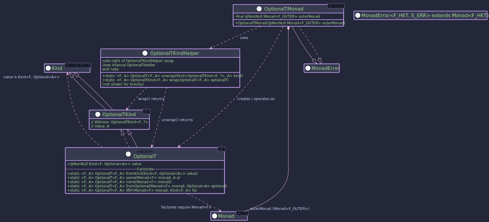

# OptionalT: _Combining Monadic Effects with `java.util.Optional`_


~~~ admonish example title="See Example Code:"
[OptionalTExample.java](https://github.com/higher-kinded-j/higher-kinded-j/blob/main/hkj-examples/src/main/java/org/higherkindedj/example/basic/optional_t/OptionalTExample.java)
~~~

## `OptionalT` Monad Transformer

The `OptionalT` monad transformer (short for Optional Transformer) is designed to combine the semantics of `java.util.Optional<A>` (representing a value that might be present or absent) with an arbitrary outer monad `F`. It effectively allows you to work with computations of type `Kind<F, Optional<A>>` as a single, unified monadic structure.

This is particularly useful when operations within an effectful context `F` (such as asynchronicity with `CompletableFutureKind`, non-determinism with `ListKind`, or dependency injection with `ReaderKind`) can also result in an absence of a value (represented by `Optional.empty()`).

## Structure



## `OptionalT<F, A>`: The Core Data Type

`OptionalT<F, A>` is a record that wraps a computation yielding `Kind<F, Optional<A>>`.

```java
public record OptionalT<F, A>(@NonNull Kind<F, Optional<A>> value)
    implements OptionalTKind<F, A> {
  // ... static factory methods ...
}
```

* **`F`**: The witness type of the **outer monad** (e.g., `CompletableFutureKind.Witness`, `ListKind.Witness`). This monad encapsulates the primary effect of the computation.
* **`A`**: The type of the value that might be present within the **`Optional`, which itself is within the context of `F`.
* **`value`**: The core wrapped value of type **`Kind<F, Optional<A>>`. This represents an effectful computation `F` that, upon completion, yields a `java.util.Optional<A>`.

## `OptionalTKind<F, A>`: The Witness Type

**For integration with Higher-Kinded-J's generic programming model,** `OptionalTKind<F, A>` acts as the higher-kinded type witness.

* **It extends** `Kind<G, A>`, where `G` (the witness for the combined `OptionalT` monad) is `OptionalTKind.Witness<F>`.
* **The outer monad** `F` is fixed for a particular `OptionalT` context, while `A` is the variable type parameter representing the value inside the `Optional`.

```java
public interface OptionalTKind<F, A> extends Kind<OptionalTKind.Witness<F>, A> {
  // Witness type G = OptionalTKind.Witness<F>
  // Value type A = A (from Optional<A>)
}
```

## `OptionalTKindHelper`: Utility for Wrapping and Unwrapping

`OptionalTKindHelper` is a final utility class providing static methods to seamlessly convert between the concrete `OptionalT<F, A>` type and its `Kind` representation (`Kind<OptionalTKind.Witness<F>, A>`).

```java

public enum OptionalTKindHelper {
   
  OPTIONAL_T;
  
    // Unwraps Kind<OptionalTKind.Witness<F>, A> to OptionalT<F, A>
    public  <F, A> @NonNull OptionalT<F, A> narrow(
        @Nullable Kind<OptionalTKind.Witness<F>, A> kind);

    // Wraps OptionalT<F, A> into OptionalTKind<F, A>
    public  <F, A> @NonNull OptionalTKind<F, A> widen(
        @NonNull OptionalT<F, A> optionalT);
}
```

**Internally, it uses a private record** `OptionalTHolder` to implement `OptionalTKind`, but this is an implementation detail.

## `OptionalTMonad<F>`: Operating on `OptionalT`

**The** `OptionalTMonad<F>` class implements `MonadError<OptionalTKind.Witness<F>, Unit>`. This provides the standard monadic operations (`of`, `map`, `flatMap`, `ap`) and error handling capabilities for the `OptionalT` structure. The error type `E` for `MonadError` is fixed to `Unit` signifying that an "error" in this context is the `Optional.empty()` state within `F<Optional<A>>`.

* **It requires a** `Monad<F>` instance for the outer monad `F`, which must be supplied during construction. This `outerMonad` is used to manage and sequence the effects of `F`.

```java
// Example: F = CompletableFutureKind.Witness
// 1. Get the Monad instance for the outer monad F
Monad<CompletableFutureKind.Witness> futureMonad = CompletableFutureMonad.INSTANCE;

// 2. Create the OptionalTMonad
OptionalTMonad<CompletableFutureKind.Witness> optionalTFutureMonad =
    new OptionalTMonad<>(futureMonad);

// Now 'optionalTFutureMonad' can be used to operate on
// Kind<OptionalTKind.Witness<CompletableFutureKind.Witness>, A> values.

```

~~~admonish info title="Key Operations with _OptionalTMonad_:"

* **`optionalTMonad.of(value)`**: Lifts a (nullable) value `A` into the `OptionalT` context. The underlying operation is `r -> outerMonad.of(Optional.ofNullable(value))`. Result: `OptionalT(F<Optional<A>>)`.
* **`optionalTMonad.map(func, optionalTKind)`**: Applies a function `A -> B` to the value `A` if it's present within the `Optional` and the `F` context is successful. The transformation occurs within `outerMonad.map`. If `func` returns `null`, the result becomes `F<Optional.empty()>`. Result: `OptionalT(F<Optional<B>>)`.
* **`optionalTMonad.flatMap(func, optionalTKind)`**: The primary sequencing operation. It takes a function `A -> Kind<OptionalTKind.Witness<F>, B>` (which effectively means `A -> OptionalT<F, B>`). It runs the initial `OptionalT` to get `Kind<F, Optional<A>>`. Using `outerMonad.flatMap`, if this yields an `Optional.of(a)`, `func` is applied to `a` to get the next `OptionalT<F, B>`. The `value` of this new `OptionalT` (`Kind<F, Optional<B>>`) becomes the result. If at any point an `Optional.empty()` is encountered within `F`, it short-circuits and propagates `F<Optional.empty()>`. Result: `OptionalT(F<Optional<B>>)`.
* **`optionalTMonad.raiseError(error)`** (where error is `Unit`): Creates an `OptionalT` representing absence. Result: `OptionalT(F<Optional.empty()>)`.
* **`optionalTMonad.handleErrorWith(optionalTKind, handler)`**: Handles an empty state from the _inner_ `Optional`. Takes a handler `Function<Unit, Kind<OptionalTKind.Witness<F>, A>>`.
~~~

----

~~~admonish title="Creating _OptionalT_ Instances"

- [OptionalTExample.java](https://github.com/higher-kinded-j/higher-kinded-j/blob/main/hkj-examples/src/main/java/org/higherkindedj/example/basic/optional_t/OptionalTExample.java)

`OptionalT` instances are typically created using its static factory methods. These often require a `Monad<F>` instance for the outer monad.

```java
public void createExample() {
    // --- Setup ---
    // Outer Monad F = CompletableFutureKind.Witness
    Monad<CompletableFutureKind.Witness> futureMonad = CompletableFutureMonad.INSTANCE;
    String presentValue = "Data";
    Integer numericValue = 123;

    // 1. `OptionalT.fromKind(Kind<F, Optional<A>> value)`
    //    Wraps an existing F<Optional<A>>.
    Kind<CompletableFutureKind.Witness, Optional<String>> fOptional =
        FUTURE.widen(CompletableFuture.completedFuture(Optional.of(presentValue)));
    OptionalT<CompletableFutureKind.Witness, String> ot1 = OptionalT.fromKind(fOptional);
    // Value: CompletableFuture<Optional.of("Data")>

    // 2. `OptionalT.some(Monad<F> monad, A a)`
    //    Creates an OptionalT with a present value, F<Optional.of(a)>.
    OptionalT<CompletableFutureKind.Witness, String> ot2 = OptionalT.some(futureMonad, presentValue);
    // Value: CompletableFuture<Optional.of("Data")>

    // 3. `OptionalT.none(Monad<F> monad)`
    //    Creates an OptionalT representing an absent value, F<Optional.empty()>.
    OptionalT<CompletableFutureKind.Witness, String> ot3 = OptionalT.none(futureMonad);
    // Value: CompletableFuture<Optional.empty()>

    // 4. `OptionalT.fromOptional(Monad<F> monad, Optional<A> optional)`
    //    Lifts a plain java.util.Optional into OptionalT, F<Optional<A>>.
    Optional<Integer> optInt = Optional.of(numericValue);
    OptionalT<CompletableFutureKind.Witness, Integer> ot4 = OptionalT.fromOptional(futureMonad, optInt);
    // Value: CompletableFuture<Optional.of(123)>


    Optional<Integer> optEmpty = Optional.empty();
    OptionalT<CompletableFutureKind.Witness, Integer> ot4Empty = OptionalT.fromOptional(futureMonad, optEmpty);
    // Value: CompletableFuture<Optional.empty()>


    // 5. `OptionalT.liftF(Monad<F> monad, Kind<F, A> fa)`
    //    Lifts an F<A> into OptionalT. If A is null, it becomes F<Optional.empty()>, otherwise F<Optional.of(A)>.
    Kind<CompletableFutureKind.Witness, String> fValue =
        FUTURE.widen(CompletableFuture.completedFuture(presentValue));
    OptionalT<CompletableFutureKind.Witness, String> ot5 = OptionalT.liftF(futureMonad, fValue);
    // Value: CompletableFuture<Optional.of("Data   ")>

    Kind<CompletableFutureKind.Witness, String> fNullValue =
        FUTURE.widen(CompletableFuture.completedFuture(null)); // F<null>
    OptionalT<CompletableFutureKind.Witness, String> ot5Null = OptionalT.liftF(futureMonad, fNullValue);
    // Value: CompletableFuture<Optional.empty()> (because the value inside F was null)


    // Accessing the wrapped value:
    Kind<CompletableFutureKind.Witness, Optional<String>> wrappedFVO = ot1.value();
    CompletableFuture<Optional<String>> futureOptional = FUTURE.narrow(wrappedFVO);
    futureOptional.thenAccept(optStr -> System.out.println("ot1 result: " + optStr));
  }
```
~~~


~~~admonish Example title="Asynchronous Multi-Step Data Retrieval"

- [OptionalTExample.java](https://github.com/higher-kinded-j/higher-kinded-j/blob/main/hkj-examples/src/main/java/org/higherkindedj/example/basic/optional_t/OptionalTExample.java)

Consider a scenario where you need to fetch a user, then their profile, and finally their preferences. Each step is asynchronous (`CompletableFuture`) and might return an empty `Optional` if the data is not found. `OptionalT` helps manage this composition cleanly.

```java
public static class OptionalTAsyncExample {

    // --- Monad Setup ---
    static final Monad<CompletableFutureKind.Witness> futureMonad = CompletableFutureMonad.INSTANCE;
    static final OptionalTMonad<CompletableFutureKind.Witness> optionalTFutureMonad =
        new OptionalTMonad<>(futureMonad);
    static final ExecutorService executor = Executors.newFixedThreadPool(2);

    public static Kind<CompletableFutureKind.Witness, Optional<User>> fetchUserAsync(String userId) {
      return FUTURE.widen(CompletableFuture.supplyAsync(() -> {
        System.out.println("Fetching user " + userId + " on " + Thread.currentThread().getName());
        try {
          TimeUnit.MILLISECONDS.sleep(50);
        } catch (InterruptedException e) { /* ignore */ }
        return "user1".equals(userId) ? Optional.of(new User(userId, "Alice")) : Optional.empty();
      }, executor));
    }

    public static Kind<CompletableFutureKind.Witness, Optional<UserProfile>> fetchProfileAsync(String userId) {
      return FUTURE.widen(CompletableFuture.supplyAsync(() -> {
        System.out.println("Fetching profile for " + userId + " on " + Thread.currentThread().getName());
        try {
          TimeUnit.MILLISECONDS.sleep(50);
        } catch (InterruptedException e) { /* ignore */ }
        return "user1".equals(userId) ? Optional.of(new UserProfile(userId, "Loves HKJ")) : Optional.empty();
      }, executor));
    }

    public static Kind<CompletableFutureKind.Witness, Optional<UserPreferences>> fetchPrefsAsync(String userId) {
      return FUTURE.widen(CompletableFuture.supplyAsync(() -> {
        System.out.println("Fetching preferences for " + userId + " on " + Thread.currentThread().getName());
        try {
          TimeUnit.MILLISECONDS.sleep(50);
        } catch (InterruptedException e) { /* ignore */ }
        // Simulate preferences sometimes missing even for a valid user
        return "user1".equals(userId) && Math.random() > 0.3 ? Optional.of(new UserPreferences(userId, "dark")) : Optional.empty();
      }, executor));
    }

    // --- Service Stubs (simulating async calls returning Future<Optional<T>>) ---

    // --- Workflow using OptionalT ---
    public static OptionalT<CompletableFutureKind.Witness, UserPreferences> getFullUserPreferences(String userId) {
      // Start by fetching the user, lifting into OptionalT
      OptionalT<CompletableFutureKind.Witness, User> userOT =
          OptionalT.fromKind(fetchUserAsync(userId));

      // If user exists, fetch profile
      OptionalT<CompletableFutureKind.Witness, UserProfile> profileOT =
          OPTIONAL_T.narrow(
              optionalTFutureMonad.flatMap(
                  user -> OPTIONAL_T.widen(OptionalT.fromKind(fetchProfileAsync(user.id()))),
                  OPTIONAL_T.widen(userOT)
              )
          );

      // If profile exists, fetch preferences
      OptionalT<CompletableFutureKind.Witness, UserPreferences> preferencesOT =
          OPTIONAL_T.narrow(
              optionalTFutureMonad.flatMap(
                  profile -> OPTIONAL_T.widen(OptionalT.fromKind(fetchPrefsAsync(profile.userId()))),
                  OPTIONAL_T.widen(profileOT)
              )
          );
      return preferencesOT;
    }

    // Workflow with recovery / default
    public static OptionalT<CompletableFutureKind.Witness, UserPreferences> getPrefsWithDefault(String userId) {
      OptionalT<CompletableFutureKind.Witness, UserPreferences> prefsAttemptOT = getFullUserPreferences(userId);

      Kind<OptionalTKind.Witness<CompletableFutureKind.Witness>, UserPreferences> recoveredPrefsOTKind =
          optionalTFutureMonad.handleErrorWith(
              OPTIONAL_T.widen(prefsAttemptOT),
              (Unit v) -> { // This lambda is called if prefsAttemptOT results in F<Optional.empty()>
                System.out.println("Preferences not found for " + userId + ", providing default.");
                // Lift a default preference into OptionalT
                UserPreferences defaultPrefs = new UserPreferences(userId, "default-light");
                return OPTIONAL_T.widen(OptionalT.some(futureMonad, defaultPrefs));
              }
          );
      return OPTIONAL_T.narrow(recoveredPrefsOTKind);
    }

    public static void main(String[] args) {
      System.out.println("--- Attempting to get preferences for existing user (user1) ---");
      OptionalT<CompletableFutureKind.Witness, UserPreferences> resultUser1OT = getFullUserPreferences("user1");
      CompletableFuture<Optional<UserPreferences>> future1 =
          FUTURE.narrow(resultUser1OT.value());

      future1.whenComplete((optPrefs, ex) -> {
        if (ex != null) {
          System.err.println("Error for user1: " + ex.getMessage());
        } else {
          System.out.println("User1 Preferences: " + optPrefs.map(UserPreferences::toString).orElse("NOT FOUND"));
        }
      });


      System.out.println("\n--- Attempting to get preferences for non-existing user (user2) ---");
      OptionalT<CompletableFutureKind.Witness, UserPreferences> resultUser2OT = getFullUserPreferences("user2");
      CompletableFuture<Optional<UserPreferences>> future2 =
          FUTURE.narrow(resultUser2OT.value());

      future2.whenComplete((optPrefs, ex) -> {
        if (ex != null) {
          System.err.println("Error for user2: " + ex.getMessage());
        } else {
          System.out.println("User2 Preferences: " + optPrefs.map(UserPreferences::toString).orElse("NOT FOUND (as expected)"));
        }
      });

      System.out.println("\n--- Attempting to get preferences for user1 WITH DEFAULT ---");
      OptionalT<CompletableFutureKind.Witness, UserPreferences> resultUser1WithDefaultOT = getPrefsWithDefault("user1");
      CompletableFuture<Optional<UserPreferences>> future3 =
          FUTURE.narrow(resultUser1WithDefaultOT.value());

      future3.whenComplete((optPrefs, ex) -> {
        if (ex != null) {
          System.err.println("Error for user1 (with default): " + ex.getMessage());
        } else {
          // This will either be the fetched prefs or the default.
          System.out.println("User1 Preferences (with default): " + optPrefs.map(UserPreferences::toString).orElse("THIS SHOULD NOT HAPPEN if default works"));
        }
        // Wait for async operations to complete for demonstration
        try {
          TimeUnit.SECONDS.sleep(1);
        } catch (InterruptedException e) {
          Thread.currentThread().interrupt();
        }
        executor.shutdown();
      });
    }

    // --- Domain Model ---
    record User(String id, String name) {
    }

    record UserProfile(String userId, String bio) {
    }

    record UserPreferences(String userId, String theme) {
    }
  }
```


**This example demonstrates:**

1. **Setting up** `OptionalTMonad` with `CompletableFutureMonad`.
2. **Using** `OptionalT.fromKind` to lift an existing `Kind<F, Optional<A>>` (the result of async service calls) into the `OptionalT` context.
3. **Sequencing operations with** `optionalTFutureMonad.flatMap`. If any step in the chain (e.g., `fetchUserAsync`) results in `F<Optional.empty()>`, subsequent `flatMap` lambdas are short-circuited, and the overall result becomes `F<Optional.empty()>`.
4. **Using** `handleErrorWith` to provide a default `UserPreferences` if the chain of operations results in an empty `Optional`.
5. **Finally,** `.value()` is used to extract the underlying `Kind<CompletableFutureKind.Witness, Optional<UserPreferences>>` to interact with the `CompletableFuture` directly.

`OptionalT` simplifies managing sequences of operations where each step might not yield
~~~