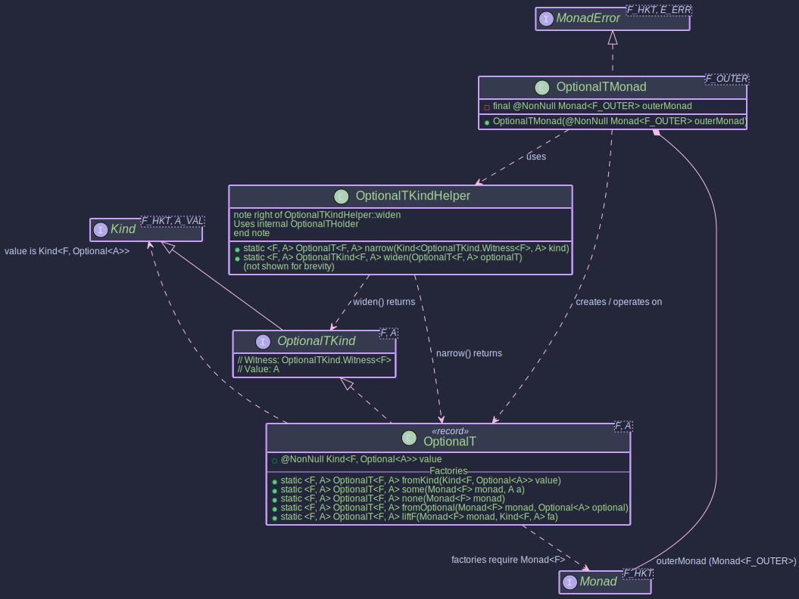

# The OptionalT Transformer:
## _When Absence Meets Other Effects_

~~~admonish info title="What You'll Learn"
- How to integrate Java's Optional with other monadic contexts
- Building async workflows where each step might return empty results
- Using `some`, `none`, and `fromOptional` to construct OptionalT values
- Creating multi-step data retrieval with graceful failure handling
- Providing default values when optional chains result in empty
~~~

~~~ admonish example title="See Example Code:"
[OptionalTExample.java](https://github.com/higher-kinded-j/higher-kinded-j/blob/main/hkj-examples/src/main/java/org/higherkindedj/example/basic/optional_t/OptionalTExample.java)
~~~

---

## The Problem: Nested Async Lookups

Consider fetching a user, then their profile, then their preferences. Each step is async and might return empty:

```java
// Without OptionalT: manual nesting
CompletableFuture<Optional<UserPreferences>> getPreferences(String userId) {
    return fetchUserAsync(userId).thenCompose(optUser ->
        optUser.map(user ->
            fetchProfileAsync(user.id()).thenCompose(optProfile ->
                optProfile.map(profile ->
                    fetchPrefsAsync(profile.userId())
                ).orElse(CompletableFuture.completedFuture(Optional.empty()))
            )
        ).orElse(CompletableFuture.completedFuture(Optional.empty()))
    );
}
```

Each step requires checking the `Optional`, providing a fallback `CompletableFuture.completedFuture(Optional.empty())` for the absent case, and nesting deeper. Three lookups; three layers of `map`/`orElse`. The fallback expression is identical every time.

## The Solution: OptionalT

```java
// With OptionalT: flat composition
OptionalT<CompletableFutureKind.Witness, UserPreferences> getPreferences(String userId) {
    var userOT = OPTIONAL_T.widen(OptionalT.fromKind(fetchUserAsync(userId)));
    var workflow = For.from(optionalTMonad, userOT)
        .from(user -> OPTIONAL_T.widen(OptionalT.fromKind(fetchProfileAsync(user.id()))))
        .from(profile -> OPTIONAL_T.widen(OptionalT.fromKind(fetchPrefsAsync(profile.userId()))))
        .yield((user, profile, prefs) -> prefs);
    return OPTIONAL_T.narrow(workflow);
}
```

If any step returns empty, subsequent steps are skipped. No manual `orElse` fallbacks, no repeated `Optional.empty()` wrapping.

### The Railway View

<pre style="line-height:1.5;font-size:0.95em">
    <span style="color:#4CAF50"><b>Present</b>  ═══●═══════════●═══════════●═══════════▶  UserPreferences</span>
    <span style="color:#4CAF50">          fetchUser   fetchProfile fetchPrefs</span>
    <span style="color:#4CAF50">          (flatMap)   (flatMap)    (flatMap)</span>
                  ╲           ╲            ╲
                   ╲           ╲            ╲  empty: skip remaining steps
                    ╲           ╲            ╲
    <span style="color:#F44336"><b>Empty</b>    ────●──────────●─────────────●──────────▶  Optional.empty()</span>
    <span style="color:#F44336">        user absent  profile absent  prefs absent</span>
                                          │
                                     <span style="color:#4CAF50">handleErrorWith</span>    provide defaults
                                          │
    <span style="color:#4CAF50">                                      ●═══▶  default UserPreferences</span>
</pre>

Each `flatMap` runs inside the outer monad `F` (e.g. `CompletableFuture`). If the inner `Optional` is empty, subsequent steps are skipped. `handleErrorWith` can provide a fallback value when the chain yields nothing.

---

## How OptionalT Works

`OptionalT<F, A>` wraps a computation yielding `Kind<F, Optional<A>>`. It represents an effectful computation in `F` that may or may not produce a value.

<pre style="line-height:1.4;font-size:0.95em">
    ┌──────────────────────────────────────────────────────────┐
    │  OptionalT&lt;CompletableFutureKind.Witness, Value&gt;         │
    │                                                          │
    │  ┌─── CompletableFuture ──────────────────────────────┐  │
    │  │                                                    │  │
    │  │  ┌─── Optional ────────────────────────────────┐   │  │
    │  │  │                                             │   │  │
    │  │  │   <span style="color:#F44336">empty()</span>            │   <span style="color:#4CAF50">of(value)</span>          │   │  │
    │  │  │                      │                      │   │  │
    │  │  └─────────────────────────────────────────────┘   │  │
    │  │                                                    │  │
    │  └────────────────────────────────────────────────────┘  │
    │                                                          │
    │  flatMap ──▶ sequences F, then routes on Optional       │
    │  map ──────▶ transforms <span style="color:#4CAF50">present value</span> only              │
    │  raiseError(Unit) ──▶ creates <span style="color:#F44336">empty()</span> in F              │
    │  handleErrorWith ──▶ recovers from <span style="color:#F44336">empty</span>                │
    └──────────────────────────────────────────────────────────┘
</pre>



* **`F`**: The witness type of the **outer monad** (e.g., `CompletableFutureKind.Witness`).
* **`A`**: The type of the value that might be present within the `Optional`.

```java
public record OptionalT<F, A>(@NonNull Kind<F, Optional<A>> value)
    implements OptionalTKind<F, A> {
  // ... static factory methods ...
}
```

---

## Setting Up OptionalTMonad

The `OptionalTMonad<F>` class implements `MonadError<OptionalTKind.Witness<F>, Unit>`. The error type is `Unit`, signifying that an "error" is the `Optional.empty()` state (absence carries no information beyond its occurrence).

```java
Monad<CompletableFutureKind.Witness> futureMonad = CompletableFutureMonad.INSTANCE;

OptionalTMonad<CompletableFutureKind.Witness> optionalTFutureMonad =
    new OptionalTMonad<>(futureMonad);
```

~~~admonish note title="Type Witness and Helpers"
**Witness Type:** `OptionalTKind<F, A>` extends `Kind<OptionalTKind.Witness<F>, A>`. The outer monad `F` is fixed; `A` is the variable value type.

**KindHelper:** `OptionalTKindHelper` provides `OPTIONAL_T.widen` and `OPTIONAL_T.narrow` for safe conversion between `OptionalT<F, A>` and its `Kind` representation.

```java
Kind<OptionalTKind.Witness<F>, A> kind = OPTIONAL_T.widen(optionalT);
OptionalT<F, A> concrete = OPTIONAL_T.narrow(kind);
```
~~~

---

## Key Operations

~~~admonish info title="Key Operations with _OptionalTMonad_:"
* **`optionalTMonad.of(value)`**: Lifts a nullable value `A` into `OptionalT`. Result: `F<Optional.ofNullable(value)>`.
* **`optionalTMonad.map(func, optionalTKind)`**: Applies `A -> B` to the present value. If `func` returns `null`, the result becomes `F<Optional.empty()>`. Result: `OptionalT(F<Optional<B>>)`.
* **`optionalTMonad.flatMap(func, optionalTKind)`**: Sequences operations. If present, applies `func` to get the next `OptionalT`. If empty at any point, short-circuits to `F<Optional.empty()>`.
* **`optionalTMonad.raiseError(Unit.INSTANCE)`**: Creates an `OptionalT` representing absence. Result: `F<Optional.empty()>`.
* **`optionalTMonad.handleErrorWith(optionalTKind, handler)`**: Handles an empty state. The handler `Unit -> Kind<OptionalTKind.Witness<F>, A>` is invoked when the inner `Optional` is empty.
~~~

---

## Creating OptionalT Instances

~~~admonish title="Creating _OptionalT_ Instances"

- [OptionalTExample.java](https://github.com/higher-kinded-j/higher-kinded-j/blob/main/hkj-examples/src/main/java/org/higherkindedj/example/basic/optional_t/OptionalTExample.java)

```java
Monad<CompletableFutureKind.Witness> futureMonad = CompletableFutureMonad.INSTANCE;

// 1. From an existing F<Optional<A>>
Kind<CompletableFutureKind.Witness, Optional<String>> fOptional =
    FUTURE.widen(CompletableFuture.completedFuture(Optional.of("Data")));
OptionalT<CompletableFutureKind.Witness, String> ot1 = OptionalT.fromKind(fOptional);

// 2. From a present value: F<Optional.of(a)>
OptionalT<CompletableFutureKind.Witness, String> ot2 =
    OptionalT.some(futureMonad, "Data");

// 3. Empty: F<Optional.empty()>
OptionalT<CompletableFutureKind.Witness, String> ot3 = OptionalT.none(futureMonad);

// 4. From a plain java.util.Optional: F<Optional<A>>
OptionalT<CompletableFutureKind.Witness, Integer> ot4 =
    OptionalT.fromOptional(futureMonad, Optional.of(123));

// 5. Lifting F<A> into OptionalT (null → empty, non-null → present)
Kind<CompletableFutureKind.Witness, String> fValue =
    FUTURE.widen(CompletableFuture.completedFuture("Data"));
OptionalT<CompletableFutureKind.Witness, String> ot5 =
    OptionalT.liftF(futureMonad, fValue);

// Accessing the wrapped value:
Kind<CompletableFutureKind.Witness, Optional<String>> wrappedFVO = ot1.value();
CompletableFuture<Optional<String>> futureOptional = FUTURE.narrow(wrappedFVO);
```
~~~

---

## Real-World Example: Async Multi-Step Data Retrieval

~~~admonish Example title="Asynchronous Multi-Step Data Retrieval"

- [OptionalTExample.java](https://github.com/higher-kinded-j/higher-kinded-j/blob/main/hkj-examples/src/main/java/org/higherkindedj/example/basic/optional_t/OptionalTExample.java)

**The problem:** You need to fetch a user, then their profile, then their preferences. Each step is async and might not find data. You want the chain to short-circuit on the first empty result.

**The solution:**

```java
static final Monad<CompletableFutureKind.Witness> futureMonad =
    CompletableFutureMonad.INSTANCE;
static final OptionalTMonad<CompletableFutureKind.Witness> optionalTFutureMonad =
    new OptionalTMonad<>(futureMonad);

// Service stubs return Future<Optional<T>>
static Kind<CompletableFutureKind.Witness, Optional<User>> fetchUserAsync(String userId) {
    return FUTURE.widen(CompletableFuture.supplyAsync(() ->
        "user1".equals(userId) ? Optional.of(new User(userId, "Alice"))
                               : Optional.empty()));
}

// Workflow: user → profile → preferences
static OptionalT<CompletableFutureKind.Witness, UserPreferences>
    getFullUserPreferences(String userId) {

  OptionalT<CompletableFutureKind.Witness, User> userOT =
      OptionalT.fromKind(fetchUserAsync(userId));

  OptionalT<CompletableFutureKind.Witness, UserProfile> profileOT =
      OPTIONAL_T.narrow(optionalTFutureMonad.flatMap(
          user -> OPTIONAL_T.widen(
              OptionalT.fromKind(fetchProfileAsync(user.id()))),
          OPTIONAL_T.widen(userOT)));

  return OPTIONAL_T.narrow(optionalTFutureMonad.flatMap(
      profile -> OPTIONAL_T.widen(
          OptionalT.fromKind(fetchPrefsAsync(profile.userId()))),
      OPTIONAL_T.widen(profileOT)));
}
```

**Why this works:** Each `flatMap` only executes its lambda if the previous step produced a present value. If `fetchUserAsync` returns empty, neither `fetchProfileAsync` nor `fetchPrefsAsync` are called.
~~~

---

## Providing Defaults with Error Recovery

~~~admonish Example title="Recovery with Default Values"

**The problem:** When the preference chain returns empty, you want to provide default preferences rather than propagating the absence.

**The solution:**

```java
static OptionalT<CompletableFutureKind.Witness, UserPreferences>
    getPrefsWithDefault(String userId) {

  OptionalT<CompletableFutureKind.Witness, UserPreferences> prefsAttempt =
      getFullUserPreferences(userId);

  Kind<OptionalTKind.Witness<CompletableFutureKind.Witness>, UserPreferences>
      recovered = optionalTFutureMonad.handleErrorWith(
          OPTIONAL_T.widen(prefsAttempt),
          (Unit v) -> {
              UserPreferences defaultPrefs =
                  new UserPreferences(userId, "default-light");
              return OPTIONAL_T.widen(OptionalT.some(futureMonad, defaultPrefs));
          });

  return OPTIONAL_T.narrow(recovered);
}
```

The `handleErrorWith` handler receives `Unit` (since absence carries no information) and returns an `OptionalT` containing the default preferences.
~~~

---

~~~admonish warning title="Common Mistakes"
- **Null vs. empty confusion:** `OptionalT.liftF` treats a `null` value inside `F<A>` as `Optional.empty()`. If you want to explicitly signal absence, use `OptionalT.none` rather than relying on null propagation.
- **Unit as error type:** When using `handleErrorWith`, the handler function receives `Unit.INSTANCE`, not a descriptive error. If you need typed error information, consider `EitherT` instead.
~~~

---

~~~admonish tip title="See Also"
- [Monad Transformers](transformers.md) - General concept and choosing the right transformer
- [MaybeT](maybet_transformer.md) - Equivalent functionality for Higher-Kinded-J's Maybe type
- [EitherT](eithert_transformer.md) - When you need typed errors, not just absence
~~~

---

~~~admonish tip title="Further Reading"
- [Java Optional Best Practices](https://www.baeldung.com/java-optional) - Comprehensive Baeldung guide (20 min read)
- [Null References: The Billion Dollar Mistake](https://www.infoq.com/presentations/Null-References-The-Billion-Dollar-Mistake-Tony-Hoare/) - Tony Hoare's historic talk on why Optional matters (60 min watch)
~~~


**Previous:** [EitherT](eithert_transformer.md)
**Next:** [MaybeT](maybet_transformer.md)
