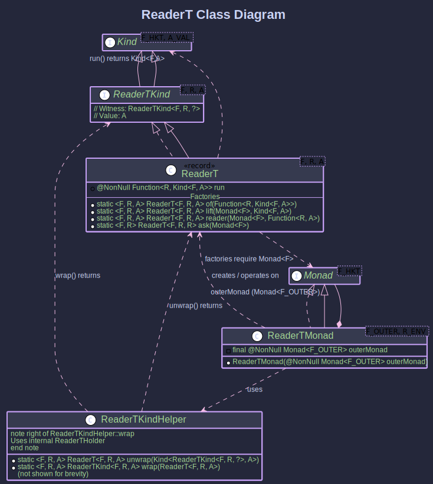

# The ReaderT Transformer:
## _Threading Configuration Through Effects_

> *"No man is an island, entire of itself."*
>
> – John Donne, *Meditation XVII*

No computation is independent of its environment. ReaderT makes that dependency explicit and composable.

~~~admonish info title="What You'll Learn"
- How to combine dependency injection (Reader) with other effects like async operations
- Building configuration-dependent workflows that are also async or failable
- Using `ask`, `reader`, and `lift` to work with environment-dependent computations
- Creating testable microservice clients with injected configuration
- Managing database connections, API keys, and other contextual dependencies
~~~

~~~ admonish example title="See Example Code:"
- [ReaderTExample.java](https://github.com/higher-kinded-j/higher-kinded-j/blob/main/hkj-examples/src/main/java/org/higherkindedj/example/basic/reader_t/ReaderTExample.java)

- [ReaderTAsyncExample.java](https://github.com/higher-kinded-j/higher-kinded-j/blob/main/hkj-examples/src/main/java/org/higherkindedj/example/basic/reader_t/ReaderTAsyncExample.java)

- [ReaderTAsyncUnitExample.java](https://github.com/higher-kinded-j/higher-kinded-j/blob/main/hkj-examples/src/main/java/org/higherkindedj/example/basic/reader_t/ReaderTAsyncUnitExample.java)
~~~

---

## The Problem: Configuration Everywhere

Consider a service that needs API keys and URLs for every operation:

```java
// Without ReaderT: passing config through every function
CompletableFuture<ServiceData> fetchData(AppConfig config, String itemId) {
    return CompletableFuture.supplyAsync(() ->
        callApi(config.apiKey(), config.serviceUrl(), itemId));
}

CompletableFuture<ProcessedData> processData(AppConfig config, ServiceData data) {
    return CompletableFuture.supplyAsync(() ->
        transform(data, config.apiKey()));
}

// Every call requires explicit config passing:
CompletableFuture<ProcessedData> workflow(AppConfig config) {
    return fetchData(config, "item123")
        .thenCompose(data -> processData(config, data));
}
```

The `config` parameter threads through every function signature, every call site, every test. It's noise that obscures the actual logic. Rename a config field, and you touch every function in the chain.

## The Solution: ReaderT

```java
// With ReaderT: config is implicit
ReaderT<CompletableFutureKind.Witness, AppConfig, ServiceData>
    fetchDataRT(String itemId) {
  return ReaderT.of(config ->
      FUTURE.widen(CompletableFuture.supplyAsync(() ->
          callApi(config.apiKey(), config.serviceUrl(), itemId))));
}

ReaderT<CompletableFutureKind.Witness, AppConfig, ProcessedData>
    processDataRT(ServiceData data) {
  return ReaderT.reader(futureMonad,
      config -> transform(data, config.apiKey()));
}

// Config provided once, at the end:
Kind<CompletableFutureKind.Witness, ProcessedData> result =
    composedWorkflow.run().apply(prodConfig);
```

The `AppConfig` is threaded implicitly through `flatMap`. Each operation declares its dependency on `AppConfig` in its return type, but never receives it as a parameter. The config is provided once, when you run the computation.

```
    ┌──────────────────────────────────────────────────────────┐
    │  ReaderT<CompletableFutureKind.Witness, AppConfig, A>    │
    │                                                          │
    │        ┌── AppConfig ──┐                                 │
    │        │               │                                 │
    │        │  apiKey       │                                 │
    │        │  serviceUrl   │                                 │
    │        │  executor     │                                 │
    │        └───────┬───────┘                                 │
    │                │                                         │
    │                ▼                                         │
    │   ┌─── Function: R → Kind<F, A> ───────────────────┐     │
    │   │                                                │     │
    │   │  config → CompletableFuture<result>            │     │
    │   │                                                │     │
    │   └────────────────────────────────────────────────┘     │
    │                                                          │
    │  flatMap ──▶ threads same config to next operation       │
    │  map ──────▶ transforms result, config unchanged         │
    │  ask ──────▶ gives you the config itself                 │
    │  run ──────▶ provides config, returns F<A>               │
    └──────────────────────────────────────────────────────────┘
```

---

## How ReaderT Works

`ReaderT<F, R, A>` wraps a function `R -> Kind<F, A>`. When you supply an environment of type `R`, you get back a monadic value `Kind<F, A>`.



* **`F`**: The witness type of the **outer monad** (e.g., `CompletableFutureKind.Witness`).
* **`R`**: The type of the **read-only environment** (configuration, dependencies).
* **`A`**: The type of the value produced, within the outer monad `F`.
* **`run`**: The core function `R -> Kind<F, A>`.

```java
public record ReaderT<F, R, A>(@NonNull Function<R, Kind<F, A>> run)
    implements ReaderTKind<F, R, A> {
  // ... static factory methods ...
}
```

---

## Setting Up ReaderTMonad

The `ReaderTMonad<F, R>` class implements `Monad<ReaderTKind.Witness<F, R>>`, providing standard monadic operations. It requires a `Monad<F>` instance for the outer monad:

```java
OptionalMonad optionalMonad = OptionalMonad.INSTANCE;
record AppConfig(String apiKey) {}

ReaderTMonad<OptionalKind.Witness, AppConfig> readerTOptionalMonad =
    new ReaderTMonad<>(optionalMonad);
```

~~~admonish note title="Type Witness and Helpers"
**Witness Type:** `ReaderTKind<F, R, A>` extends `Kind<ReaderTKind.Witness<F, R>, A>`. The outer monad `F` and environment `R` are fixed; `A` is the variable value type.

**KindHelper:** `ReaderTKindHelper` provides `READER_T.widen` and `READER_T.narrow` for safe conversion.

```java
Kind<ReaderTKind.Witness<F, R>, A> kind = READER_T.widen(readerT);
ReaderT<F, R, A> concrete = READER_T.narrow(kind);
```
~~~

---

## Key Operations

~~~admonish info title="Key Operations with _ReaderTMonad_"
* **`readerTMonad.of(value)`**: Lifts a pure value into `ReaderT`. The environment is ignored. Result: `ReaderT(r -> outerMonad.of(value))`.
* **`readerTMonad.map(func, readerTKind)`**: Transforms the result value `A -> B` within the outer monad. The environment passes through unchanged. Result: `ReaderT(r -> F<B>)`.
* **`readerTMonad.flatMap(func, readerTKind)`**: The core sequencing operation. Runs the first `ReaderT` with the environment to get `Kind<F, A>`. If it yields an `A`, applies `func` to get a new `ReaderT<F, R, B>`, which is then also run with the **same environment**. This is what makes configuration threading automatic.
~~~

---

## Creating ReaderT Instances

~~~admonish title="Creating _ReaderT_ Instances"

```java
OptionalMonad optMonad = OptionalMonad.INSTANCE;
record Config(String setting) {}
Config testConfig = new Config("TestValue");

// 1. Directly from R -> F<A> function
ReaderT<OptionalKind.Witness, Config, String> rt1 = ReaderT.of(
    cfg -> OPTIONAL.widen(Optional.of("Data based on " + cfg.setting())));
// Run: OPTIONAL.narrow(rt1.run().apply(testConfig))
// → Optional.of("Data based on TestValue")

// 2. Lifting an existing F<A> (environment ignored)
Kind<OptionalKind.Witness, Integer> optionalValue =
    OPTIONAL.widen(Optional.of(123));
ReaderT<OptionalKind.Witness, Config, Integer> rt2 =
    ReaderT.lift(optMonad, optionalValue);
// Run: always returns Optional.of(123) regardless of config

// 3. From R -> A function (result lifted into F)
ReaderT<OptionalKind.Witness, Config, String> rt3 =
    ReaderT.reader(optMonad, cfg -> "Hello from " + cfg.setting());
// Run: Optional.of("Hello from TestValue")

// 4. ask: provides the environment itself as the result
ReaderT<OptionalKind.Witness, Config, Config> rt4 = ReaderT.ask(optMonad);
// Run: Optional.of(Config("TestValue"))
```
~~~

---

## Real-World Example: Configuration-Dependent Async Services

~~~admonish Example title="Configuration-Dependent Asynchronous Service Calls"

- [ReaderTAsyncExample.java](https://github.com/higher-kinded-j/higher-kinded-j/blob/main/hkj-examples/src/main/java/org/higherkindedj/example/basic/reader_t/ReaderTAsyncExample.java)

**The problem:** You have async service operations that all need an `AppConfig` (API keys, URLs, executor). You want to compose them without passing config through every call.

**The solution:**

```java
static final Monad<CompletableFutureKind.Witness> futureMonad =
    CompletableFutureMonad.INSTANCE;
static final ReaderTMonad<CompletableFutureKind.Witness, AppConfig> cfReaderTMonad =
    new ReaderTMonad<>(futureMonad);

record AppConfig(String apiKey, String serviceUrl, ExecutorService executor) {}
record ServiceData(String rawData) {}
record ProcessedData(String info) {}

// Operation 1: fetch data (needs config for URL and API key)
static ReaderT<CompletableFutureKind.Witness, AppConfig, ServiceData>
    fetchServiceDataRT(String itemId) {
  return ReaderT.of(config -> FUTURE.widen(
      CompletableFuture.supplyAsync(() ->
          new ServiceData("Raw data for " + itemId + " from " + config.serviceUrl()),
          config.executor())));
}

// Operation 2: process data (needs config for API key)
static ReaderT<CompletableFutureKind.Witness, AppConfig, ProcessedData>
    processDataRT(ServiceData data) {
  return ReaderT.reader(futureMonad,
      config -> new ProcessedData("Processed: " + data.rawData().toUpperCase()));
}

// Compose: fetch then process
Kind<ReaderTKind.Witness<CompletableFutureKind.Witness, AppConfig>, ProcessedData>
    workflowRT = cfReaderTMonad.flatMap(
        data -> READER_T.widen(processDataRT(data)),
        READER_T.widen(fetchServiceDataRT("item123")));

ReaderT<CompletableFutureKind.Witness, AppConfig, ProcessedData> composedWorkflow =
    READER_T.narrow(workflowRT);

// Run with different configs:
AppConfig prodConfig = new AppConfig("prod_key", "https://api.prod.example.com", executor);
AppConfig stagingConfig = new AppConfig("staging_key", "https://api.staging.example.com", executor);

ProcessedData prodResult = FUTURE.join(composedWorkflow.run().apply(prodConfig));
ProcessedData stagingResult = FUTURE.join(composedWorkflow.run().apply(stagingConfig));
```

**Why this works:** The `AppConfig` is threaded through both `fetchServiceDataRT` and `processDataRT` by `flatMap`. The same workflow runs against production and staging simply by providing different configs at the `run().apply(...)` call. The workflow definition is completely decoupled from the environment.
~~~

---

## Using `ask` to Access Configuration Mid-Workflow

~~~admonish Example title="Accessing Configuration with `ask`"

**The problem:** Within a composed workflow, you need to read a specific config value without restructuring the computation.

**The solution:**

```java
ReaderT<CompletableFutureKind.Witness, AppConfig, AppConfig> getConfigRT =
    ReaderT.ask(futureMonad);

Kind<ReaderTKind.Witness<CompletableFutureKind.Witness, AppConfig>, String>
    getServiceUrlRT = cfReaderTMonad.map(
        (AppConfig cfg) -> "Service URL: " + cfg.serviceUrl(),
        READER_T.widen(getConfigRT));

String stagingUrl = FUTURE.join(
    READER_T.narrow(getServiceUrlRT).run().apply(stagingConfig));
// → "Service URL: https://api.staging.example.com"
```

`ReaderT.ask` returns the entire environment as the result, which you can then `map` over to extract specific fields.
~~~

---

## Fire-and-Forget Operations with Unit

~~~admonish Example title="`ReaderT` for Actions Returning `Unit`"

- [ReaderTAsyncUnitExample.java](https://github.com/higher-kinded-j/higher-kinded-j/blob/main/hkj-examples/src/main/java/org/higherkindedj/example/basic/reader_t/ReaderTAsyncUnitExample.java)

**The problem:** Some operations (logging, initialisation, sending metrics) depend on configuration but don't produce a meaningful return value.

**The solution:** Use `Unit` as the value type:

```java
static ReaderT<CompletableFutureKind.Witness, AppConfig, Unit> initialiseComponentRT() {
    return ReaderT.of(config -> FUTURE.widen(
        CompletableFuture.runAsync(() -> {
            System.out.println("Initialising with API Key: " + config.apiKey());
            // ... initialisation work ...
        }, config.executor()).thenApply(v -> Unit.INSTANCE)));
}

// Run:
Unit result = FUTURE.join(initialiseComponentRT().run().apply(prodConfig));
// → () (Unit.INSTANCE, signifying successful completion)
```
~~~

---

~~~admonish warning title="Common Mistakes"
- **Forgetting to run:** A `ReaderT` is a *description* of a computation, not the computation itself. It does nothing until you call `.run().apply(config)`. If your tests pass but nothing happens, check that you are running the `ReaderT`.
- **Mutating the environment:** `R` should be immutable. `ReaderT` passes the same `R` to every operation in a chain. Mutating it would break referential transparency and produce unpredictable results.
- **Using ReaderT when you need state changes:** If the configuration changes between steps, you need `StateT`, not `ReaderT`. The "Reader" in `ReaderT` means *read-only*.
~~~

---

~~~admonish tip title="See Also"
- [Monad Transformers](transformers.md) - General concept and choosing the right transformer
- [StateT](statet_transformer.md) - When your environment needs to change between steps
- [EitherT](eithert_transformer.md) - When operations can fail with typed errors
~~~

---

~~~admonish tip title="Further Reading"
- [Reader Monad for Dependency Injection](https://medium.com/@johnmcclean/reader-monad-for-dependency-injection-in-java-9056d9501c75) - Practical examples without frameworks (12 min read)
- [Functional Dependency Injection](https://www.youtube.com/watch?v=ZasXwtTRkio) - Conference talk on Reader pattern (40 min watch)
- [ReaderT Design Pattern](https://academy.fpblock.com/blog/2017/06/readert-design-pattern/) - Michael Snoyman's production patterns (30 min read)
- [A Fresh Perspective on Monads](https://rockthejvm.com/articles/a-fresh-perspective-on-monads) - Rock the JVM on composing monadic effects (20 min read)
~~~

**Previous:** [MaybeT](maybet_transformer.md)
**Next:** [StateT](statet_transformer.md)
