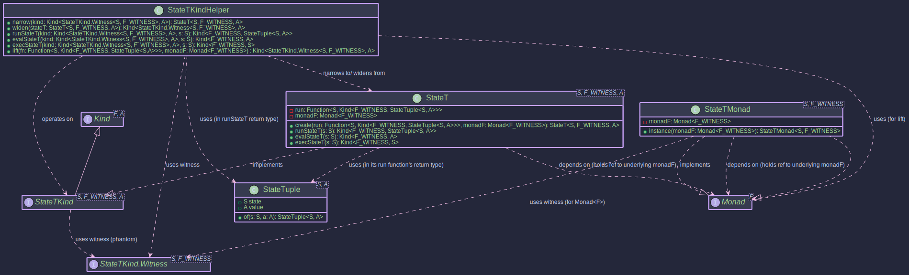

# The StateT Transformer:
## _Managing State Across Effect Boundaries_

~~~admonish info title="What You'll Learn"
- How to add stateful computation to any existing monad
- Building stack operations that can fail (StateT with Optional)
- Understanding the relationship between State and StateT<S, Identity, A>
- Creating complex workflows that manage both state and other effects
- Using `get`, `set`, `modify` operations within transformer contexts
~~~

~~~ admonish example title="See Example Code:"
- [StateTExample.java](https://github.com/higher-kinded-j/higher-kinded-j/blob/main/hkj-examples/src/main/java/org/higherkindedj/example/basic/state_t/StateTExample.java)

- [StateTStackExample](https://github.com/higher-kinded-j/higher-kinded-j/blob/main/hkj-examples/src/main/java/org/higherkindedj/example/basic/state_t/StateTStackExample.java)
~~~

---

## The Problem: Stateful Operations that Can Fail

Imagine a stack data structure where `pop` might fail on an empty stack. Without `StateT`, you end up managing both the state transitions and the optionality by hand:

```java
// Without StateT: manual state + optional management
Optional<StateTuple<List<Integer>, Integer>> pop(List<Integer> stack) {
    if (stack.isEmpty()) return Optional.empty();
    List<Integer> newStack = new LinkedList<>(stack);
    Integer value = newStack.remove(0);
    return Optional.of(StateTuple.of(newStack, value));
}

// Composing: push, push, pop, pop, sum the popped values
Optional<StateTuple<List<Integer>, Integer>> workflow(List<Integer> initial) {
    var afterPush1 = push(initial, 10);   // Returns StateTuple (always succeeds)
    var afterPush2 = push(afterPush1.state(), 20);
    var pop1Result = pop(afterPush2.state());
    if (pop1Result.isEmpty()) return Optional.empty();
    var pop2Result = pop(pop1Result.get().state());
    if (pop2Result.isEmpty()) return Optional.empty();
    int sum = pop1Result.get().value() + pop2Result.get().value();
    return Optional.of(StateTuple.of(pop2Result.get().state(), sum));
}
```

Each operation returns both a new state and a value; the optionality adds another layer of checking. The state threading is manual and error-prone. Miss one `.get().state()` call and you use stale state.

## The Solution: StateT

```java
// With StateT: state threading + optionality handled automatically
var computation =
    For.from(ST_OPT_MONAD, push(10))
        .from(_ -> push(20))
        .from(_ -> pop())
        .from(_ -> pop())
        .yield((a, b, p1, p2) -> {
            System.out.println("Popped: " + p1 + ", " + p2);
            return p1 + p2;
        });

Optional<StateTuple<List<Integer>, Integer>> result =
    OPTIONAL.narrow(StateTKindHelper.runStateT(computation, Collections.emptyList()));
// → Optional.of(StateTuple([], 30))
```

The state flows from one operation to the next through `flatMap`. If any operation returns `Optional.empty()` (e.g., popping an empty stack), the rest are skipped. No manual state passing, no null checks.

---

## How StateT Works

`StateT<S, F, A>` represents a computation that takes an initial state `S`, produces a result `A` and a new state `S`, all within the context of a monad `F`.

```
    ┌──────────────────────────────────────────────────────────┐
    │  StateT<List<Integer>, OptionalKind.Witness, A>          │
    │                                                          │
    │    State S ─────▶ ┌────────────────────────┐             │
    │    (initial)      │  Function:             │             │
    │                   │  S → Kind<F, (S, A)>   │             │
    │                   └────────────┬───────────┘             │
    │                                │                         │
    │                                ▼                         │
    │                   ┌─── Optional ──────────┐              │
    │                   │                       │              │
    │                   │  empty()  │  of(S, A) │              │
    │                   │           │           │              │
    │                   └───────────────────────┘              │
    │                                                          │
    │  flatMap ──▶ threads updated state to next operation     │
    │  map ──────▶ transforms value, state unchanged           │
    │  runStateT ──▶ provides initial state, returns F<(S,A)>  │
    │  evalStateT ──▶ returns F<A> (discards final state)      │
    │  execStateT ──▶ returns F<S> (discards value)            │
    └──────────────────────────────────────────────────────────┘
```



* **`S`**: The type of the state.
* **`F`**: The witness type for the underlying monad (e.g., `OptionalKind.Witness`, `IOKind.Witness`).
* **`A`**: The type of the computed value.
* **`StateTuple<S, A>`**: A container holding the pair `(state, value)`.

The fundamental structure is a function: `S -> F<StateTuple<S, A>>`

```java
// StateT holds: Function<S, Kind<F, StateTuple<S, A>>>
StateT<Integer, OptionalKind.Witness, String> computation =
    StateT.create(
        currentState -> {
            if (currentState < 0) return OPTIONAL.widen(Optional.empty());
            return OPTIONAL.widen(Optional.of(
                StateTuple.of(currentState + 1, "Value: " + currentState)));
        },
        optionalMonad);
```

---

## Setting Up StateTMonad

The `StateTMonad<S, F>` class implements `Monad<StateTKind.Witness<S, F>>`. It requires a `Monad<F>` instance for the underlying monad:

```java
OptionalMonad optionalMonad = OptionalMonad.INSTANCE;

StateTMonad<Integer, OptionalKind.Witness> stateTMonad =
    StateTMonad.instance(optionalMonad);
```

~~~admonish note title="Key Classes"
* **`StateT<S, F, A>`**: The primary data type holding `S -> Kind<F, StateTuple<S, A>>`.
* **`StateTKind<S, F, A>`**: The `Kind` representation for generic monadic usage.
* **`StateTKind.Witness<S, F>`**: The higher-kinded type witness. Both `S` and `F` are part of the witness.
* **`StateTMonad<S, F>`**: The `Monad` instance, providing `of`, `map`, `flatMap`, `ap`.
* **`StateTKindHelper`**: Utility for `narrow`, `runStateT`, `evalStateT`, `execStateT`.
* **`StateTuple<S, A>`**: A record holding `(S state, A value)`.
~~~

---

## Running StateT Computations

```java
// Run: returns F<StateTuple<S, A>>
Kind<OptionalKind.Witness, StateTuple<Integer, String>> result =
    StateTKindHelper.runStateT(computation, 10);
// → Optional.of(StateTuple(11, "Value: 10"))

// Eval: returns F<A> (discards state)
Kind<OptionalKind.Witness, String> valueOnly =
    StateTKindHelper.evalStateT(computation, 10);
// → Optional.of("Value: 10")

// Exec: returns F<S> (discards value)
Kind<OptionalKind.Witness, Integer> stateOnly =
    StateTKindHelper.execStateT(computation, 10);
// → Optional.of(11)
```

---

## Composing StateT Actions

Like any monad, `StateT` computations compose with `map` and `flatMap`:

~~~admonish Example title="map: Transforming the Value"
```java
Kind<StateTKind.Witness<Integer, OptionalKind.Witness>, Integer> initial =
    StateT.create(s -> OPTIONAL.widen(
        Optional.of(StateTuple.of(s + 1, s * 2))), optionalMonad);

Kind<StateTKind.Witness<Integer, OptionalKind.Witness>, String> mapped =
    stateTMonad.map(val -> "Computed: " + val, initial);

// Run with state 5:
// 1. initial: state=6, value=10
// 2. map: value → "Computed: 10"
// Result: Optional.of(StateTuple(6, "Computed: 10"))
```
~~~

~~~admonish Example title="flatMap: Sequencing State Operations"
```java
Kind<StateTKind.Witness<Integer, OptionalKind.Witness>, Integer> firstStep =
    StateT.create(s -> OPTIONAL.widen(
        Optional.of(StateTuple.of(s + 1, s * 10))), optionalMonad);

Function<Integer, Kind<StateTKind.Witness<Integer, OptionalKind.Witness>, String>>
    secondStepFn = prevValue -> StateT.create(
        s -> {
            if (prevValue > 100) {
                return OPTIONAL.widen(Optional.of(
                    StateTuple.of(s + prevValue, "Large: " + prevValue)));
            }
            return OPTIONAL.widen(Optional.empty()); // Fail if too small
        }, optionalMonad);

Kind<StateTKind.Witness<Integer, OptionalKind.Witness>, String> combined =
    stateTMonad.flatMap(secondStepFn, firstStep);

// Run with state 15: firstStep → (16, 150), secondStep(150) → (166, "Large: 150")
// Run with state 5:  firstStep → (6, 50), secondStep(50) → empty (too small)
```
~~~

---

## State-Specific Operations

Common state operations can be constructed using `StateT.create`:

```java
// get: retrieve the current state as the value
static <S, F> Kind<StateTKind.Witness<S, F>, S> get(Monad<F> monadF) {
    return StateT.create(s -> monadF.of(StateTuple.of(s, s)), monadF);
}

// set: replace the state, return Unit
static <S, F> Kind<StateTKind.Witness<S, F>, Unit> set(S newState, Monad<F> monadF) {
    return StateT.create(s -> monadF.of(StateTuple.of(newState, Unit.INSTANCE)), monadF);
}

// modify: update the state with a function, return Unit
static <S, F> Kind<StateTKind.Witness<S, F>, Unit> modify(
        Function<S, S> f, Monad<F> monadF) {
    return StateT.create(s -> monadF.of(StateTuple.of(f.apply(s), Unit.INSTANCE)), monadF);
}

// gets: extract a value derived from the state
static <S, F, A> Kind<StateTKind.Witness<S, F>, A> gets(
        Function<S, A> f, Monad<F> monadF) {
    return StateT.create(s -> monadF.of(StateTuple.of(s, f.apply(s))), monadF);
}
```

---

## Real-World Example: Stack with Failure

~~~admonish Example title="Stack Operations with Optional Failure"

- [StateTStackExample.java](https://github.com/higher-kinded-j/higher-kinded-j/blob/main/hkj-examples/src/main/java/org/higherkindedj/example/basic/state_t/StateTStackExample.java)

**The problem:** You need stack push/pop operations where popping an empty stack produces an absence rather than an exception, and you want to compose these operations cleanly.

**The solution:**

```java
private static final OptionalMonad OPT_MONAD = OptionalMonad.INSTANCE;
private static final StateTMonad<List<Integer>, OptionalKind.Witness> ST_OPT_MONAD =
    StateTMonad.instance(OPT_MONAD);

static Kind<StateTKind.Witness<List<Integer>, OptionalKind.Witness>, Unit>
    push(Integer value) {
  return StateTKindHelper.stateT(stack -> {
      List<Integer> newStack = new LinkedList<>(stack);
      newStack.add(0, value);
      return OPTIONAL.widen(Optional.of(StateTuple.of(newStack, Unit.INSTANCE)));
  }, OPT_MONAD);
}

static Kind<StateTKind.Witness<List<Integer>, OptionalKind.Witness>, Integer> pop() {
  return StateTKindHelper.stateT(stack -> {
      if (stack.isEmpty()) {
          return OPTIONAL.widen(Optional.empty()); // Cannot pop empty stack
      }
      List<Integer> newStack = new LinkedList<>(stack);
      Integer popped = newStack.remove(0);
      return OPTIONAL.widen(Optional.of(StateTuple.of(newStack, popped)));
  }, OPT_MONAD);
}

// Compose with For comprehension:
var computation =
    For.from(ST_OPT_MONAD, push(10))
        .from(_ -> push(20))
        .from(_ -> pop())
        .from(_ -> pop())
        .yield((a, b, p1, p2) -> {
            System.out.println("Popped in order: " + p1 + ", then " + p2);
            return p1 + p2;
        });

List<Integer> initialStack = Collections.emptyList();
Optional<StateTuple<List<Integer>, Integer>> result =
    OPTIONAL.narrow(StateTKindHelper.runStateT(computation, initialStack));
// → Optional.of(StateTuple([], 30))

// Popping an empty stack:
Optional<StateTuple<List<Integer>, Integer>> emptyPop =
    OPTIONAL.narrow(StateTKindHelper.runStateT(pop(), Collections.emptyList()));
// → Optional.empty()
```

**Why this works:** The `For` comprehension sequences state operations through `flatMap`. Each `push` returns the updated stack as new state; each `pop` either returns the popped value with an updated stack, or `Optional.empty()` which short-circuits the rest. The state threading is completely automatic.
~~~

---

## Relationship to State Monad

The [State Monad](../monads/state_monad.md) (`State<S, A>`) is a specialised case of `StateT`. Specifically, `State<S, A>` is equivalent to `StateT<S, IdKind.Witness, A>`, where `Id` is the Identity monad (a monad that adds no effects).

If your stateful computation doesn't need to combine with another effect, use `State<S, A>` directly. Reach for `StateT` when you need state *and* another effect (optionality, error handling, async).

---

~~~admonish warning title="Common Mistakes"
- **Using stale state:** In manual state threading, it's easy to accidentally use the state from step 1 in step 3. `StateT.flatMap` eliminates this by threading updated state automatically.
- **Null in `ap`:** The `ap` method requires the function it extracts from the first `StateT` computation to be non-null. A `null` function will cause a `NullPointerException`.
- **Confusing StateT with ReaderT:** If your "state" never changes, you probably want `ReaderT`. Use `StateT` only when operations need to *modify* the state.
~~~

---

~~~admonish tip title="See Also"
- [State Monad](../monads/state_monad.md) - Understand the basics of stateful computations
- [Monad Transformers](./transformers.md) - General concept of monad transformers
- [ReaderT](readert_transformer.md) - When you need read-only environment, not mutable state
- [Draughts Example ("checkers")](../examples/examples_draughts.md) - See the HKJ State Monad used in a game 
~~~

---


**Previous:** [ReaderT](readert_transformer.md)
