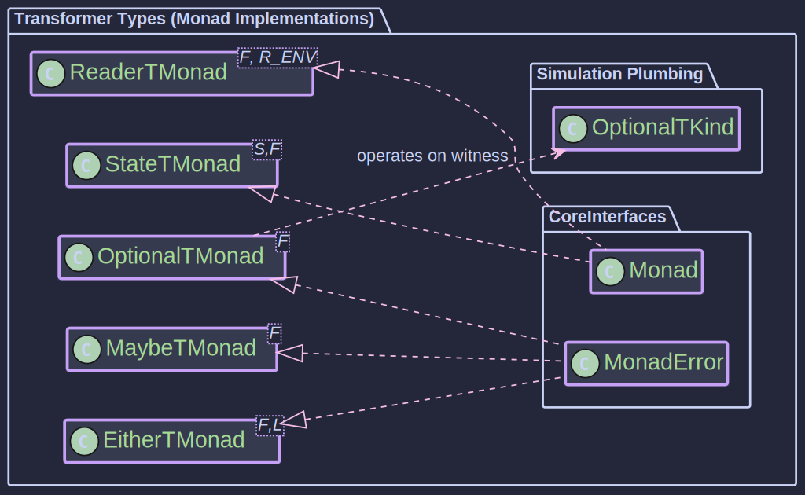

# The Transformers:
_Combining Monadic Effects_

> *"Any sufficiently complicated program contains an ad hoc, informally-specified, bug-ridden, slow implementation of half of a monad transformer."*
>
> – A functional programmer's lament (after Greenspun's Tenth Rule)

If you've ever written a utility method that takes a `CompletableFuture<Either<E, A>>` and tries to `flatMap` across both layers, you've already started building one. Transformers formalise the pattern.

~~~admonish info title="What You'll Learn"
- Why directly nesting monadic types like `CompletableFuture<Either<E, A>>` leads to complex, unwieldy code
- How monad transformers wrap nested monads to provide a unified interface with familiar `map` and `flatMap` operations
- The available transformers in Higher-Kinded-J: EitherT, MaybeT, OptionalT, ReaderT, and StateT
- How to choose the right transformer for your use case based on the effect you need to add
~~~

~~~admonish note title="Prefer the Effect Path API?"
The [Effect Path API](../effect/ch_intro.md) provides a fluent, concrete wrapper around these transformers. For most use cases you can work entirely with Path types and never touch the raw transformer machinery. See [Stack Archetypes](archetypes.md) for named patterns.

| Path Type | Corresponding Transformer |
|-----------|--------------------------|
| `EitherPath<E, A>` | `EitherT<F, E, A>` |
| `MaybePath<A>` | `MaybeT<F, A>` |
| `OptionalPath<A>` | `OptionalT<F, A>` |
| `ReaderPath<R, A>` | `ReaderT<F, R, A>` |
| `WithStatePath<S, A>` | `StateT<S, F, A>` |

Use the raw transformer when you need to combine effects with a *different* outer monad (e.g. `CompletableFuture`, `IO`, or a custom monad).
~~~


---

## The Problem: Monads Don't Compose

When building real applications, you rarely need just one effect. An operation might be **asynchronous** and also **fail with domain errors**. Another might require **configuration** and also be **async**. A third might need to **track state** while **potentially returning nothing**.

Each of these effects has a clean monadic representation in isolation. The trouble starts when you combine them.

### What Nesting Looks Like in Practice

Consider a service that fetches a user asynchronously and might fail:

```java
// The nested type: async + typed error
CompletableFuture<Either<DomainError, User>> fetchUser(String userId) { ... }
CompletableFuture<Either<DomainError, Order>> createOrder(User user) { ... }
CompletableFuture<Either<DomainError, Receipt>> processPayment(Order order) { ... }

// Composing them manually:
CompletableFuture<Either<DomainError, Receipt>> workflow =
    fetchUser("user-42").thenCompose(eitherUser ->
        eitherUser.fold(
            error -> CompletableFuture.completedFuture(Either.left(error)),
            user -> createOrder(user).thenCompose(eitherOrder ->
                eitherOrder.fold(
                    error -> CompletableFuture.completedFuture(Either.left(error)),
                    order -> processPayment(order)
                )
            )
        )
    );
```

Three steps. Already deeply nested. Every step requires the same boilerplate: check if the inner `Either` is `Left`, propagate the error, or unwrap the `Right` and continue. Add a fourth step and the indentation grows further. Add error recovery and it becomes genuinely difficult to read.

The problem is structural: `CompletableFuture` and `Either` each have their own `flatMap`, but Java gives you no way to unify them into a single sequencing operation.

---

## The Solution: Transformer as Wrapper

A monad transformer `T` takes an outer monad `F` and produces a **new monad** `T<F>` that combines both effects. The transformer handles the interleaving of contexts automatically.

```
    ┌───────────────────────────────────────────────────────────────┐
    │  HOW A TRANSFORMER WORKS                                      │
    │                                                               │
    │                   ┌─────────────────────────┐                 │
    │                   │   Transformer (EitherT) │                 │
    │                   │                         │                 │
    │   flatMap ───────▶│  1. Sequence outer F    │──────▶ result   │
    │                   │  2. Check inner Either  │                 │
    │                   │  3. Route: Left → skip  │                 │
    │                   │          Right → apply  │                 │
    │                   └─────────────────────────┘                 │
    │                                                               │
    │   You call one flatMap. The transformer does both.            │
    └───────────────────────────────────────────────────────────────┘
```

The same workflow with `EitherT`:

```java
EitherTMonad<CompletableFutureKind.Witness, DomainError> eitherTMonad =
    new EitherTMonad<>(CompletableFutureMonad.INSTANCE);

Kind<EitherTKind.Witness<CompletableFutureKind.Witness, DomainError>, Receipt> workflow =
    For.from(eitherTMonad, EitherT.fromKind(fetchUser("user-42")))
        .from(user -> EitherT.fromKind(createOrder(user)))
        .from(order -> EitherT.fromKind(processPayment(order)))
        .yield((user, order, receipt) -> receipt);
```

One `flatMap` sequences the async operation *and* propagates errors. No manual `fold`, no repeated `Either.left` wrapping, no growing indentation. The nesting is still there (it must be), but the transformer hides it.

---

## Key Characteristics

1. **Stacking** – Transformers allow "stacking" monadic effects in a standard way
2. **Unified Interface** – The resulting transformed monad implements `Monad` (and often `MonadError`), so you use the same `map`, `flatMap`, `of` you already know
3. **Abstraction** – The complexity of managing the nested structure is encapsulated; you work with a single monadic layer

~~~admonish note title="Witness Type Requirement"
All transformers require an outer monad `F` where `F extends WitnessArity<TypeArity.Unary>`. This ensures the transformer can work with any properly-typed monad in the framework.
~~~

---

## Transformers in Higher-Kinded-J



Higher-Kinded-J provides five transformers. Each solves a specific composition problem:

### EitherT: Typed Errors in Any Context

**The problem:** Your async operation can fail with a domain-specific error, and you need to sequence multiple such operations without manual error propagation.

**The solution:** `EitherT<F, E, A>` wraps `Kind<F, Either<E, A>>` and provides `MonadError<..., E>`, giving you `flatMap` for sequencing, `raiseError` for failures, and `handleErrorWith` for recovery.

**Usage:** [How to use the EitherT Monad Transformer](eithert_transformer.md)

---

### OptionalT: When Absence Meets Other Effects

**The problem:** Your async data retrieval might return nothing (user not found, config missing), and you need to chain lookups without checking each `Optional` manually.

**The solution:** `OptionalT<F, A>` wraps `Kind<F, Optional<A>>` and provides `MonadError<..., Unit>`, where `Unit` represents the "empty" state. Chain lookups with `flatMap`; if any step returns empty, the rest are skipped.

**Usage:** [How to use the OptionalT Monad Transformer](optionalt_transformer.md)

---

### MaybeT: Functional Optionality Across Monads

**The problem:** Same as OptionalT, but you're using Higher-Kinded-J's `Maybe` type rather than `java.util.Optional`.

**The solution:** `MaybeT<F, A>` wraps `Kind<F, Maybe<A>>` with the same `MonadError<..., Unit>` interface. Functionally equivalent to OptionalT; choose based on which optional type your codebase uses.

**Usage:** [How to use the MaybeT Monad Transformer](maybet_transformer.md)

---

### ReaderT: Threading Configuration Through Effects

**The problem:** Multiple operations need access to shared configuration (database URLs, API keys, feature flags), and each is also wrapped in another effect like `CompletableFuture`. Passing the config manually through every function signature is tedious and error-prone.

**The solution:** `ReaderT<F, R, A>` wraps a function `R -> Kind<F, A>`. The environment `R` is provided once at the end, when you run the computation; all intermediate operations receive it implicitly through `flatMap`.

**Usage:** [How to use the ReaderT Monad Transformer](readert_transformer.md)

---

### StateT: Managing State Across Effect Boundaries

**The problem:** You need to thread mutable state through a sequence of operations that are also wrapped in another effect (e.g., a stack that can fail on pop, a counter that increments across async steps).

**The solution:** `StateT<S, F, A>` wraps a function `S -> Kind<F, StateTuple<S, A>>`. Each `flatMap` threads the updated state to the next operation; the outer monad's effects are handled simultaneously.

**Usage:** [How to use the StateT Monad Transformer](statet_transformer.md)

---

## Transformer Patterns at a Glance

| Pattern | Transformer | Outer Monad | What You Get |
|---------|-------------|-------------|--------------|
| Async + Error | `EitherT` | `CompletableFuture` | Async workflows with typed error propagation |
| Async + Absence | `OptionalT` / `MaybeT` | `CompletableFuture` | Async lookups that may return nothing |
| Config + Async | `ReaderT` | `CompletableFuture` | Dependency injection for async services |
| Config + Error | `ReaderT` | `Either` | Environment-dependent computations that can fail |
| State + Failure | `StateT` | `Optional` / `Either` | Stateful operations that can short-circuit |
| State + Async | `StateT` | `CompletableFuture` | State threading across async boundaries |

---

~~~admonish warning title="Common Pitfalls"
- **Forgetting to unwrap:** The result of a transformer computation is still wrapped. Call `.value()` on the transformer to extract the underlying `Kind<F, Either<E, A>>` (or equivalent) when you need to interact with the outer monad directly.
- **Wrong monad order:** `EitherT<Future, E, A>` (error inside future) is different from hypothetical `FutureT<Either, E, A>` (future inside error). The *outer* monad is the one the transformer wraps around; the *inner* effect is what the transformer adds. Choose based on which semantics you need.
- **Overusing transformers:** If you only combine effects in one or two places, manual nesting may be simpler. Transformers shine when the pattern is repeated across many operations.
~~~

---

**Previous:** [Stack Archetypes](archetypes.md)
**Next:** [EitherT](eithert_transformer.md)
