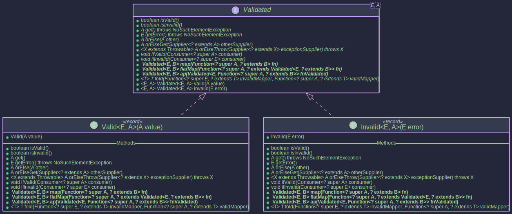
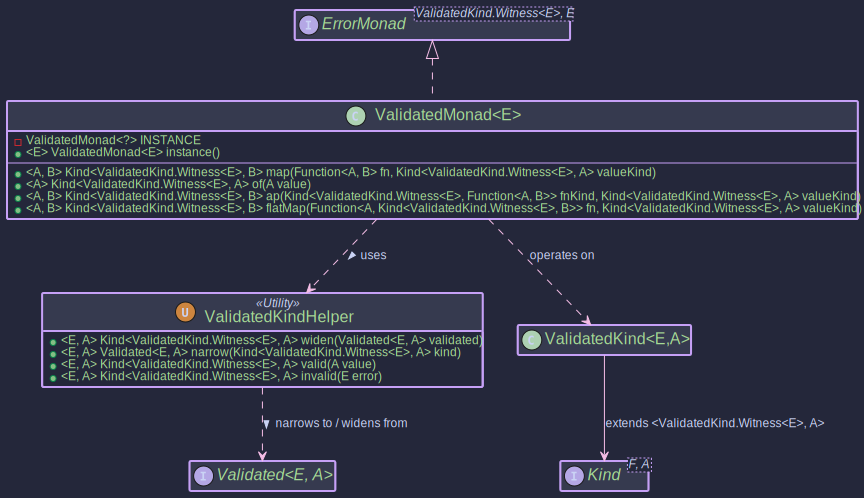

# Validated - Handling Valid or Invalid Operations

## Purpose

The `Validated<E, A>` type in `Higher-Kinded-J` represents a value that can either be `Valid<A>` (correct) or `Invalid<E>` (erroneous). It is commonly used in scenarios like input validation where you want to clearly distinguish between a successful result and an error. Unlike types like `Either` which are often used for general-purpose sum types, `Validated` is specifically focused on the valid/invalid dichotomy. Operations like `map`, `flatMap`, and `ap` are right-biased, meaning they operate on the `Valid` value and propagate `Invalid` values unchanged.

The `ValidatedMonad<E>` provides a monadic interface for `Validated<E, A>` (where the error type `E` is fixed for the monad instance), allowing for functional composition and integration with the Higher-Kinded-J framework. This facilitates chaining operations that can result in either a valid outcome or an error.

~~~admonish info title="Key benefits include:"

* **Explicit Validation Outcome:** The type signature `Validated<E, A>` makes it clear that a computation can result in either a success (`Valid<A>`) or an error (`Invalid<E>`).
* **Functional Composition:** Enables chaining of operations using `map`, `flatMap`, and `ap`. If an operation results in an `Invalid`, subsequent operations in the chain are typically short-circuited, propagating the `Invalid` state.
* **HKT Integration:** `ValidatedKind<E, A>` (the HKT wrapper for `Validated<E, A>`) and `ValidatedMonad<E>` allow `Validated` to be used with generic functions and type classes that expect `Kind<F, A>`, `Functor<F>`, `Applicative<F>`, or `Monad<M>`.
* **Clear Error Handling:** Provides methods like `fold`, `ifValid`, `ifInvalid` to handle both `Valid` and `Invalid` cases explicitly.
* **Standardized Error Handling:** As a `MonadError<ValidatedKind.Witness<E>, E>`, it offers `raiseError` to construct error states and `handleErrorWith` for recovery, integrating with generic error-handling combinators.
~~~

`ValidatedMonad<E>` implements `MonadError<ValidatedKind.Witness<E>, E>`, which transitively includes `Monad<ValidatedKind.Witness<E>>`, `Applicative<ValidatedKind.Witness<E>>`, and `Functor<ValidatedKind.Witness<E>>`.

## Structure

**Validated Type** Conceptually, `Validated<E, A>` has two sub-types:

* `Valid<A>`: Contains a valid value of type `A`.
* `Invalid<E>`: Contains an error value of type `E`.


**Monadic Structure** The `ValidatedMonad<E>` enables monadic operations on `ValidatedKind.Witness<E>`.


## How to Use `ValidatedMonad<E>` and `Validated<E, A>`

- [ValidatedMonadExample.java](https://github.com/higher-kinded-j/higher-kinded-j/blob/main/hkj-examples/src/main/java/org/higherkindedj/example/basic/validated/ValidatedMonadExample.java)

### Creating Instances

`Validated<E, A>` instances can be created directly using static factory methods on `Validated`. For HKT integration, `ValidatedKindHelper` and `ValidatedMonad` are used. `ValidatedKind<E, A>` is the HKT wrapper.

**Direct `Validated` Creation & HKT Helpers:** Refer to `ValidatedMonadExample.java` (Section 1) for runnable examples.


~~~admonish title="Creating _Valid_, _Invalid_ and HKT Wrappers"

Creates a `Valid` instance holding a **non-null** value.
```java
Validated<List<String>, String> validInstance = Validated.valid("Success!"); // Valid("Success!")
```

Creates an `Invalid` instance holding a **non-null** error.
```java
Validated<List<String>, String> invalidInstance = Validated.invalid(Collections.singletonList("Error: Something went wrong.")); // Invalid([Error: Something went wrong.])
```

Converts a `Validated<E, A>` to `Kind<ValidatedKind.Witness<E>, A>` using `VALIDATED.widen()`.
```java
Kind<ValidatedKind.Witness<List<String>>, String> kindValid = VALIDATED.widen(Validated.valid("Wrapped"));
```
Converts a `Kind<ValidatedKind.Witness<E>, A>` back to `Validated<E, A>` using `VALIDATED.narrow()`.
```java
Validated<List<String>, String> narrowedValidated = VALIDATED.narrow(kindValid);
```
Convenience for `widen(Validated.valid(value))`using `VALIDATED.valid()`.
```java
Kind<ValidatedKind.Witness<List<String>>, Integer> kindValidInt = VALIDATED.valid(123);
```
Convenience for `widen(Validated.invalid(error))` using `VALIDATED.invalid()`.
```java
Kind<ValidatedKind.Witness<List<String>>, Integer> kindInvalidInt = VALIDATED.invalid(Collections.singletonList("Bad number"));
```
~~~

### `ValidatedMonad<E>` Instance Methods:
Refer to `ValidatedMonadExample.java` (Sections 1 & 6) for runnable examples.

~~~admonish title="_validatedMonad.of(A value)_"
Lifts a value into `ValidatedKind.Witness<E>`, creating a `Valid(value)`. This is part of the `Applicative` interface.
```java
ValidatedMonad<List<String>> validatedMonad = ValidatedMonad.instance();
Kind<ValidatedKind.Witness<List<String>>, String> kindFromMonadOf = validatedMonad.of("Monadic Valid"); // Valid("Monadic Valid")
System.out.println("From monad.of(): " + VALIDATED.narrow(kindFromMonadOf));
```

Lifts an error `E` into the `ValidatedKind` context, creating an `Invalid(error)`. This is part of the `MonadError` interface.
```java
ValidatedMonad<List<String>> validatedMonad = ValidatedMonad.instance();
List<String> errorPayload = Collections.singletonList("Raised error condition");
Kind<ValidatedKind.Witness<List<String>>, String> raisedError =
    validatedMonad.raiseError(errorPayload); // Invalid(["Raised error condition"])
System.out.println("From monad.raiseError(): " + VALIDATED.narrow(raisedError));
```
~~~

### Interacting with `Validated<E, A>` values

The `Validated<E, A>` interface itself provides useful methods: Refer to `ValidatedMonadExample.java` (Section 5) for runnable examples of `fold`, `ifValid`, `ifInvalid`.

* `isValid()`: Returns `true` if it's a `Valid`.
* `isInvalid()`: Returns `true` if it's an `Invalid`.
* `get()`: Returns the value if `Valid`, otherwise throws `NoSuchElementException`. _Use with caution._
* `getError()`: Returns the error if `Invalid`, otherwise throws `NoSuchElementException`. _Use with caution._
* `orElse(@NonNull A other)`: Returns the value if `Valid`, otherwise returns `other`.
* `orElseGet(@NonNull Supplier<? extends @NonNull A> otherSupplier)`: Returns the value if `Valid`, otherwise invokes `otherSupplier.get()`.
* `orElseThrow(@NonNull Supplier<? extends X> exceptionSupplier)`: Returns the value if `Valid`, otherwise throws the exception from the supplier.
* `ifValid(@NonNull Consumer<? super A> consumer)`: Performs action if `Valid`.
* `ifInvalid(@NonNull Consumer<? super E> consumer)`: Performs action if `Invalid`.
* `fold(@NonNull Function<? super E, ? extends T> invalidMapper, @NonNull Function<? super A, ? extends T> validMapper)`: Applies one of two functions depending on the state.
* `Validated` also has its own `map`, `flatMap`, and `ap` methods that operate directly on `Validated` instances.

### Key Operations (via `ValidatedMonad<E>`)

These operations are performed on the HKT wrapper `Kind<ValidatedKind.Witness<E>, A>`. Refer to `ValidatedMonadExample.java` (Sections 2, 3, 4) for runnable examples of `map`, `flatMap`, and `ap`.

Applies `f` to the value inside `kind` if it's `Valid`. If `kind` is `Invalid`, or if `f` throws an exception (The behaviour depends on `Validated.map` internal error handling, typically an `Invalid` from `Validated.map` would be a new `Invalid`), the result is `Invalid`.


~~~admonish title="Transforming Values (_map_)"
```java
// From ValidatedMonadExample.java (Section 2)
ValidatedMonad<List<String>> validatedMonad = ValidatedMonad.instance();
Kind<ValidatedKind.Witness<List<String>>, Integer> validKindFromOf = validatedMonad.of(42);
Kind<ValidatedKind.Witness<List<String>>, Integer> invalidIntKind =
    VALIDATED.invalid(Collections.singletonList("Initial error for map"));

Function<Integer, String> intToString = i -> "Value: " + i;

Kind<ValidatedKind.Witness<List<String>>, String> mappedValid =
    validatedMonad.map(intToString, validKindFromOf); // Valid("Value: 42")
System.out.println("Map (Valid input): " + VALIDATED.narrow(mappedValid));

Kind<ValidatedKind.Witness<List<String>>, String> mappedInvalid =
    validatedMonad.map(intToString, invalidIntKind); // Invalid(["Initial error for map"])
System.out.println("Map (Invalid input): " + VALIDATED.narrow(mappedInvalid));
```
~~~


~~~admonish title="Transforming Values (_flatMap_)"

If `kind` is `Valid(a)`, applies `f` to `a`. `f` must return a `Kind<ValidatedKind.Witness<E>, B>`. If `kind` is `Invalid`, or `f` returns an `Invalid Kind`, the result is `Invalid`.

```java
// From ValidatedMonadExample.java (Section 3)
ValidatedMonad<List<String>> validatedMonad = ValidatedMonad.instance();
Kind<ValidatedKind.Witness<List<String>>, Integer> positiveNumKind = validatedMonad.of(10);
Kind<ValidatedKind.Witness<List<String>>, Integer> nonPositiveNumKind = validatedMonad.of(-5);
Kind<ValidatedKind.Witness<List<String>>, Integer> invalidIntKind =
        VALIDATED.invalid(Collections.singletonList("Initial error for flatMap"));


Function<Integer, Kind<ValidatedKind.Witness<List<String>>, String>> intToValidatedStringKind =
    i -> {
      if (i > 0) {
        return VALIDATED.valid("Positive: " + i);
      } else {
        return VALIDATED.invalid(Collections.singletonList("Number not positive: " + i));
      }
    };

Kind<ValidatedKind.Witness<List<String>>, String> flatMappedToValid =
    validatedMonad.flatMap(intToValidatedStringKind, positiveNumKind); // Valid("Positive: 10")
System.out.println("FlatMap (Valid to Valid): " + VALIDATED.narrow(flatMappedToValid));

Kind<ValidatedKind.Witness<List<String>>, String> flatMappedToInvalid =
    validatedMonad.flatMap(intToValidatedStringKind, nonPositiveNumKind); // Invalid(["Number not positive: -5"])
System.out.println("FlatMap (Valid to Invalid): " + VALIDATED.narrow(flatMappedToInvalid));

Kind<ValidatedKind.Witness<List<String>>, String> flatMappedFromInvalid =
    validatedMonad.flatMap(intToValidatedStringKind, invalidIntKind); // Invalid(["Initial error for flatMap"])
System.out.println("FlatMap (Invalid input): " + VALIDATED.narrow(flatMappedFromInvalid));
```

~~~


~~~admonish title="Applicative Operation (ap)"


If `ff` is `Valid(f)` and `fa` is `Valid(a)`, applies `f` to `a`, resulting in `Valid(f(a))`. If either `ff` or `fa` is `Invalid`, the result is `Invalid`. Specifically, if `ff` is `Invalid`, its error is returned. If `ff` is `Valid` but `fa` is `Invalid`, then `fa`'s error is returned. If both are `Invalid`, `ff`'s error takes precedence. Note: This `ap` behavior is right-biased and does not accumulate errors in the way some applicative validations might; it propagates the first encountered `Invalid` or the `Invalid` function.


```java
// From ValidatedMonadExample.java (Section 4)
ValidatedMonad<List<String>> validatedMonad = ValidatedMonad.instance();
Kind<ValidatedKind.Witness<List<String>>, Function<Integer, String>> validFnKind =
    VALIDATED.valid(i -> "Applied: " + (i * 2));
Kind<ValidatedKind.Witness<List<String>>, Function<Integer, String>> invalidFnKind =
    VALIDATED.invalid(Collections.singletonList("Function is invalid"));

Kind<ValidatedKind.Witness<List<String>>, Integer> validValueForAp = validatedMonad.of(25);
Kind<ValidatedKind.Witness<List<String>>, Integer> invalidValueForAp =
    VALIDATED.invalid(Collections.singletonList("Value is invalid"));

// Valid function, Valid value
Kind<ValidatedKind.Witness<List<String>>, String> apValidFnValidVal =
    validatedMonad.ap(validFnKind, validValueForAp); // Valid("Applied: 50")
System.out.println("Ap (ValidFn, ValidVal): " + VALIDATED.narrow(apValidFnValidVal));

// Invalid function, Valid value
Kind<ValidatedKind.Witness<List<String>>, String> apInvalidFnValidVal =
    validatedMonad.ap(invalidFnKind, validValueForAp); // Invalid(["Function is invalid"])
System.out.println("Ap (InvalidFn, ValidVal): " + VALIDATED.narrow(apInvalidFnValidVal));

// Valid function, Invalid value
Kind<ValidatedKind.Witness<List<String>>, String> apValidFnInvalidVal =
    validatedMonad.ap(validFnKind, invalidValueForAp); // Invalid(["Value is invalid"])
System.out.println("Ap (ValidFn, InvalidVal): " + VALIDATED.narrow(apValidFnInvalidVal));

// Invalid function, Invalid value
Kind<ValidatedKind.Witness<List<String>>, String> apInvalidFnInvalidVal =
    validatedMonad.ap(invalidFnKind, invalidValueForAp); // Invalid(["Function is invalid"])
System.out.println("Ap (InvalidFn, InvalidVal): " + VALIDATED.narrow(apInvalidFnInvalidVal));
```
~~~

### MonadError Operations
As `ValidatedMonad<E>` implements `MonadError<ValidatedKind.Witness<E>, E>`, it provides standardized ways to create and handle errors. Refer to ValidatedMonadExample.java (Section 6) for detailed examples.

~~~admonish title="_recover_ and _recoverWith_"

```java
// From ValidatedMonadExample.java (Section 6)
ValidatedMonad<List<String>> validatedMonad = ValidatedMonad.instance();
List<String> initialError = Collections.singletonList("Initial Failure");

// 1. Create an Invalid Kind using raiseError
Kind<ValidatedKind.Witness<List<String>>, Integer> invalidKindRaised = // Renamed to avoid conflict
    validatedMonad.raiseError(initialError);
System.out.println("Raised error: " + VALIDATED.narrow(invalidKindRaised)); // Invalid([Initial Failure])

// 2. Handle the error: recover to a Valid state
Function<List<String>, Kind<ValidatedKind.Witness<List<String>>, Integer>> recoverToValid =
    errors -> {
        System.out.println("MonadError: Recovery handler called with errors: " + errors);
        return validatedMonad.of(0); // Recover with default value 0
    };
Kind<ValidatedKind.Witness<List<String>>, Integer> recoveredValid =
    validatedMonad.handleErrorWith(invalidKindRaised, recoverToValid);
System.out.println("Recovered to Valid: " + VALIDATED.narrow(recoveredValid)); // Valid(0)

// 3. Handle the error: transform to another Invalid state
Function<List<String>, Kind<ValidatedKind.Witness<List<String>>, Integer>> transformError =
    errors -> validatedMonad.raiseError(Collections.singletonList("Transformed Error: " + errors.get(0)));
Kind<ValidatedKind.Witness<List<String>>, Integer> transformedInvalid =
    validatedMonad.handleErrorWith(invalidKindRaised, transformError);
System.out.println("Transformed to Invalid: " + VALIDATED.narrow(transformedInvalid)); // Invalid([Transformed Error: Initial Failure])

// 4. Handle a Valid Kind: handler is not called
Kind<ValidatedKind.Witness<List<String>>, Integer> validKindOriginal = validatedMonad.of(100);
Kind<ValidatedKind.Witness<List<String>>, Integer> notHandled =
    validatedMonad.handleErrorWith(validKindOriginal, recoverToValid); // Handler not called
System.out.println("Handling Valid (no change): " + VALIDATED.narrow(notHandled)); // Valid(100)

// 5. Using a default method like handleError
Kind<ValidatedKind.Witness<List<String>>, Integer> errorForHandle = validatedMonad.raiseError(Collections.singletonList("Error for handleError"));
Function<List<String>, Integer> plainValueRecoveryHandler = errors -> -1; // Returns plain value
Kind<ValidatedKind.Witness<List<String>>, Integer> recoveredWithHandle = validatedMonad.handleError(errorForHandle, plainValueRecoveryHandler);
System.out.println("Recovered with handleError: " + VALIDATED.narrow(recoveredWithHandle)); // Valid(-1)
```
The default `recover` and `recoverWith` methods from `MonadError` are also available.
~~~


~~~admonish title="Combining operations for simple validation"

This example demonstrates how `ValidatedMonad` along with `Validated` can be used to chain operations that might succeed or fail. With `ValidatedMonad` now implementing `MonadError`, operations like `raiseError` can be used for clearer error signaling, and `handleErrorWith` (or other `MonadError` methods) can be used for more robust recovery strategies within such validation flows.

-  [ValidatedMonadExample.java](https://github.com/higher-kinded-j/higher-kinded-j/tree/main/src/main/java/org/higherkindedj/example/basic/validated/ValidatedMonadExample.java) (see "Combined Validation Scenario").


```java
// Simplified from the ValidatedMonadExample.java
public void combinedValidationScenarioWithMonadError() {
  ValidatedMonad<List<String>> validatedMonad = ValidatedMonad.instance();
  Kind<ValidatedKind.Witness<List<String>>, String> userInput1 = validatedMonad.of("123");
  Kind<ValidatedKind.Witness<List<String>>, String> userInput2 = validatedMonad.of("abc"); // This will lead to an Invalid

  Function<String, Kind<ValidatedKind.Witness<List<String>>, Integer>> parseToIntKindMonadError =
      (String s) -> {
        try {
          return validatedMonad.of(Integer.parseInt(s)); // Lifts to Valid
        } catch (NumberFormatException e) {
          // Using raiseError for semantic clarity
          return validatedMonad.raiseError(
              Collections.singletonList("'" + s + "' is not a number (via raiseError)."));
        }
      };

  Kind<ValidatedKind.Witness<List<String>>, Integer> parsed1 =
      validatedMonad.flatMap(parseToIntKindMonadError, userInput1);
  Kind<ValidatedKind.Witness<List<String>>, Integer> parsed2 =
      validatedMonad.flatMap(parseToIntKindMonadError, userInput2); // Will be Invalid

  System.out.println("Parsed Input 1 (Combined): " + VALIDATED.narrow(parsed1)); // Valid(123)
  System.out.println("Parsed Input 2 (Combined): " + VALIDATED.narrow(parsed2)); // Invalid(['abc' is not a number...])

  // Example of recovering the parse of userInput2 using handleErrorWith
  Kind<ValidatedKind.Witness<List<String>>, Integer> parsed2Recovered =
      validatedMonad.handleErrorWith(
          parsed2,
          errors -> {
            System.out.println("Combined scenario recovery: " + errors);
            return validatedMonad.of(0); // Default to 0 if parsing failed
          });
  System.out.println(
      "Parsed Input 2 (Recovered to 0): " + VALIDATED.narrow(parsed2Recovered)); // Valid(0)
}
```
This example demonstrates how `ValidatedMonad` along with `Validated` can be used to chain operations that might succeed or fail, propagating errors and allowing for clear handling of either outcome, further enhanced by `MonadError` capabilities.


~~~